# 1、会计6要素及其确认条件

> 1. `会计要素`按照其性质分为资产、负债、所有者权益、收入、费用以及利润。   //前三个反映企业的财务状况；后三反映企业的经营成果
>    1. 资产
>    2. 负债
>    3. 所有者权益
>    4. 收入
>    5. 费用
>    6. 利润
>    7. 会计要素计量属性：计量就是==确定金额==的过程，有5种确定金额的方法
>       1. 历史成本：`实际成本`
>       2. 重置成本：现行成本，`重新购入相同资产所需现金`
>       3. 可变现净值：存货时用
>       4. 现值：例：12月想拿到103(终值)，1月就要存100(现值)，
>       5. 公允价值：`脱手价格`， 例：古董标价100，卖了10(公允价值)

[直接计入所有者权益的利得和损失包括什么_百度搜索](https://www.baidu.com/s?ie=utf-8&f=3&rsv_bp=1&tn=baidu&wd=%E7%9B%B4%E6%8E%A5%E8%AE%A1%E5%85%A5%E6%89%80%E6%9C%89%E8%80%85%E6%9D%83%E7%9B%8A%E7%9A%84%E5%88%A9%E5%BE%97%E5%92%8C%E6%8D%9F%E5%A4%B1%E5%8C%85%E6%8B%AC%E4%BB%80%E4%B9%88&oq=%25E7%259B%25B4%25E6%258E%25A5%25E8%25AE%25A1%25E5%2585%25A5%25E6%2589%2580%25E6%259C%2589%25E8%2580%2585%25E6%259D%2583%25E7%259B%258A%25E7%259A%2584%25E5%2588%25A9%25E5%25BE%2597%25E5%2592%258C%25E6%258D%259F%25E5%25A4%25B1&rsv_pq=d3d44fb200027661&rsv_t=9124THpZ3Bd6D3eJOh6kuMneaBpq3uPqutFuExSKMsvPCq5PWotdHIwIwUQ&rqlang=cn&rsv_enter=1&rsv_dl=ts_0&rsv_btype=t&inputT=2758&rsv_sug3=17&rsv_sug1=8&rsv_sug7=100&rsv_sug2=0&prefixsug=%25E7%259B%25B4%25E6%258E%25A5%25E8%25AE%25A1%25E5%2585%25A5%25E6%2589%2580%25E6%259C%2589%25E8%2580%2585%25E6%259D%2583%25E7%259B%258A%25E7%259A%2584%25E5%2588%25A9%25E5%25BE%2597%25E5%2592%258C%25E6%258D%259F%25E5%25A4%25B1%25E5%258C%2585%25E6%258B%25AC&rsp=0&rsv_sug4=4534)	  [直接计入所有者权益的利得和损失_百度百科](https://baike.baidu.com/item/%E7%9B%B4%E6%8E%A5%E8%AE%A1%E5%85%A5%E6%89%80%E6%9C%89%E8%80%85%E6%9D%83%E7%9B%8A%E7%9A%84%E5%88%A9%E5%BE%97%E5%92%8C%E6%8D%9F%E5%A4%B1/4096993)	[2022初级会计实务](https://www.youtube.com/watch?v=9yEmtPTbSZ8&list=PL7OHlWPKg-a0xpL4J1muH4IemII9Idehu&index=81)	

直接计入所有者权益的利得和损失: 

- **定义区分**‌：这些利得和损失属于非日常活动产生的经济利益的变动，不通过利润表（当期损益）核算，而是直接调整所有者权益。
- ‌**会计科目**‌：主要通过`其他综合收益`和`资本公积`科目记录。
  - 例如，金融资产公允价值变动计入其他综合收益，而股本溢价计入资本公积。
- ‌**与损益类项目的区别**‌：如非流动资产处置损益、债务重组损益等属于“营业外收入/支出”，需计入当期利润表，而非直接调整所有者权益。

|  |  |
| ------------------------------------------------------------ | ------------------------------------------------------------ |
|  |  |
|  |  |
|  |  |
|  |  |
|  |  |

## ==会计要素==计量属性

[现值_百度搜索](https://www.baidu.com/s?ie=utf-8&f=8&rsv_bp=1&tn=baidu&wd=%E7%8E%B0%E5%80%BC&oq=%25E7%259B%25B4%25E6%258E%25A5%25E8%25AE%25A1%25E5%2585%25A5%25E6%2589%2580%25E6%259C%2589%25E8%2580%2585%25E6%259D%2583%25E7%259B%258A%25E7%259A%2584%25E5%2588%25A9%25E5%25BE%2597%25E5%2592%258C%25E6%258D%259F%25E5%25A4%25B1%25E5%258C%2585%25E6%258B%25AC%25E4%25BB%2580%25E4%25B9%2588&rsv_pq=9f2287d20008df2b&rsv_t=c13agzKbQ4YR9n5e9LsbznYYolTWvhg7HNJ%2F%2BzS5UWE61AD74RC%2FnaEbP4o&rqlang=cn&rsv_enter=0&rsv_dl=tb&rsv_sug3=2&rsv_n=2&rsv_btype=t&inputT=1607&rsv_sug4=1651)	[终值和现值的计算公式到底如何理解？](https://zhuanlan.zhihu.com/p/672042418)	 [现值计算公式](https://www.dongao.com/wdzt/zckjs_xianzhi_4231249/)	

[可变现净值计算公式](https://www.baidu.com/s?ie=utf-8&f=3&rsv_bp=1&tn=baidu&wd=%E5%8F%AF%E5%8F%98%E7%8E%B0%E5%87%80%E5%80%BC%E8%AE%A1%E7%AE%97%E5%85%AC%E5%BC%8F%E6%98%AF%E4%BB%80%E4%B9%88&oq=%25E7%258E%25B0%25E5%2580%25BC&rsv_pq=e673c3590013b877&rsv_t=3099f%2BaqcaNXHCq0ZUYkOsOjYI%2Faa8rLdfYfH0j%2F0dEGXkVLEzBf%2F9eSYGs&rqlang=cn&rsv_enter=1&rsv_dl=ts_1&rsv_sug3=1&rsv_sug1=2&rsv_sug7=100&rsv_sug2=1&rsv_btype=t&prefixsug=%25E5%258F%25AF%25E5%258F%2598%25E7%258E%25B0%25E5%2587%2580%25E5%2580%25BC&rsp=1&inputT=4885&rsv_sug4=4884) 	

会计要素计量属性：计量就是==确定金额==的过程，有5种确定金额的方法

1. 历史成本：实际成本
2. 重置成本：现行成本，重新购入相同资产所需现金
3. 可变现净值：存货时用
   1. `存货可变现净值 = 存货估计售价 − 至完工估计将发生的成本 − 估计销售费用 − 相关税金`
   2. 从预计==售价中扣除==完成销售所需的==全部成本和税费==
4. 现值：例：12月想拿到103(终值)，1月就要存100(现值)
   1. 将来（或过去）的一笔支付或支付流在当今的价值。或理解为： 成本或收益的价值以今天的现金来计量时，称为现值
5. 公允价值：脱手价格， 例：古董标价100，卖了10(公允价值)

|  |  |
| ------------------------------------------------------------ | ------------------------------------------------------------ |
|  |  |

# 2、会计等式

> 1. 会计等式的表现形式
>    1.  资产 = 负债 + 所有者权益，编制资产负债表依据
>    2. 静态会计等式：反映某个时点企业的财务状况，并没有体现出企业的经营过程
> 2. 交易或事项对会计等式的影响
>    1.  9种， 收入 - 费用 = 利润，编制利润表依据。

|  | 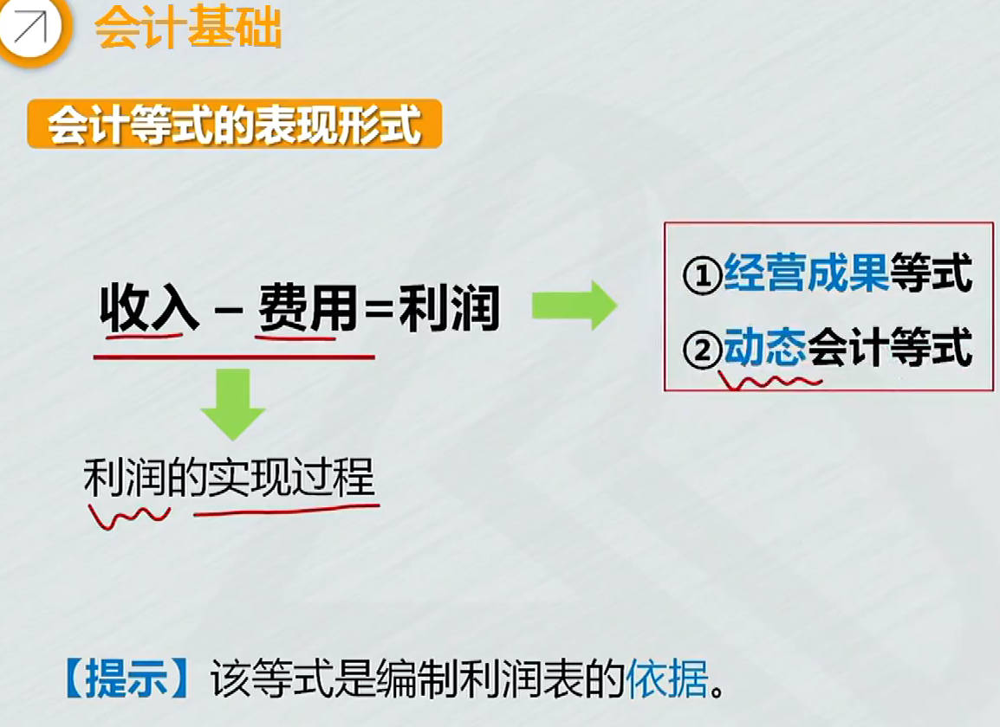 |
| ------------------------------------------------------------ | ------------------------------------------------------------ |
|  |  |

# 3、==会计科目==和账户

[好：最新会计科目表（2025）_中国会计网](http://www.canet.com.cn/kemu/596034.html)	

[2025年新会计准则会计科目明细](https://baijiahao.baidu.com/s?id=1825099602512134837&wfr=spider&for=pc)   

[企业会计准则——应用指南2006](https://docs.maoyanqing.com/accounting/ent/or/20061030.html)  [最新企业会计准则及应用指南2月修订版](http://new.delikcpa.com/news/show-2888.html)		  

[小企业会计准则_百度搜索](https://www.baidu.com/s?ie=UTF-8&wd=%E5%B0%8F%E4%BC%81%E4%B8%9A%E4%BC%9A%E8%AE%A1%E5%87%86%E5%88%99)	[“小企业会计准则”与“企业会计准则”的区别](https://mp.weixin.qq.com/s?__biz=MzkyNjMxMTM5MQ==&mid=2247487417&idx=1&sn=5a17dd947b707f94d3a735915788bec0)	[《小企业会计准则》与《企业会计准则》有何不同？](https://v.66law.cn/wenda/3206842.aspx)	

[中华人民共和国会计法（2024年）](https://kjs.mof.gov.cn/zhengcefabu/202408/t20240812_3941615.htm)	 [小企业会计准则](https://kjs.mof.gov.cn/zhengcefabu/201111/t20111107_605525.htm)		[小企业会计准则——会计科目、主要账务处理和财务报表](https://kjs.mof.gov.cn/zhengcefabu/201111/t20111107_605525.htm)	

[2024最新企业会计准则及应用指南](https://zhuanlan.zhihu.com/p/5168977887)	 

> 1. `会计科目`：具体的反映哪项资产、哪项负债等会计要素的变化。  对会计要素具体内容，进行分类核算的项目。  会计科目分类：资产类科目、负债类科目、共同类科目、所有者权益类科目、成本类科目、损益类科目。
>
>    1. 按提供信息的详细程度：分总分类科目、明细分类科目
>       1. 例如：负债 > 短期借款 > 工行； 看到短期借款就知道是从银行借的，要知道从哪个银行借的
>    2. `账户`：根据会计科目设置，有一定格式和结构，根据核算的经济内容，分（资产类、负债类、共同类、所有者权益类、成本类和损益类）账户；T型账户。
>       1. 会计科目只是一个名称，要反映增加减少的金额， 要在会计科目下面画一个T型结构，T型结构左右2边反映增加减少的金额； 
>       2. 会计科目加上下边的T型结构，就是会计账户； 哪边记增加，哪边记减少，取决于采用的==记账方法==和该账户==所记录的经济内容==；  
>       3. 账户科目关系：科目下面画个T型结构就是账户了，账户是根据科目设置的
>       4. 账户是根据科目设置的，所以对账户的分类和对科目的分类是一致的，也有2种分类方式
>

会计科目：更具体的反映企业经济业务，例如,反映什么资产增加了，原材料资产

- 对会计要素具体内容进行分类核算

会计科目有2种分类方式： 

1. 反映的经济内容
2. ==提供信息的详细程度==及其统驭关系

|  |  |
| ------------------------------------------------------------ | ------------------------------------------------------------ |
|  |  |
|  |  |
|  |  |

## 会计账户

会计科目只是一个名字，核算时，只有会计科目不够，==会计科目反映不出增减变动金额==

例如：购买原材料，只反映原材料增加，银行存款减少，但会计科目反映不出来,增加多少，减少多少。

`会计科目` 加上 `T型结构`，就是==会计账户==， 会计科目是会计账户的名称

- 账户哪一方登记增加，哪一方登记减少，取决于采用的 `记账方法` 和 该账户记录的`经济内容`

|  |  |
| ------------------------------------------------------------ | ------------------------------------------------------------ |
|  |                                                              |

# 4、借贷记账法

> 1. `复式记账法`：对于每一笔经济业务，都必须用相等的金额==在两个或两个以上相互联系的账户中进行登记==，全面、系统地反应会计要素增减变化的一种记账方法。
>    1. 借贷记账法的记账规则：“有借必有贷,借贷必相等”。如果涉及多个账户，记入借方账户金额的合计数等于，记入贷方账户金额的合计数。
>
> 1. `账户结构`：就是6类账户哪一边登记增加，哪一边登记减少
>    1. ==资产类、成本类和费用类==账户借方记增加， 贷方记减少； ==资成费==
>       1. 资产类成本类：本期发生额不加期初余额，只是当期增加的余额；  ==期末余额=期初余额+本期借方发生额-本期贷方发生额==； 
>          1. 有些账户可能期末无余额：生产成本全转成库存商品了
>    2. ==负债==类、==所有者权益==类和==收入==类账户贷方记增加，借方记减少
>       1. 负债类所有者权益类：有些账户可能期末无余额，例借了100，全还了

单式记账法：例如存折，只反映钱进来了，或者出去了； 不反映钱从哪来，或钱去哪里了; 只反映一个方面

复式记账法：例如，存款增加了，还要记存款增加是因为发工资

|  |  |
| ------------------------------------------------------------ | ------------------------------------------------------------ |
|  |  |
|  |  |
|  |  |

## 资产类、成本类、负债类、所有者权益类账户结构

看看各种账户，哪一边记增加，哪一边记减少

1. `资成费`账户增加记借方
2. `负债、所有者权益、收入类账户`增加记贷方, ==债权收==
3. `期末余额`哪边大，记哪边
4. 本期发生额不能加==期初余额==， 期初余额是上期留下的，不是当期发生额
   1. 例，2月的`本期借方发生额`100，不能加期初余额40； 2月期末余额 `40+100-50=90`

|  |  |
| ------------------------------------------------------------ | ------------------------------------------------------------ |
|  |  |

## 损益类账户结构

> 1. 损益类：包括收入类和费用类
>    1. 收入类：期末余额要转入本年利润，借方转走，贷方要加相同金额
>
>    2. 费用类：
>
>    3. 收入类账户：*本期收入净额在期末转入*“本年利润”账户,用以计算当期损益,结转后无余额。
>
>    4. 费用类账户：本期费用净额在期末转入“本年利润”账户，用以计算当期损益，结转后无余额。
>
> 2. 记账规则：账户结构解决了不同账户，增减登记在哪边； 接下来就可以用账户这个载体记录经济业务；就是可以用账户记账了
> 3. 会计`分录`：
>    1. 如果涉及到多个账户，都画T型图麻烦，用会计分录：简便的方式来反映经济业务
>       1. 不画T型图也能反映原材料增加1000
>       2. 对每一项经济业务的核算用的都是会计分录
>    2. 会计分录记载于记账凭证中。由应借应贷方向、相互对应的科目及其金额构成。

损益类账户期末没有余额, 期末转入==本年利润==

- 例如：收入借方60，贷100， 借方加40转入本年利润，两边就相等了
- 转出去了，就是减少，记借方

|  |  |
| ------------------------------------------------------------ | ------------------------------------------------------------ |

## ==记账规则==和会计分录

记账步骤：

1. 账户：业务涉及哪几个账户
2. 方向：借方还是贷方登记
3. 金额：填写

记账规则：有借必有贷，借贷必相等

- 一笔业务，记在这个账户的借方，必须在另一个账户贷方记一笔
- 因为是复式记账，要知道来源或者去向，2边肯定相等

==会计分录==：`画T型账户太麻烦`，用简便的形式反映经济业务

|  |  |
| ------------------------------------------------------------ | ------------------------------------------------------------ |
|  |  |

## ==试算平衡==

> 1. 试算平衡： 试算平衡表：在期末结出各账户的本期发生额合计，和期末余额后编制。
>    ==发生额试算平衡==： $$全部账户本期借方发生额合计=全部账户本期贷方发生额合计$$
>    ==余额试算平衡==：   $$全部账户借方期末(初)余额合计=全部账户贷方期末(初)余额合计$$
>    1. 借方期末余额：损益类期末结转到本年利润没余额，成本类(生产成本完工时变成库存商品)会转为资产类，所以期末有借方余额的：资产类账户
>    2. 贷方期末余额：收入类没有余额，只有负债和所有者权益类有余额，根据公式，资产=负债+所有者权益，所以：借方期末余额=贷方期末余额

用来==检查账户记录==是不是正确

1. 发生额试算平衡理解：
   1. 每笔业务涉及到的账户，借方发生额和贷方发生额相等 (依据:==有借必有贷，借贷必相等==); 合计后，所有账户的借方发生额和贷方发生额的合计数必相等
2. ==余额==试算平衡理解：
   1. `期末有借方余额的有`：资成类账户，费用转本年利润没余额        
      1. 成本类最终会转化为企业**资产**，例生产成本，转为库存商品，所以最终，期末有借方余额的是资产类账户余额
   2. `贷方期末余额`：**债、权益类**账户, 收入类账户转本年利润没余额
   3. 依据 $$\color{red}资产=负债+所有者权益，  借方期末余额 = 贷方期末余额$$
3. $$期末余额 = 期初余额 + 本期增加发生额 - 本期减少发生额‌$$
4. $$期初余额=期末余额+本期减少发生额-本期增加发生额$$; `本期期初余额=上期期末余额`

|  |  |
| ------------------------------------------------------------ | ------------------------------------------------------------ |
|  |  |
|  |  |

### 实战

[总分类账和明细分类账怎么登？](https://www.zhihu.com/question/292122433)	 

1. 会计分录
2. 会计分录登记到==总分类账户==
   1. 算出各账户期初余额、本期发生额和期末余额
3. 根据各账户期初余额、本期发生额和期末余额，编制总分类账户==试算平衡表==

|  |  |
| ------------------------------------------------------------ | ------------------------------------------------------------ |
|  |  |
|  |       |

# 7、会计凭证

会计核算流程：==单、证、账、表==

1. 原始凭证
2. 记账凭证: `会计分录`在记账凭证上完成
3. 会计帐薄： 根据记账凭证登记帐薄
4. 财务报表

## 原始凭证

[填制人和经办人_百度搜索](https://www.baidu.com/s?ie=UTF-8&wd=%E5%A1%AB%E5%88%B6%E4%BA%BA%E5%92%8C%E7%BB%8F%E5%8A%9E%E4%BA%BA)	 

==经办人==是指业务办理人。 ==填制人==是指制单的人，一般指会计、出纳

[原始凭证填制和审核](https://www.renrendoc.com/paper/209466886.html)	

> 1. 原始凭证： 又称单据
>    1. 基本内容：原始凭证7要素
>       1. ==名、日、金、容、2人、单(担)== 
>       2. 2人:经办人 、填制人;  单： 双方单位名
>    2. 填制要求

|  |  |
| ------------------------------------------------------------ | ------------------------------------------------------------ |
|  |  |
|  |  |
|  |  |
|  |  |
|  |  |

### 填制要求

1. 连续编号因错作废时，加盖作废戳
2. 原始凭证金额错，只能重开
3. 其他错误：重开或更正，更正处盖章

|  |  |
| ------------------------------------------------------------ | ------------------------------------------------------------ |
|  | 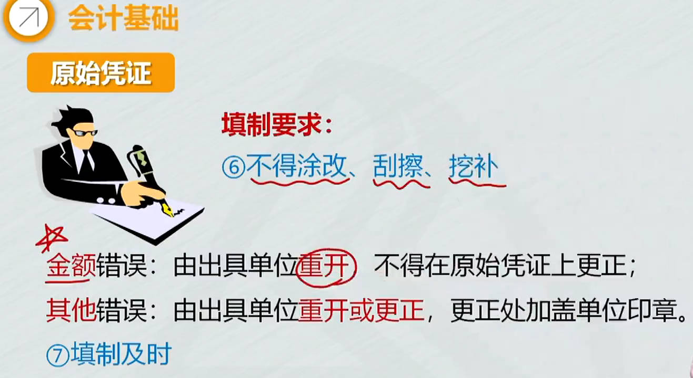 |

## 记账凭证

1. 记账凭证: `会计分录`在记账凭证上完成
   1. 转账凭证： 下图例子里：所有借贷方科目写在总帐科目栏
2. 会计帐薄： 根据记账凭证登记帐薄

> 1. 记账凭证：作用是确定会计分录，作为登记帐薄的直接依据。
>    1. 收款凭证：借方科目是确定的
>    2. 付款凭证：贷方科目是确定的，不是银行存款就是库存现金 
>    3. 转账凭证：左上角没借贷方科目，因为借贷方不确定
>    4. 填制要求
>       1. 已登记入账，当年内发现错误：==内容错==，红字填一张内容相同的用来注销，再蓝字填一张正确的；  ==金额错==，差额，红减蓝增
>       2. 以前年度错误：蓝字填一张更正的记账凭证

|  |  |
| ------------------------------------------------------------ | ------------------------------------------------------------ |
|  |  |
|  |  |
|  |  |

### 会计凭证填制和保管

1. 填制： `凭证编号`、日期、`摘要`、`科目`、金额； 所附`原始凭证张数`;
   1. 填制、记账、稽核、会计机构负责人、会计主管签名或盖章
   2. $$转字4\tfrac{1}{3} 号$$ ：第4笔转账业务，有3张记账凭证，这是第1张 
   3. 如果登记过帐薄，`记账处打勾`
2. 填制记账凭证发生错误
   1. ==已登记入账==的记账凭证，==当年内==发现填写错误： 
      1. ==红字冲销法==： 红字填一张与原内容一样的用来注销，同时用蓝字填一张正确的记账凭证
      2. ==调整记账凭证==：科目没错`金额错`：将正确数字和错误数字的差额，另编一张调整记账凭证，调增金额用蓝字，调减红字
   2. 发现以前年度记账凭证有错误
      1. 蓝字填一张更正的记账凭证

|  |  |
| ------------------------------------------------------------ | ------------------------------------------------------------ |
|  |  |
|  |  |
|  |  |
|  |  |
|  |  |
|  |  |
|  |                                                         |

# 9、会计帐薄

[记账实操](https://search.bilibili.com/all?vt=04453278&keyword=%E8%AE%B0%E8%B4%A6%E5%AE%9E%E5%8A%A1&search_source=5)	

填记账凭证时，同时填写帐薄，例如银行存款日记账

> 1. 会计帐薄：以经过审核的会计凭证为依据，全面、系统、连续的记录各项经济业务和会计事项的薄籍。
>
>    1. 账簿作用：1月1日，某企业银行存款100万，假定1月发生了这么多经济业务，每笔业务都填了记账凭证，想知道余额银行存款余额；要一张一张翻记账凭证，看每笔业务对银行存款的影响，最后算出； 比较麻烦；
>    2. 经济业务多的单位的总分类账，可根据记账凭证汇总表(又称科目汇总表)，或汇总记账凭证等定期登记
>
>    1. `结帐`：1、结清各种损益类账户，计算确定本期利润。 2、结出各资产、负债、所有者权益账户的，本期发生额合计和期末余额。

[家庭活页记账本](https://mbd.baidu.com/newspage/data/dtlandingsuper?nid=dt_3685900239503432151)	

==活页式==账簿一般适用于`需频繁更新或分类管理`的明细账、辅助账等,具有灵活性强、便于业务扩展的特点

==多栏式==：借贷方`金额栏`按需设若干专栏； 常用于`收入、费用、成本明细账`

==数量金额式==：借、贷、余额栏目分设数量、单价、金额； 常用于`原材料、库存商品明细账`

|  |  |
| ------------------------------------------------------------ | ------------------------------------------------------------ |
|  |  |
|  |  |
|  |  |
|  |  |
|  |  |
|  |  |
|  |  |
|  |  |

## 登记要求

没有余额写平,元的位置写个 $$θ$$ 

|  |  |
| ------------------------------------------------------------ | ------------------------------------------------------------ |
|  |  |
|  |  |
|  |  |
|  |                                                         |

## 格式与==登记方法==

[现金日记账](https://mbd.baidu.com/newspage/data/dtlandingsuper?nid=dt_4209343915359195741)	 [出纳实务：库存现金日记账的结账](https://baijiahao.baidu.com/s?id=1608201048743682560)	

[银行存款日记账](https://www.douyin.com/note/7356170603344334106)	 

[备抵账户_百度百科](https://baike.baidu.com/item/%E5%A4%87%E6%8A%B5%E8%B4%A6%E6%88%B7/10238875?lemmaFrom=lemma_starMap&fromModule=lemma_starMap&starNodeId=c9fdac1dc0d4bad1280ac99c&lemmaIdFrom=775251)	

1. 库存现金日记账
   1. 日记账要逐日结出余额

2. 银行存款日记账
3. 总分类账
   1. 业务少，逐笔登记
   2. 业务多，用`汇总记账凭证` 或 `科目汇总表`登记总帐
4. 明细分类账
   1. 可以是三栏、多栏、数量金额式
   2. 根据明细分类账户设置并登记
5. 总分类账和明细分类账平行登记
   1. 还要在库存商品的2个明细账分别登记10000和5000
   2. 方向相同、金额相等、期间一致： 库存商品在借方，甲和乙一样要在借方登记

|  |  |
| ------------------------------------------------------------ | ------------------------------------------------------------ |
|  |  |
| 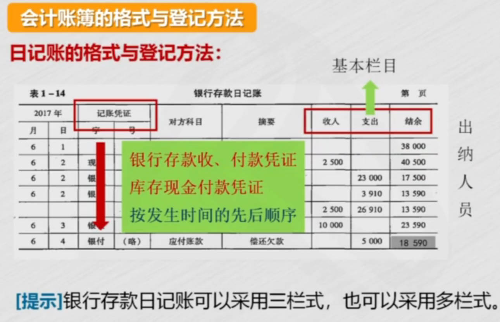 |  |
| 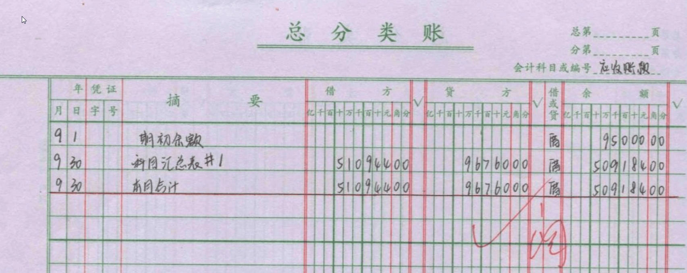 | 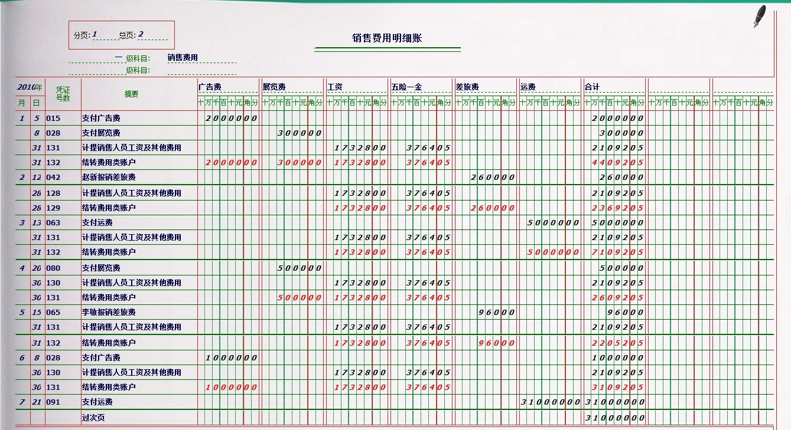             |
|  |  |
|  |  |
|  |  |
|  |                                                         |

## 对账与结帐

1. 损益类账户期末没有余额：余额转本年利润
2. 资产、负债、所有者权益账户：结出发生额和期末余额

|  |  |
| ------------------------------------------------------------ | ------------------------------------------------------------ |
|  |  |
|  |  |

## ==错账更正==

错账更正方法
1. **划线更正**：==结帐前==发现帐薄和记账凭证错(未过账)，其中有一个出错: ==文字或数字错==
   1. 文字或数字上划红线，上方写正确的
   2. 并由记账人员和会计主管在更正处盖章
2. **红字冲销**：
   1. 帐薄和记账凭证，2边都错了，并且是==科目错==了
      1. 红字写一张与错误的记账凭证相同的，用来冲销，摘要栏写"`注销x月x日x号凭证`"
      2. 蓝字写一张正确的记账凭证
   2. 帐薄和记账凭证==科目无误==，所记金额大于应记金额，==多记了==
      1. 多记金额用`红字`（==负==）写一张记账凭证，冲销多记金额，摘要栏写"`冲销x月x日第x号记账凭证多记金额`"
3. **补充登记法**
   1. 帐薄和记账凭证==科目无误==，所记金额小于应记金额，==少记了==
      1. 少记的金额用`蓝字`写一张记账凭证，摘要栏写"`补记x月x日第x号记账凭证少记金额`"

|  |  |
| ------------------------------------------------------------ | ------------------------------------------------------------ |
|  |  |
|  |                                                              |

# 11、财产清查

账实核对

> 1. 货币资金的清查方法：
>    1. 库存现金清查
>    2. 银行存款清查：银行存款余额调节表;    
>       1. 以企业`银行存款日记账`余额和`银行对账单`余额为基础， 各自分别==加上对方已收，减去对方已付==
> 2. 实物资产清查
> 3. 往来款项清查
> 4. 债权债务的清查
> 5. 清查结果处理

|  |  |
| ------------------------------------------------------------ | ------------------------------------------------------------ |
|  |  |
| 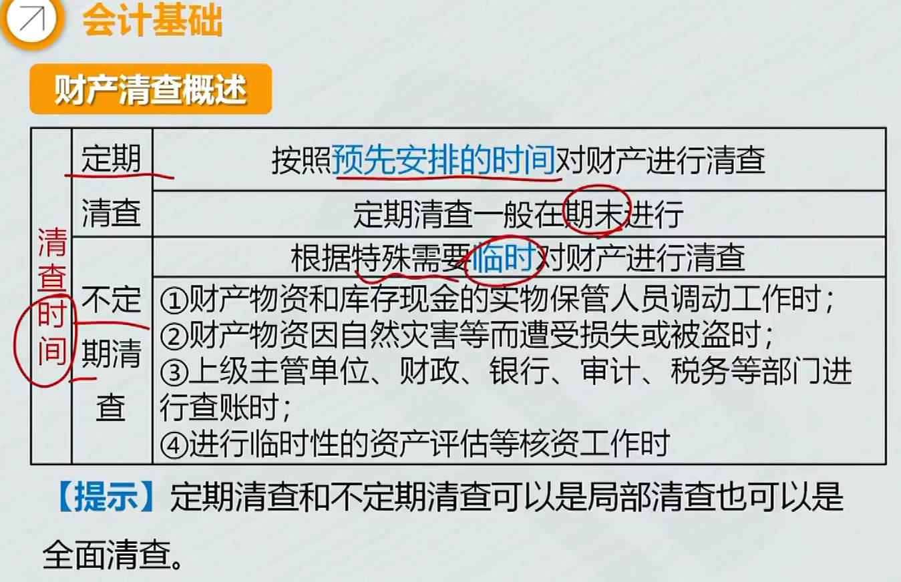 |  |
|  |  |

## 银行存款的清查

企业银行存款==日记账余额== + 银行已收（==企业未收==）款 — 银行已付（==企业未付==）款 == `银行对账单`存款余额 + 企业已收（`银行未收`）款 —  企业已付（`银行未付`）款

|  |  |
| ------------------------------------------------------------ | ------------------------------------------------------------ |
|  |  |
|  |  |

## 实物资产清查

|  |  |
| ------------------------------------------------------------ | ------------------------------------------------------------ |

## 清查结果处理
|  |  |
| ------------------------------------------------------------ | ----- |

##  财务报告

|  |  |
| ------------------------------------------------------------ | ------------------------------------------------------------ |
|  |                                                         |

# 12、会计账务处理程序

> 1. 记账凭证账务处理程序：根据==记账凭证==登记总分类账
>    1. 根据收、付凭证登记现金、银行存款日记账
>    2. 根据原始凭证和记账凭证，登记明细分类账
>    3. 根据记账凭证，登记总分类账
>    4. 发生一次业务，就要登记一次总帐
> 2. 汇总记账凭证：汇总转账凭证借贷方不确定，一般按贷方账户汇总
>    1. 定期编制汇总收、付、转凭证，再根据汇总记账凭证登记总账
>    1. 汇总的是单个账户， ==按账户分类汇总==
> 3. 科目汇总表：又称记账凭证汇总表
>    1. 汇总所有账户的借、贷方发生额 ，==按科目定期汇总借、贷方发生额==
>    2. 定期编制科目汇总表，再根据科目汇总表登记总账
>    3. 可以每月汇总一次每月编一张; 也可以`每旬（10天）`汇总一次每旬编一张

|  |  |
| ------------------------------------------------------------ | ------------------------------------------------------------ |
|  |  |
|  |  |
| 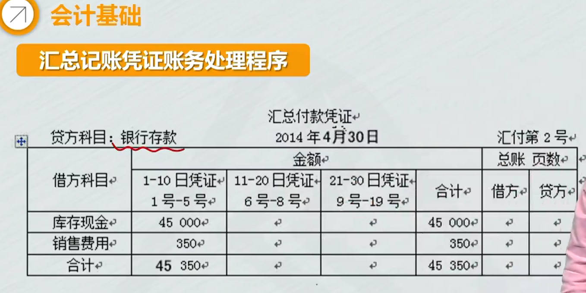 |  |
|  |  |
|  |  |

# 13、成本会计基础
1. 概念
2. 基本原理
3. 产品成本核算要求
4. 一般程序
   1. 结转成本：东西卖出去了，要知道成本是多少，有收入有成本才能算利润
5. 产品成本计算方法
   1. 品种法
   2. 分批法
   3. 分布法

|  |  |
| ------------------------------------------------------------ | ------------------------------------------------------------ |
|  |  |
|  |  |
|  |  |
|  |  |
|  |  |
|  | 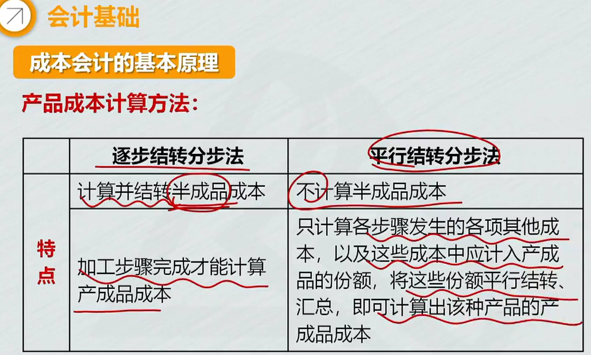 |

# 14、管理会计基础
|  |  |
| ------------------------------------------------------------ | ------------------------------------------------------------ |
|  |  |
|  |                                                         |

# 15、政府会计基础

|  |  |
| ------------------------------------------------------------ | ------------------------------------------------------------ |
| 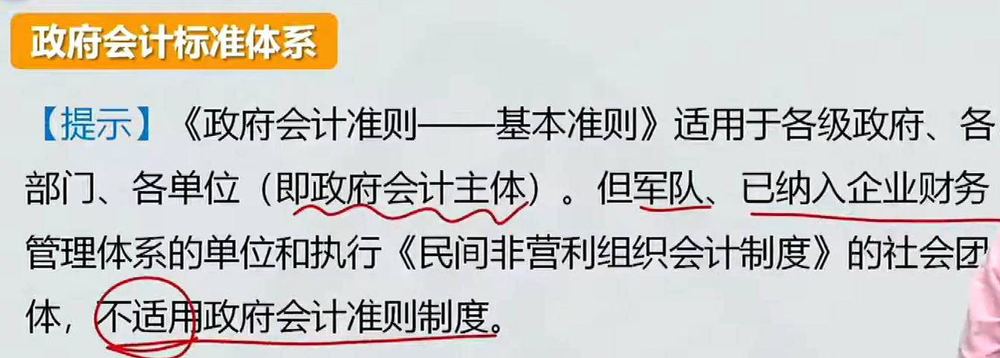 | 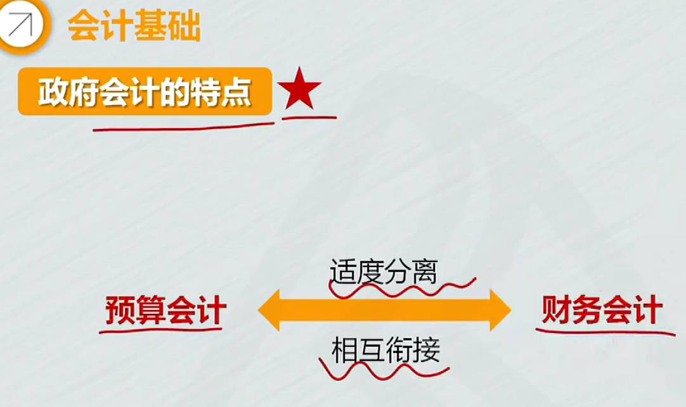 |
| 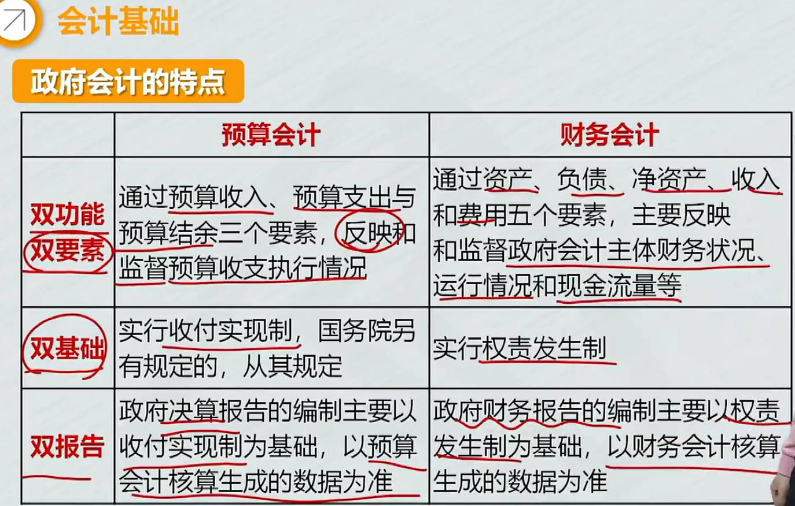 |  |
|  |  |
|  |  |