# 3.1 货币资金

[主营业务收入、其他业务收入和营业外收入的区别](https://mp.weixin.qq.com/s?__biz=MzU2MjAyMDcxNA==&mid=2247529735&idx=2&sn=ac84c394dbda4be8e25f922eed0ccfa4&chksm=fc6ddd02cb1a5414f8a05553a62ef8eae7820d97650794bf19b86a42f911d9e65f7d1eaf4105&scene=27)   [其他业务收入](https://wiki.mbalib.com/wiki/其他业务收入) [营业外收入](https://wiki.mbalib.com/wiki/营业外收入) 

[摊余成本](https://zhuanlan.zhihu.com/p/355770118)    [其他业务成本](https://wiki.mbalib.com/wiki/Category:损益类科目) [生产成本](https://wiki.mbalib.com/wiki/Category:成本类科目)

## 库存现金

> 1. 现金管理制度
>    1. 现金限额: 开户行确定
>    1. 不得坐支：只能从现金限额或银行中提取，不能从现金收入中直接支付
> 2. ==现金清查==的账务处理
>    1. 备用金：拨给各部门零星开支使用的款项
>    2. 调帐==以实为主==: 账上1000，实际800； 把账上的调为800
>    3. 实地盘点法；库存现金盘点报告表（原始凭证）；  结果：现金短缺或溢余  :账实不符，以实为主。
>       `待处理财产损益(过渡)、要赔的(其他应收款) 、管理费用；   溢余：其他应付款、 营业外收入`


|  |  |
| ------------------------------------------------------------ | ------------------------------------------------------------ |
|  |  |
|  |  |
|  |  |
|  |  |

## 银行存款

|  |  |
| ------------------------------------------------------------ | ------------------------------------------------------------ |

## 其他货币资金

1. 银行汇票
   1. 存100，货款80，退20
2. 银行本票
3. 信用卡
4. 信用证保证金存款
5. 存出投资款
6. 外埠存款

> 1. "商业汇票"通过"应收票据、应付票据"核算，不通过其他货币资金科目核算。

### 银行汇票

|  |  |
| ------------------------------------------------------------ | ------------------------------------------------------------ |
|  |  |
|  |  |
| 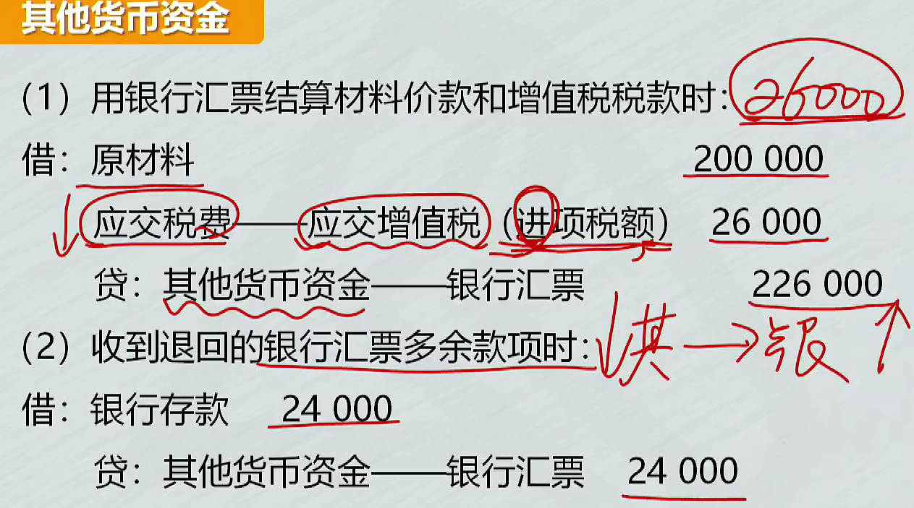 |  |

### 银行本票

|  |  |
| ------------------------------------------------------------ | ------------------------------------------------------------ |
|  |  |

### 信用卡存款

[为什么单位卡账户的资金只能从其基本账户转账存入_百度搜索](https://www.baidu.com/s?ie=UTF-8&wd=%E4%B8%BA%E4%BB%80%E4%B9%88%E5%8D%95%E4%BD%8D%E5%8D%A1%E8%B4%A6%E6%88%B7%E7%9A%84%E8%B5%84%E9%87%91%E5%8F%AA%E8%83%BD%E4%BB%8E%E5%85%B6%E5%9F%BA%E6%9C%AC%E8%B4%A6%E6%88%B7%E8%BD%AC%E8%B4%A6%E5%AD%98%E5%85%A5)	

单位卡账户的资金一律从其基本账户转账存入,不得交存现金,不得将销货收入的款项存入其账户

|  |  |
| ------------------------------------------------------------ | ------------------------------------------------------------ |
|  |                                                         |

### 信用证保证金存款等

> 1. 信用证保证金存款：信用证不可撤销，只限于转账结算，不可以支取现金
> 2. 存出投资款
> 3. 外埠存款：到外地临时、零星采购，到外地银行开立采购专户；不计利息、只付不收、付完清户。采购人员可提少量现金，一律转账结算。
> 4. 其他货币资金里没有银行承兑汇票(商业汇票)、银行支票(和银行存款支付一样)。 银行汇票、本票可背书转让。

|  |  |
| ------------------------------------------------------------ | ------------------------------------------------------------ |
|  |  |
# 3.2 交易性金融资产

## 取得

> 1. 金融资产
> 2. 交易性金融资产
>    1. 近期内出售
>    2. `以公允价值计量`且其变动计入当期损益
>    3. 股票、债券等
> 3. 交易性金融资产取得、持有、出售
> 4. 转让金融商品应交增值税
> 5. 短期投资的核算

==取得至处置的投资收益==：

1. 交易费计入投资收益
2. 持有期股利、利息
3. 处置时损益： 出售时借贷方差额计入投资收益， `处置时价款 - 处置时账面余额`
4. 出售时确认应缴增值税，对应科目计入投资收益

==取得至处置的损益==：除了投资收益，还有公允价值变动计入`公允价值变动损益`

==处置损益==： 处置价款减账面价值

公允价值变动损益：股票涨跌

投资收益属于==收入类==科目

B从A处买时，有未付的股利、利息，B要先垫付给A，到支付日、付息日收回垫付的金额

- 股票价款里包含股利
- 债券价款里包含利息的情况：应收利息


资产负债表日(date of balance sheet)指的是结账日期，即结账和编制资产负债表的日期。通常指年度资产负债表日，在我国会计年度中，资产负债表日一般是指==每年12月31日==

|  |  |
| ------------------------------------------------------------ | ------------------------------------------------------------ |
|  |  |
|  |  |
|  |  |
|  |  |
|  |  |
|  |  |
|  |  |

## 持有

1. 收回垫付股利：借：其他货币资金   贷：应收股利 （冲抵垫付）
2. 宣告发股利：   借：应收股利          贷：投资收益
3. 期末资产负债表日(==每年12月31日==)
   1. 公允价值变动:  高于或低于`账面余额`
   1. 公允价值变动损益，贷方：利得

|  |  |
| ------------------------------------------------------------ | ------------------------------------------------------------ |
|  |  |
|  |  |
|  |  |
|  | 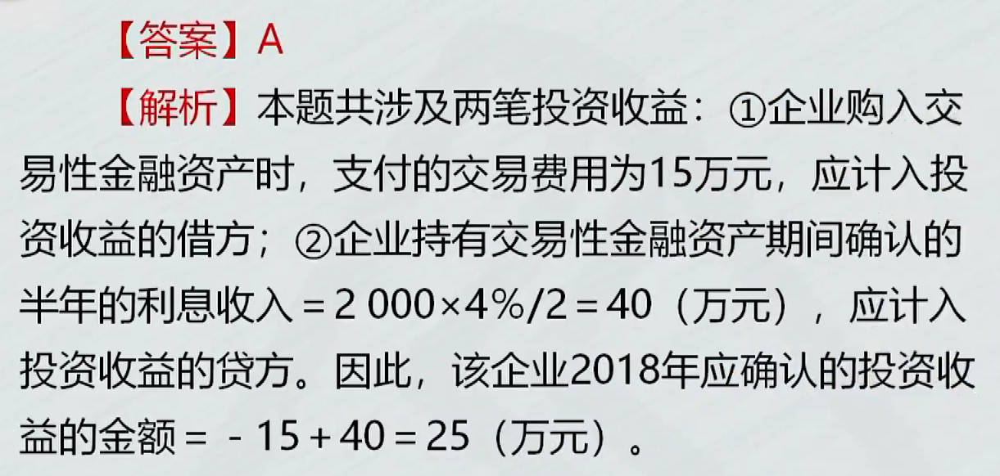 |

## 出售

交易性金融资产2个科目：`成本`和`公允价值变动`要分别冲掉。

- 如果之前的 `公允价值变动`余额在借方，就在贷方冲减
- 借贷方差额记在投资收益
  - 投资收益： 处置时价款 - 处置时账面余额
  - 出售价 - （成本+公允价值变动） = ==投资收益==


|  |  |
| ------------------------------------------------------------ | ------------------------------------------------------------ |
|  |  |
|  |                                                         |
## 转让金融商品应交增值税

$$D垫付的股利；    I垫付的利息$$

除之后还原为==不含税的销售额==,再乘==6%==税率：  $\tfrac{\huge卖出价-买入价(不扣除D/I)}{\huge1+6\%} \times 6\%$

1. 大于0，转让产生了收益，要交增值税
2. 小于0，出现负差，不仅不缴增值税，还可以抵扣增值税
   1. 损失年末不让转下一年继续抵扣，年末要把借方抵扣税费转出（即冲销掉）
      1. 借方余额转出：就是借方余额冲掉，做一个相反的会计分录

|  |  |
| ------------------------------------------------------------ | ------------------------------------------------------------ |
|  |  |
|  |  |
|  |  |
|  |  |
|  |  |
## 短期投资核算

==小企业==的短期投资：随时变现、持有时间不超1年(含1年)。

- 短期投资的税费，计入短期投资的成本
- 应收股利买方垫付了，包含在存款里，在贷方冲抵； 出售没短期投资了，冲抵短期投资

|  |  |
| ------------------------------------------------------------ | ------------------------------------------------------------ |
|  |  |
|  |                                                              |

# 3.3 应收及预付款项

## 应收票据

> 1. 应收票据：收到的==商业汇票==，不超6个月(商业承兑汇票、银行承兑汇票-万五手续费)

A卖东西：B什么都没给，借：应收账款

贴现：商业汇票没到期转让给银行

背书转让：A公司销货取得票据，需要从C公司买货，把票据给C

- 票面金额不够货款，剩余用银行存款支付

|  |  |
| ------------------------------------------------------------ | ------------------------------------------------------------ |
|  |  |
| 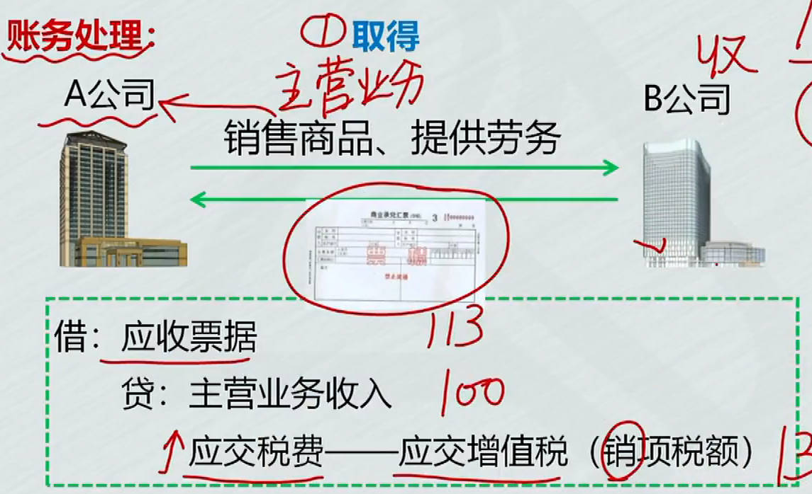 |  |
|  |  |

## 应收账款

应收、预收是==卖方==视角； 应付、预付是==买方==视角

卖东西：入账价值：价款+增值税+代垫的运杂费等
|  |  |
| ------------------------------------------------------------ | ------------------------------------------------------------ |
|  |  |
|  |                                                              |

## 预付账款

|  |  |
| ------------------------------------------------------------ | ------------------------------------------------------------ |
|  |  |
|  |                                                         |
## 应收股利和应收利息

|  | 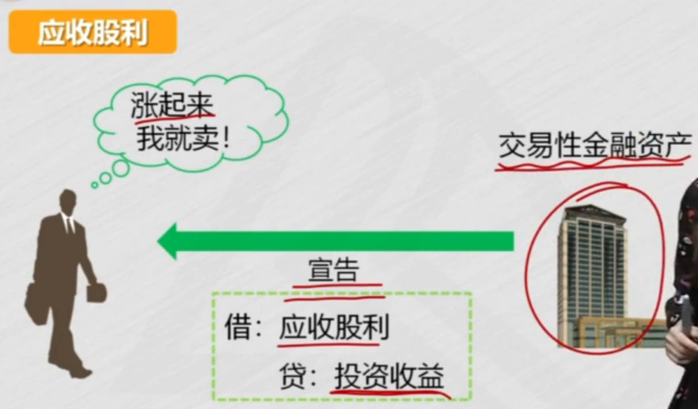 |
| ------------------------------------------------------------ | ------------------------------------------------------------ |
|  |  |
|  |                                                         |
## ==其他应收款==

|  |  |
| ------------------------------------------------------------ | ------------------------------------------------------------ |
|  |  |
## 应收款项减值

1. 直接转销法(小企业)
   1. 3年收不回来为坏账，发生坏账时才确认损失
   2. 用 `信用减值损失` 核算, 收不回来，冲减 `应收账款`
   3. 缺点：16年的损失，到19年才确认
2. **备抵法**
   1. 期末==估计==应收款中收不回来的部分，确认相应坏账损失

### 直接转销法

|  |  |
| ------------------------------------------------------------ | ------------------------------------------------------------ |
|  |  |
|  |                                                         |
### ==备抵法==

[坏账准备是哪一类科目_百度搜索](https://www.baidu.com/s?ie=UTF-8&wd=%E5%9D%8F%E8%B4%A6%E5%87%86%E5%A4%87%E6%98%AF%E5%93%AA%E4%B8%80%E7%B1%BB%E7%A7%91%E7%9B%AE)	

[冲销是什么意思_百度搜索](https://www.baidu.com/s?ie=utf-8&f=3&rsv_bp=1&tn=baidu&wd=%E5%86%B2%E9%94%80%E6%98%AF%E4%BB%80%E4%B9%88%E6%84%8F%E6%80%9D&oq=%25E5%259D%258F%25E8%25B4%25A6%25E5%2587%2586%25E5%25A4%2587%25E6%2598%25AF%25E5%2593%25AA%25E4%25B8%2580%25E7%25B1%25BB%25E7%25A7%2591%25E7%259B%25AE&rsv_pq=fecd9531000e9608&rsv_t=3dd876uBtQ8FQJoTejKIg0BmCAnpZqjy1BB9MSAgHv9kPjnLaBIBmDtaAyA&rqlang=cn&rsv_enter=1&rsv_dl=ts_0&rsv_sug3=13&rsv_sug1=3&rsv_sug7=100&rsv_sug2=0&rsv_btype=t&prefixsug=%25E5%2586%25B2%25E9%2594%2580&rsp=0&inputT=5844&rsv_sug4=9862)	  [信用减值损失和资产减值损失](https://zhuanlan.zhihu.com/p/677347517)	[资产负债表日_百度百科](https://baike.baidu.com/item/%E8%B5%84%E4%BA%A7%E8%B4%9F%E5%80%BA%E8%A1%A8%E6%97%A5/2235822)	

资产负债表日(date of balance sheet)指的是结账日期，即结账和编制资产负债表的日期。通常指年度资产负债表日，在我国会计年度中，资产负债表日一般是指==每年12月31日==


不要等到实际发生坏账时，才去处理，在期末，就要估计现有应收款项收不回来的部分,确认相应坏账损失。

`备抵科目`：它的增加，会使应收账款的价值减少 

1. **计提坏账准备** : 增加坏账准备
   1. 坏账准备属于资产类科目中的备抵科目（调整科目）‌，主要用于抵减应收账款等资产类科目的账面价值，反映应收款项可能发生的减值损失
2. 转回：计提10万，应有8万, 转回2万
   1. 冲减计提

3. 转销坏账损失 ：==实际发生坏账==，就是转销坏账, 把`坏账准备结转掉`
   1. 实际发生坏账时，`冲掉坏账准备 和 应收账款`
4. ==收回已转销的坏账==：钱又收回来了，收回已转销的应收账款
   1. 钱又收回来了，==先恢复==准备、应收; 再处理收款

坏账准备科目： **转回、转销在借方，计提、补提、收回已转销在贷方**； 贷方增加，借方登记减少

|  |  |
| ------------------------------------------------------------ | ------------------------------------------------------------ |
|  |  |
|  |  |
|  |  |
|  |  |
|  | 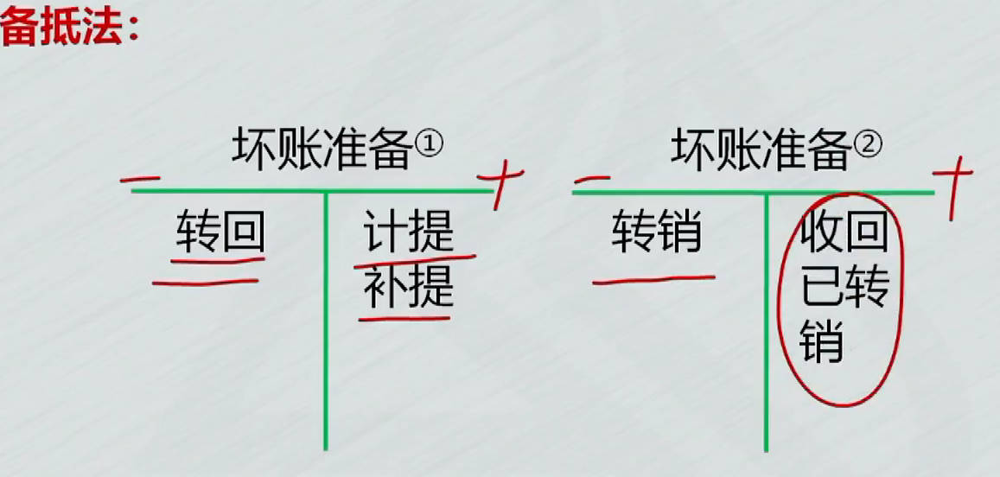 |

# 3.4 存货

几种重要的存货：$\color{blue}\Large原材料、周转材料、委托加工物资、库存商品$

消耗性生物资产也是存货

**存货成本核算**时，可以用==计划成本==或==实际成本==核算

1. **原材料**： `在途物资`
   1. **发出材料账务处理**: 领用、出售、发出委托加工
   2. ==发出存货的计价方法==
   3. 计划成本法下：**入库**前不用`在途物资`，用`材料采购`科目
      1. **入库**：  分开需要3个分录，  ==采购分录、入库分录、结转差异分录==
         1. 入库和结转差异分录可以合并： `借：原材料(计划成本)     贷： 材料采购(实际成本)   材料成本差异(入库节约差异)`

      2. **发出**材料账务处理：        ==发出材料分录、结转差异分录==
         1. 发出材料、结转差异分录合并： `借：生产成本等(实际成本)  贷：原材料(计划成本)     材料成本差异(发出超支差异)`

      3. 记忆技巧：==超支时==，材料成本差异的方向和==原材料方向相同==

2. **周转材料**: 包装物、低值易耗品
   1. 作为==产品组成==部分
      1. 领用包装物记减少,计入产品生产成本
      2. `周转材料-包装物`
   2. 随商品出售，而==不单独计价==
      1. 借：销售费用

   3. 随商品出售，==单独计价==
      1. 相当于销售茶叶盒，要确认收入、结转成本 
         1. `其他业务收入、其他业务成本`
      2. 涉及`销售需要2个分录`： 确认收入、结转成本

   4. ==出租、出借==包装物
      1. 库存包装物转`出租/借`
      2. 押金
      3. 租金收入
      4. 修理费用
      5. 包装物摊销
         1. 例如：包装物能用2次，用一次价值减少
            1. 除固定资产外，用摊销，例如无形资产摊销
         1. 出借摊销到`销售费用`，出租摊销到`其他业务成本`

   5. ==低值易耗品==： 在用、在库、摊销（因为使用价值减少）； `周转材料-低值易耗品-在用`
      1. 分次摊销法: 领用、摊销、最后一次摊销结平余额
      2. 领用：在库转在用
      3. 摊销: 价值减少的部分
         1. 摊销记计划成本，费用记实际成本

      4. 结平余额（在用、摊销）
         1. 2次摊销完后，在用借方有1000，摊销贷方有1000，摊销完后不应该有余额
         2. 所以要==结平余额==，在用贷方1000，摊销借方1000

3. **委托加工物资**
   1. 发出物资
   2. 支付加工费、运费等
      1. 消费税：收回后连续加工，可抵扣的消费税；  收回后直接出售，不能抵扣，计入成本

   3. 验收入库

4. **库存商品** ： 包括 **产成品、外购商品**等
   1. **工业企业：** 
      1. 生产时的账务处理
         1. 借方：生产成本 贷：原材料

      2. 完工时
         1. 生产成本转库存商品

      3. 销售时： 2个分录
         1. 确认收入
         2. 结转成本： `借：主营业务成本  贷：库存商品`
   2. **商品流通企业发出商品的核算方法**： 
      1. 毛利率法： **销售净额 减 毛利**，就是销售成本
         1. $\Large本期销售毛利=本期销售净额\times上期毛利率$
         2. $\Large本期销售成本=本期销售净额-本期销售毛利$
      2. 售价金额法： **收入 减 进销差价**，就是销售成本
         1. 进价和售价的差额就是进销差价, 然后计算差价率: $\Large\color{blue}{差价\over售价}={期初差价+本期购入差价\over期初售价+本期购入售价}$
         2. 销售商品的进价怎么确定： 
            1. $\color{blue}\large本期销售商品应分摊的商品进销差价= 销售时售价(收入)\times进销差价率$
            2. $\color{red}\large本期销售商品成本=本期商品销售成本-本期销售商品应分摊的商品进销差价$
            3. $\color{blue}\large期末结存商品成本=期初结存商品进价+本期购入商品进价-本期销售商品成本$
         3. 分录：按==售价==结转成本，再分摊销售商品的进销差价,冲减主营业务成本，冲减后主营业务成本（差额）就是进价

## 存货成本确定

1. **外购存货成本**
   1. 价款
   2. 税费：==三税一费与不能抵扣==,要计入存货成本
      1. 消资进关附加
      2. 不能抵扣的增值税进项税
   3. 其他费用：==六费一损耗==
      1. 运、包、装、保、理、仓
      2. 合理损耗
2. **自制存货成本**
   1. 直接材料
   2. 直接人工
   3. 制造费用
3. **委托加工存货成本**
   1. 耗用的原材料等
   2. 加工费
   3. 税费
   4. 其他费用
4. **不应计入存货成本的费用**
   1. 非正常损耗
      1. 自然灾害造成的损耗，计入==营业外支出==
   2. 验收入库后的仓储费用
5. 几种重要的存货：存货核算时，可以用==计划成本==或==实际成本==核算
   1. 原材料
   2. 周转材料
   3. 委托加工物资
   4. 库存商品

|  |  |
| ------------------------------------------------------------ | ------------------------------------------------------------ |
|  |  |
|  |  |
|  |  |
|  |  |
|  |  |
|  |  |
|  |  |

## 原材料采用实际成本核算


### 购入材料

`在途物资`：原材料未验收入库

`原材料`：在途物资验收入库后

1. 货款已支付，已入库
    1. 借：原材料

2. 货款已支付，未入库
    1. 借：==在途物资==

3. 已入库, 货款未支付
    1. 收到发票：  贷：==应付账款==
    2. 发票未到：  月末，贷：==应付账款-暂估应付账款==， 下月初红字冲销

4. 货款已预付，未入库
    1. 预付
    2. 收货
    3. 补付


| 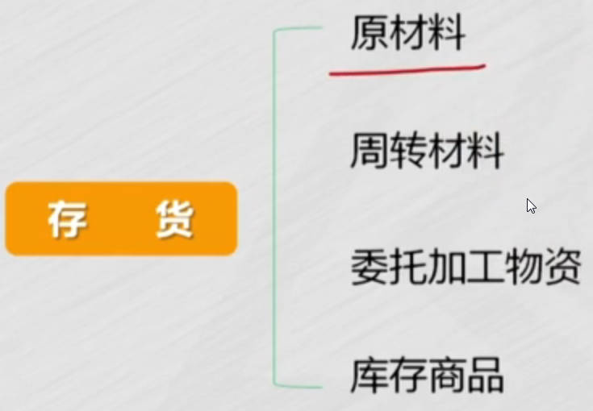 | 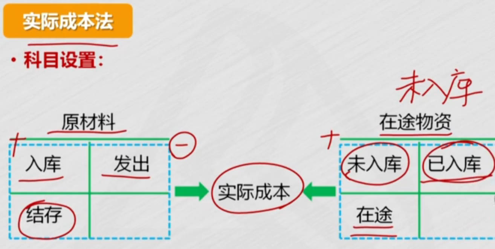 |
| ------------------------------------------------------------ | ------------------------------------------------------------ |
|  |  |
|  |  |
| 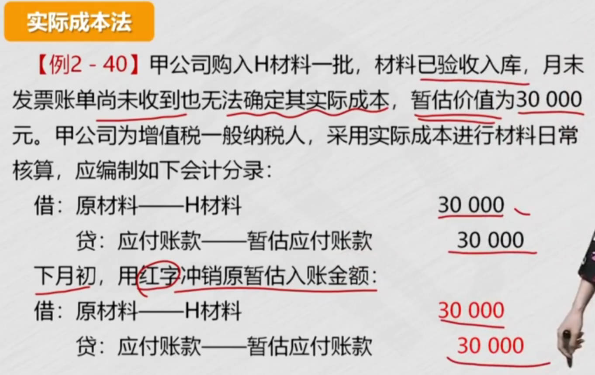 |  |
|  |  |
|  |                                                         |

### 发出材料账务处理

[卖材料为什么计入其他业务成本_百度搜索](https://www.baidu.com/s?ie=utf-8&f=8&rsv_bp=1&tn=baidu&wd=%E5%8D%96%E6%9D%90%E6%96%99%E4%B8%BA%E4%BB%80%E4%B9%88%E8%AE%A1%E5%85%A5%E5%85%B6%E4%BB%96%E4%B8%9A%E5%8A%A1%E6%88%90%E6%9C%AC&oq=%25E5%258D%2596%25E6%259D%2590%25E6%2596%2599%25E4%25B8%25BA%25E4%25BB%2580%25E4%25B9%2588%25E4%25B8%258D%25E6%2598%25AF%25E5%2585%25B6%25E4%25BB%2596%25E4%25B8%259A%25E5%258A%25A1%25E6%2594%25B6%25E5%2585%25A5&rsv_pq=b13616f90008337d&rsv_t=fab77nNYk5UGiboWFFTrMnPnkeRfyCnSenJQ3WlOGc5asZF71Ex00ynq%2FW4&rqlang=cn&rsv_enter=1&rsv_dl=tb&rsv_sug3=13&rsv_sug1=8&rsv_sug7=100&rsv_sug2=0&rsv_btype=t&inputT=6211&rsv_sug4=7566)	  [企业对外销售原材料是主营业务成本](https://ailegal.baidu.com/?fr=seo_qadetail&template=business&articleType=qadetail&articleId=bf2d9697922299000703)	[出售原材料](https://www.chinaacc.com/wenda/detail/xt/5583076)	

1. 生成经营领用
   1. 发出存货: $\begin{matrix}
      借：生成成本\\
         管理费用等\\
      贷：原材料
      \end{matrix}$

2. 出售
   1. 销售原材料的收入计入`其他业务收入`，同时结转相应的成本到`其他业务成本`

3. 发出委托加工
   1. 借：委托加工物资


卖材料： 实现收入，所发生的成本; 出售材料的成本;卖材料12万，收入2万，成本10万

- 对于工业企业来说，销售产品是其主营业务，因此销售产品的成本计入 `主营业务成本` 。

- 而销售原材料通常不被视为企业的主要业务活动，因此销售原材料的收入计入 `其他业务收入` ，其成本则计入 `其他业务成本`

|  |  |
| ------------------------------------------------------------ | ------------------------------------------------------------ |
|  |  |
|  |                                                         |

### 发出存货的计价方法

[工厂必须有仓管吗_百度搜索](https://www.baidu.com/s?ie=utf-8&f=8&rsv_bp=1&tn=baidu&wd=%E5%B7%A5%E5%8E%82%E5%BF%85%E9%A1%BB%E6%9C%89%E4%BB%93%E7%AE%A1%E5%90%97&oq=%25E5%258E%259F%25E6%259D%2590%25E6%2596%2599%25E5%258F%2591%25E5%2587%25BA%25E4%25BB%2580%25E4%25B9%2588%25E5%25B2%2597%25E4%25BD%258D%25E7%25AE%25A1%25E7%2590%2586&rsv_pq=ae039c9c00004d8a&rsv_t=ddf4viwYjVZdGQUfEUhNTPd5j9o1ZcENmurSqjO2jWBFXzx2z%2F0GeCv%2BE%2Bo&rqlang=cn&rsv_enter=1&rsv_dl=tb&rsv_btype=t&inputT=29587&rsv_sug3=60&rsv_sug1=48&rsv_sug7=100&rsv_sug2=0&rsv_sug4=31420)  [工厂无仓库管理员怎么办-畅捷通](https://h.chanjet.com/ask/d34159cf693f5.html)  [没有仓库管理员怎么做账](https://www.chanjet.com/lker/6674d53ee4b099de6f5dd845.html?a=mkting) [工厂没仓管会计怎么记账_百度搜索](https://www.baidu.com/s?ie=UTF-8&wd=%E5%B7%A5%E5%8E%82%E6%B2%A1%E4%BB%93%E7%AE%A1%E4%BC%9A%E8%AE%A1%E6%80%8E%E4%B9%88%E8%AE%B0%E8%B4%A6)  [货物入库没有仓管经手怎样做账](https://bbs.kuguanyi.com/thread-34376-1-1.html)     

面粉2次进价不一样，按哪个算？

加权平均：剩饭新饭混着吃

==后进先出法==已经被会计准则取消

- 内存：栈
- 问题：后进的可能一直在下面，会过期发霉

|  |  |
| ------------------------------------------------------------ | ------------------------------------------------------------ |
|  |  |
|  |  |

#### 个别计价法
每次买入的都贴上价格
|  |  |
| ------------------------------------------------------------ | ------------------------------------------------------------ |
|  |  |
|  |                                                         |

#### 月末一次加权平均法

==平时==发出存货时，==只记数量==，不记成本

月末记==存货的单位成本==： $$总成本{\div}总数量$$

| 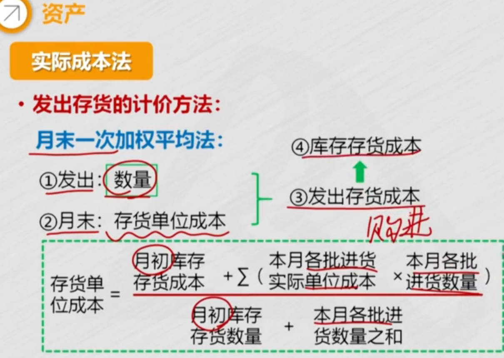 |  |
| ------------------------------------------------------------ | ------------------------------------------------------------ |
|  |  |
#### 移动加权平均法

每次进货时，都要计算==存货单位成本==

| 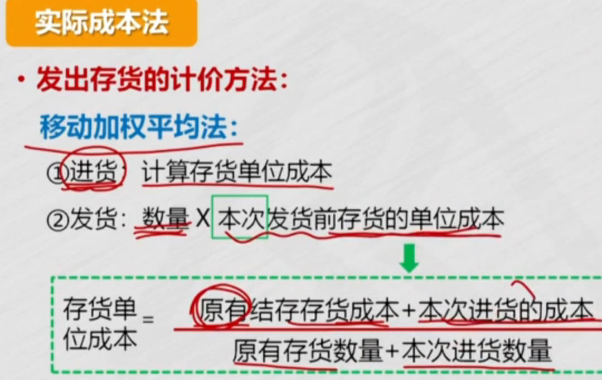 |  |
| ------------------------------------------------------------ | ------------------------------------------------------------ |
|  |  |
|  |                                                         |

#### 先进先出法

根据==先购入存货==成本，计算发出存货成本

物价持续上升：

- 高估企业当期利润： $$收入-成本=利润$$，发出成本低，减后利润就高
- 高估库存存货价值： $$期末成本=期初成本+本收-本发$$ , 发出成本低，期末库存存货成本就会高估

|  | 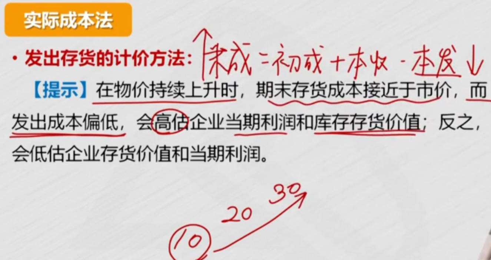 |
| ------------------------------------------------------------ | ------------------------------------------------------------ |
|  |  |
|  |  |
## 原材料采用计划成本核算

[实际成本法与计划成本法核算的比较](https://wenku.baidu.com/view/fe4b04a15a0102020740be1e650e52ea5418ce5a.html?fr=aladdin266&ind=1&aigcsid=0&qtype=0&lcid=1&queryKey=%E8%AE%A1%E5%88%92%E6%88%90%E6%9C%AC%E6%B3%95%E7%94%A8%E5%A4%84&verifyType=undefined&_wkts_=1747384809553)	

> 计划成本法可以准确地控制生产成本，从而提高企业效率
>
> 1. ==购入材料分开写需要3个分录==： **采购分录、入库分录、结转差异分录**
>    1. 入库和结转差异分录可以合并
>    2. 原材料借贷方都用计划成本
>    3. ==材料采购借方==用实际成本, 贷方用计划成本，借贷方有差异
> 2. **发出材料需要2个分录**： 发出材料、结转差异; 可以合并
>    1. 先按计划成本发出，最终要调整为实际成本
> 3. 采购用实际成本，入库用计划成本，发出用计划成本，最后调整为实际成本
>    1. 记忆技巧：==超支时==，材料成本差异的方向和==原材料方向相同==

计划成本法下：入库前不用`在途物资`，用`材料采购`科目

- 原材料：借贷方都用`计划成本`登记
- 材料采购：借方用`实际成本`，贷方用`计划成本`
  - 例：采购成本100，计划90
  - 余额反映成本差异，借方超支差异，贷方节约差异，入库后不应该有余额，转入==材料成本差异==, 结转：借方转借方，贷方转贷方

==科目==：材料采购、原材料、材料成本差异

买车，计划是120万，实际100万。 入库的用原材料科目，未入库用"材料采购"科目，登记的都是计划成本

1. 采购分录 ：材料采购借方用实际成本
2. 入库分录： 材料采购贷方用计划成本
3. 结转差异分录 ：材料采购余额结转到 `材料成本差异 = 实际 - 计划`

```bash
借：材料采购（实际）  100
   应交税费-应交增值税（进项） 13
  贷：银行存款等			  113
  
同时：  入库分录 和 结转差异分录合并
借：原材料（计划）      120
  贷：材料采购（实际）     100
     材料成本差异（节约）  20
```

### 购入材料

1. 货款已支付，已入库
   1. 计划成本法下，==入库不计原材料==，要先记 `材料采购`
   2. 原材料借贷方都用计划成本
      1. 入库时，借：原材料 贷：在途物资（材料采购）； 原材料借贷方都用计划成本,要相等， 所以==材料采购贷方==也用计划成本
   3. ==材料采购借方==用实际成本
      1. 实际成本比计划成本大，借方余额超支差异
      2. 材料采购入库后不应该有余额，但这里有余额，==①余额转到==反映成本差异的账户： ==材料成本差异==
      3. 材料成本差异：借方余额超支差异
   4. ==购入材料分开写需要3个分录==： **采购分录、入库分录、结转差异分录**
      1. 入库和结转差异分录可以合并
   
2. 货款已支付，未入库
3. 已入库, 货款未支付
4. 货款已预付，未入库(计划成本法没讲这个)

|  |  |
| ------------------------------------------------------------ | ------------------------------------------------------------ |
|  |  |
|  |  |
|  |  |
|  |  |
|  |  |
|  |  |
|  |                                                         |

不用购入一次材料，就结转一次差异，可以到月末一次性的汇总核算

### ==发出材料账务处理==

$\color{blue}\LARGE差异率\Rightarrow 差异\Rightarrow 实际成本$

不论购入还是发出，原材料都按计划成本核算

- 先按计划成本发出，最终要调整为实际成本
  - 有计划成本了，$\color{green}\Large实际成本=计划成本+差异$，要算出差异
  - 算差异，要先计算==材料成本差异率==
  - 计算==发出材料的成本差异==
    - $发出材料的计划成本 \times 本期材料成本差异率 $
  - 结转发出材料的成本差异，并将发出材料的==②计划成本调整为实际成本==
    - 计划成本调整为实际成本分录: 成本增加10万
- **发出材料需要2个分录**： 发出材料、结转差异; 可以合并

**需要核算发出材料的实际成本**


==差异率==：差异在计划成本中占的比例

- 如果比较均衡，可以直接用期初材料的成本差异率，作为材料成本差异

1. 计算==材料成本差异率==
   1. ==差异== 除以 ==计划成本==
   1. $\huge期初材料成本差异+本期入库材料成本差异\over\huge期初材料计划成本+本期入库材料计划成本$
      1. 期初成本差异计算： 借方超支差异，正数
      1. $\color{blue}\Large差异 = 实际成本 - 计划成本$
2. 计算==发出材料的成本差异==
   1. $发出材料的计划成本 \times 本期材料成本差异率 $
3. 结转发出材料的成本差异，并将发出材料的计划成本调整为==实际成本==
   1. 计划成本调整为实际成本分录
      1. 材料成本差异:  取得时超支差异在借方，发出时相反，超支差异在贷方
   2. 记忆技巧：==超支时==，材料成本差异的方向和==原材料方向相同==, 因为超支时，实际大于计划,计划加差异才等于实际
      1. 或者这样理解：取得时，借:原材料，超支方也在借方； 发出时：贷：原材料，超支方也在贷方
4. 计算期末库存材料成本

|  |  |
| ------------------------------------------------------------ | ------------------------------------------------------------ |
|  |  |
|  |  |
|  |  |
|  |  |
|  |  |
|  |  |
|  |  |

#### 习题

销售2个分录：确认收入、结转成本

|  |  |
| ------------------------------------------------------------ | ------------------------------------------------------------ |
|  |  |
|  |  |
|  |  |

## ==周转材料==

包装物、低值易耗品

### 包装物

1. 作为==产品组成==部分
   1. 领用包装物记减少,计入产品生产成本
   1. `周转材料-包装物`
   
2. 随商品出售，而==不单独计价==
   1. 借：销售费用

3. 随商品出售，==单独计价==
   1. 相当于销售茶叶盒，要确认收入、结转成本 
      1. `其他业务收入、其他业务成本`
   2. 涉及`销售需要2个分录`： 确认收入、结转成本
   
4. ==出租、出借==包装物

|  |  |
| ------------------------------------------------------------ | ------------------------------------------------------------ |
|  |  |
|  |  |
|  |  |
|  |                                                         |

#### 出租、出借包装物

1. 库存包装物转`出租/借`
2. 押金
3. 租金收入
4. 修理费用
5. 包装物摊销
   1. 例如：包装物能用2次，用一次价值减少
      1. 除固定资产外，用摊销，例如无形资产摊销
   1. 出借摊销到`销售费用`，出租摊销到`其他业务成本`

|  |  |
| ------------------------------------------------------------ | ------------------------------------------------------------ |
|  |  |
|  |  |

### 低值易耗品

**难点**：低值易耗品摊销, 要==结平余额==

在使用、在仓库、摊销（因为使用价值减少）

==一次摊销法==：金额小，不用多次摊销, 领用时一次计入成本费用

==分次摊销法==: 

1. 领用：在库转在用
2. 摊销: 价值减少的部分
   1. 摊销完，价值减少为0，相当于没有这项资产,和资产相关的明细科目都不应该有余额
   1. 摊销记计划成本，费用记实际成本
   
3. 结平余额（在用、摊销）: 最后一次摊销结平余额
   1. 2次摊销完后，在用借方有1000，摊销贷方有1000，摊销完后不应该有余额
   2. 所以要==结平余额==，在用贷方1000，摊销借方1000


|  |  |
| ------------------------------------------------------------ | ------------------------------------------------------------ |
|  |  |
|  |  |
|  |  |
|  |                                                         |

## 委托加工物资

重点： 收回后连续加工，可抵扣消费税

1. 发出物资
2. 支付加工费、运杂费等
   1. 加工费、运杂费直接计入成本
   1. 消费税：==收回后连续加工，可抵扣消费税==；  收回后直接出售，不能抵扣，计入成本
   
3. 验收入库

|  |  |
| ------------------------------------------------------------ | ------------------------------------------------------------ |
|  |  |
|  |  |
|  |  |
|  |  |

## 库存商品

难点：售价金额法分录

包括 **产成品、外购商品**等

**工业企业：** 

1. 生产时的账务处理
   1. 借方：生产成本 贷：原材料

2. 完工时
   1. 生产成本转库存商品

3. 销售时： 2个分录
   1. 确认收入
   2. 结转成本： `借：主营业务成本  贷：库存商品`

**商品流通企业发出商品的核算方法**： 


|  |  |
| ------------------------------------------------------------ | ------------------------------------------------------------ |
|  |  |

### 商品流通企业发出商品

[计划成本法记得是不是售价_百度搜索](https://www.baidu.com/s?ie=UTF-8&wd=%E8%AE%A1%E5%88%92%E6%88%90%E6%9C%AC%E6%B3%95%E8%AE%B0%E5%BE%97%E6%98%AF%E4%B8%8D%E6%98%AF%E5%94%AE%E4%BB%B7)

> 售价金额法: 通过按售价记录商品的销售和库存，计算销售商品应负担的进销差价，将售价调整为实际成本‌	
>
> - 按售价入账，销售后结转为实际成本
>
> 其实2种方法类似，毛利率和进销差价率，都是利润 除以 收入
>
> - 接着求出毛利（或进销差价）
> - 本期销售成本 = 收入 - 毛利（或进销差价）

确认**本期销售成本、期末存货成本**

1. 毛利率法： 销售收入 减 销售毛利，就是销售成本
   1. $\Large本期销售毛利=本期销售净额\times上期毛利率$
   2. $\Large本期销售成本=本期销售净额-本期销售毛利$
2. 售价金额法
   1. 根据==进销差价==，计算进销差价率，再计算出`销售商品进价`
      1. 进销差价率: ==差价==在==售价==中的比率
      2. $\large\color{blue}进价=售价-差价$ ;   $\Large\color{blue}售价(收入) - 进价(成本) = 差价(利润)$
   2. 进价和售价的差额就是进销差价, 然后计算==差价率==: $\Large\color{blue}{差价\over售价}={期初差价+本期购入差价\over期初售价+本期购入售价}$
   3. 销售商品的进价怎么确定： 
      1. $\color{blue}\large本期销售商品应分摊的商品进销差价= 销售时售价(收入)\times进销差价率$
      2. $\color{red}\large本期销售商品成本=本期商品销售成本-本期销售商品应分摊的商品进销差价$
      3. $\color{blue}\large期末结存商品成本=期初结存商品进价+本期购入商品进价-本期销售商品成本$
   4. 分录：
      1. 销售时按==售价==结转成本
      2. 期末再分摊销售商品的进销差价,冲减主营业务成本，冲减后主营业务成本（差额）就是进价


|  |  |
| ------------------------------------------------------------ | ------------------------------------------------------------ |
|  |  |
|  |  |
|  |  |
|  |  |
|  |  |

## 消耗性生物资产

- 林木类郁闭后发生的管护费等后续支出，计入==管理费用==

|  |  |
| ------------------------------------------------------------ | ------------------------------------------------------------ |
|  |  |
|  |  |
|  |  |
|  |  |
|  |  |
|  |                                                         |

## 存货的清查

实地盘点法

管理不善存货损毁后不让抵扣

**盘盈**: 一般是收发计量错误造成的，所以`冲减管理费用`

- 小企业存货盘盈：记营业外收入

**盘亏**：自然灾害原因，记营业外支出

|  |  |
| ------------------------------------------------------------ | ------------------------------------------------------------ |
| 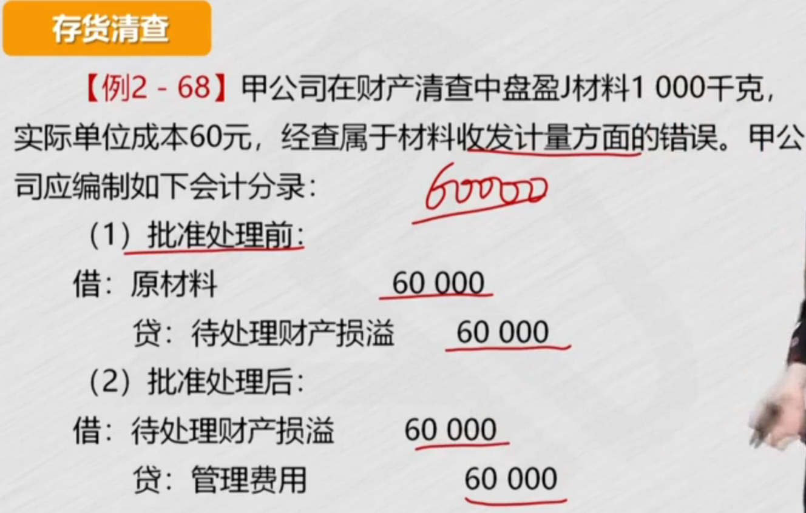 |  |
|  |  |
|  |  |
|  |                                                              |

## 存货的==减值==

重点：计提、转回，商品卖掉`结转存货跌价准备`

比较`实际成本`和`可变现净值`: 资产负债表日，成本大于可变现净值

计提减值后，==账面价值==按可变现净值计量

存货发生减值时，减值并没有实际发生，不能直接冲减存货，计入==存货跌价准备==； 只有实际发生损失时，才能冲减存货，==类似坏账准备==

==结转==：已计提1000减值准备，现在产品要出售（2步：收入、结转成本）

- 产品销售，存货没了，存货跌价准备不能留，要在存货（库存商品）里，**冲掉计提的跌价准备**，因为计提在贷方，所以在借方冲减

- 也可以`写成2个分录`: 跌价准备冲成本

|  |  |
| ------------------------------------------------------------ | ------------------------------------------------------------ |
|  |  |
|  |  |
|  |  |
|  |  |
