# 1. 长期投资

- 债权投资
  - 债权投资：利息、收回本金
  - 其他债权投资： 收利息、高价出售
- 股权投资
  - 长期股权投资
  - 其他权益工具投资

## 债权投资

2种：债权投资、其他债权投资

1. 债权投资确认与计量
   1. 初始计量
      1. 购买`入账金额`：购买价款+税（不含未领取债券利息）
      2. 债券的发行：平价、溢价、折价发行(价格<面值)

   2. 后续计量
      1. ==摊余成本==理解为`账面价值`
         1. 已偿还的本金：发行公司偿还的本金
         2. 加减累计摊销额: 每年分摊的利息调整

      2. 后续计量分：实际利率法、直线法(小企业)

2. 科目设置
   1. 应计利息：债券2种付息方式
      1. 分期支付利息： 每年年末收到的利息，计入应收利息
      2. 应计利息： 债券到期支付利息，计入应计利息

   2. 小企业设"长期债券投资"科目，核算长期持有的债券投资，并设明细科目面值、溢折价、应计利息

3. 账务处理
   1. 取得
   2. 持有
      1. 期末，确定利息收入： 投资收益和票面利息不相等，差额计入利息调整； 2种情况
         1. 溢价购买： 利息调整的摊销； 多花的20万损失，摊销到4年，应收利息减摊销，投资收益只有1
         2. 折价购入： 收益摊销到4年
   3. 到期收回面值

|  |  |
| ------------------------------------------------------------ | ------------------------------------------------------------ |
|  |  |
|  |  |
|  |  |
|  |  |
|  |  |
|  |  |
|  |  |
|  |  |
|  |  |
|  |  |
|  |                                                              |

## 长期股权投资

持股比例要$\ge20\%$

### 长投初始计量

1. 长期股权投资: 其他权益工具投资, 也是长期持有的股权投资；长期股权投资持股比例一般大于等于20%。 长投的分类：按投资后的结果分3类：企业合并核算方法-成本法
   1. 控制(形成控制的长投、对子公司的投资、企业合并形成的长投)：同一控制下企业合并形成的长投(同一母公司下A子公司投资B子公司)、非同一控制下...
   2. 共同控制(对合营企业的投资)：例如双方持股比例达到70%，决策才能够实施。
   3. 重大影响(20%<联营企业<50%)
2. 长投初始计量
3. 企业合并方式形成的长投
   1. 同一控制下企业合并形成的长投：合并方、被合并方；
      1. 支付现金、转让非现金资产或承担债务方式作为合并对价
         1. 初始投资成本：因为是同一企业交易不公允，例如：投100万不能记100万，占80%股权，记被合并方的所有者权益*80%。不能用被合并方所有者权益，从`合并报表`里找。   差额记资本公积，如果资本公积不够减，剩下的冲减盈余公积、利润分配
      2. 发行权益性证券作为合并对价(股票换股票)
   2. 非同一控制下企业合并形成的长投：购买方、被购买方；非关联方，交易公允。
      1. 支付现金作为合并对价：借：长投    贷：银存等
      2. 转让非现金资产...
      3. 发行权益性证券...：发行费用冲减资本公积
4. 形成共同控制的长投
5. 形成重大影响的长投

|  |  |
| ------------------------------------------------------------ | ------------------------------------------------------------ |
|  |  |
|  |  |
|  |  |

#### 企业合并方式形成的长投

|  |  |
| ------------------------------------------------------------ | ------------------------------------------------------------ |
|  |  |
|  |  |
|  |  |
|  |  |
|  |  |
| 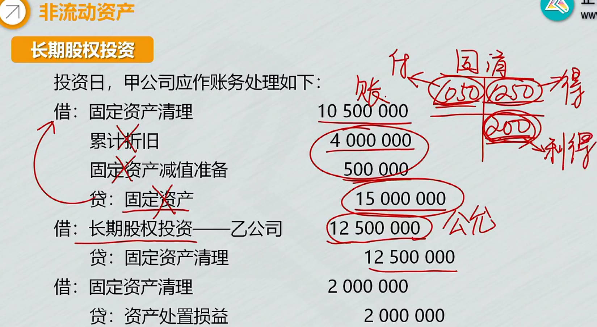 |  |
|  |  |
|  |                                                         |

#### 非企业合并方式形成的长投

后2个核算原则一样

1. 形成共同控制的长投
2. 形成重大影响的长投

|  |  |
| ------------------------------------------------------------ | ------------------------------------------------------------ |
|  |  |
|  |                                                         |

### 长投后续计量

成本法对应母子关系，权益法对应夫妻关系

1. 权益法：被投资方实现`净利润，投资方要确认投资收益`； 发放现金、股利时，投资方`不确认投资收益`。
   1. 购入股权，就成了所有者，按持股比例享有所有者权益。   被投资方所有者权益变，就要跟着调
   2. 2个调整
      1. 初始投资成本的调整
      2. 所有者权益变动时，长投账面价值调整

2. 成本法：母子；被投资方`实现净利润，投资方不确认投资收益`。 发放现金、股利时，投资方按持股比例`确认收益`

|  |  |
| ------------------------------------------------------------ | ------------------------------------------------------------ |
|  |  |
|  |  |
|  |  |
|  |  |
|  |  |
|  |  |
|  |                                                              |

### 长投减值和处置

|  |  |
| ------------------------------------------------------------ | ------------------------------------------------------------ |
|  |  |
|  |  |
|  |                                                         |

# 2、投资性房地产

## 投房管理

房地产：房产、地产(土地使用权)：  投房的经营方式：赚租金和获取资本增值。   投房投资的风险

|  |  |
| ------------------------------------------------------------ | ------------------------------------------------------------ |
|  |  |
|  |  |

## 投房确认与计量
1. 投房的确认
2. 投房的计量
   1. 成本模式
   2. 公允价值模式： 类似交易性金融资产
   3. 自用房地产或存货转换为投房(公允价值模式)

|  | 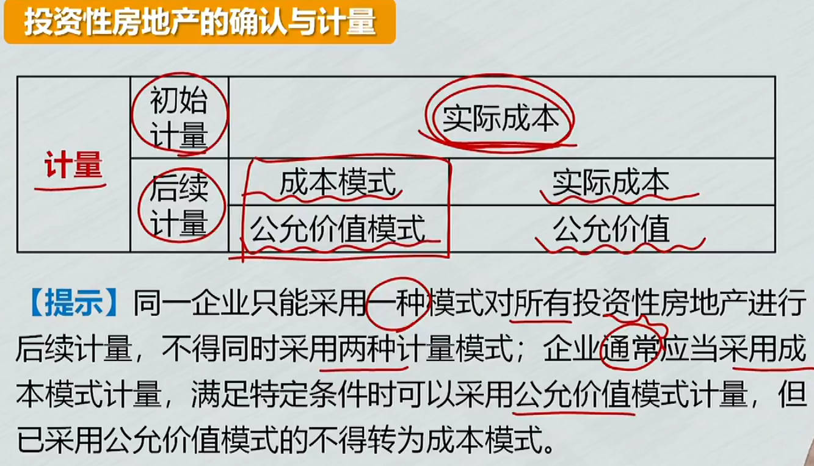 |
| ------------------------------------------------------------ | ------------------------------------------------------------ |

## 投房账务处理

### 成本模式

成本模式：==类似固定资产、无形资产处理==

1. 外购: `房子买回来后直接出租`
   1. 实际成本：价税费组成
2. 自行建造：`完工时出租`，作为投房核算
   1. 旧资产转为新资产: 冲掉旧资产，增加新资产；冲掉旧折旧，增加新折旧
      1. 土地使用权无形资产的一半，转为投房；
      2. 无形资产没了，要冲减计提的摊销
      3. 同时，无形资产变为投房，计提的摊销变为投房的摊销，旧资产摊销转为新资产摊销
3. 确认租金收入： 借：银存等  贷：其他业务收入
4. 按期计提折旧或摊销
   1. 借方，其他业务成本： 为了实现租金收入发生的成本

5. 计提减值准备：    借：资产减值损失      贷：投资性房地产减值准备
6. 处置投资性房地产：作为企业日常活动，和出售产品类似。确认收入、结转成本

|  |  |
| ------------------------------------------------------------ | ------------------------------------------------------------ |
|  |  |
|  |  |
|  |  |
| 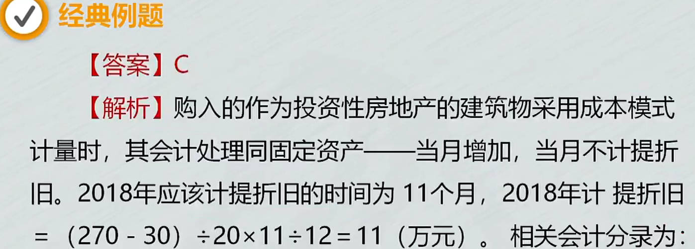 |  |
|  |  |
|  |                                                         |

### 公允价值模式

公允价值模式： 类似交易性金融资产

1. 外购
2. 自行建造：投资性房地产-成本
3. 确认==租金收入==： 借：银存等  贷：其他业务收入
4. 确认公允价值变动
   1. 投房账面价值调成公允

5. ==处置==投资性房地产：作为企业日常活动，和出售产品类似。
   1. 确认收入、结转成本
   2. 还有2个结转: 公允变动损益、其他综合收益余额，都转到其他业务成本

|  |  |
| ------------------------------------------------------------ | ------------------------------------------------------------ |
|  |  |
|  |  |
|  |  |
|  |  |
|  |  |
|  | 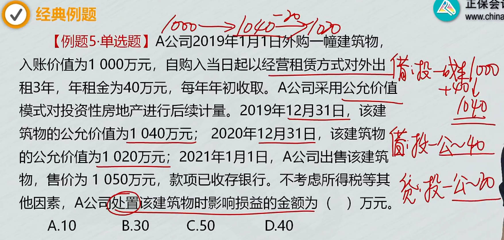 |
|  |  |

### 自用房地产或存货转换为投房(公允价值模式)

1. 自用房地产
   1. 冲掉旧的
   2. 增加新的： 当天房地产的公允价值，有借贷差
   3. 借贷差：转换当天公允价值和账面价值差额
      1. 差额在贷方
         1. 借贷差计入其他综合收益，是所权类的科目，不影响利润
      2. 差额在借方，不记所权，计入`公允价值变动损益`，损益类科目

2. 存货
   1. 开发的商品房，就是存货，通过==开发产品==科目核算

3. 借贷差计入不同科目原因： 出于谨慎性考虑

|  |  |
| ------------------------------------------------------------ | ------------------------------------------------------------ |
|  |  |
|  |  |
|  |  |

# 3、固定资产

`科目：固定资产、在建工程`

- **在建工程**：==未达到使用状态==的固定资产

> 1.  固定资产的管理
> 2.  固资的取得
>    1. ==外购==
>       1. 购入不需安装
>       2. 购入需安装: 分3步,购入分录、安装分录、交付分录
>          1. 购入、安装：==借方：在建工程==
>          1. 交付使用： 在建工程转固定资产
>          1. 小规模纳税人购入固资
>       3. 一笔款购入多项, 没单独标价固资
>          1. 按公允价值比例分摊
>    2. ==自行建造固资==
>       1. 自营：达到预定可使用状态：借：固定资产(入账价值)    贷：在建工程
>          1. 领用工程物资，计入成本
>       2. 出包方式：出包给承包商建造； 简单，付承包商的价款。
> 3. 固资的折旧
> 4. 固资的减值、后续支出
> 5. 固资的处置
> 6. 固资清查
> 7. 使用权资产的账务处理

## 取得

固定资产成本，类似存货成本，价税费

|  |  |
| ------------------------------------------------------------ | ------------------------------------------------------------ |
|  |  |
|  |  |
|  |  |
|  |  |
|  |  |
|  |  |
|  |  |

### 外购多项没单独标价的固定资产

按公允价值比例分摊

|  |  |
| ------------------------------------------------------------ | ------------------------------------------------------------ |
|  |  |
|  | 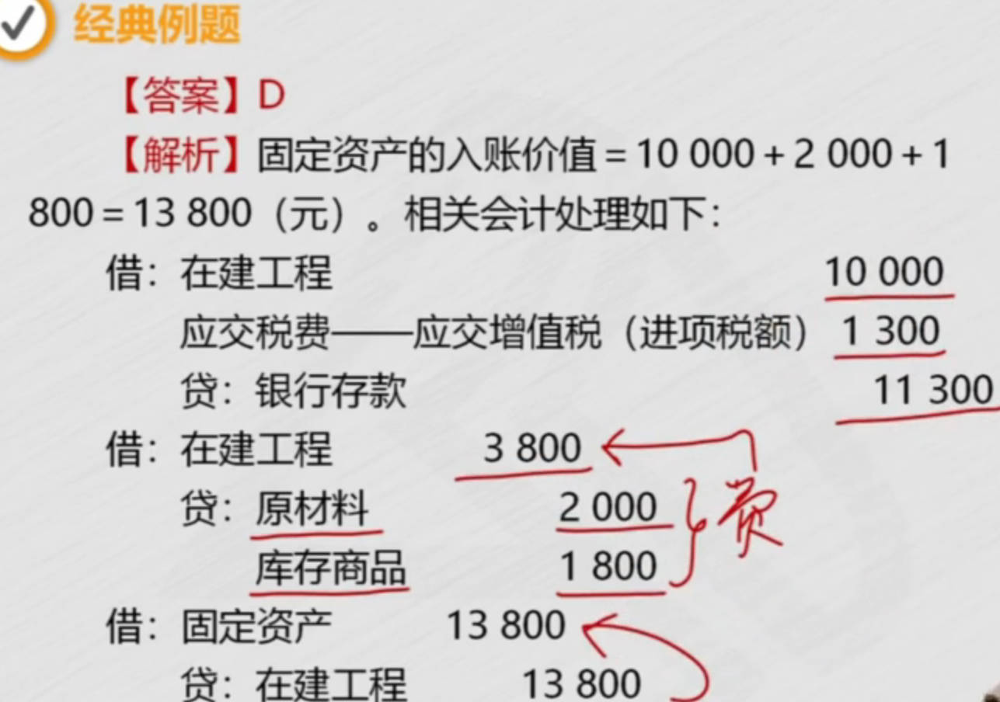 |

### 自行建造

购入、领用、达到可使用状态

|  |  |
| ------------------------------------------------------------ | ------------------------------------------------------------ |
|  |  |
|  |  |
|  |  |
|  |  |
|  |  |

## ==折旧==

[固定资产折旧不扣除减值准备](https://lvlin.baidu.com/question/659810246224410645.html)  

> 1. 折旧：原价 - 净残值 - 减值，和预计的使用寿命也有关。
>    1. 折旧影响因素：原价、净残值、减值、预计寿命
>    2. 折旧范围
>       1. 已提足折旧仍使用： 例，预计寿命10年，10年后资产还能继续使用，以后不再计提折旧
>    3. 折旧方法：前2个叫直线法，后2个加速折旧法
>       1. 年限平均法
>          1. 年折旧额
>          1. 年折旧率===年折旧额/原价==；   预计净残值率=预计净残值/原价；
>       2. 工作量法：汽车预计总行驶里程；
>          1. 单元折旧额
>       3. 双倍余额递减法
>          1. 最后2年之前： $账面净值\times年折旧率$
>          2. 最后2年用直线法：  $\Large{(剩余账面净值-预计净残值)\over2}$
>       4. 年数总和法
> 2. 折旧账务处理

- 年限平均法
  - 按年平均
  - $\huge年折旧额 = \color{Purple}{原价-预计净残值\over预计使用年限}$
    - 年折旧额：原价20，预计净残值 `1`，10年，每年折旧 `1.9`
  - $\huge年折旧率 = \color{Purple} {年折旧额\over原价}={1-预计净残值率\over预计使用年限}$
- 工作量法    [汽车一个月折旧额_百度搜索](https://www.baidu.com/s?ie=UTF-8&wd=%E6%B1%BD%E8%BD%A6%E4%B8%80%E4%B8%AA%E6%9C%88%E6%8A%98%E6%97%A7%E9%A2%9D)	
  - 按工作量平均
  - $\huge单位工作量折旧额 = \color{Purple}{原价-预计净残值\over预计总工作量}=原价\times{1-预计净残值率\over预计总工作量}$
  - $\Large\color{blue}月折旧额=当月工作量\times单位工作量折旧额$
- 双倍余额抵减法
- 年数总和法

|  |  |
| ------------------------------------------------------------ | ------------------------------------------------------------ |
|  |  |
|  |  |
|  |  |
|  |                                                         |

### 双倍余额抵减法

账面价值: $\Large原价-累计折旧-减值$

账面余额: 原价

==账面净值==：即折余价值； 原价扣除已提折旧，不扣减值部分

**最后2年之前的折旧**： $\huge\color{blue}{期初账面净值(扣折旧)\times{2\over预计使用年限}}$

**最后2年折旧**：$\huge\color{blue}{剩余账面净值-预计净残值\over2}$

双倍余额递减法的**年折旧率**： 使用年限分之2 ;  $\huge{2 \over 预计使用年限} $

|  |  |
| ------------------------------------------------------------ | ------------------------------------------------------------ |
|  |  |
|  |  |

### 年数总和法

第一年尚可使用年限5年，第二年4，第5年1; $5、4、3、2、1$

分母年数总和： $1+2+3+4+5$

$\Large\color{red}年折旧率={尚可使用年限\over预计使用寿命的年数总和}$

$\Large\color{red}年折旧额=(原值-净残值)\times该年折旧率$

|  |  |
| ------------------------------------------------------------ | ------------------------------------------------------------ |
|  |  |
|  |  |

累计折旧：特殊资产类科目，贷方记增加，借方减少

- 是备抵科目，使固定资产价值减少，是企业的费用，根据用途，记到相应科目

## 减值

[资产负债表日_百度搜索](https://www.baidu.com/s?ie=UTF-8&wd=%E8%B5%84%E4%BA%A7%E8%B4%9F%E5%80%BA%E8%A1%A8%E6%97%A5)	

资产负债表日(date of balance sheet): 指结账日期，即结账和编制资产负债表的日期

固定资产减值一经确认，以后不得转回

==资产负债表日==，固资发生减值迹象时： 借：资产减值损失   贷：固定资产减值准备。 减值后的资产作为全新资产计提折旧。

|  |  |
| ------------------------------------------------------------ | ------------------------------------------------------------ |
| 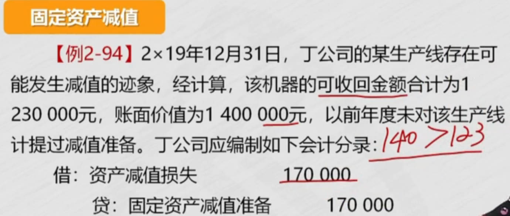 |  |

## 后续支出

**后续支出**: 取得固定资产之后，所发生的支出； 例如更新改造支出、日常修理费用

1. **资本化支出**：计入固资成本
   1. ==更新改造==： 分3步，改造前、改造时、改造后
   2. 改造前
      1. **固资转在建工程**后，不能留固定资产的累计折旧、减值准备在账上，因为固资没了；要冲销掉累计折旧、减值准备
   3. ==改造时== : 2个分录，报废旧的，换上新的
      1. `旧`发动机拿走，账面价值减少，要冲减资产（在建工程）, 借方：报废了，是损失，`营业外支出`
      2. 购入`新`发动机，然后装上，装上类似领用`工程物资`
      3. 更新改造时，发生的==其它资本化支出==
         1. 安装费等， 计入资产成本（在建工程）
   4. 改造后
      1. 完成更新改造后，资产由80变为98
      2. 固定资产入账价值包括
         1. 固定资产转在建工程
         2. 取出旧部件
         3. 新部件成本
         4. 其它资本化支出，例安装费
2. **费用化支出**：计入当期损益
   1. ==日常维修==

|  |  |
| ------------------------------------------------------------ | ------------------------------------------------------------ |
|  |  |
|  |  |
|  |  |
|  |  |
|  |  |
|  |  |
| 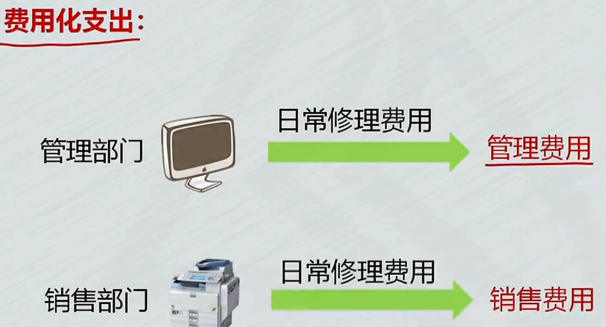 |  |

## ==处置==

1. 处置：分3种情况， **出售、报废、毁损**  
   1. 不能像出售产品一样，说卖就卖，要先==清理==，清理后，通过`固定资产清理`科目核算 
      1. ==固资先转清理==，冲销折旧、减值准备
      2. 发生清理费用：也计入 `固定资产清理`
      3. 处置： 出售、报废、毁损
      4. 结转清理损益： 计算净损益
         1. 固定资产清理贷方：利得，清理后不应该有余额，转入`资产处置损益`

**出售**、转让：首先要清理

- 转固资清理科目 => 清理费用 => 出售 => 利得转入`资产处置损益`
- ==结转处置净损益==： 出售时余额转入`资产处置损益`账户, ==借方转借方==

**报废**：`残料入库`(原材料)

**毁损**：收到残料或赔款       

- 报废毁损： 损失转`营业外支出`，利得转`营业外收入`

|  |  |
| ------------------------------------------------------------ | ------------------------------------------------------------ |
|  |  |
|  |  |
|  |  |
|  |  |
|  |  |
|  |  |
|  |  |
|  |  |
| 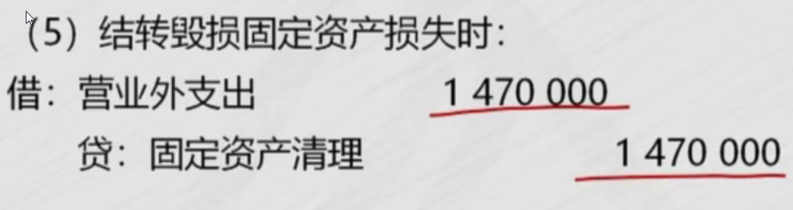 |  |

## 清查

**盘盈**：作为前期差错处理，用`以前年度损益调整`科目，不让影响当前损益。          重置成本：去买一台一模一样设备的价钱。

- 以前年度损益调整转入==留存收益==，留存收益2个科目，盈余公积10% 
  - 不影响当前损益, 影响期初的利润, 即期初的留存收益， 所以要调整留存收益
  - 以前的利润增加，期初的利润就增加，所以要调的是当期期初的利润，也就是增加期初的留存收益
  
- 以前的利润增加，还有个调整所得税的处理

**盘亏**：通过`待处理财产损益`科目核算; 冲固资、折旧、减值， 进项税转出

- 固资没有了，相关的折旧、减值也要冲掉
- 管理不善造成的，要将进项税转出
- ==账调完，报批后转销==
  - 总损失：资产，加白缴的增值税
  - 能收的赔款，记其他应收款

|  |  |
| ------------------------------------------------------------ | ------------------------------------------------------------ |
| 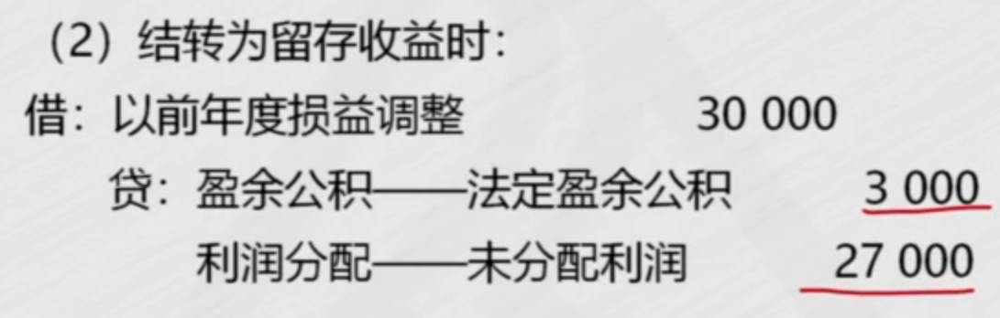 |  |
|  |  |

# 4、==使用权资产==的账务处理

[中级会计财管必背公式](https://zhuanlan.zhihu.com/p/700638379)   [年金现值系数表_百度搜索](https://www.baidu.com/s?ie=utf-8&f=3&rsv_bp=1&tn=baidu&wd=%E5%B9%B4%E9%87%91%E7%8E%B0%E5%80%BC%E7%B3%BB%E6%95%B0%E8%A1%A8&oq=%25E5%25B9%25B4%25E9%2587%2591%25E7%258E%25B0%25E5%2580%25BC%25E7%25B3%25BB%25E6%2595%25B0&rsv_pq=bde99f04000062ba&rsv_t=1ffbOFIOThoCI%2FIGkiJ%2B6MtewlV61HFGXRh7ICm2Bxv7jd9qFmRBtmGxuoc&rqlang=cn&rsv_enter=1&rsv_dl=ts_0&rsv_sug3=1&rsv_sug1=1&rsv_sug7=100&rsv_sug2=0&rsv_btype=t&prefixsug=%25E5%25B9%25B4%25E9%2587%2591%25E7%258E%25B0%25E5%2580%25BC%25E7%25B3%25BB%25E6%2595%25B0&rsp=0&inputT=566&rsv_sug4=2866&rsv_sug=1)  [最新年金现值系数表(详细)](http://www.360doc.com/content/22/1124/17/40076021_1057382944.shtml)  

企业租入设备，不属于短期租赁和低价值资产租赁，租赁期长等... 根据实质重于形式，虽然设备没有所有权，但还是作为自有资产登记入账，用使用权资产核算

1. 初始计量
   1. 使用权资产的成本: 现值，初始计量金额
      1. 租赁5年，每年租金10万，未来一共要支付50万
      1. 现值：未来的钱折算到现在的价值。==年金现值系数==
      1. 成本要冲减租赁激励
   1. 未来应该支付的租金，是现在的负债，借贷差额相当于利息
      1. 现在支付35，未来付50，差额相当于利息，分5年摊销
      1. 取得资产时，利息还不能确认，计入`未确认融资费用`

1. 后续计量
   1. 支付租金：第一年年末，付租金，支付利息。
   2. 确认利息
   3. 计提折旧
   4. 租赁期满购买使用权资产
      1. 使用权资产转为固定资产: 冲掉折旧，期满该付的都付了，2个租赁负债冲掉
      2. 银存： 购买资产要花钱

|  |  |
| ------------------------------------------------------------ | ------------------------------------------------------------ |
|  |  |
|  |  |
|  |  |
|  |  |
|  |  |
|  |  |
|  | 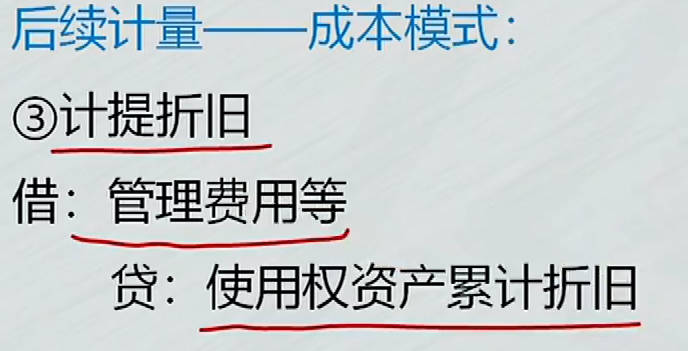 |
|  |  |

# 5、生产性生物资产

账务处理

1. 外购生资
2. 自行营造或繁殖的生资
3. 转为育肥畜
4. 后续支出
5. 计提折旧
6. 减值
7. 成本结转
8. 后续计量

|  |  |
| ------------------------------------------------------------ | ------------------------------------------------------------ |
|  |  |
|  |  |
|  |                                                              |

# 6、==无形资产==

1. 无资取得：价、税、费
   1. ==外购==: 抵扣的税不记入成本，宣传费计入销售费用
   2. ==自行研发==
      1. 研究阶段
         1. 研究阶段支出作为费用，先计入`研发支出-费用化支出`，期末转入`管理费用`
      2. 开发阶段
2. 无资摊销
3. 无资减值与处置：与固资减值类似。出售：无形资产备抵科目要冲销掉
   1. 报废无形资产

## 取得

|  |  |
| ------------------------------------------------------------ | ------------------------------------------------------------ |
|  |  |
|  |  |
|  |  |
|  |  |
|  |  |
| 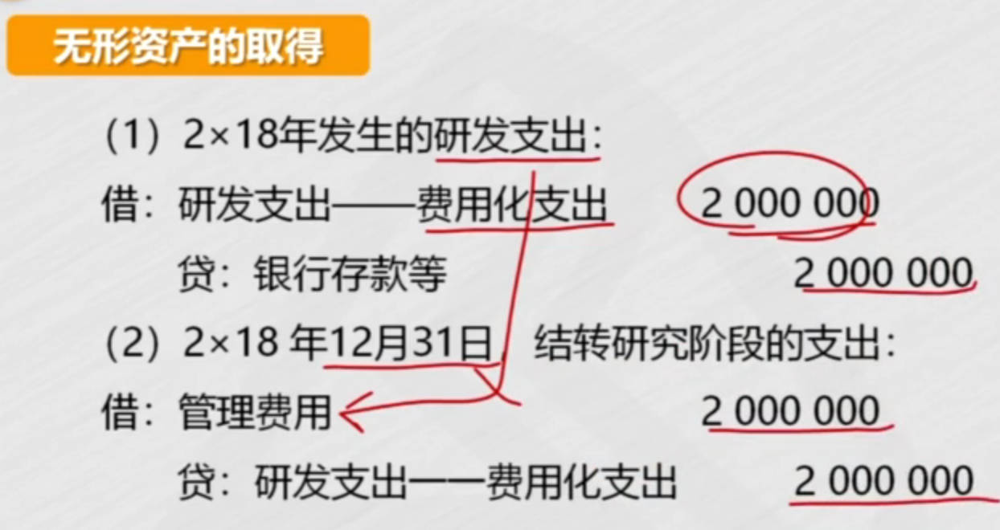 |  |

## 摊销

固定资产计提折旧，无形资产计提摊销

|  |  |
| ------------------------------------------------------------ | ------------------------------------------------------------ |
|  |  |
|  |  |

## 减值与处置

**减值**： 账面价值=成本-累摊-减值准备

**处置**：

1. 出售
   1. 要冲销掉无形资产相关的摊销、减值准备
   2. 转销：借贷方差额计入`资产处置损益`，即出售无形资产的净损益
2. 报废处理
   1. 资产对企业没用了，记入损失， `营业外支出`

|  |  |
| ------------------------------------------------------------ | ------------------------------------------------------------ |
| 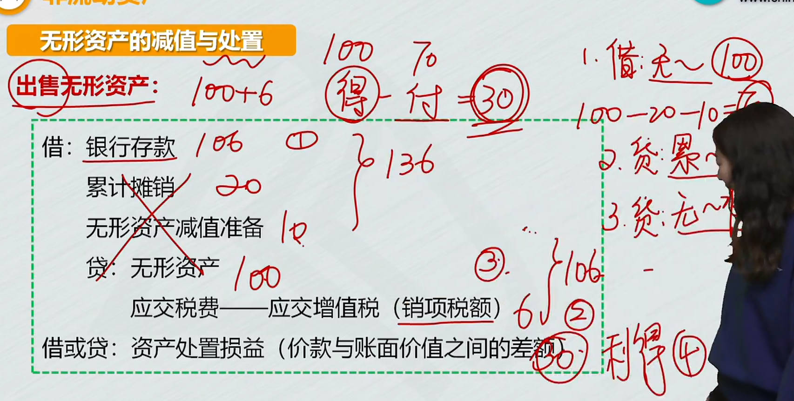 |  |
|  |  |
|  |  |

# 7、长期待摊费用

长摊核算范围：长摊是资产类科目

- 例：租办公楼进行装修，==能为企业带来更多利益，记入资产==，不是费用
  - 租办公楼装修,期满人家收回，就没有这项资产了，不能直接将这项资产直接减为0，因为是在3年租期收益，要在3年摊销，根据用途计入相应科目
- 发生==改良时==计入资产
  - 装修支出计入`长期待摊费用`
  - 贷方记发生的支出； 领材料，记原材料

- 在==受益期==进行摊销
  - 根据用途计入相应科目

|  |  |
| ------------------------------------------------------------ | ------------------------------------------------------------ |
|  |  |
|  |                                                         |

