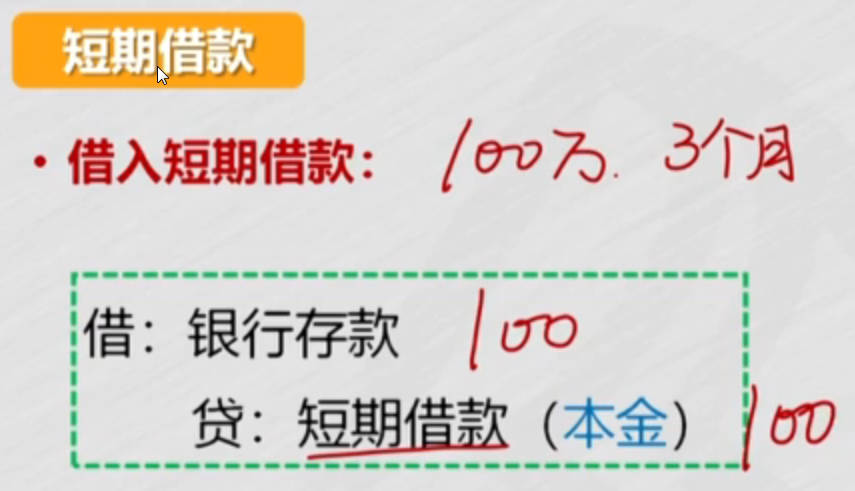
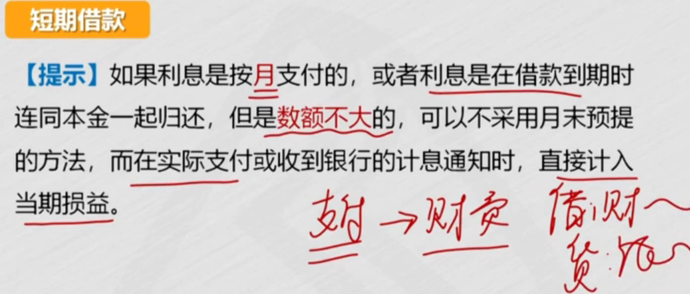
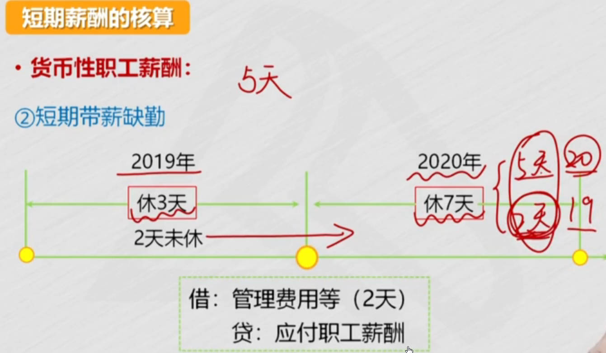
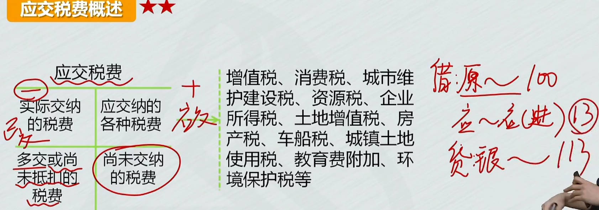
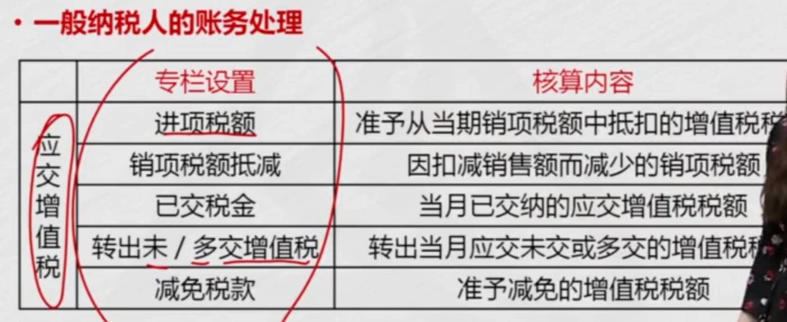
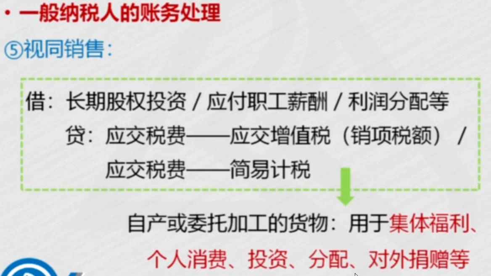
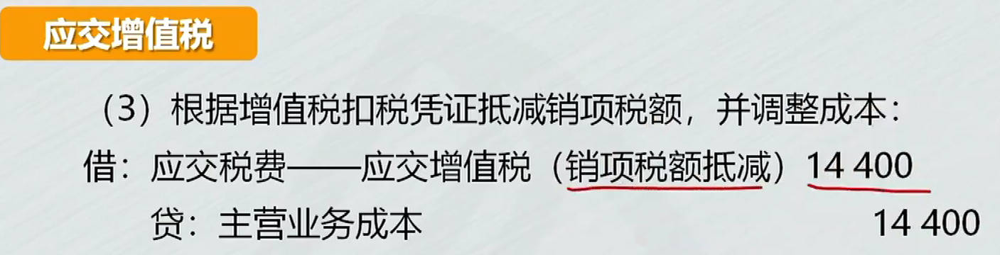
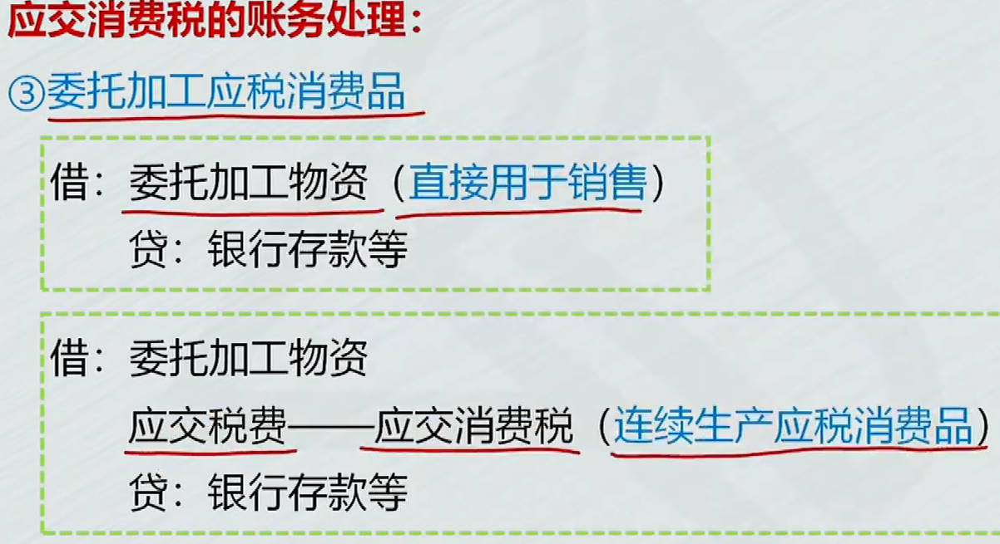

# 1、短期借款
1. ==借入==款项
2. 确认==利息==费用
   1. 非预提: `支付利息时才确认财务费用`； 每个月末支付利息
   2. 预提：`应付利息`科目
      1. 简化处理： 利息数额不大时，可以支付利息时再确认财务费用
      2. 不按月支付，`按期支付`，例，每月1万，但3个月支付1次
         1. 前2个月应付利息，第3个月到期2个分录，先付3月份的，再付前2个月的
         2. 3月份分录：借:财务费用 贷：银行存款； 
         3. 再冲掉前2月应付利息： 借：应付利息  贷：银行存款
3. ==偿还==短借

|  |  |
| ------------------------------------------------------------ | ------------------------------------------------------------ |
|  |  |
|  |  |
|  |  |
|  |  |
|  |  |
|  |  |
|  |                                                              |

# 2、应付预收
1. 应付票据
   1. 销售：应收票据； 付款：应付票据
   1. 手续费记财务费用
2. 应付账款
3. 预收账款
4. 应付利息
5. 应付股利
6. 其他应付款

|  |  |
| ------------------------------------------------------------ | ------------------------------------------------------------ |
|  |  |
|  |  |
|  |  |
|  |                                                         |

## 应付账款

**现金折扣**

- 折扣率/付款期限，2/10， 10天内付款享受 `2%`折扣
- 折扣冲减财务费用: 贷：财务费用

电、燃气**暂付款**： 相当于预付款，预先缴电费； 月末应付账款计入相应的成本

预付的就是已经支付的，所以可以用应付账款借方，反映预付的款项

|  |  |
| ------------------------------------------------------------ | ------------------------------------------------------------ |
|  |  |
|  |  |
|  |  |
|  |  |
|  |  |
|  |                                                         |

## ==预收账款==

1. 取得预收款
   1. 开始收的预付款，因为还没开始使用，只能计预收账款
2. 确认收入时
   1. 到月末，使用了1个月，可以确认收入了，冲掉预收款,6个月冲减6万,最终预收账款余额为0
3. 收到补付的款项

应收账款的贷方就是已收的款项，所以可以用==应收账款贷方==，反映预收的款项

|  |  |
| ------------------------------------------------------------ | ------------------------------------------------------------ |
|  |  |
|  |  |
|  |  |
|  |  |

## 应付利息

1. 计提时
2. 实际支付时

|  |  |
| ------------------------------------------------------------ | ------------------------------------------------------------ |
|  |                                                         |

## 应付股利

应付股利核算==现金股利==, 要分股利，利润减少

|  |  |
| ------------------------------------------------------------ | ------------------------------------------------------------ |
|  |                                                         |

## 其他应付款

保证金：押金

|  |  |
| ------------------------------------------------------------ | ------------------------------------------------------------ |
|  |  |

# 3、应付职工薪酬

[职工薪酬包括_百度搜索](https://www.baidu.com/s?ie=UTF-8&wd=%E8%81%8C%E5%B7%A5%E8%96%AA%E9%85%AC%E5%8C%85%E6%8B%AC)	[企业会计准则第9号——职工薪酬](https://www.gov.cn/gongbao/content/2014/content_2684515.htm)	

1. 职工薪酬：**四大类**‌， 短期薪酬、离职后福利、辞退福利、其他长期职工福利
   1. 劳动合同、正式任命、劳务派遣
2. 短期薪酬核算
   1. 货币性薪酬
      1. 工资等标准薪酬
      2. 短期带薪缺勤
         1. 累积带薪缺勤: 年假
         2. 非累积带薪缺勤： 病假
   2. 非货币性薪酬
      1. 自产产品发放给职工作为福利：含税公允价值
      2. 自有住房等资产无偿提供给职工使用：2步：先按资产当月应计提的折旧确认，应薪。同时做计提折旧分类
      3. 租赁住房等资产无偿提供给职工使用
3. 长期职薪核算
   1. 离职后福利
   2. 辞退福利
4. 其他长期职工福利

|  |  |
| ------------------------------------------------------------ | ------------------------------------------------------------ |
|  |  |
|  |  |
|  |                                                         |

## 短期薪酬核算

[应付职工薪酬_百度百科](https://baike.baidu.com/item/%E5%BA%94%E4%BB%98%E8%81%8C%E5%B7%A5%E8%96%AA%E9%85%AC/10259193)	 [带薪年假的财税处理](https://mp.weixin.qq.com/s?__biz=MzUyNDg3NDY5OA==&mid=2247486995&idx=2&sn=f8e22243086635c1f24a3e285820157c&poc_token=HAVtUWijXZVfafvLlpN45jEIVueT8aBMquuDdtDk)	

### 货币性薪酬

1. 工资等标准薪酬
   1. 确认应付职工薪酬： 当月月末计负债, ==应付职工薪酬==
   2. 实际支付时：第2个月9号，支付工资时：银行存款冲掉负债(应付职工薪酬)
2. 短期带薪缺勤
   1. 累积带薪缺勤: 年假  
      1. 5天是20年年假，2天是19年未休的
         1. 年假先使用当年可享受到权利，不足的再从上年结转的年休假中扣除
      2. 如果预计20年会休这2天年假，就在19年末确认这2天的工资费用
   2. 非累积带薪缺勤： 婚假、产假、病假
3. 职工福利费
4. 按国家规定计提标准的职工薪酬

|  |  |
| ------------------------------------------------------------ | ------------------------------------------------------------ |
|  |  |
|  |  |
|  |  |
|  |  |
|  |  |
|  |  |
|  |  |
|  |  |
|  |  |

### 非货币性薪酬

1. 以`自有产品`发放给职工作为福利
   1. 决定发放
      1. 自产产品价格用==含税公允价值==，确定应付职工薪酬
   2. 实际发放
      1. 类似销售，确认收入、结转成本
2. 将自有住房等`资产`无偿提供给职工使用
   1. 员工不需要为提供的汽车付钱，所以给员工的薪酬就相当于汽车的折旧额
   1. 确认应付职工薪酬，同时==计提折旧==
3. `租赁`住房等资产无偿提供给职工使用
   1. 用应付的==租金==，确认应付职工薪酬
4. 将`外购商品`发放给职工作为福利

|  |  |
| ------------------------------------------------------------ | ------------------------------------------------------------ |
|  |  |
|  |  |
|  |  |
|  |  |

## 设定提存计划的核算

离职后福利

|  |  |
| ------------------------------------------------------------ | ------------------------------------------------------------ |
|  |  |

# 4、应交税费

## 应交增值税

1. 一般计税方法
   1. 期末应纳税额等于当期销项减当期进项
   2. ==专栏==: `应交增值税(销项税额)`, 二级明细科目括号内的是专栏
2. 简易计税方法
   1. 没有减进项税额，因为不能抵扣进项税

|  |  |
| ------------------------------------------------------------ | ------------------------------------------------------------ |
|  |  |
|  |  |
|  |  |
|  |  |
|  |  |
|  |  |

### 一般纳税人账务处理

**取得资产、接受劳务或服务**

1. ==购进==货物、加工修理修配劳务、服务、无形资产或不动产
   1. 未经税务机关认证，而不得从当期销项税额中抵扣的进项税，记入`应交税费-待认证进项税额`, 认证后转 `应交增值税(进项税额)`
2. 货物等已验收入库，但尚未取得增值税扣税凭证
   1. 发票账单没到,暂估入账
3. 进项税额转出
   1. 事后改变用途： 用于集体福利，个人消费等
   2. 事后改变用途，或非正常损失，例存货清查，管理不善造成损失

**销售等业务**

1. ==销售==货物、加工修理修配劳务、服务、无形资产或不动产
   1. 2种特殊情况: 确认收入时点，和纳税义务发生时点不一定一致
      1. `收入可以确认，但纳税义务还没有发生`
      2. 纳税义务发生，但收入利得还不能确认： 纳税义务发生，就要确定销项税额
2. 视同销售
   1. 不一定确认收入，只是增值税的处理视同销售处理
   2. **捐赠**： 计支出， 用的不是售价，而是==成本==
   3. 自产产品发放福利：视同销售，确认收入、结转成本， 用的是==成本==
   4. 材料`对外投资`要确认收入：用的是==售价==； 相当于材料卖出，没收到钱，而是收到股权； 要确认收入、结转成本
   5. 领用原材料：不属于视同销售， 不涉及税

**交纳增值税**

1. 交纳`当月应交`增值税
2. 交纳`以前期间未交`增值税
   1. 因为以前未交的结转到，未交增值税，所以冲减`未交增值税`

**月末转出多交增值税和未交增值税**

应交增值税月末，不能有余额

当月==应交增值税==账户，余额怎么处理： 要做结转处理，转入 `未交增值税`账户

1. 月末转出`当月多交`增值税
   1. 结转：多交借方转借方

2. 当月应交`未交`增值税: 少交
   2. 结转：少交贷方转贷方

|  |  |
| ------------------------------------------------------------ | ------------------------------------------------------------ |
|  |  |
|  |  |
|  |  |
|  |  |
|  |  |
|  |  |
|  |  |
|  |                                                         |

### 小规模纳税人账务处理 

|  |  |
| ------------------------------------------------------------ | ------------------------------------------------------------ |
|  |  |
|  |                                                         |

### 差额征税的账务处理

[金融商品转让的增值税为什么要计入投资收益？](https://www.zhihu.com/question/598666818/answer/3013134516)  [年末为什么能转入投资收益](https://www.baidu.com/s?ie=UTF-8&wd=%E8%BD%AC%E8%AE%A9%E9%87%91%E8%9E%8D%E5%95%86%E5%93%81%E5%BA%94%E4%BA%A4%E5%A2%9E%E5%80%BC%E7%A8%8E%E5%B9%B4%E6%9C%AB%E4%B8%BA%E4%BB%80%E4%B9%88%E8%83%BD%E8%BD%AC%E5%85%A5%E6%8A%95%E8%B5%84%E6%94%B6%E7%9B%8A)		

1. 相关成本费用允许抵减销项税额
   1. 相关成本费用允许抵减销售额，就是可以抵减销项税额
      1. 因扣减销售额，而减少的销项税额
   2. 借方冲减应交税费，贷方冲减主营业务成本
2. 转让金融商品, 按规定以盈亏相抵后的余额作为销售额

|  |  |
| ------------------------------------------------------------ | ------------------------------------------------------------ |
|  |  |
|  |                                                         |

### 增值税税款系统专用设备和技术维护费用,抵减增值税税额的账务处理

减免税 冲减 管理费用

|  |  |
| ------------------------------------------------------------ | ------------------------------------------------------------ |
|  |  |
|  |  |

## 应交消费税

销售、用于职工福利==计入税金及附加==，委托加工、进口、自产自用直接==计入成本==

1. 销售应税消费品
   1. 除了交增值税，还要交消费税
   2. 购买方支付
   3. 税金及附加： 损益类科目，企业税费，影响利润
   4. 增值税是价外税，消费税是价内税，包含在价款中

2. 自产自用应税消费品
   1. 计入工程成本
   2. 自产应税消费品发放福利：视同销售，和销售应税消费品类似

3. 委托加工应税消费品：
   1. 继续生产应税消费品，可以抵扣
   2. 直接用于销售，不可抵扣

4. 进口应税消费品
   1. 直接计入应税消费品成本

|  |  |
| ------------------------------------------------------------ | ------------------------------------------------------------ |
|  |  |
|  |  |
|  |  |
|  |  |
|  |  |

## 其他应交税费

1. 应交资源税
   1. 盐、矿等应税产品
2. 应交城市维护建设税
   1. $\color{red}\Large(实际交纳的增值税 + 实际交纳的消费税)\times适用税率$
3. 应交教育费附加
4. 应交土地增值税: 转让时缴纳，分3种情况
   1. 通过`固定资产`科目核算
   2. 通过`无形资产`科目核算
      1. 比转让无形资产处理多了个应交税费
   3. 房地产开发企业销售房地产
5. 应交房产税、城镇土地使用税、车船税
6. 应交个人所得税

|  |  |
| ------------------------------------------------------------ | ------------------------------------------------------------ |
|  |  |
|  |  |
|  |  |
|  |  |
|  |  |

# 5、非流动负债

1. 长期借款
   1. 借入款项
   2. 偿还借款
   3. 确认利息费用
2. 长期应付款

|  |  |
| ------------------------------------------------------------ | ------------------------------------------------------------ |
|  |  |
|  |  |

