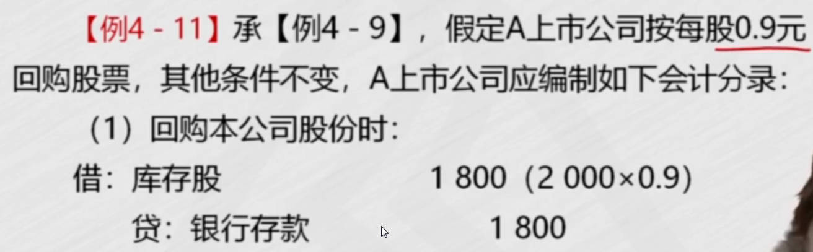
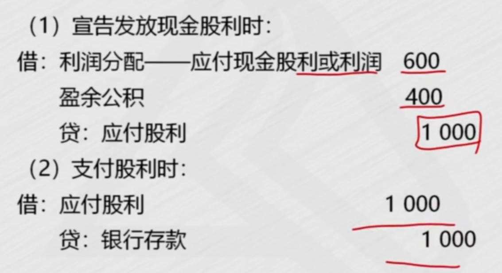

# 1、实收资本(股本)

股本面值是1元， 股本溢价计入资本公积

1. 股份有限公司以外的企业
   1. 出资
   1. 追加投资
   1. 实收资本减少
1. 股份有限公司
   1. 发行股票
   1. 增资
   1. 股本减少

|  |  |
| ------------------------------------------------------------ | ------------------------------------------------------------ |
|  |  |
|  |  |
|  |                                                              |
## 股份有限公司以外的企业

[资本公积用途](https://baike.baidu.com/item/%E8%B5%84%E6%9C%AC%E5%85%AC%E7%A7%AF/1021605)	

[股份有限公司以外的企业减资_百度搜索](https://www.baidu.com/s?ie=utf-8&f=8&rsv_bp=1&tn=baidu&wd=%E8%82%A1%E4%BB%BD%E6%9C%89%E9%99%90%E5%85%AC%E5%8F%B8%E4%BB%A5%E5%A4%96%E7%9A%84%E4%BC%81%E4%B8%9A%E5%87%8F%E8%B5%84&oq=%25E8%2582%25A1%25E4%25BB%25BD%25E6%259C%2589%25E9%2599%2590%25E5%2585%25AC%25E5%258F%25B8%25E4%25BB%25A5%25E5%25A4%2596%25E7%259A%2584%25E4%25BC%2581%25E4%25B8%259A&rsv_pq=a0d59ee800023f38&rsv_t=7b8cLe3aqWdfg1INkxbgWMd4n3gcineGBgPc0Dfk2TVlaEOpqWdrKx%2Fi7z0&rqlang=cn&rsv_enter=1&rsv_dl=tb&rsv_sug3=9&rsv_sug1=4&rsv_sug7=100&rsv_sug2=0&rsv_btype=t&inputT=4871&rsv_sug4=7092)	

1. 出资：有限责任公司(**实收资本**)、股份有限公司(发行股票筹资、股本：发行股票面值)。超过面值的记入`资本公积-股本溢价`； 接受现金资产、非货币资产投资。
   1. 货币出资
   1. 非货币资产出资
      1. 视同销售, 获得的是实收资本
1. 追加投资
   1. 原投资者追加投资：按原出资比例投资，例，注册资本由30增加到40
      1. 新投资者追加现金资产投资
      1. 新投资者追加非现金资产投资
   1. 资本公积转增资本
      1. 资本公积主要用途是转增资本: 企业扩大规模
      2. 资本公积减少，实收资本增加
   1. 盈余公积转增资本：有规定用途的利润
1. 减资
   1. 实收资本的减少
   1. 报经批准减少注册资本

|  |  |
| ------------------------------------------------------------ | ------------------------------------------------------------ |
|  |  |
|  |  |
|  |  |
|  |  |
|  |  |
|  |  |
|  |  |
|  |  |

## 股份有限公司

[股份有限公司减资_百度搜索](https://www.baidu.com/s?ie=utf-8&f=8&rsv_bp=1&tn=baidu&wd=%E8%82%A1%E4%BB%BD%E6%9C%89%E9%99%90%E5%85%AC%E5%8F%B8%E5%87%8F%E8%B5%84&oq=%25E8%2582%25A1%25E4%25BB%25BD%25E6%259C%2589%25E9%2599%2590%25E5%2585%25AC%25E5%258F%25B8%25E4%25BB%25A5%25E5%25A4%2596%25E7%259A%2584%25E4%25BC%2581%25E4%25B8%259A%25E5%2587%258F%25E8%25B5%2584&rsv_pq=d7c06a490000eb26&rsv_t=3d83add3AYCrMBq3ccRa2yqOExgiFTXVYwxkdPxl3ihTC7D97swIHz6kfBA&rqlang=cn&rsv_enter=1&rsv_dl=tb&rsv_btype=t&inputT=626&rsv_sug3=11&rsv_sug1=5&rsv_sug7=100&rsv_sug2=0&prefixsug=%25E8%2582%25A1%25E4%25BB%25BD%25E6%259C%2589%25E9%2599%2590%25E5%2585%25AC%25E5%258F%25B8%25E5%2587%258F%25E8%25B5%2584&rsp=0&rsv_sug4=739)	[库存股_百度搜索](https://www.baidu.com/s?ie=UTF-8&wd=%E5%BA%93%E5%AD%98%E8%82%A1)	

库存股： 公司将自己已经发行的股票重新买回，存放于公司，而尚未注销或重新售出

1. 出资
   1. 发行股票：股本增加，所有者权益增加 
1. 追加投资
   1. 资本公积转增股本
   1. 盈余公积转增股本
1. 减资
   1. 股本的减少：==回购公司股票减资==
   1. 回购股票
      1. 库存股： 所权减项，类似资产备抵科目，所以库存股增加的方向和所权减少是一个方向。
   1. 注销股本： 股本回购后，对应的股本要注销掉，冲销掉库存股，因为发行股票时，贷方记股本增加
      1. 注销股本3步：冲掉股本、冲掉库存股、借贷方差额处理
      1. 借：股本(面值) 贷：库存股(回购价) ; 不相等，有差额
         1. 回购价高于面值，借方依次冲减资本公积、盈余公积、利润分配-未分配利润;  回购的钱比发行的钱多，亏了
         1. 回购价低于面值，贷方计入`资本公积-股本溢价`

|  |  |
| ------------------------------------------------------------ | ------------------------------------------------------------ |
|  |  |
|  |  |
|  |  |
|  |  |
|  |  |
|  |  |
|  |                                                              |

# 2、资本公积
资本公积： 三个明细科目

1. ==资本溢价==：超额缴入资本的数额
2. ==股本溢价==：发行价格高于面值的部分
   1. 股票发行费处理: 手续费等用`资本公积-股本溢价`冲减
3. ==其他资本公积==

|  |  |
| ------------------------------------------------------------ | ------------------------------------------------------------ |
|  |  |
|  |  |
|  |  |
|  |  |
|  |  |
|  |  |

# 3、留存收益

## 计算可供分配的利润

留存收益包括==盈余公积==和==未分配利润==

- 盈余公积：`有规定用途的利润`，可以用盈余公积补利润
- 未分配利润

**利润分配**：用于盈余公积、发放股利

1. 结转本年利润
   1. 损益类科目==期末转入本年利润==： 期末没有余额，结转借方转借方，贷转贷
      1. 主营业务成本借方转入，本年利润借方
2. **结转实现净利润**: 计算出可供分配利润
   1. 分配利润不用`本年利润`账户核算，用==利润分配==
   2. 利润分配之前: 年末，把本年利润余额，结转到利润分配
      1. 贷方余额：==本年利润余额== 转入 利润分配-未分配利润
      2. 利润分配借方：未弥补的亏损
      3. 盈余公积可以补亏损
   3. 可供分配的利润
      1. $\large年初的+本年实现的+盈余公积补亏的$

|  |  |
| ------------------------------------------------------------ | ------------------------------------------------------------ |
|  |  |
|  |  |
|  |  |

## 利润分配

和利润相关的有3个结转：

- 结转本年利润
- **结转实现净利润**： 损益类科目转入本年利润， 本年利润转入`利润分配-未分配利润`
- 结转利润分配除"未分配利润"外其他明细科目余额， 也要转入`利润分配-未分配利润`

**利润分配**: 用于盈余公积、发放股利

1. 分配出去的利润
   1. 提取法定盈余公积
      1. 年初有亏损的，先补亏后净利润再乘10%
   2. 提取任意盈余公积
   3. 向投资者==分配利润或股利==
      1. 宣告发放现金股利
      2. 实际发放`股票股利`：宣告不做账务处理
2. **年末累积的未分配利润**
   1. 分配完利润后，最后要结转利润分配除"未分配利润"外其他明细科目余额
      1. 年末结转，除"未分配利润"外其他明细科目余额： 利润分配有很多明细科目，把明细科目余额转入未分配利润
         1. 提前盈余公积、发放股利后，借方利润分配有余额， 所以年末要结转到未分配利润,算出分配出去多少利润
   2. 最后算出累积的未分配利润

|  |  |
| ------------------------------------------------------------ | ------------------------------------------------------------ |
|  |  |
|  |  |
|  |  |
|  |  |
|  |  |
|  |  |
|  |                                                         |

## 盈余公积

1. 盈余公积用途：有规定用途的利润
   1. 盈余公积补亏
   2. 盈余公积转增资本(股本)
   3. 盈余公积发放现金股利或利润

|  |  |
| ------------------------------------------------------------ | ------------------------------------------------------------ |
|  |  |
|  |  |
|  |  |
|  |                                                              |

## 各类交易事项对留存收益与所有者权益的影响

|  |  |
| ------------------------------------------------------------ | ------------------------------------------------------------ |

