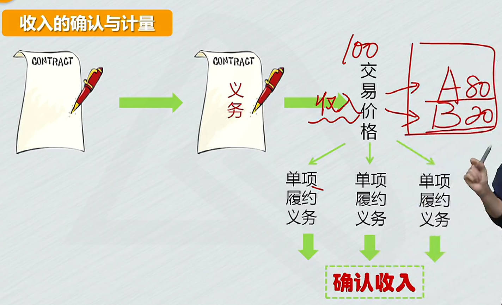
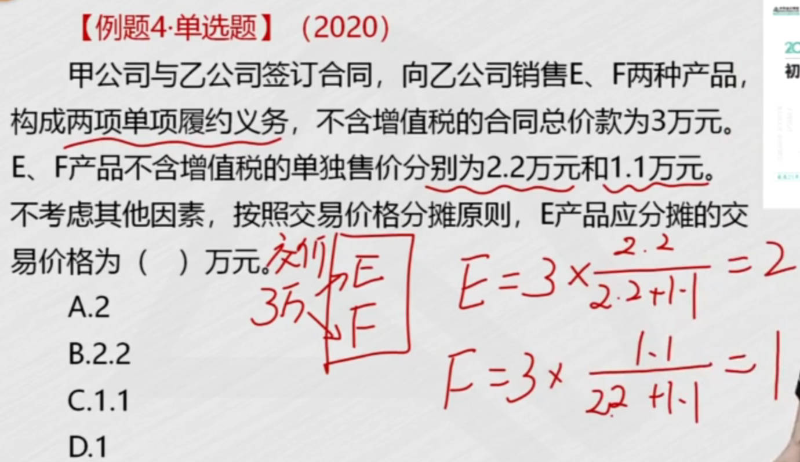
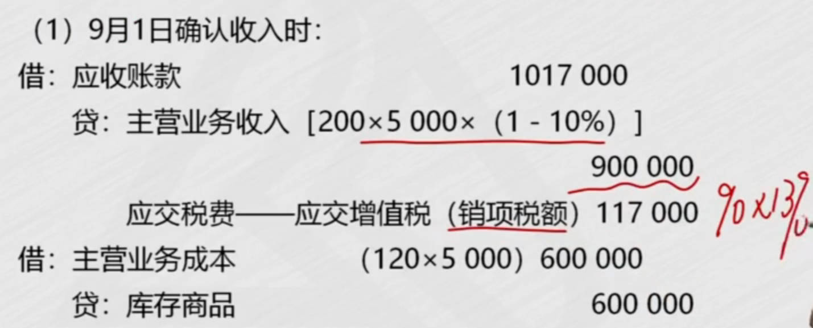
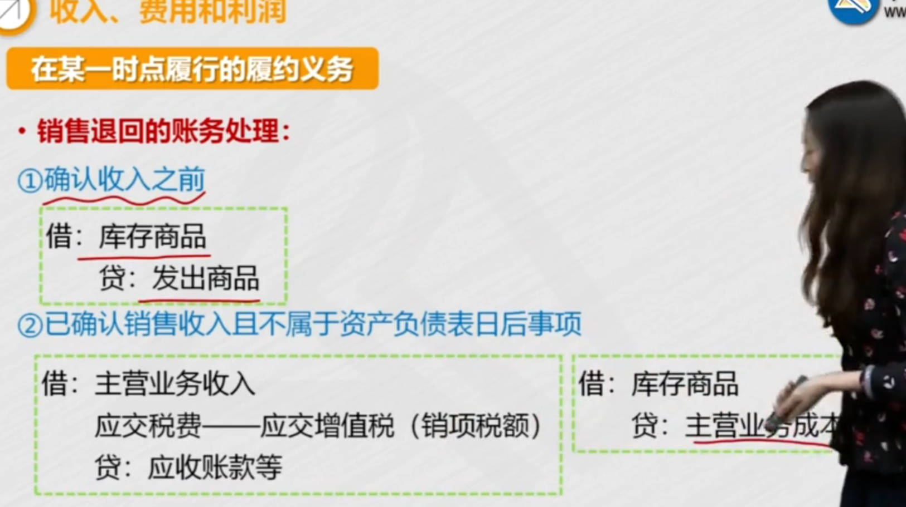
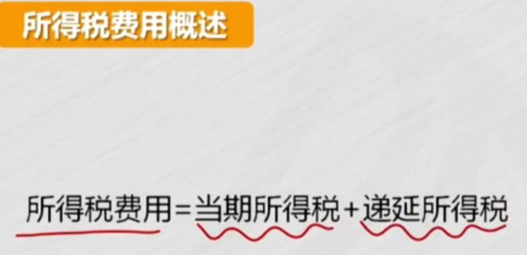
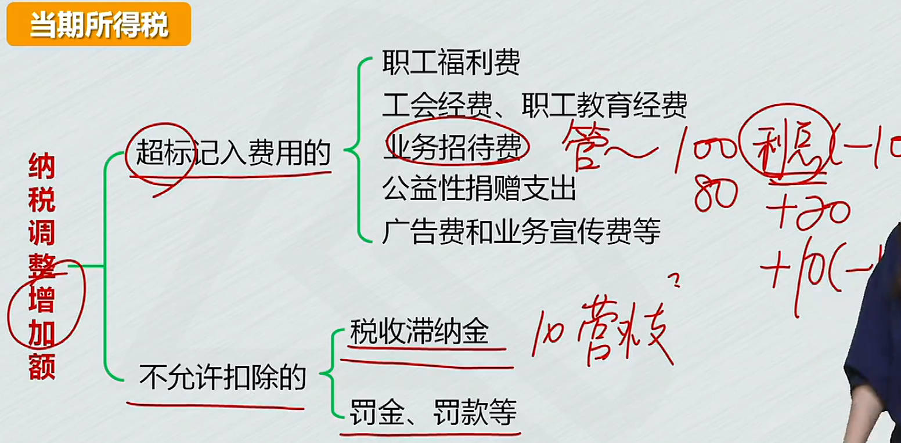
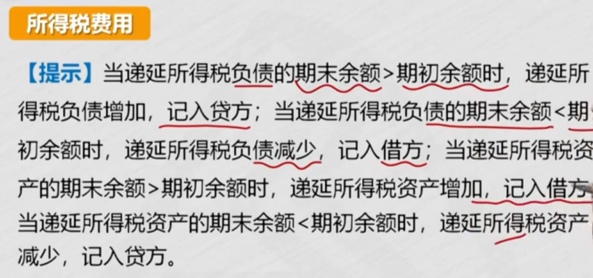

# 1、收入

## 收入确认与计量

收入： 日常活动中形成的； 利得： 非日常活动中形成的

==收入确认与计量5个步骤==：

1. 识别合同
   1. 履行了合同中的义务，才能实现收入
   2. `合同要满足五个条件`(收入确认的前提条件)。
2. 识别义务
   1. 合同中包含了几个义务
3. 确定交易价格
4. 分摊交易价格
   1. 如果合同包含多个义务，企业要做多件事，交易价格在2义务之间分摊，履行A义务，确认80收入。
5. 履行各单项履约义务时==确认收入==
   1. 每履行一项单项履约义务时，确认相关的收入
   2. 两类义务：时点、时段

|  |  |
| ------------------------------------------------------------ | ------------------------------------------------------------ |
|  |  |
|  |  |
|  |  |
|  |  |
|  |  |
|  |  |
|  |  |

## 收入帐务处理

### 在某一时点履行的履约义务

#### 判断控制权转移

客户取得商品控制权时，才能确认收入

|  |  |
| ------------------------------------------------------------ | ------------------------------------------------------------ |
|  |  |
|  |  |
|  |                                                              |

#### ==收入账务处理==

1. 商品销售业务：确认收入、结转成本  
   1. 现金结算：借：银存、库存现金等
   2. 委托收款：借：`应收账款`
   3. 商业汇票结算：借：`应收票据`
   4. 赊销：：借：`应收账款`
2. 发出商品业务

|  |  |
| ------------------------------------------------------------ | ------------------------------------------------------------ |
|  |  |
|  |  |
|  |  |
|  |  |

##### 发出商品业务

1. 未满足`对价很可能收回`: 
   1. 已发出商品但不确认收入 
   2. 未满足"对价很可能收回"的收入确认条件：`发出商品`科目
2. ==委托代销==
   1. 手续费10000，代销增值税600从应收账款里减去
   1. : 借：委托代销商品   贷：委托代销商品款

|  |  |
| ------------------------------------------------------------ | ------------------------------------------------------------ |
|  |  |
|  |  |
|  |  |
|  |                                                              |

##### 折扣

1. 涉及商业折扣： 打折
   1. 按扣除商业折扣后的金额，确定收入
2. 涉及现金折扣： 为了让购货方及早付款而提供的债务扣除
   1. 和付款相关，销售时不考虑，不影响确认收入
   2. 记财务费用

|  |  |
| ------------------------------------------------------------ | ------------------------------------------------------------ |
|  |  |
|  |  |
|  |  |
|  |  |

##### 材料销售

|  |  |
| ------------------------------------------------------------ | ------------------------------------------------------------ |
|  |  |
|  |  |

##### 销售退回

1. 未确认收入的售出商品发生销售退回
   1. 发出商品回来了：   借：库存商品   贷：发出商品 
2. 已确认收入、结转成本
   1. 和没销售一样，把之前的确认收入、结转成本、现金折扣==冲掉==, 相反分录

|  |  |
| ------------------------------------------------------------ | ------------------------------------------------------------ |
|  |  |
|  |  |
|  |                                                         |

##### 可变对价

合同中的对价不是固定金额：按期望值或最可能发生金额，确定可变对价的最佳估计数。

==合同资产==科目： 有条件的债权

|  |  |
| ------------------------------------------------------------ | ------------------------------------------------------------ |
|  |  |
|  |                                                         |

### 在某一时段履行的履约义务

[收入准则重新修订](https://baijiahao.baidu.com/s?id=1726984022250288425&wfr=spider&for=pc) [尽职调查](http://baike.esnai.com/history.aspx?id=5679)

按==履约进度==（完工进度）确认收入

1. 在某一时段履行的履约义务==确认收入==的账务处理
   1. `履约进度确定`：采用产出指标 或 投入指标
      1. 常见的是按累计实际发生的成本，占预计总成本的比例，确定履约进度

|  |  |
| ------------------------------------------------------------ | ------------------------------------------------------------ |
|  |  |
|  |  |
|  |  |

#### 账务处理

**第一个例子：装修**

第一个月末：

1. ==实际发生的成本==先计入合同履约成本
2. ==收入==按履约进度确认，增值稅：收入乘9%
   1. 结转成本：总成本40万乘25%，并不是实际发生多少，就结转多少, 也按履约进度计算==主营业务成本==

第二个月末：

1. 一共完成70%，==确认收入==时减去以前确认的收入
2. 总成本： 第一个月实际发生10万，第二个月实际发生18万，预计还将发生12万，共40万
   1. `40 x 70% -10 = 18`

完工确认收入、成本

**第二个例子：健身**

合同负债 ： 还没提供服务，预收的款项

每月冲减合同负债,待转销项税转为销项税（纳税义务发生了）

|  |  |
| ------------------------------------------------------------ | ------------------------------------------------------------ |
|  |  |
|  |  |
|  |  |
|  |  |
|  |  |
|  |  |

#### 合同成本

1. 合同取得成本
   1. 取得合同时发生的增量成本，预期能够收回
   1. 例5-8：按月确认服务收入，摊销合同取得成本(即佣金)
2. 合同履约成本(以前的劳务成本)
   1. 履行合同时发生的成本,属于收入准则范围，同时满足3个条件
   1. 合同履约成本摊销，转入主营业务成本

|  |  |
| ------------------------------------------------------------ | ------------------------------------------------------------ |
|  |  |
|  |  |
|  |  |
|  |  |
|  |  |
|  |  |
|  |                                                         |

# 2、费用

费用分类：日常活动中发生的， 非日常活动发生的-==损失==
1. 营业成本
2. 税金及附加
3. 期间费用

|  |  |
| ------------------------------------------------------------ | ------------------------------------------------------------ |
|  |  |
|  |  |
|  |  |
|  |  |
|  |  |
|  |                                                         |

# 3、利润

利润由2部分构成

- 日常活动形成的收入，减费用
- 非日常活动形成的利润：直接计入当期利润的利得，扣除损失;  利得和损失分为2类：
  - 直接计入当期利润的利得和损失
  - 直接计入所有者权益的利得和损失

1. 利润计算：营业利润 => 利润总额 => 净利润
   1. 营业利润：除营业外收入、营业外支出、所得税费用
   2. 利润总额：营业利润 + 营业外收入 - 营业外支出
   3. 净利润：利润总额 - 所得税费用
2. 营业外收支
3. 所得税费用、本年利润

|  |  |
| ------------------------------------------------------------ | ------------------------------------------------------------ |
|  |  |
|  |  |
|  |  |

## 所得税费用

企业实现了利润，就要交所得税

3. 所得税费用
   1. $\color{red}\Large所得税费用=当期应交所得税+递延所得税$
      1. 应交所得税：按税法规定算的所得税 不等于 会计准则确认的所得税
         1. 应纳税所得额： 税前会计利润，加减调整额
      2. 递延所得税：包括递延所得税`资产`、递延所得税`负债`  
         1. 负债-资产
         2. (期末负债-期初负债) - (期末资产-期初资产)
         3. 递延所得税资产减少5万，记贷方
   3. $\color{red}\Large净利润=利润总额-所得税费用$

|  |  |
| ------------------------------------------------------------ | ------------------------------------------------------------ |
|  |  |
|  |  |
|  |  |
|  |  |
|  |  |
|  |  |
|  |  |
|  |  |
|  |                                                              |

## 本年利润

1. 本年利润结转方法
   1. 损益类科目余额转到本年利润
   2. ==表结法==
   3. ==账结法==
2. 结转本年利润的账务处理
   1. 收入、利得类账户，一般在贷方，转本年利润： 贷方转贷方
   2. 费用、损失类账户，一般在借方，转本年利润： 借方转借方
   3. 年末，本年利润余额，转入 `利润分配-未分配利润`
   4. 结转完，本年利润没有余额

|  |  |
| ------------------------------------------------------------ | ------------------------------------------------------------ |
|  |  |
|  |  |
|  |  |
|  |  |
|  |  |
|  |                                                         |
