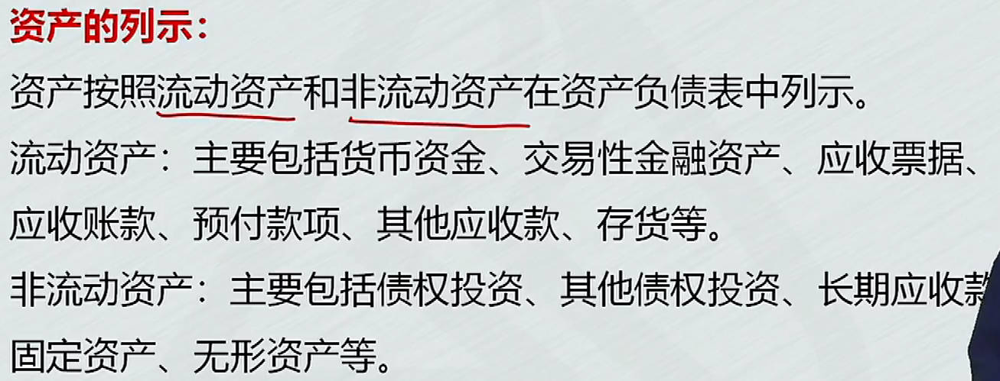
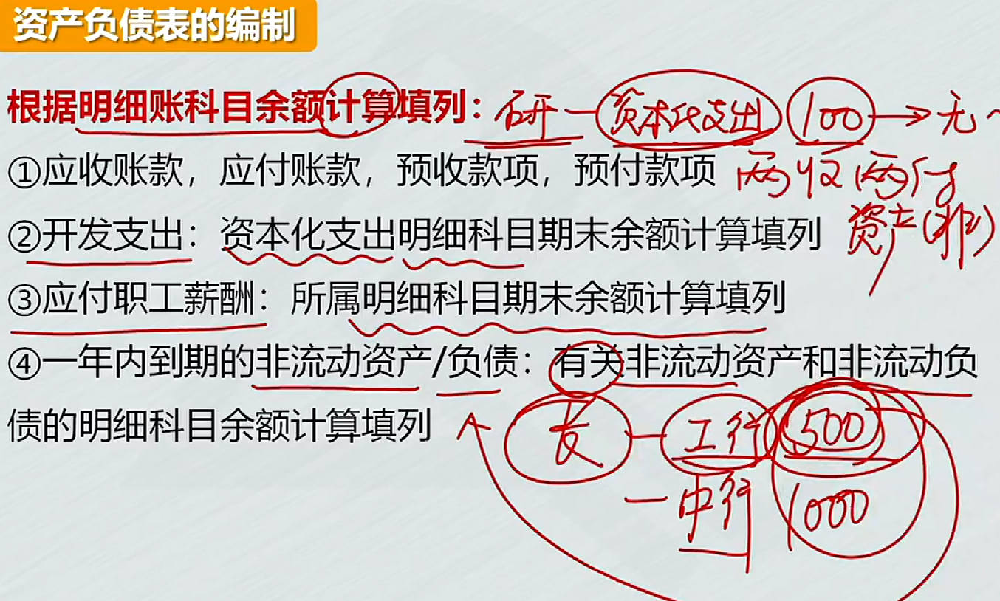
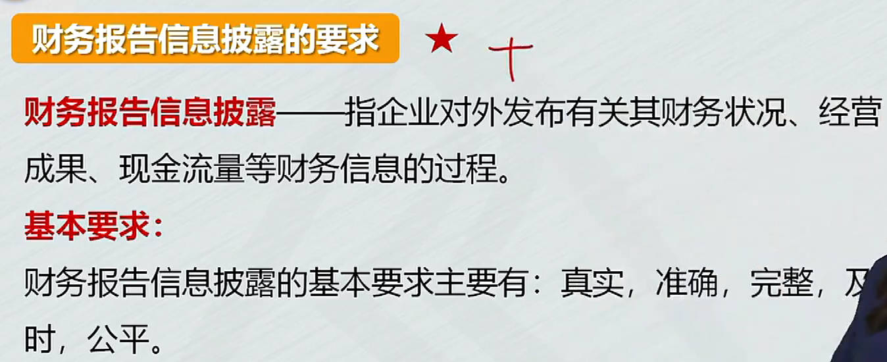

# 1、资产负债表

## 概述

1. 财务报告
2. 资产负债表：12.31日企业的财务状况，多少资产、负债、所权
   1. 资产按流动性由大到小的顺序，自上而下列示
   2. 负债按清偿时间的先后顺序列示

|  |  |
| ------------------------------------------------------------ | ------------------------------------------------------------ |
|  |  |
|  |  |
|  |  |
|  |  |
## 资产负债表编制

期末余额：从帐薄中找，根据账户的余额去填列期末余额

1. `根据总帐科目余额填列`
   1. 根据总帐科目余额直接填列
   2. 根据==几个总帐科目余额==计算
2. 根据有关`科目余额减`去，其`备抵科目余额后的净额填列`
3. 明细账科目余额==计算填列==
   1. 应付账款：贷方应付，借方已付、余额多付(预付)。    预付账款：借方预付，贷方应付
   1. 预付款项、应收账款：是资产，有备抵科目，资产备抵科目要减去
   1. $\color{green}\Large收+收，付+付，资产借借加，负债贷贷加$
4. 总帐科目和明细账科目余额分析==计算填列==
   1. 长期借款
5. `综合运用上述方法分析填列`
   1. 存货
6. 其他重要项目的填列

|  |  |
| ------------------------------------------------------------ | ------------------------------------------------------------ |
|  |  |
|  |  |
|  |  |
|  |  |
|  |  |
|  |                                                         |

### 其他重要项目的填列

|  |  |
| ------------------------------------------------------------ | ------------------------------------------------------------ |
|  |  |
|  |  |
|  |  |
|  |  |
|  |                                                              |

# 2、利润表

1. 单步式
2. 多步式：营业收入 => 营业利润 =>利润总额 =>净利润 => 每股收益
   1. 本期金额：根据相关科目发生额或计算公式填列
   1. 营业收入：主营业务收入 + 其他业务收入
   1. 营业成本：主营业务成本 + 其他业务成本
   1. 税金及附加
   1. 研发费用
   1. 财务费用
   1. 公允价值变动收益
   1. 资产处置收益
   1. 营业利润
   1. 利润总额
   1. 所得税费用
   1. 净利润
   1. 综合收益总额

|  |  |
| ------------------------------------------------------------ | ------------------------------------------------------------ |
|  |  |
|  |  |
|  |  |
|  |  |
|  |  |
|  |  |
|  |  |
|  |  |
# 3、现金流量表

|  |  |
| ------------------------------------------------------------ | ------------------------------------------------------------ |
|  |  |
|  |  |
|  |  |
|  |  |
|  |  |
|  |  |
|  |  |
|  |  |
|  |                                                              |
# 4、所有者权益变动表 

|  |  |
| ------------------------------------------------------------ | ------------------------------------------------------------ |
|  |  |
|  |  |
|  |                                                         |
# 5、财务报表附注及财务报告信息披露要求
|  |  |
| ------------------------------------------------------------ | ------------------------------------------------------------ |
|  |  |
|  |                                                         |