# 精简

## 流动资产

1. 交易性金融资产：取得、持有、出售、转让金融商品应交增值税
2. 应收及预付款：应收股利、应收利息、应收款项==减值==、其他应收款
3. 存货: 几种重要的存货, 原材料、周转材料、委托加工物资、库存商品
   1. ==原材料==
      1. 外购存货成本
      2. 发出存货的计价方法
      3. 原材料采用实际成本核算
      4. 未入库：在途物资
      5. 原材料采用==计划成本==核算
         1. ==购入材料分开写需要3个分录==： **采购分录、入库分录、结转差异分录**
            1. 原材料借贷方都用计划成本, ==材料采购贷方==也用计划成本，借方用实际成本
               1. 未入库：材料采购
            2. 入库时材料采购余额，结转到`材料成本差异`
               1. 购入时，材料成本差异： ==借方超支==差异，贷方节约差异
         2. **发出材料需要2个分录**： 发出材料、结转差异; 可以合并
            1. 先按计划成本发出，最终要调整为实际成本
               1. 材料成本差异率
               2. $\color{green}\Large实际成本=计划成本+差异=计划成本\times(1+差异率)$
            2. 采购用实际成本，入库用计划成本，发出用计划成本，最后调整为实际成本
               1. 记忆技巧：==超支时==，材料成本差异的方向和==原材料方向相同==
                  1. 取得时，入库，原材料在借方； 发出时，原材料在贷方
   2. ==周转材料==: 包装物、低值易耗品
      1. 低值易耗品
         1. 低值易耗品摊销, 要==结平余额==
   3. 委托加工物资
      1. 收回后连续加工，可抵扣消费税
   4. 库存商品：包括库存的产成品、外购商品等
      1. 毛利率法： 销售净额 减 销售毛利，就是销售成本
      2. 售价金额法
         1. 根据进价和售价的差价，算出进销差价率(毛利率)，接下来和毛利率法类似
         2. 注意分录：销售时，结转成本、分摊已售出商品的进项差价
            1. 因为购入商品时有进销差价，卖出商品的差价要分摊掉
   5. 存货减值
      1. 资产负债表日，成本大于可变现净值，要计提存货跌价准备
         1. 计提后，存货按可变现净值计量，即账面价值
      2. 跌价准备转回: (成本-可变现净值)-已计提
      3. 商品售出结转成本： 已计提1000，存货卖掉冲减1000；  也可以写2个分录

## 非流动资产

1. 固定资产
   1. 折旧: 考题给出年限和净残值
      1. 年限平均法：  $\Large\color{Purple}{原价\times折旧率}$
      2. 工作量法：  $\Large\color{Purple}{当月工作量\times单位折旧额}$ 
      3. 双倍余额抵减法： $\Large\color{Purple}{折余价值\times折旧率}$
      4. 年数总和法：  $\Large\color{red}(原价-净残值)\times该年折旧率$
   2. 后续支出
      1. 资本化支出
         1. 改造后：$\Large\color{red}入账价值=原账面价值-取出的旧部件+新部件+其他资本化支出$
      2. 费用化支出
   3. 处置
      1. 出售： 处置净损益转`资产处置损益`
      2. 报废、毁损： 损失转`营业外支出`，利得转`营业外收入`
   4. 清查
      1. 盘盈
         1. 以前的利润增加，期初的利润就增加，所以要调的是当期期初的利润，也就是增加期初的==留存收益==
      2. 盘亏
         1. 固资没有了，相关的`折旧、减值`也要冲掉
         2. 管理不善造成的，要将`进项税转出`
         3. ==账调完，报批后转销==
            1. 总损失：资产，加白缴的增值税
            2. 能收的赔款，记其他应收款
2. 无形资产
   1. 取得
      1. ==自行研发==
         1. 研究阶段
            1. 研究阶段支出作为费用，先计入`研发支出-费用化支出`，期末转入`管理费用`
         2. 开发阶段
            1. `研发支出-资本化支出`

   2. 摊销
   3. 处置

3. 长期待摊费用
   1. 发生==改良时==计入资产
      - 装修支出计入`长期待摊费用`
      - 贷方记发生的支出； 领材料，记原材料
   2. 在==受益期==进行摊销
      - 根据用途计入相应科目

## 负债

1. 应付职工薪酬： 短期薪酬、长期职薪、其他长期职工福利
2. 应交税费
   1. 应交增值税
      1. 应交税费二级明细科目、应交增值税专栏
      2. 视同销售: 捐赠、自产产品发福利、材料对外投资
      3. 差额征税: 相关成本费用允许抵减销项税

## 所有者权益

1. 资本公积: 来自溢价
2. 留存收益： 实现的利润, 包括==盈余公积==和==未分配利润==
   1. 盈余公积：`有规定用途的利润`
   2. 利润分配: 和利润相关的有3个结转

## 收入、费用、利润

# 会计科目表

[好：最新会计科目表（2025）_中国会计网](http://www.canet.com.cn/kemu/596034.html)	

[2025年新会计准则会计科目明细](https://baijiahao.baidu.com/s?id=1825099602512134837&wfr=spider&for=pc)   

[企业会计准则——应用指南2006](https://docs.maoyanqing.com/accounting/ent/or/20061030.html)  [最新企业会计准则及应用指南2月修订版](http://new.delikcpa.com/news/show-2888.html)		  

[小企业会计准则_百度搜索](https://www.baidu.com/s?ie=UTF-8&wd=%E5%B0%8F%E4%BC%81%E4%B8%9A%E4%BC%9A%E8%AE%A1%E5%87%86%E5%88%99)	[“小企业会计准则”与“企业会计准则”的区别](https://mp.weixin.qq.com/s?__biz=MzkyNjMxMTM5MQ==&mid=2247487417&idx=1&sn=5a17dd947b707f94d3a735915788bec0)	[《小企业会计准则》与《企业会计准则》有何不同？](https://v.66law.cn/wenda/3206842.aspx)	

[中华人民共和国会计法（2024年）](https://kjs.mof.gov.cn/zhengcefabu/202408/t20240812_3941615.htm)	 [小企业会计准则](https://kjs.mof.gov.cn/zhengcefabu/201111/t20111107_605525.htm)		[小企业会计准则——会计科目、主要账务处理和财务报表](https://kjs.mof.gov.cn/zhengcefabu/201111/t20111107_605525.htm)	

[2024最新企业会计准则及应用指南](https://zhuanlan.zhihu.com/p/5168977887)	

[会计科目表背诵口诀_百度搜索](https://www.baidu.com/s?ie=utf-8&f=3&rsv_bp=1&tn=baidu&wd=%E4%BC%9A%E8%AE%A1%E7%A7%91%E7%9B%AE%E8%A1%A8%E8%83%8C%E8%AF%B5%E5%8F%A3%E8%AF%80&oq=%25E4%25BC%259A%25E8%25AE%25A1%25E7%25A7%2591%25E7%259B%25AE%25E8%25A1%25A8&rsv_pq=8d50a4c30006a785&rsv_t=682aBWH2nq4wdrB%2BbHw2KkOoBZ7zz7cquqp%2BfcbJYAR413JwIdtwv9FeWcc&rqlang=cn&rsv_enter=1&rsv_dl=ts_3&rsv_btype=t&rsv_sug3=6&rsv_sug1=3&rsv_sug7=100&rsv_sug2=1&prefixsug=%25E4%25BC%259A%25E8%25AE%25A1%25E7%25A7%2591%25E7%259B%25AE%25E8%25A1%25A8&rsp=3&rsv_sug4=3879)	[会计口诀_百度百科](https://baike.baidu.com/item/%E4%BC%9A%E8%AE%A1%E5%8F%A3%E8%AF%80/5846251)	[会计科目表背诵口诀](https://baijiahao.baidu.com/s?id=1814500206857483383&wfr=spider&for=pc)	[会计科目顺口溜](https://mbd.baidu.com/newspage/data/dtlandingsuper?nid=dt_4829100390411788655&sourceFrom=search_a)	[2025年会计科目表](https://zhuanlan.zhihu.com/p/29192878786)	

## 会计科目编号

[334个会计科目表](https://baijiahao.baidu.com/s?id=1736323052768867962&wfr=spider&for=pc)	 [会计科目编号规则_百度搜索](https://www.baidu.com/s?ie=utf-8&f=8&rsv_bp=1&tn=baidu&wd=%E4%BC%9A%E8%AE%A1%E7%A7%91%E7%9B%AE%E7%BC%96%E5%8F%B7%E8%A7%84%E5%88%99&oq=%25E4%25BC%259A%25E8%25AE%25A1%25E7%25A7%2591%25E7%259B%25AE%25E7%25BC%2596%25E7%25A0%2581%25E8%25A1%25A8&rsv_pq=da372b2b0005be8a&rsv_t=3c002ibYijQ85L%2Fcw2AXcd3XgEQfmwORmK%2F7vaduH1TaM3N2o4rYiWlEjYQ&rqlang=cn&rsv_enter=1&rsv_dl=tb&rsv_btype=t&inputT=6213&rsv_sug3=52&rsv_sug1=30&rsv_sug7=100&rsv_sug2=0&rsv_sug4=9601)	[会计科目编号_百度百科](https://baike.baidu.com/item/%E4%BC%9A%E8%AE%A1%E7%A7%91%E7%9B%AE%E7%BC%96%E5%8F%B7/12712568)	[会计科目表_百度百科](https://baike.baidu.com/item/%E4%BC%9A%E8%AE%A1%E7%A7%91%E7%9B%AE%E8%A1%A8/2467679)	

**一级科目编码规则**

1. 千位
   1. 1、2、3、4、5、6，分别顺序代表资产类、负债类、共同类、所有者权益类、成本类、损益类等六类
2. 百位
   1. 业务性质相同
   2. 大类下的小类划分（如资产类中，0=货币资金、1=应收款项）
3. 3-4位‌
   1. 流水号，用于区分同类科目（如1002=银行存款、1403=原材料）

**下级科目扩展规则**

1. 二级科目
   1. 6位编码，前4位继承一级科目编号，后2位为细分流水号（如100201=中国银行账户）
2. 三级及以下科目
   1. 每级增加2位数字，形成层级递进（如10020101=中国银行基本户）

# 会计分录

[会计分录大全](https://zhuanlan.zhihu.com/p/434251143)	 [初级会计330条会计分录](https://zhuanlan.zhihu.com/p/669480149) [330个会计分录](https://www.bilibili.com/video/BV18K411G7xn/?vd_source=7346303e5e18677d7261c2c0c109ecfd)	[完整版330个会计分录](https://zhuanlan.zhihu.com/p/429452498)		 [会计分录](https://www.kjjl100.com/news/164846.html)	 [《初级会计实务》分录](https://www.dongao.com/ziliao/cjks_cjkjsw_85/983.shtml)	[初级会计实务330条分录](https://zhuanlan.zhihu.com/p/683005122)	

[会计人必备的八大网站](https://www.bilibili.com/video/BV1jy4y1C7oX?spm_id_from=333.788.recommend_more_video.1&vd_source=7346303e5e18677d7261c2c0c109ecfd)

[企业常见做假账21种手法](https://www.bilibili.com/video/BV1i54y1R7rz/?vd_source=7346303e5e18677d7261c2c0c109ecfd)	[会计记账全套流程](https://www.bilibili.com/video/BV1L54y1C7KA/?vd_source=7346303e5e18677d7261c2c0c109ecfd)	

[合理避税的的12种方法](https://www.bilibili.com/video/BV1SK4y1h75M/?vd_source=7346303e5e18677d7261c2c0c109ecfd)	

[出口退税实操](https://www.bilibili.com/video/BV1huLFz3EBS/?vd_source=7346303e5e18677d7261c2c0c109ecfd)	

[经济法基础必背口诀](https://www.chinaacc.com/ziliaoku/chujizhicheng/detail4637.shtml)	 [2025年《经济法基础》必背法条](https://www.chinaacc.com/ziliaoku/chujizhicheng/detail4513.shtml)	

> 公式

[2025年《初级会计实务》常用公式](https://www.dongao.com/cjks/cjkjsw/202503284543216.html)	 [2025年《经济法基础》常用公式](https://www.chinaacc.com/ziliaoku/chujizhicheng/detail4514.shtml)	 [2025年《初级会计实务》常用会计公式](https://www.chinaacc.com/ziliaoku/chujizhicheng/detail4512.shtml)	 

> 习题

[2023初级会计1200道母题](https://zhuanlan.zhihu.com/p/593210517)		

[结转_百度百科](https://baike.baidu.com/item/%E7%BB%93%E8%BD%AC/7344296)	[会计结转_百度搜索](https://www.baidu.com/s?ie=UTF-8&wd=%E4%BC%9A%E8%AE%A1%E7%BB%93%E8%BD%AC)	

[会计里的转销、冲销、核销](https://www.zhihu.com/question/648569953)	[会计中的转销、转回、核销、冲销](https://mbd.baidu.com/newspage/data/dtlandingsuper?nid=dt_4217574168130992785&sourceFrom=search_a)	  [转销_百度百科](https://baike.baidu.com/item/%E8%BD%AC%E9%94%80/3283002)	[计提、转销、摊销、冲销](https://wenku.baidu.com/view/2932919bb90d4a7302768e9951e79b896902681b.html?fr=aladdin266&ind=3&aigcsid=0&qtype=0&lcid=3&queryKey=%E8%BD%AC%E9%94%80&verifyType=undefined&_wkts_=1748840381143)	 

[递延资产_百度搜索](https://www.baidu.com/s?ie=UTF-8&wd=%E9%80%92%E5%BB%B6%E8%B5%84%E4%BA%A7)	[摊销_百度搜索](https://www.baidu.com/s?ie=UTF-8&wd=%E6%91%8A%E9%94%80)	[什么是摊销](https://www.acc5.com/news-xinwen/detail_170538.html)	[好：摊销](https://mp.weixin.qq.com/s?__biz=MzkxNTQ3MTY2Mg==&mid=2247504117&idx=4&sn=1561e9fb856c222867e37025d4770f13)	[摊销](https://aistudy.baidu.com/site/wjzsorv8/8cd47d9a-7797-42f3-9306-b902ded71161?qaId=3920475&categoryLv1=%E6%95%99%E8%82%B2%E5%9F%B9%E8%AE%AD&efs=1&ch=54&srcid=10014&source=natural&category=%E5%85%B6%E4%BB%96&eduFrom=136&botSourceType=46)	

[计入](https://aistudy.baidu.com/site/wjzsorv8/8cd47d9a-7797-42f3-9306-b902ded71161?qaId=951091&categoryLv1=%E6%95%99%E8%82%B2%E5%9F%B9%E8%AE%AD&efs=1&ch=54&srcid=10014&source=natural&category=%E5%85%B6%E4%BB%96&eduFrom=136&botSourceType=46)  [计入](https://aistudy.baidu.com/site/wjzsorv8/8cd47d9a-7797-42f3-9306-b902ded71161?qaId=1948136&categoryLv1=%E6%95%99%E8%82%B2%E5%9F%B9%E8%AE%AD&efs=1&ch=54&srcid=10014&source=natural&category=%E5%85%B6%E4%BB%96&eduFrom=136&botSourceType=46)		[计入](https://aistudy.baidu.com/site/wjzsorv8/8cd47d9a-7797-42f3-9306-b902ded71161?qaId=951091&categoryLv1=%E6%95%99%E8%82%B2%E5%9F%B9%E8%AE%AD&efs=1&ch=54&srcid=10014&source=natural&category=%E5%85%B6%E4%BB%96&eduFrom=136&botSourceType=46)	

==计入==：  “计入”强调计算后归入特定分类, 而“记入”侧重单纯记录行为

==结转==： 或期末结转，指期末结账时将某一账户的`余额`或`差额`转入另一账户。这里涉及两个账户，一般结转后，转出账户将没有余额

- 结转：借方转借方，贷方转贷方

==摊销==：  一种会计计算方法,可以把`一次性支出或收入`按固定比例分配到多个财政年度,以满足会计分录的原则,并且根据不同的类型确定等额摊销或递减摊销 

- 将无形资产的成本在其预期使用寿命内系统、合理地分摊到各会计期间的过程,用于反映资产价值随时间推移的消耗情况
- 摊销： **价值减少的部分**

==转销==:  把==减值准备结转掉==(例，备抵法：实际发生坏账，转销坏账);  从某些资产减值准备的结转核销中发生的费用;  **转销减值准备**

- **将一个数额从某一账户转入另一账户**     [转销_百度百科](https://baike.baidu.com/item/%E8%BD%AC%E9%94%80/3283002)	
- 借方余额转出：就是借方余额冲掉，做一个相反的会计分录
- 指企业发生的费用是从，存货跌价准备、坏账准备 、 固定资产减值准备 、 无形资产减值准备 、 长期股权投资减值准备、 商誉减值准备等`资产减值准备的结转核销`
- 当你计提的减值准备资产不再需要时，把这些`减值准备结转掉`。举个例子，比如你之前计提了存货的跌价准备，现在存货卖掉了，那么你就要把之前计提的跌价准备结转掉

==核销==： **核销坏账**; 对财务凭证或单据的确认、审核和记录

- 完成会计凭证的审核，核销会核实凭证的真实性，以确保会计事项的真实性和准确性
- 例，收到发票之后，就可以核销相应账，对于确实无法收回的应收款项，按管理权限报经批准

==冲销==：对错误的会计记录进行冲抵，使其在对等额内相互抵消

==转回==: 和转销类似，但它是为了让资产的价值回升。

- 例，之前计提的减值准备太多了，现在情况好转了，需要把多提的部分转回

==备抵科目==: 用来准备抵消的科目，是所对应科目的减项，通常是资产类才有备抵科目

## 折旧

[备抵科目_百度搜索](https://www.baidu.com/s?ie=UTF-8&wd=%E5%A4%87%E6%8A%B5%E7%A7%91%E7%9B%AE)	 [好：8个备抵科目的借贷方向](https://mbd.baidu.com/newspage/data/dtlandingsuper?nid=dt_5477370994693456846&sourceFrom=search_a)	 [会计备抵科目总结‼️](https://mbd.baidu.com/newspage/data/dtlandingsuper?nid=dt_4475815647729147598&sourceFrom=search_a)	[财务必会的8种备抵科目](https://mbd.baidu.com/newspage/data/dtlandingsuper?nid=dt_4500838106078534361&sourceFrom=search_a)	 [备抵科目](https://mbd.baidu.com/newspage/data/dtlandingsuper?nid=dt_3026827586497332024&sourceFrom=search_a)	

有了累计折旧，既能反映汽车原值，也能反映汽车的真实价值(账面价值)

固定资产计提折旧，无形资产计提摊销

备抵科目增加的方向，和相应科目减少的方向一致

| 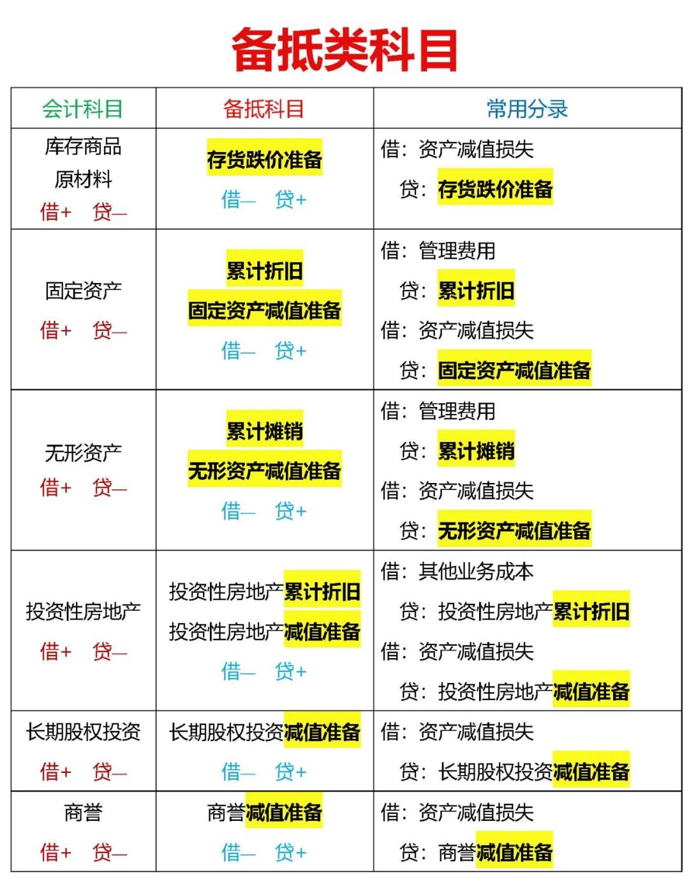 | 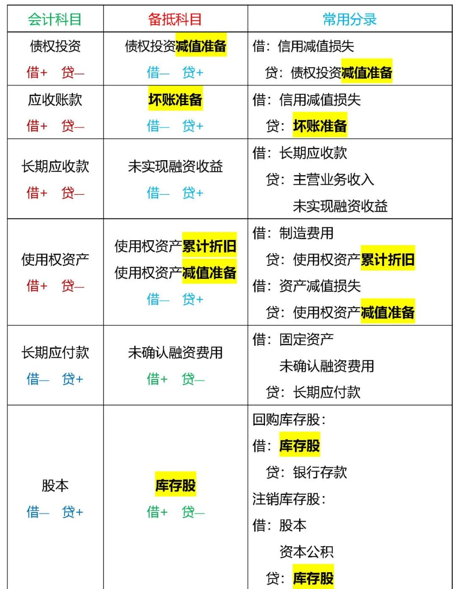 |
| -------------------------------- | -------------------------------- |

## 减值

| 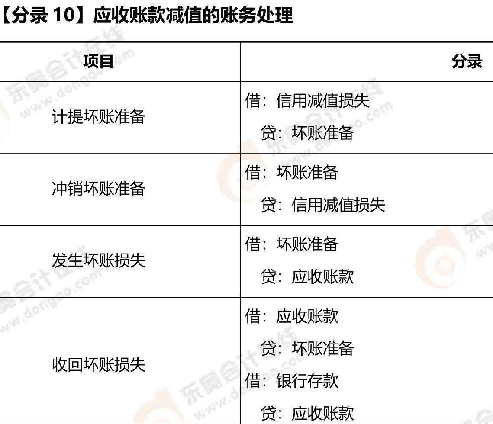 | 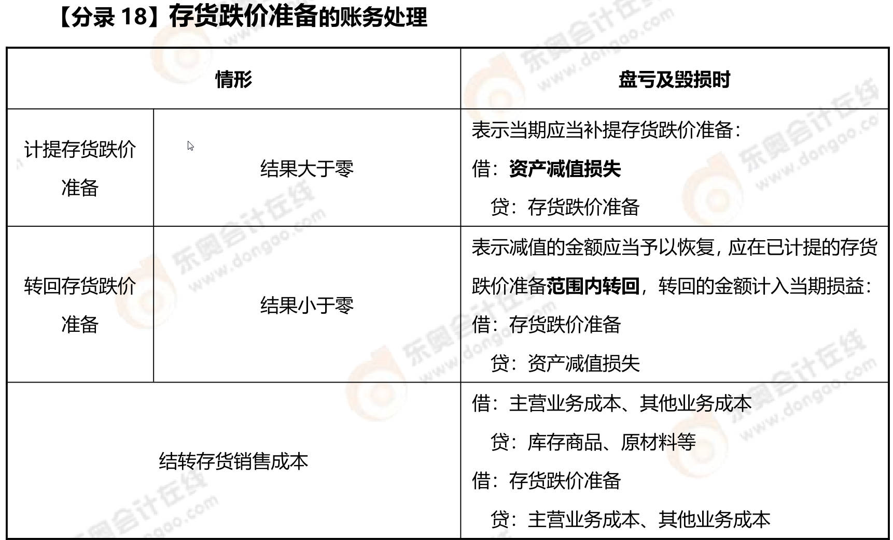 |
| ------------------------------------------------------- | ------------------------------------------------------------ |
|  |                                                         |

## 清查

[财产清查的内容有哪些](https://www.kuaiji.com/kuaijishiwu/528586184.html)	[会计清查方法](https://www.66law.cn/laws/4556753.aspx)	[财产清查 ](https://zhuanlan.zhihu.com/p/9046692225)	 

[会计分录](https://zhuanlan.zhihu.com/p/401668443)	 [财产清查](https://www.99wenmi.com/article/filet72karle.html) [财产清查账务处理](https://www.chinaacc.com/kuaijishiwu/zzjn/yu20200423095238.shtml)		 

**货币资金、实物资产、往来款项、债权债务的清查**

1. 货币资金清查：   ==待处理财产损溢==
2. 往来款项
3. 金融资产投资的清查
   1. 交易性金融资产
   2. 可供出售金融资产
   3. 持有至到期投资
   4. 长期股权投资等
4. 存货:     ==待处理财产损溢==
5. 固定资产
   1. 盘盈： `以前年度损益调整`
      1. 作为前期差错处理，用`以前年度损益调整`科目，不让影响当前损益

   2. 盘亏： ==待处理财产损溢==

6. 无形资产和其他资产的清查

| 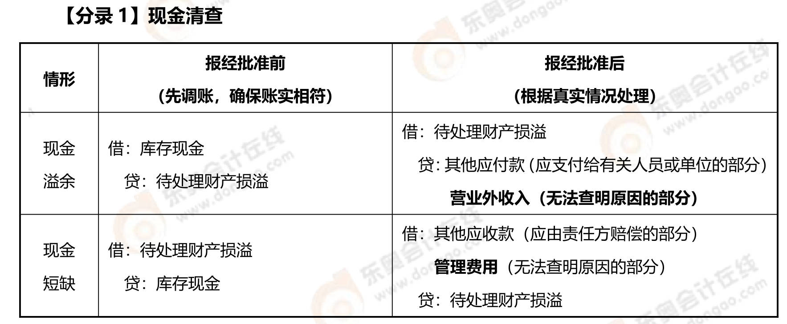      | 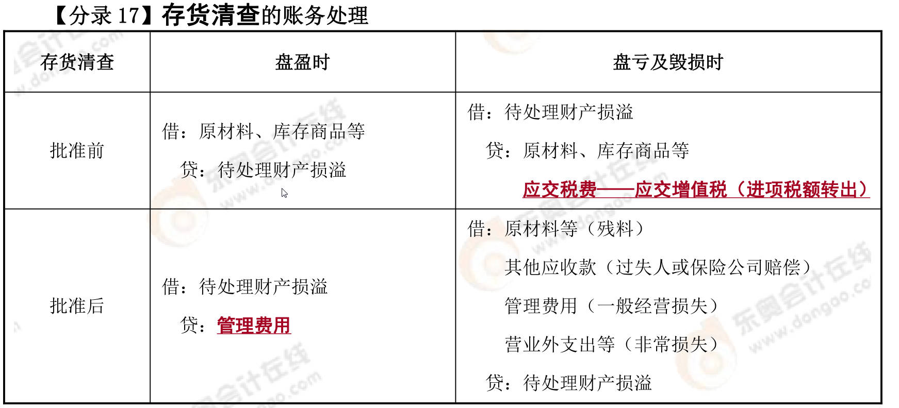 |
| ------------------------------------------------------------ | ------------------------------------------------------- |
| 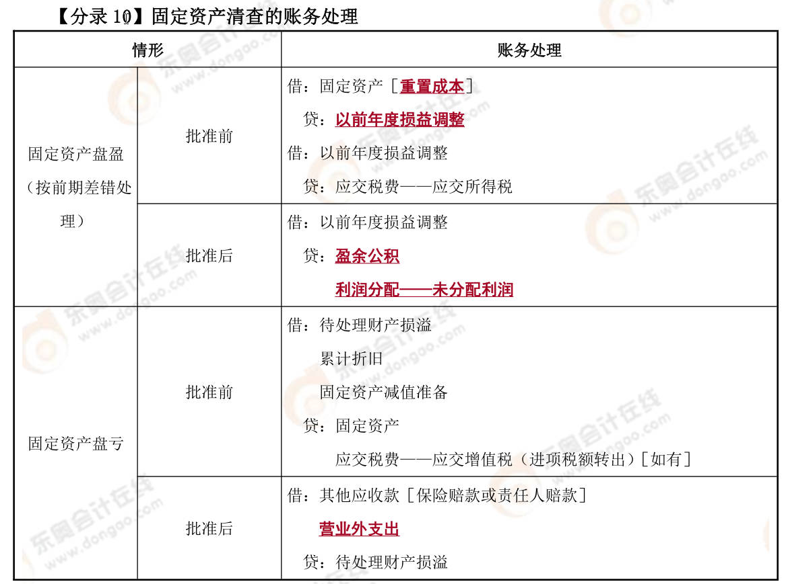 |                                                    |

## 损益

[其他业务收入&营业外收入](https://bang.api.duia.com/duibaApp/appViewTopic?isApp=0&isLiao=0&topicId=434086&userId=0)	 [保险赔款计入营业外收入吗](https://baijiahao.baidu.com/s?id=1832964995726779222&wfr=spider&for=pc)	

营业外收入不属于收入，它属于利得

1. 出售交易性金融资产： ==投资收益==

# 流动资产

## 交易性金融资产

1. 出售: `投资收益 = 处置时价款 - 处置时账面余额`
2. 转让金融商品应交增值税 : $$\tfrac{卖出价-买入价(不扣除D/I)}{1+6\%} \times 6\%$$

计算：

- ==取得至处置的投资收益==：
  - 交易费计入投资收益
  - 持有期股利、利息
  - 处置时损益： 出售时借贷方差额计入投资收益， `处置时价款 - 处置时账面余额`
  - 出售时确认应缴增值税，对应科目计入投资收益

- ==取得至处置的损益==：
  - 除了投资收益，还有公允价值变动计入`公允价值变动损益`

- ==处置损益==： 处置价款减账面价值

## 应收、预付账款

应收、预收是==卖方==视角； 应付、预付是==买方==视角

其他应收款

### 应收款项减值

1. 直接转销法(小企业)
   1. 3年收不回来为坏账，发生坏账时才确认损失
   2. 用 `信用减值损失` 核算, 收不回来，冲减 `应收账款`
   3. 缺点：16年的损失，到19年才确认
2. **备抵法**: 期末==估计==应收款中收不回来的部分，确认相应坏账损失
   1. **计提坏账准备** : 增加坏账准备
      1. 坏账准备属于资产类科目中的备抵科目（调整科目）‌，主要用于抵减应收账款等资产类科目的账面价值，反映应收款项可能发生的减值损失
   2. 转回：计提10万，应有8万, 转回2万
      1. 冲减计提
   3. 转销坏账损失 ：==实际发生坏账==，就是转销坏账, 把`坏账准备结转掉`
      1. 实际发生坏账时，`冲掉坏账准备 和 应收账款`
   4. ==收回已转销的坏账==：钱又收回来了，收回已转销的应收账款
      1. 钱又收回来了，==先恢复==准备、应收; 再处理收款

## ==存货==

几种重要的存货：$\color{blue}\Large原材料、周转材料、委托加工物资、库存商品$

1. **存货成本核算**： 可以用==计划成本==或==实际成本==核算
2. 存货减值
3. 存货清查

### 存货成本确定

1. 外购存货成本
   1. 价款
   2. 税费：==三税一费与不能抵扣==,要计入存货成本
      1. 消资进关附加
      2. 不能抵扣的增值税进项税
   3. 其他费用：==六费一损耗==
      1. 运、包、装、保、理、仓
      2. 合理损耗
2. **自制存货成本**
   1. 直接材料
   2. 直接人工
   3. 制造费用
3. **委托加工存货成本**
   1. 耗用的原材料等
   2. 加工费
   3. 税费
   4. 其他费用
4. **不应计入存货成本的费用**
   1. 非正常损耗
      1. 自然灾害造成的损耗，计入==营业外支出==
   2. 验收入库后的仓储费用

### 成本核算

#### 实际成本法

1. 购入材料
   1. `在途物资`
2. 发出材料
   1. 生成经营领用
      1.  $\begin{matrix}
         借：生成成本\\
            管理费用等\\
         贷：原材料
         \end{matrix}$
   2. 出售
      1. 销售原材料的收入计入`其他业务收入`，同时结转相应的成本到`其他业务成本`
   3. 发出委托加工
      1. 借：委托加工物资
3. **发出存货的计价方法**
   1. 个别计价法
   2. 先进先出法
   3. 月末一次加权平均法
      1. ==平时==发出存货时，==只记数量==，不记成本
      2. 月末记==存货的单位成本==： $$总成本{\div}总数量$$
   4. 移动加权平均法
      1. 每次进货时，都要计算==存货单位成本==

#### 计划成本法

1. **购入材料**
   1. 材料采购==借方用实际成本,贷方用计划成本==
      1. ==原材料==借贷方都用计划成本
      2. 实际成本比计划成本大，借方余额超支差异
      3. 材料采购入库后不应该有余额，但这里有余额，==①余额转到==反映成本差异的账户： ==材料成本差异==
      4. 材料成本差异：借方余额超支差异
   2. 购入材料分开写需要3个分录： **采购分录、入库分录、结转差异分录**
      1. 入库和结转差异分录可以合并
2. **发出材料**
   1. 不论购入还是发出，原材料都按计划成本核算
   2. 先按计划成本发出，最终要调整为实际成本
      1. 有计划成本了，$\color{green}\Large实际成本=计划成本+差异$，要算出差异
      2. 算差异，要先计算==材料成本差异率==
      3. 计算==发出材料的成本差异==
         1. $发出材料的计划成本 \times 本期材料成本差异率 $
      4. 结转发出材料的成本差异，并将发出材料的==②计划成本调整为实际成本==
         1. 计划成本调整为实际成本分录

   3. **发出材料需要2个分录**： 发出材料、结转差异; 可以合并

3. **记忆技巧**：==超支时==，材料成本差异的方向和==原材料方向相同==, 因为超支时，实际大于计划,计划加差异才等于实际
   1. 或者这样理解：取得时，借:原材料，超支方也在借方； 发出时：贷：原材料，超支方也在贷方

### 原材料

**原材料**： `在途物资`

1. **发出材料账务处理**: 领用、出售、发出委托加工
2. ==发出存货的计价方法==
3. 计划成本法下：**入库**前不用`在途物资`，用`材料采购`科目
   1. **入库**：  分开需要3个分录，  ==采购分录、入库分录、结转差异分录==
      1. 入库和结转差异分录可以合并： `借：原材料(计划成本)     贷： 材料采购(实际成本)   材料成本差异(入库节约差异)`

   2. **发出**材料账务处理：        ==发出材料分录、结转差异分录==
      1. 发出材料、结转差异分录合并： `借：生产成本等(实际成本)  贷：原材料(计划成本)     材料成本差异(发出超支差异)

### 周转材料

**难点**：低值易耗品摊销, 要==结平余额==

**周转材料**: 包装物、低值易耗品

1. 作为==产品组成==部分
   1. 领用包装物记减少,计入产品生产成本
   2. `周转材料-包装物`
2. 随商品出售，而==不单独计价==
   1. 借：销售费用

3. 随商品出售，==单独计价==
   1. 相当于销售茶叶盒，要确认收入、结转成本 
      1. `其他业务收入、其他业务成本`
   2. 涉及`销售需要2个分录`： 确认收入、结转成本

4. ==出租、出借==包装物
   1. 库存包装物转`出租/借`
   2. 押金
   3. 租金收入
   4. 修理费用
   5. 包装物摊销
      1. 例如：包装物能用2次，用一次价值减少
         1. 除固定资产外，用摊销，例如无形资产摊销
      1. 出借摊销到`销售费用`，出租摊销到`其他业务成本`

5. ==低值易耗品==： 在用、在库、摊销（因为使用价值减少）； `周转材料-低值易耗品-在用`
   1. 分次摊销法: 领用、摊销、最后一次摊销结平余额
   2. 领用：在库转在用
   3. 摊销: 价值减少的部分
      1. 摊销完，价值减少为0，相当于没有这项资产,和资产相关的明细科目都不应该有余额
      1. 摊销记计划成本，费用记实际成本
      
   4. 结平余额（在用、摊销）
      1. 2次摊销完后，在用借方有1000，摊销贷方有1000，摊销完后不应该有余额
      2. 所以要==结平余额==，在用贷方1000，摊销借方1000

### 委托加工物资

重点： 收回后连续加工，可抵扣消费税

1. 发出物资
2. 支付加工费、运杂费等
   1. 加工费、运杂费直接计入成本
   2. 消费税：==收回后连续加工，可抵扣消费税==；  收回后直接出售，不能抵扣，计入成本

3. 验收入库

### 库存商品

难点：售价金额法分录

**库存商品** ： 包括 **产成品、外购商品**等

> 售价金额法: 通过按售价记录商品的销售和库存，计算销售商品应负担的进销差价，将售价调整为实际成本‌	
>
> - 按售价入账，销售后结转为实际成本
>
> 其实2种方法类似，毛利率和进销差价率，都是利润 除以 收入
>
> - 接着求出毛利（或进销差价）
> - 本期销售成本 = 收入 - 毛利（或进销差价）

1. **工业企业：** 
   1. 生产时的账务处理
      1. 借方：生产成本 贷：原材料

   2. 完工时
      1. 生产成本转库存商品

   3. 销售时： 2个分录
      1. 确认收入
      2. 结转成本： `借：主营业务成本  贷：库存商品`
2. **商品流通企业发出商品的核算方法**： 
   1. 毛利率法： **销售净额 减 毛利**，就是销售成本
      1. $\Large本期销售毛利=本期销售净额\times上期毛利率$
      2. $\Large本期销售成本=本期销售净额-本期销售毛利$
   2. 售价金额法： **收入 减 进销差价**，就是销售成本；  $\Large\color{blue}售价(收入) - 进价(成本) = 差价(利润)$
      1. 进价和售价的差额就是进销差价, 然后计算差价率: $\Large\color{blue}{差价\over售价}={期初差价+本期购入差价\over期初售价+本期购入售价}$
      2. 销售商品的进价怎么确定： 
         1. $\color{blue}\large本期销售商品应分摊的商品进销差价= 销售时售价(收入)\times进销差价率$
         2. $\color{red}\large本期销售商品成本=本期商品销售成本-本期销售商品应分摊的商品进销差价$
         3. $\color{blue}\large期末结存商品成本=期初结存商品进价+本期购入商品进价-本期销售商品成本$
      3. 分录：
         1. 销售时按==售价==结转成本
         2. 期末再分摊销售商品的进销差价,冲减主营业务成本，冲减后主营业务成本（差额）就是进价

# 非流动资产

## 固定资产

**在建工程**：==未达到使用状态==的固定资产

### 取得

1. ==外购==
   1. 购入不需安装
   2. 购入需安装: 分3步,==购入分录、安装分录、交付分录==
      1. 购入、安装：==借方：在建工程==
      2. 交付使用： 在建工程转固定资产
      1. 小规模纳税人购入固资
   3. 一笔款购入多项, 没单独标价固资
      1. 按公允价值比例分摊
2. ==自行建造固资==
   1. 自营：达到预定可使用状态：借：固定资产(入账价值)    贷：在建工程
      1. 领用工程物资，计入成本
   2. 出包方式：出包给承包商建造； 简单，付承包商的价款。

### ==折旧==

1. 折旧影响因素：原价、净残值、减值、预计寿命
2. 折旧范围
   1. 已提足折旧仍使用： 例，预计寿命10年，10年后资产还能继续使用，以后不再计提折旧
3. 折旧方法：前2个叫直线法，后2个加速折旧法
   1. **年限平均法**： 算出 `年折旧额`
      1. 年折旧率===年折旧额/原价==；   预计净残值率=预计净残值/原价
      2. $\huge年折旧额 = \color{Purple}{原价-预计净残值\over预计使用年限}$
         1. 年折旧额：原价20，预计净残值 `1`，10年，每年折旧 `1.9`
      3. $\huge年折旧率 = \color{Purple} {年折旧额\over原价}={1-预计净残值率\over预计使用年限}$
   2. **工作量法**： 先算出 `单位工作量折旧额`
      1. 汽车预计总行驶里程
      2. $\huge单位工作量折旧额 = \color{Purple}{原价-预计净残值\over预计总工作量}={原价\times(1-预计净残值率)\over预计总工作量}$
      3. $\Large\color{blue}月折旧额=当月工作量\times单位工作量折旧额$
   3. 双倍余额递减法：
      1. 账面价值： $\Large原价-累计折旧-减值$
      2. 账面余额: 原价
      3. ==账面净值==：即折余价值； 原价扣除已提折旧，不扣减值部分
      4. **最后2年之前的折旧**： $\huge\color{blue}{期初账面净值(扣折旧)\times{2\over预计使用年限}}$
      5. **最后2年折旧**：$\huge\color{blue}{剩余账面净值-预计净残值\over2}$
      6. 双倍余额递减法的==年折旧率==： 使用年限分之2 ;  $\huge{2 \over 预计使用年限} $
   4. **年数总和法**
      1. $\Large\color{red}年折旧率={尚可使用年限\over预计使用寿命的年数总和}={3\over1+2+3}$
      2. $\Large\color{blue}年折旧额=(原值-净残值)\times该年折旧率$

| 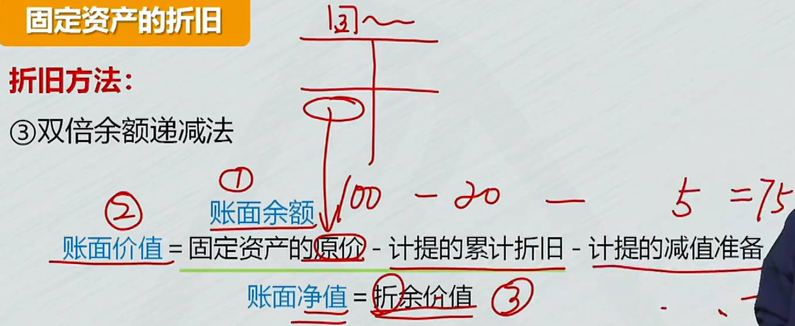 | 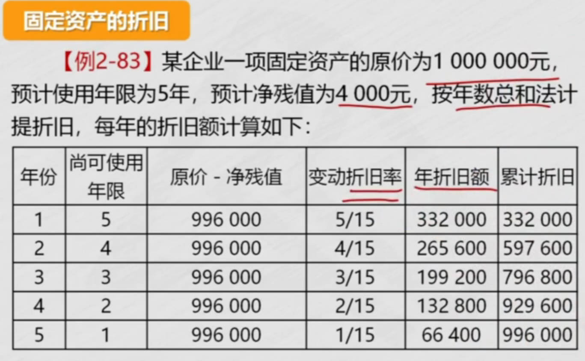 |
| ------------------------------------------------------- | ------------------------------------------------------- |

### 减值

固定资产减值一经确认，以后不得转回

### ==后续支出==

取得固定资产之后，所发生的支出； 例如`更新改造`支出、`日常修理`费用

1. **资本化支出**：计入固资成本
   1. ==更新改造==： 分3步，改造前、改造时、改造后
   2. 改造前
      1. **固资转在建工程**后，不能留固定资产的累计折旧、减值准备在账上，因为固资没了；要冲销掉累计折旧、减值准备
   3. ==改造时== : 2个分录，报废旧的，换上新的
      1. `旧`发动机拿走，账面价值减少，要冲减资产（在建工程）, 借方：报废了，是损失，`营业外支出`
      2. 购入`新`发动机，然后装上，装上类似领用`工程物资`
      3. 更新改造时，发生的==其它资本化支出==
         1. 安装费等， 计入资产成本（在建工程）
   4. 改造后
      1. 完成更新改造后，资产由80变为98
      2. 固定资产入账价值包括
         1. 固定资产转在建工程
         2. 取出旧部件
         3. 新部件成本
         4. 其它资本化支出，例安装费
2. **费用化支出**：计入当期损益
   1. ==日常维修==

| 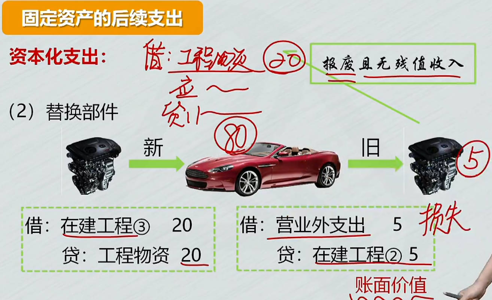 | 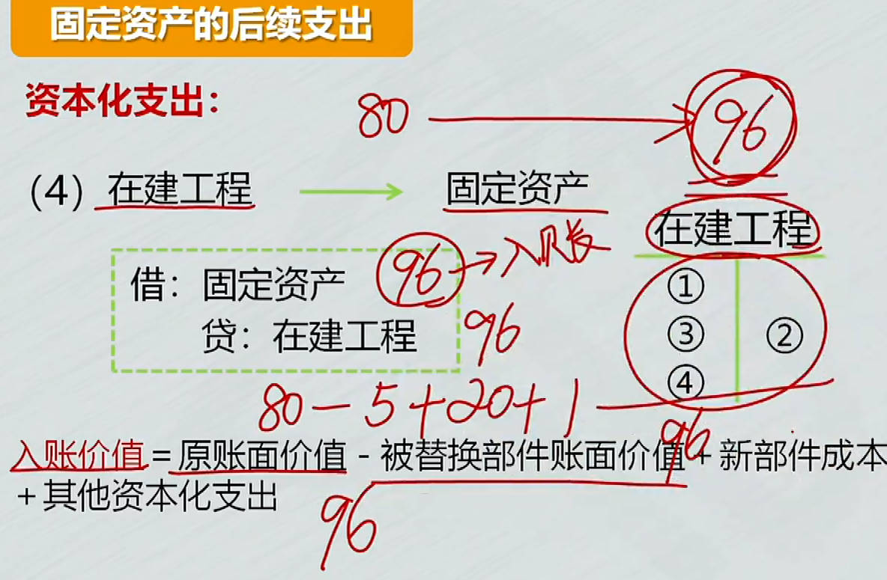 |
| ------------------------------------------------------- | ------------------------------------------------------------ |

### 处置

1. 处置：分3种情况， **出售、报废、毁损**  
   1. 不能像出售产品一样，说卖就卖，要先==清理==，清理后，通过`固定资产清理`科目核算 
      1. ==固资先转清理==，冲销折旧、减值准备
      2. 发生清理费用：也计入 `固定资产清理`
      3. 处置： 出售、报废、毁损
      4. 结转清理损益： 计算净损益
         1. 固定资产清理贷方：利得，清理后不应该有余额，转入`资产处置损益`

**出售**、转让：首先要清理

- 转固资清理科目 => 清理费用 => 出售 => 利得转入`资产处置损益`
- ==结转处置净损益==： 出售时余额转入`资产处置损益`账户, ==借转借==

**报废**：`残料入库`(原材料)

**毁损**：收到残料或赔款       

- 报废毁损： 损失转`营业外支出`，利得转`营业外收入`

| 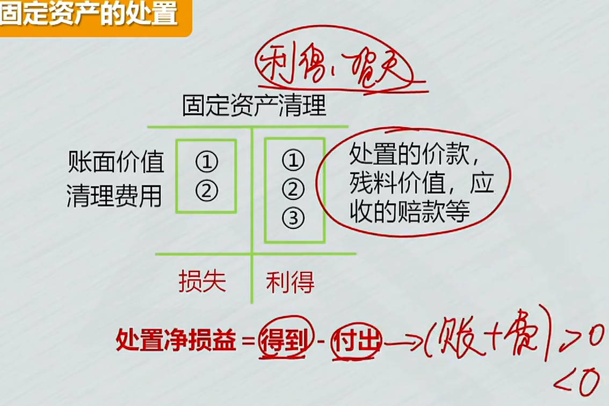 | 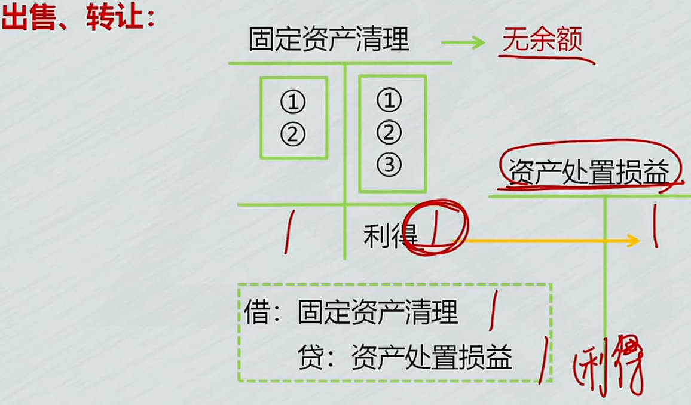 |
| ------------------------------------------------------- | ------------------------------------------------------------ |
| 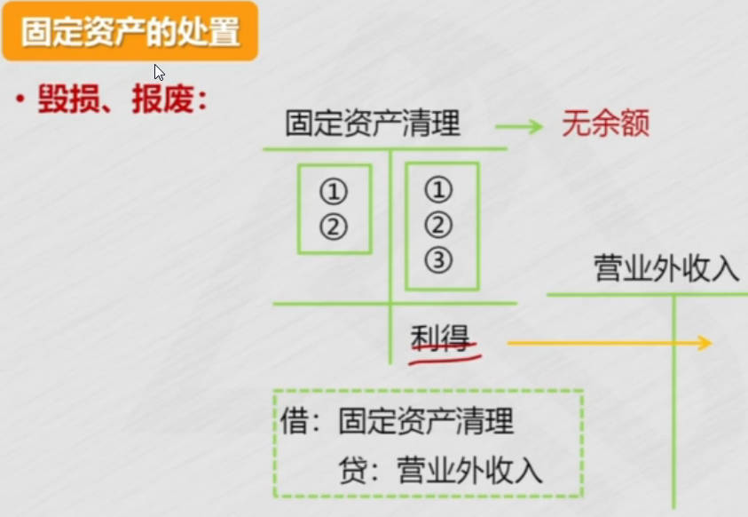 |                                                              |

### 清查

**盘盈**：作为前期差错处理，用`以前年度损益调整`科目，不让影响当前损益。          重置成本：去买一台一模一样设备的价钱。

- 以前年度损益调整转入留存收益，留存收益2个科目，盈余公积10% 
  - 不影响当前损益, 影响期初的利润, 即期初的留存收益， 所以要调整留存收益
  - 以前的利润增加，期初的利润就增加，所以要调的是当期期初的利润，也就是增加期初的==留存收益==
  
- 还有个调整所得税的处理

**盘亏**：通过`待处理财产损益`科目核算; 冲固资、折旧、减值， 进项税转出

- 固资没有了，相关的`折旧、减值`也要冲掉
- 管理不善造成的，要将`进项税转出`
- ==账调完，报批后转销==
  1. 总损失：资产，加白缴的增值税
  2. 能收的赔款，记其他应收款

## 无形资产

### 取得

价、税、费

1. ==外购==: 抵扣的税不记入成本，宣传费计入销售费用
2. ==自行研发==
   1. 研究阶段
      1. 研究阶段支出作为费用，先计入`研发支出-费用化支出`，期末转入`管理费用`
   2. 开发阶段

| 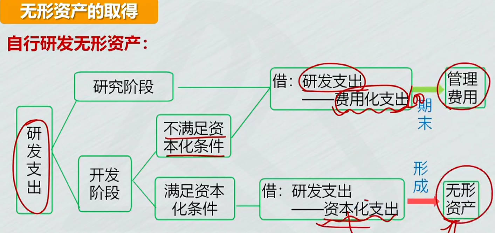 | 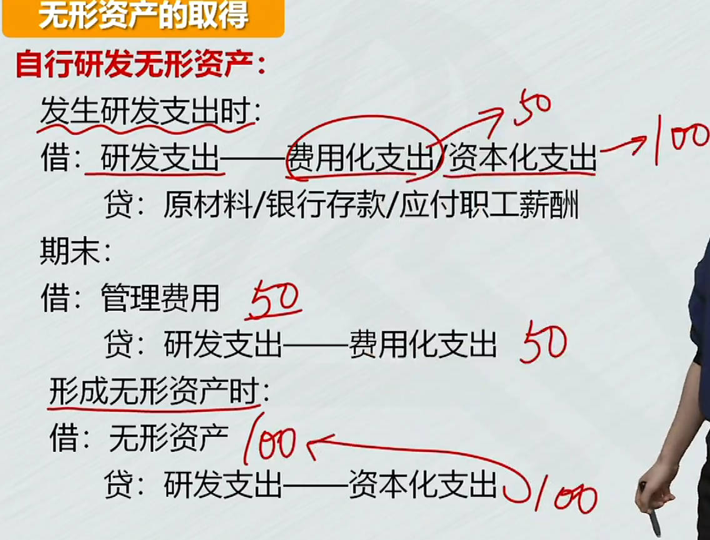 |
| ------------------------------------------------------- | ------------------------------------------------------- |

### 摊销

固定资产计提折旧，无形资产计提摊销

### 减值与处置

**减值**： 账面价值=成本-累摊-减值准备

**处置**：

1. 出售
   1. 要冲销掉无形资产相关的摊销、减值准备
   2. 转销：借贷方差额计入`资产处置损益`，即出售无形资产的净损益
2. 报废处理
   1. 资产对企业没用了，记入损失， `营业外支出`

## 长期待摊费用

- 长摊核算范围：长摊是资产类科目

  - 例：租办公楼进行装修，==能为企业带来更多利益，记入资产==，不是费用
    - 租办公楼装修,期满人家收回，就没有这项资产了，不能直接将这项资产直接减为0，因为是在3年租期收益，要在3年摊销，根据用途计入相应科目
  - 发生==改良时==计入资产
    - 装修支出计入`长期待摊费用`
    - 贷方记发生的支出； 领材料，记原材料
  - 在==受益期==进行摊销
    - 根据用途计入相应科目

| 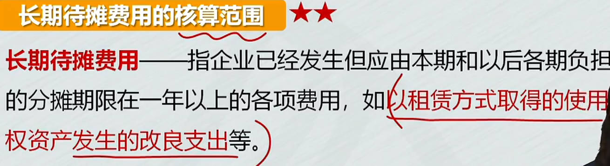 |  |
| ------------------------------------------------------- | ------------------------------------------------------- |

# 负债

## 短期借款

确认==利息==费用:

- 非预提: `支付利息时才确认财务费用`； 每个月末支付利息
- 预提：`应付利息`科目

### 应付账款

现金折扣：鼓励债务人在规定期限内付款，而提供的债务扣除

- 折扣率/付款期限，2/10， 10天内付款享受 `2%`折扣
- 折扣冲减财务费用: 贷：财务费用

### 预收账款

难点

## 应付职工薪酬

**四大类**‌:  短期薪酬、长期薪酬、其他长期职工福利

### 短期薪酬

1. 货币性薪酬
   1. 工资等标准薪酬
   2. 职工福利费
   3. 按国家规定计提标准的职工薪酬
   4. 短期带薪缺勤
2. 非货币性薪酬
   1. 以`自产产品`发放给职工作为福利
   2. 将`外购商品`发放给职工作为福利
   3. 企业将拥有的房屋等`资产`无偿提供给职工使用
   4. 企业`租赁`住房等资产供职工无偿使用

## 应交税费

### 应交增值税

**取得资产、接受劳务或服务**

1. ==购进==货物、加工修理修配劳务、服务、无形资产或不动产
2. 货物等已验收入库，但尚未取得增值税扣税凭证
3. 进项税额转出

**销售等业务**

1. ==销售==货物、加工修理修配劳务、服务、无形资产或不动产
2. 视同销售

**交纳增值税**

1. 交纳`当月应交`增值税
2. 交纳`以前期间未交`增值税

**月末转出多交增值税和未交增值税**

当月==应交增值税==余额，结转到 `未交增值税`

1. 多交借方转借方
2. 少交贷方转贷方

#### 差额征税的账务处理

1. 相关成本费用允许扣减销售额，而减少销项税额
2. 转让金融商品, 按规定以盈亏相抵后的余额作为销售额

### 应交消费税

销售、用于职工福利==计入税金及附加==，委托加工、进口、自产自用直接==计入成本==

### 其他应交税费

哪些计入税金及附加

# 所有者权益

## 实收资本(股本)

重点：股本减少

1. 股份有限公司以外的企业
   1. 出资
      1. 货币出资:  `资本公积-资本溢价`
      1. 非货币资产出资: 视同销售,获得的是实收资本
   1. 追加投资
      1. 投资者追加投资: 原、新投资者
      1. 资本公积转增资本
      1. 盈余公积转增资本
   1. 实收资本减少
1. 股份有限公司
   1. 发行股票
   1. 增资
   1. ==股本减少==
      1. 回购股票
         1. 库存股： 所权减项，类似资产备抵科目，所以库存股增加的方向和所权减少是一个方向。
      1. 注销股本： 股本回购后，对应的股本要注销掉，冲销掉库存股，因为发行股票时，贷方记股本增加
         1. 注销股本3步：冲掉股本、冲掉库存股、借贷方差额处理
         1. 借：股本(面值) 贷：库存股(回购价) ; 不相等，有差额
            1. 回购价高于面值，借方依次冲减资本公积、盈余公积、利润分配-未分配利润;  回购的钱比发行的钱多，亏了
            1. 回购价低于面值，贷方计入`资本公积-股本溢价`

## 资本公积

资本公积： 三个明细科目

1. ==资本溢价==
2. ==股本溢价==
   1. 股票发行费处理: 手续费等用`资本公积-股本溢价`冲减
3. 其他资本公积

## 留存收益

留存收益包括==盈余公积==和==未分配利润==

- 盈余公积：`有规定用途的利润`，可以用盈余公积补利润

### 利润分配

用于盈余公积、发放股利

1. 结转本年利润
   1. 损益类科目余额==期末转入本年利润==
2. 结转实现净利润
   1. 分配利润不用`本年利润`账户核算，用==利润分配==
   2. 本年利润余额，结转到==利润分配==
   3. 利润分配借方：未弥补的亏损
   4. 盈余公积可以补亏损
3. 分配利润
   1. 分配出去的利润
      1. 提取法定盈余公积
      2. 提取任意盈余公积
      3. 向投资者==分配利润或股利==
   2. 计算年末累积的未分配利润
      1. 分配完利润后，最后要结转利润分配除"未分配利润"外其他明细科目余额
      2. 最后算出累积的未分配利润

### 盈余公积

盈余公积用途：有规定用途的利润

1. 盈余公积补亏
2. 盈余公积转增资本(股本)
3. 盈余公积发放现金股利或利润

# 收入费用利润

## 收入

### 在某一时点履行的履约义务

收入： 日常活动中形成的； 利得： 非日常活动中形成的

==收入确认与计量5个步骤==：

1. 识别合同
2. 识别义务
3. 确定交易价格
4. 分摊交易价格
5. 履行各单项履约义务时==确认收入==

**收入账务处理**

1. 商品销售业务：确认收入、结转成本  
   1. 现金结算：借：银存、库存现金等
   2. 委托收款：借：`应收账款`
   3. 商业汇票结算：借：`应收票据`
   4. 赊销：：借：`应收账款`
2. 发出商品业务
   1. 未满足`对价很可能收回`: ==发出商品==科目
   2. ==委托代销==: 借：委托代销商品   贷：委托代销商品款
3. 折扣
   1. 商业折扣： 打折
   2. 现金折扣： 为了让购货方及早付款而提供的债务扣除
4. 材料销售
5. 销售退回
   1. 未确认收入的售出商品发生销售退回
   2. 已确认收入、结转成本
6. 可变对价
   1. ==合同资产==科目： 有条件的债权

### 在某一时段履行的履约义务

在某一时段履行的履约义务==确认收入==的账务处理

1. `履约进度确定`：采用产出指标 或 投入指标
   1. 常见的是按累计实际发生的成本，占预计总成本的比例，确定履约进度
2. 合同成本
   1. 合同取得成本
   2. 合同履约成本(以前的劳务成本)

## 费用

费用分类：日常活动中发生的， 非日常活动发生的-==损失==

1. 营业成本
2. 税金及附加
3. 期间费用

## 利润

利润由2部分构成

- 日常活动形成的收入，减费用

- 非日常活动形成的利润：直接计入当期利润的利得，扣除损失;  利得和损失分为2类：

  - 直接计入当期利润的利得和损失
  - 直接计入所有者权益的利得和损失

  

1. 利润计算：营业利润 => 利润总额 => 净利润
   1. 利润总额：营业利润 + 营业外收入 - 营业外支出
   2. 净利润：利润总额 - 所得税费用
2. 营业外收支
3. 所得税费用、本年利润

### 所得税

$\color{red}\Large所得税费用=当期应交所得税+递延所得税$

递延所得税：包括递延所得税`资产`、递延所得税`负债`  

1. 负债-资产
2. (期末负债-期初负债) - (期末资产-期初资产)

# 财务报告
