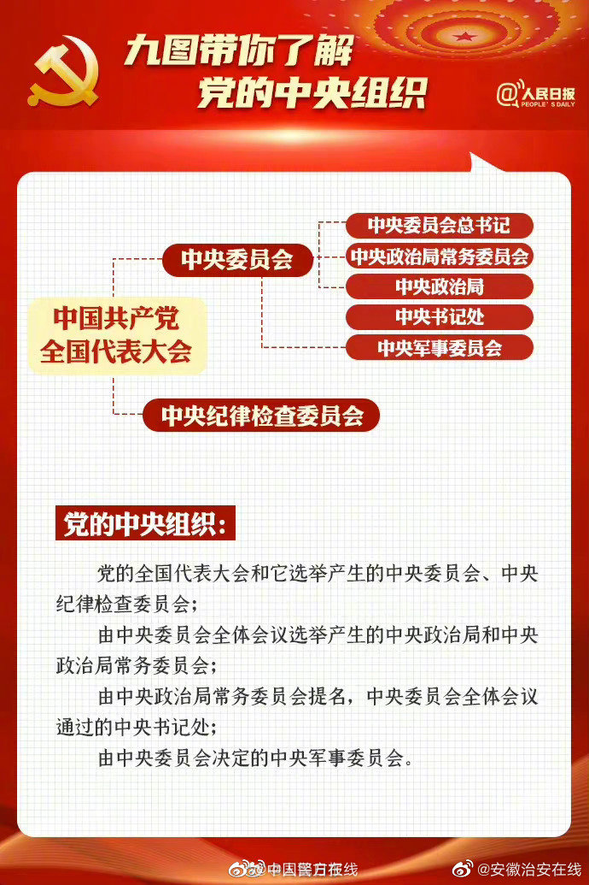

>- 法的渊源
>- 法律事实
> - 法律关系
>- 法律责任

# 1、法律基础

[2022 初级会计师 经济法基础 侯永斌- YouTube](https://www.youtube.com/watch?v=FbSH7795IDA&list=PL7OHlWPKg-a3kcVp7ddkhM2JZrvf65Jzz)	

找法律：[找法网](https://china.findlaw.cn/fagui/list_a230200/) [美国常用的法律政策](https://zhuanlan.zhihu.com/p/485306880) [美国三大自卫法律原则-退坚城](https://baijiahao.baidu.com/s?id=1732067025321386892&wfr=spider&for=pc)

学法律：[法律事实](https://baijiahao.baidu.com/s?id=1670644304894396978&wfr=spider&for=pc)  [从旧兼从轻原则](https://www.zhihu.com/question/304501341/answer/544609511) 

行政机关：[国务院组织机构](https://ru.hujiang.com/new/p1373268/) [国务院](http://www.gov.cn/guowuyuan/index.htm) [国务院组织机构](http://www.gov.cn/guowuyuan/zuzhi.htm)  [行政区划](http://www.gov.cn/guoqing/2005-09/13/content_5043917.htm)  [政治局7常委](https://baike.baidu.com/item/中国共产党中央委员会政治局常务委员会委员/55522778?fromtitle=中共中央政治局常委&fromid=55560631&fr=aladdin)  [七常委](https://www.voacantonese.com/a/a-look-at-the-7-men-slated-to-lead-china-s-communist-party-20221023/6801996.html?utm_source=dlvr.it&utm_medium=twitter)  [政治局24委员 ](https://baike.baidu.com/item/中国共产党中央委员会政治局/55570571?fromtitle=中央政治局&fromid=176901&fr=aladdin)  [中央办公厅](https://zhuanlan.zhihu.com/p/414233733)  [国务院副总理](https://baike.baidu.com/item/中华人民共和国国务院副总理/1210471?fr=aladdin)  [国务委员](https://baike.baidu.com/item/中华人民共和国国务委员/4830431?fromtitle=国务委员&fromid=6095454&fr=aladdin) [秘书长-办公室主任](https://baijiahao.baidu.com/s?id=1684558656567110858&wfr=spider&for=pc) [秘书](https://m.iask.sina.com.cn/b/3244310.html)  

1厅、26部、2办事(国研室)、16部委管理的国家局；1直特(国资委)、10直机【***1262 16110***】【9直事：华、科、社科、气、工，证监、银保监、央广台、发展研究中心，国家行政学院与中央党校，一个机构两块牌子，作为党中央直属事业单位。】 【10直机：关、税、市场、医保局、体、统计、广电；参事室、机关事务局、国际发展署】【港澳事务办公室、国务院研究室】    

34个省级行政区，包括23个省、5个自治区、4个直辖市、2个特别行政区。

工程：[特高压](https://baijiahao.baidu.com/s?id=1736253788111922342&wfr=spider&for=pc)  [国网33条特高压工程](https://www.in-en.com/article/html/energy-2288444.shtml) 

官场：[二十大代表名单2296](http://www.ce.cn/xwzx/gnsz/szyw/202209/25/t20220925_38126370.shtml)  [中央委员会委员205](http://www.scopsr.gov.cn/zlzx/ddh/ddh20/20ddh/202211/t20221115_385523.html)  [中央委员会候补委员171](http://www.scopsr.gov.cn/zlzx/ddh/ddh20/20ddh/202211/t20221115_385522.html)   [中纪委委员133](http://www.scopsr.gov.cn/zlzx/ddh/ddh20/20ddh/202211/t20221115_385521.html)  [政治局7常委24委员](http://cpc.people.com.cn/GB/64162/394696/index.html) [中央直属机构人物库](http://www.ce.cn/ztpd/xwzt/zyzsjgrwk/)     [部委人物库](http://www.ce.cn/ztpd/xwzt/rwk/index.shtml)       [31省四套班子一把手](http://district.ce.cn/zt/rwk/rw/rspd/201302/17/t20130217_766061.shtml?ivk_sa=1025883i)  [地方党政领导](http://district.ce.cn/zt/rwk/)      [31位政法委书记](http://district.ce.cn/newarea/sddy/201708/23/t20170823_25260258.shtml)  [31省重要职位人事盘点](http://district.ce.cn/zt/rwk/rw/rspd/201304/11/t20130411_768532.shtml)     [2012年205中央委员现任职务](https://news.sina.com.cn/z/zywy2012/)   

参考网站：[中国共产党新闻网](http://cpc.people.com.cn/)  [中国政要](http://cpc.people.com.cn/GB/64162/394696/index.html)   [20大新闻中心](http://20th.cpcnews.cn/n101/2022/1023/c98-853.html)  [四套班子排序](https://baijiahao.baidu.com/s?id=1672503881636463638&wfr=spider&for=pc)

中国机构：[中国8大机构](http://www.scopsr.gov.cn/zlzx/jggk/)   [历次党代会及全会](http://www.scopsr.gov.cn/zlzx/ddh/)  [历次国务院改革](http://www.scopsr.gov.cn/zlzx/jgyg/)      [公安、法院、检察院的关系-公检法](https://mp.weixin.qq.com/s?__biz=MzIzMzA5MTkwOQ==&mid=404539273&idx=1&sn=4301aa07f72ba641bc6c95fd76efeaf8&chksm=756281a3421508b5edd760880e15a8c3cdb37e692a724cb7d2646c6530e96dac829e104426bb&scene=27)  [审判机关](https://baike.baidu.com/item/审判机关?fromModule=lemma_inlink)

> 1. [国务院机构](http://www.scopsr.gov.cn/zlzx/jggk/gwyjg/) [党中央机构](http://www.scopsr.gov.cn/zlzx/jggk/201901/t20190118_359604.html) [全国人大机构](http://www.scopsr.gov.cn/zlzx/jggk/201901/t20190118_359603.html) [全国政协机构](http://www.scopsr.gov.cn/zlzx/jggk/201901/t20190118_359602.html) [最高人民法院](http://www.scopsr.gov.cn/zlzx/jggk/201901/t20190118_359601.html) [最高人民检察院](http://www.scopsr.gov.cn/zlzx/jggk/201901/t20190118_359600.html) [社会团体](http://www.scopsr.gov.cn/zlzx/jggk/201901/t20190118_359599.html) [民主党派](http://www.scopsr.gov.cn/zlzx/jggk/201901/t20190118_359598.html)
>    1. 部委人物库： 1262 16110 9
>    2. 中直人物库：党中央各部门、 党中央直属事业单位
>    3. 地方人物库

|  |  |
| ------------------------------------------------------------ | ------------------------------------------------------------ |

==党的会议、人大会议、政协会议==：  [几届全国人大几次会议](https://zhuanlan.zhihu.com/p/401524136)  [中国的几类重大会议](https://zhuanlan.zhihu.com/p/429659830)   [全国人民代表大会共开了几届](https://www.baidu.com/s?ie=UTF-8&wd=全国人民代表大会共开了几届)

> 1. 党代会：5年一次，2022.10.16，中央委员会召集，选举中央委员会、中央纪律检查委员会(中纪委)
> 2. 中央委员会全体会议：中央政治局召集，至少1次/年，5年内一般举行7次；==几届几中全会==；全会选出中央政治局、中央政治局常务委员会(中央*军委*)，常务：主持日常工作；
> 3. 中央书记处：中央政治局常务委员会(***中央政治局常委会***)提名，全会通过对中央书记处(**办事机构**)； 全会决定的中央军事委员会。
> 4. 党章：2022年10月22日，[中国共产党第二十次全国代表大会](https://baike.baidu.com/item/中国共产党第二十次全国代表大会/59177990?fromModule=lemma_inlink)通过了关于《中国共产党章程（修正案）》的决议
> 5. **中央全会：俗称“X届X中全会**”：刚召开完“X大”，就对应“X届”。从“X届一中全会”开至“X届七中全会”，5年内开完7次会议。
> 6. **全国人大：俗称“X届全国人大X次会议**”：每年召开；全国人大会议周期自定，目前已到十三届，X次代表5年周期中的第几年。 
>    1. 全国人大常委会会议一般每两个月举行一次
> 7. 两会指： 每年的全国人大和全国政协会议

## 法的分类和渊源

7种渊源：宪法、法律、法规、规章、特别行政区法、国际条约和惯例、司法解释

1. ==法的本质与特征==

   1. 本质：法是统治阶级`国家意志`的体现
   2. 法的特征：国家意志性、强制性、规范性、明确公开性和普遍约束性
      1. 规范性：规范人们在社会关系中的`权利和义务`

2. ==法的分类和渊源==： 各级制定的法律、法规等，比较

   1. 我国法的渊源：法的形式，法律的来源，也就是法律文件； `上位法优于下位法`

      1. 三权分立(权力、行政、司法机关)。我国司法权隶属立法权。政府向人大负责制

      2. 7种渊源：宪法、法律、法规、规章、特别行政区法、国际条约和惯例、司法解释

         > 地方人大及常：地方性`法规`，法规以条例结尾。 		     xx地方xx条例
         > 国务院：行政法规，高于地方性法规。			           xx条例
         > 国务院各部门：`部门规章`，不带地名、`不是法、不是法规`	   xx办法、xx准则等
         > 地方各级政府：地方政府规章，带地名、不是法、不是法规。	 xx地方xx办法等
         > 我国是大陆法系，成文法，不是判例法。

   2. `法的生效(范围)`：法从什么时间生效

      1. 时间效力
         1. 对该法实施以前的事件和行为有无溯及力：从旧兼从轻； 
      2. 空间效力：域内（全国/局部适用）、域外效力、
      3. 对人的效力：法的适用主体
         1. 属人原则：凡本国人
         2. 属地原则：凡本国管辖范围内
         3. 保护原则：凡损害本国利益

   3. `法的效力等级及其适用规则`：法律冲突时，按谁执行

      1. 特别法优于一般法：特别法有规定按特别法，没规定按一般法
      2. 新法优于旧法
      3. 新的一般规定、旧的特殊规定：19赵 vs 91泰森；找裁判，一般是制定机关。
         1. 部门规章、地方性法规：不是同一机关制定，没共同上级机关，2家小孩打架，2个爹一起来，认为别人孩子对，就用别人的；觉得自己对，要提请全国人大常委会裁定。

   4. `法的分类`：内三小子根本太普通(内容开头，3个标准)； 祖国(祖就是主体)

3. ==法律部门==

   1. 七大法律部门：  相宪、劳社经民行、诉程刑 【象限和老舍经过民行】  宪法及相关法、劳动法社会法

4. ==法律事实==：引起法律关系（变化）发生、变更和消灭的直接原因； 分类标准：是否以当事人的意志为转移。 自然、社会现象； 

   1. 法律行为：合法、积极、表意、单方、要式、自主/代理     
   2. 法律事件：法律事实可以是自然现象，也可以是人的活动，前者是指法律事件，即与个人意志无关的客观现象；后者是指人（自然人与法人）的有意识的活动。并不是所有的自然现象和人的活动都可以成为法律事实。比如，刮风、下雨等自然现象；散步、看书等人类活动都不是法律事实，
      1. 自然现象：例如地震造成人身财产伤害，有保险关系有赔偿
      2. 社会现象

5. ==法律关系==

   1. 主体：法律关系中享有权利和承担义务的当事人
   2. 内容：法律关系的主体所`享有的权利和承担的义务`。 权利：作出
   3. 客体：双方权利和义务指向的对象。 借车：车就是客体

|  |  |
| ------------------------------------------------------------ | ------------------------------------------------------------ |
|  |  |
|  |  |

### 生效范围

|  |  |
| ------------------------------------------------------------ | ------------------------------------------------------------ |
|  |  |
|  |  |

### 适用效力

|  |  |
| ------------------------------------------------------------ | ------------------------------------------------------------ |

### 分类

|  |  |
| ------------------------------------------------------------ | ------------------------------------------------------------ |
## 法律部门

**7大法律部门**: 相宪、劳社经行民、诉程刑     【象限和老舍经过民行】  宪法及相关法、劳动法社会法

1. 宪法相关法：直接保障宪法实施、国家政权运作的法律规范总称。
2. 民商法：
   1. 民法：调整"平等主体" 之间的人身、财产关系
   2. 商法：调整"平等主体" 之间的商事关系； <保险法>调整的是商业保险
3. 行政法：不平等，行政机关、行政管理相对人
   1. 纵向管理关系
4. 经济法：国家干预、调控市场经济活动，所产生的社会经济关系；两反一保，财、税、金、贸(对外)
   1. 调整纵向经济管理关系，`管理和被管理`的经济关系； 
5. 刑法：规范犯罪、刑事责任和刑罚，的法律规范的总称
6. 诉讼与非诉讼程序法
   1. 诉讼：通过人民法院解决纠纷
   2. 非诉讼：不通过法院，其他渠道

|  |  |
| ------------------------------------------------------------ | ------------------------------------------------------------ |
|  |  |
|  |  |
|  |  |

## ==法律事实==

根据是否以当事人的意志为转移，分2种

1. 法律事件
2. 法律行为

### 法律事件

不以人的意志为转移, 分为绝对、相对事件

1. 自然现象3类，自然灾害、生老病死、意外 ； 例如地震造成人身财产伤害，有保险关系有赔偿
2. 社会现象: 战争

### 法律行为

以人的意志为转移，人能控制

1. 意思表示：意思，内心的想法；表示,表达出来。 通过意思表示，行为才能成立
   1. `非表意行为`： 只要事实发生，行为就成立。民法典规定：非意思表示行为不属于法律行为，初级不细究。
2. 要式：必要的形式、格式。例：票据，法律规定必须要写的，不写导致票据无效。

|  |  |
| ------------------------------------------------------------ | ------------------------------------------------------------ |
|  |                                                         |

## ==法律关系==三要素

1. 主体：法律关系中`享有权利和承担义务的当事人`；    <自然人、法人、非法人组织、国家>
2. 内容：法律关系的`主体所享有的权利和承担的义务`。 权利：作出
3. 客体：`双方权利和义务指向的对象`。 借车：车就是客体；   ==人物智为虚财==  (记忆：人有智力、行为)
   1. 物
   2. 人身、人格
   3. 智力成果：知识产权、作品、专利、商标等
   4. 信息、数据、网络虚拟财产
   5. 行为：行为作为客体存在，主要产生于合同关系，买卖合同的客体是给付行为。

### 客体

|  |  |
| ------------------------------------------------------------ | ------------------------------------------------------------ |
|  |  |

# 2、法律主体

[全民所有制企业](https://baike.baidu.com/item/全民所有制企业/7622149?fr=aladdin)  [股份有限公司](https://baike.baidu.com/item/股份有限公司/575558?fromModule=lemma_inlink) [基金会为什么要组建理事会](https://zhuanlan.zhihu.com/p/164726622)  

[什么是基金？](https://www.64365.com/zs/906112.aspx)	 [基金会的组织机构](https://www.mca.gov.cn/n155/n181/n499/n528/n551/c3765/content.html)	

[中华人民共和国公司法-百科](https://baike.baidu.com/item/中华人民共和国公司法/1755997?fromModule=lemma_inlink#reference-[7]-97338-wrap)  [中华人民共和国公司法](http://www.npc.gov.cn/npc/c12435/201811/68a85058b4c843d1a938420a77da14b4.shtml)  [中华人民共和国公司法 - 国家法律法规数据库 (npc.gov.cn)](https://flk.npc.gov.cn/detail2.html?ZmY4MDgwODE2ZjEzNWY0NjAxNmYxY2M5OGFkODExMzQ%3D)  [中华人民共和国公司法](http://zwfw-new.hunan.gov.cn/hnvirtualhall/zcwj/detailnew.jsp?laws_id=85b77550-c8b0-4dae-8bc7-978ab236895a)  [主席令](https://baike.baidu.com/item/中华人民共和国主席令/5279243?fromtitle=主席令&fromid=11192221&fr=aladdin)  [中华人民共和国行政处罚法](https://baike.baidu.com/item/中华人民共和国行政处罚法/2902771?fromModule=lemma_inlink#reference-[6]-5080095-wrap)  [治安管理处罚法](https://baike.baidu.com/item/中华人民共和国治安管理处罚条例?fromModule=lemma_inlink) [行政法](https://baike.baidu.com/item/行政法/496?fr=aladdin)   [刑法](https://baike.baidu.com/item/刑法/301706?fr=aladdin)

主体：`自然人、法人、非法人组织、国家`

1. **自然人**：
   1. 包括范围：中国公民、外国公民、无国籍人
   2. 出生死亡时间
   3. 住所：一般情况：户口本身份证记载的居所；   特殊情况：经常居所为住所
2. **法人**：==具有民事权利能力和民事行为能力，依法‘独立’享有民事权利和承担民事义务的组织==
   1. 法人分支机构：这里讲的是总分公司，非独立；  而母子公司都是法人
   2. 法人分类：`营利、非营利、特别法人`
      1. 营利：==能分配利润==；  全民所有制企业只是国有企业的一种 ； 分公司制、非公司制；  自主经营、自负盈亏、独立核算； 
         1. 公司制 
            1. 有限责任公司：简称有限公司；包括[国有独资公司](https://baike.baidu.com/item/国有独资公司/2339103?fromModule=lemma_inlink)以及其他有限责任公司； ==公司股东的责任有限==
            2. 股份有限公司：决策、执行、监督机构
         2. 非公司制
      2. 非营利法人：==不能分配利润==； 科教文卫体；==专注社会服务功能==。  事业、社会团体、捐助法人/宗教活动场所
         1. 理事会：基金会资产属于社会公共资产，在治理实践中，“社会”这个特殊的、不特定的主体不可能为基金会选定一个决策机构，所以，在治理中，基金会的所有者是缺席的。基金会的决策机构是理事会，监督机构是监事（会），秘书长领导下的秘书处是执行机构。
      3. 特别法人：==专注社会管理功能==。  机关法人、基层群众性-自治-组织法人、农村集体经济、合作经济法人
   3. 法人和法定代表人
      1. 法定代表人：代表法人从事民事活动的负责人
      2. 善意相对人： 不知情
   4. `法人设立以及设立阶段责任承担`
      1. 意思机关(股东会)、执行机关(董事会)、监督机关(监事会)、代表机关(法定代表人)
      2. 法人未成立，设立阶段责任承担：设立人承担，设立人2人以上，连带责任；  设立人以自己名义：法人或设立人承担
   5. 法人`合并分立、解散`
      1. 合并：义务由合并后的法人继承
      2. 分立：分立后的法人承担连带责任； 但是债权人和债务人另有约定的除外
      3. 解散
         1. 法人解散情形：4种； 法人章程规定、股东会决议、合并分立需要、被吊销营业执照责令关闭
         2. 保险公司解散： 经"国务院保险监督管理机构批准，银保监会"。   经营有人寿保险业务的保险公司除分立、合并与依法撤销外，不得解散。
   6. `法人清算`：解散前要清算。非营利组织理事会；
      1. ==主管机关或利害关系人==可以申请人民法院，指定有关人员组成清算组
      2. 清算后剩余财产：清算需要的费用；债务还完后剩的才是剩余财产，股东分。
         1. 剩余财产：费用->职工->税->债务
   7. `法人终止`：要注销登记，破产清算
      1. 需要登记的，清算结束并完成法人注销登记时，法人终止
      2. 不需要登记的，清算结束时，法人终止
      3. 被宣告破产的，依法进行破产清算并完成法人注销登记时，法人终止
         1. 破产清算和一般的清算，规定不一样
3. **非法人组织**
4. **国家**

## 法律主体的分类

|  |  |
| ------------------------------------------------------------ | ------------------------------------------------------------ |
|  |  |
|  |  |
|  |  |
|  |  |
|  |  |
|  |  |
|  |                                                              |
### 营利性法人、非法人组织

[非法人组织 - MBA智库百科](https://wiki.mbalib.com/wiki/非法人组织)

1. **营利性法人**
   1. 成立：营业执照==签发日期==为公司成立日期
   2. 组织机构：
      1. 董事会：只能决定代表股东利益的成员，代表职工利益的由职工代表大会选出。小公司可不设董事会，设1名执行董事；
   3. 法定代表人：按公司章程规定，由董事长、执行董事或经理担任
   4. 出资人(股东)
      1. ==滥用股东权利==：损害`内部利益`：大股东利用关联交易转移利润； `赔偿`
      2. ==滥用股东有限责任，和法人独立地位==逃避债务：转移财产，债权人，损害`外部利益`，否定公司有限责任，否定公司法人人格，承担`连带`责任。
   5. ==关联交易==
   6. 决议可撤销：3种：==决议无效、可撤销、不成立==。内容违法是无效的。其他都是可撤销。
      1. 会议‘召集程序、表决方式’违法违章可撤销； 决议内容违章可撤销
2. **非法人组织**：`个人独资、合伙企业`、不具有法人资格的专业服务机构
   1. 合伙企业：分普通(一般、特殊)、有限合伙企业; 各合伙人承担无限连带责任
   1. 非法人组织代表：一人或数人

|  |  |
| ------------------------------------------------------------ | ------------------------------------------------------------ |
|  |  |
|  |                                                              |

## 法律主体的资格

是不是所有自然人都能成为法律关系的主体？分为有没有成为法律主体的==权利==，或有没有成为法律主体的==能力==？

==法律主体资格==：包括权利能力和行为能力两个方面

1. 有没有成为法律主体的权利  和 有没有成为法律主体的能力。  【在特定的法律关系里,行使权利和承担义务的资格】
2. 权利能力：法律赋予的`资格`。
3. 行为能力：法律主体通`过自己的行为`取得。5岁小孩拿房子换猫。无民事行为能力

### 权利能力

### 行为能力

1. **自然人的权利、行为能力**
   1. 权利能力：始于出生，终于死亡；  民法典延伸了，胎儿，死者名誉权保护
   2. `行为能力`：
      1. 民事行为能力
         1. 不满8周岁==无民事行为能力==,  x<8、8≤x<18,8周岁以上不满18周岁==限制==、≥18==完全民事行为能力==人，16+自立视为完全，【以上、以下、年满包含本数，超过不满不含本数。】 < 无、限制、完全>      
            1. 无民事行为能力人：不满8周岁，$\Large\color{Green}{x}<8$
            2. 限制民事行为能力人：8以上不满18，$\Large\color{Green}8\le{x}<18$
            3. 完全民事行为能力人：年满18，$\Large\color{Green}{x}\ge18 或 16\le{x}<18$；  
         2. $\color{blue}\Large民事责任临界点： 8、16、18 ； 刑事责任临界点：12、14、16$
         3. 年龄+智力、精神健康
         4. `民事行为效力`
            1. 完全民事行为能力人，独立实施的一切法律行为都是==有效的==，要付责任
      2. `刑事责任能力`
         1. 年满12不满14；   年满14不满16；  年满16
            1. 年满12周岁(2种例外，故意杀人故意伤害，最高检核准追诉)、年满14周岁(8种重大刑事案件:抢劫强奸、投毒贩毒、放火爆炸、故杀、故伤致人重伤或死亡)、16
         2. 从轻、减轻、免除处罚
            1. 从轻：判3-7年，按最低3；  减轻：按2年，比最低还低
            2. 聋哑盲：从轻、减轻、免除处罚
2. **法人的权利、行为能力**：始于成立、终于终止

|  |  |
| ------------------------------------------------------------ | ------------------------------------------------------------ |
|  |  |
|  |  |
|  |  |

# 3、法律责任
## 民事责任
## 行政责任(处罚处分)
## 刑事责任
法律责任：`民事、刑事、行政责任`

1. 民事责任：从==惩罚性==上判定；支付==违约金==
2. 行政责任
   1. 行政处罚：针对违法的行政管理相对人；声誉、财产(==罚款==)、行为、人身罚(行政拘留)    行人誉财
   2. 行政处分：国家机关工作人员
3. 刑事责任
   1. 主刑：只能独立适用(只能判一个)
      1. 管制323[社区管制、不关起来，做什么事要去社区报告]、拘役161、有期615、无期、死刑(缓期2年)
   2. 附加刑(4种)：可同主刑(5种）一起，也可单独适用，可多个
      1. ==罚金==、剥夺政治权利(说话和当官权利)、没收财产、驱逐出境

|  |  |
| ------------------------------------------------------------ | ------------------------------------------------------------ |
|  |  |
|  |                                                              |

