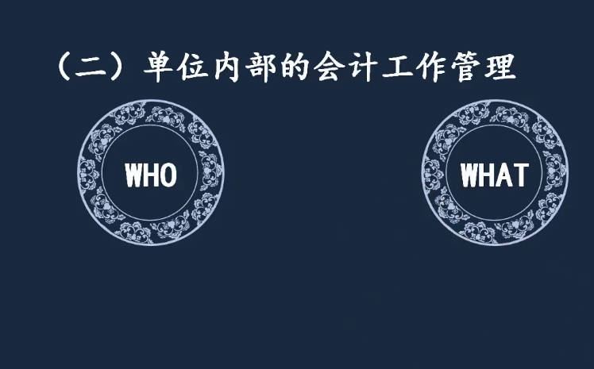
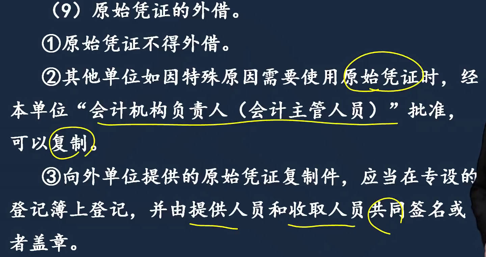
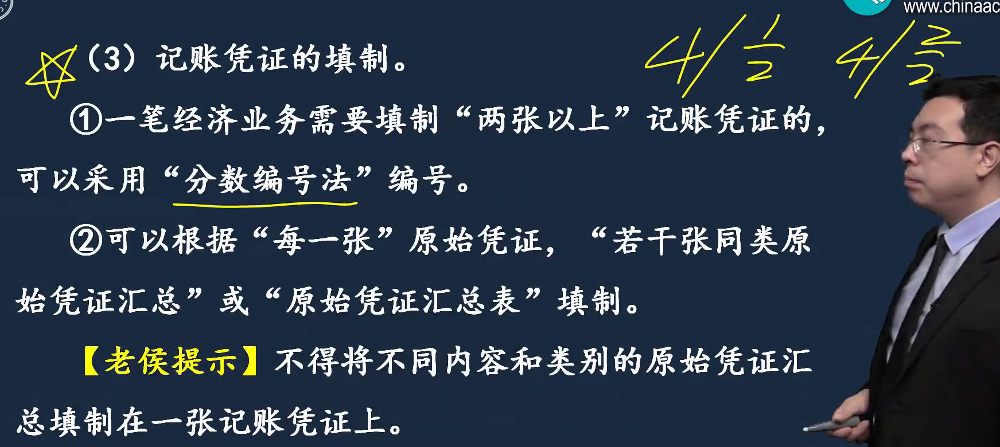
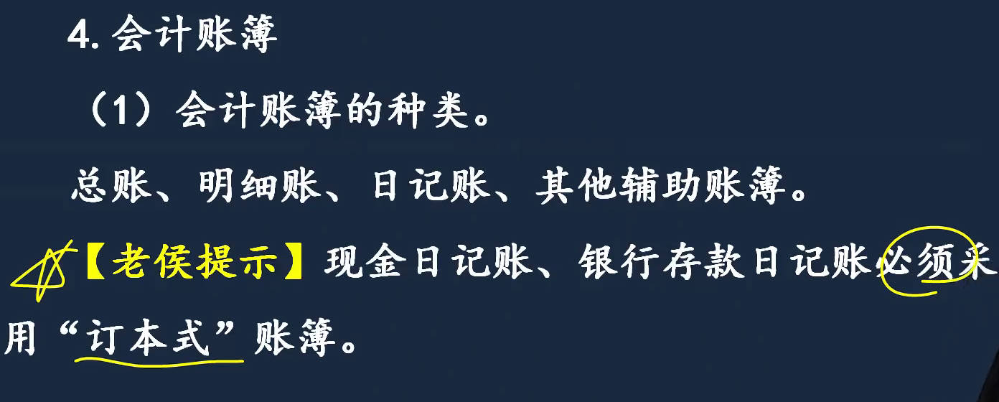
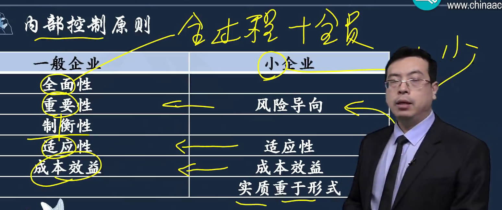
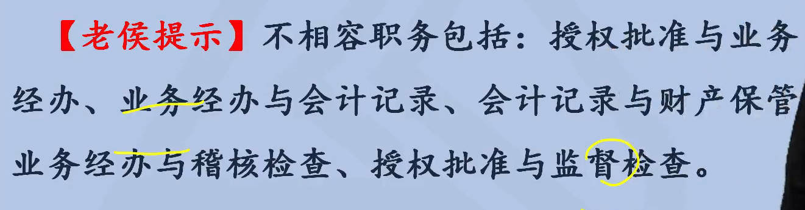
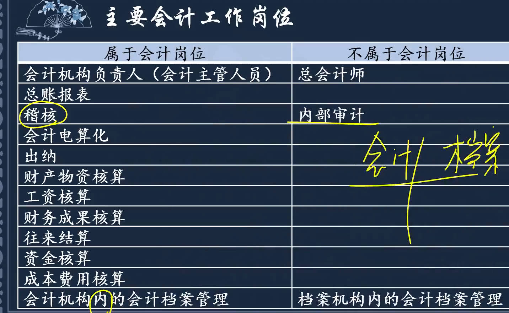
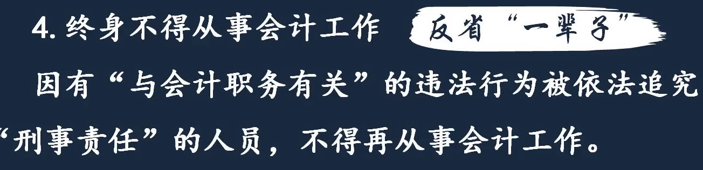
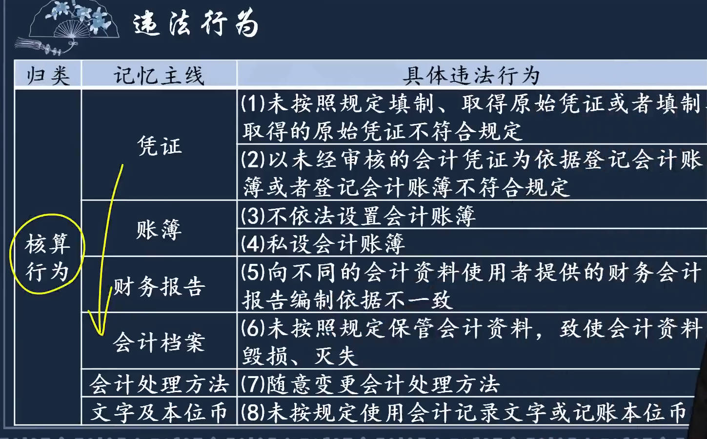

# 1、会计法律制度概述

[中华人民共和国会计法](http://jdjc.mof.gov.cn/ckjd/202111/t20211112_3765255.htm)  [会计法](https://baike.baidu.com/item/会计法/2112?fr=aladdin) [企业财务会计报告条例_行政法规库](http://www.gov.cn/zhengce/2020-12/26/content_5574371.htm)  [部级事业单位](https://zhuanlan.zhihu.com/p/151855610?utm_source=wechat_session)

> 1. 会计法：2017年11.4日，12届人大常委会30次会议，第二次修正的《[中华人民共和国会计法](https://baike.baidu.com/item/中华人民共和国会计法/1518695?fromModule=lemma_inlink)》，《关于修改〈中华人民共和国会计法〉等十一部法律的决定》第二次修正），
>    1. 分为总则，企业会计核算，公司、企业会计核算的特别规定，[会计监督](https://baike.baidu.com/item/会计监督/9277629?fromModule=lemma_inlink)，[会计机构](https://baike.baidu.com/item/会计机构/9277686?fromModule=lemma_inlink)和[会计人员](https://baike.baidu.com/item/会计人员/9277528?fromModule=lemma_inlink)，法律责任、附则等7章
>    2. 中国还制定有《[中华人民共和国注册会计师法](https://baike.baidu.com/item/中华人民共和国注册会计师法/5026866?fromModule=lemma_inlink)》《[总会计师条例](https://baike.baidu.com/item/总会计师条例/3928388?fromModule=lemma_inlink)》《企业会计准则》等法律、法规。

1. 熟悉与会计相关的法律制度
2. 会计法律制度：国家权力机关和行政机关制定，调整"会计关系"的法律文件的总称
3. 概述
   1. 会计关系
      1. 内容：宏观上/微观上
      1. 主体：会计机构/会计人员
      1. 客体：会计工作相关的具体事务
   1. 会计法：会计核算、监督、会计机构/人员、会计工作管理

```ts
/*
国家档案局与中央档案馆、国家保密局与中央保密委员会办公室、国家密码管理局与中央密码工作领导小组办公室，一个机构两块牌子，列入中共中央直属机关的下属机构序列。
1993年3月国务院机构改革决定，国家档案局与中央档案馆，一个机构两块牌子; 为党中央和国务院直属机构、副部级单位，由中央办公厅管理。
*/
```

- **会计法律制度概念和适用范围**
  - **会计法律制度概念**
  - **会计关系**
  - **会计法律制度的主要内容**
  - **国家统一的会计制度**
    - <会计法>是指导会计工作最高准则，只规范大方向，细则由其它会计法律完善 

|  |  |
| ------------------------------------------------------------ | ------------------------------------------------------------ |
|  |  |
|  |  |

# 2、会计==核算==

[管理会计学](https://cnpub.com.cn/search.html#/detail?bookSeriesNum=0&from=1&type=xsm&id=piuc4hpk4726fwpr2dt275juyzenb2qmkq5x6vp6bx6vsq7rdbicgj3brg66ip53jutvhfcvotszq)  [成本会计学](https://cnpub.com.cn/search.html#/detail?bookSeriesNum=0&from=1&type=xsm&id=xy7hcuye6pd5prsqe5bz4ke3q7dgnzl6htgbo5utzt7rdmazrlusgj3brg66ip533ztjswfzb6hnk)   [预算会计](https://cnpub.com.cn/search.html#/detail?bookSeriesNum=0&from=1&type=xsm&id=ua4h4yeo3bjj3zaaicgpkueinfg5oube6i73bp6wopjdmzyu5h6sgj3brg66ip53hen4i7irrneui)  

## 会计工作管理

[退货证明应有销货方还是购货方开具](https://www.taxhu.com/index.php?m=article&f=view&id=138649)

会计工作管理体制

1. 会计工作主管部门
   1. 统一领导，分级管理：财政部主管全国会计工作， 以上以下、以内，包括本数
2. 单位内部的会计工作管理
   1. 单位负责人。它的责任不能免除办理具体事务的会计人员的责任。对本单位会计工作和会计资料的"真实性、完整性"负责。

|  |  |
| ------------------------------------------------------------ | ------------------------------------------------------------ |
|  |  |
|  |                                                              |

## 会计核算

1. <span style="color:red">会计核算：6大要求、核算内容、凭簿报、会计信息处理流程(会计档案)</span>
   1. 会计核算`基本要求`：<span style="color:red">发饰真处自己</span>
      1. 依法建账
      2. 根据"实际发生"的经济业务进行会计核算
      3. 保证会计资料的真实和完整<span style="color:red">(是会计资料"最基本"的质量要求)</span>
         1. 伪造：无中生有；变造：篡改事实，改变歪曲
      4. 正确采用会计处理方法
      5. 正确使用会计记录文字：民族自治、外商会计记录"同时使用" (双语)
      6. 使用计算机进行会计核算必须符合法律规定
   2. 会计核算的主要内容
      1. 对应会计要素去记;  <span style="color:red">财物、款项、债权；    债务；   资本、基金；   收支费成；  财务成果 </span>
   3. 会计年度：1.1 - 12.31
   4. 记账本位币：方便原则，外币为主的：日常用外币为记账本位币，编财务报告：折算为rmb
   5. **会计凭证**
      1. ==会计账簿==
      2. ==财务会计报告==
2. 会计档案管理

|  |  |
| ------------------------------------------------------------ | ------------------------------------------------------------ |
|  |  |
|  |  |
|  |  |
|  |  |
|  |  |

### 会计凭证

验收证明：[货物验收单](https://www.renrendoc.com/paper/222589420.html)	 [家具验收报告](https://www.renrendoc.com/paper/217550102.html)	[货物验收单](https://www.renrendoc.com/paper/257157926.html) [物资采购到货验收单](https://www.renrendoc.com/paper/236408494.html) [物资入库单](https://www.renrendoc.com/paper/228227082.html)			

收款证明：[个人收款证明](https://www.renrendoc.com/paper/88064829.html)	 [公司收款证明](https://www.renrendoc.com/paper/293069842.html) 	

接上：**会计凭证**

1. 关于依据：帐薄以经过"审核"的会计凭证为依据编制
2. 原始凭证：开具(证明)、审核(假缺)、更正、外借(复制)、遗失(会计主管人员和单位负责人批准)
   1. 原始凭证的内容
   2. 原始凭证的`取得`：==明确责任==。外单位：章 个人：签名/章  自制：单位负责人或指定人签名/章     
      1. 购买实物：必须有**==验收证明==**(实物出入库，必须要有流转证明)  ；收货方开具
      2. 支付款项：收货方开具，，收款人开==收款证明==    【货\款在谁手谁开？】
      3. ==批准文件==作为原始凭证附件
   3. 原始凭证`开具`：2个以上单位共同负担支出，由保存原始凭证单位开具，==原始凭证分割单==
   4. 原始凭证的大、小写金额必须一致
   5. 原始凭证的报销
   6. `退货、退款原始凭证处理`：谁收到货谁开--==退货验收证明==(只有退货发票不能证明钱退给对方了，也不能证明货收回来了)； 对方==收款收据==或汇款银行凭证(证明对方收到退款)
      1. 实物的出库和入库，一定要有实物的流转证明
   7. `原始凭证的审核`：假(不受理，向单位负责人报告)、缺(退回)
   8. <span style="color:red">原始凭证错误的更正</span>：==金额错==不能更正，要==重开==；      内容错：出具单位重开或更正，更正处加盖印章
   9. 原始凭证<span style="color:red">外借</span>：不得外借；特殊可复制，会计机构负责人（会计主管人员）批准
      1. 复制件，要在专设的登记簿上登记，并由提供人和收取人共同签名或盖章
   10. <span style="color:red">原始凭证遗失</span>：
       1. 能取得"原出具单位"盖公章的证明，会计主管人员和单位负责人批准，代做原始凭证
       2. 当事人写详细情况，本单位会计主管人员和单位负责人批准，代作原始凭证
3. 记账凭证
   1. 记账凭证种类：收付转、通用记账凭证
   2. 记账凭证内容：收、付款凭证加上出纳签名或盖章
   3. 记账凭证填制：
      1. ==分数编号法==：4又1/2
      2. 不得将不同内容和类别的原始凭证，填在一张记账凭证。
   4. ==记账凭证后附原始凭证处理==：原则：能查到出处。除"结帐、更正错误"，记凭必须后附原凭，并记张数。
      1. 结转是损益类科目转入本年利润； 更正错误付在登记错误的原始凭证后面，摘要栏写：订正某号凭证
   5. `记凭错误的更正`：看时点。
      1. 填制时发现错误：重填
      2. 入账当年发现填写错误：==金额错==：编调整记账凭证：红字冲减 或 蓝字调增差额；  内容错：红字冲销 + 蓝字重填
      3. 以前年度记凭错误：蓝字填制一张更正的记账凭证
   6. 记账凭证的保管

|  |  |
| ------------------------------------------------------------ | ------------------------------------------------------------ |
|  |  |
|  |  |
|  |  |
|  |  |
|  |  |
|  |  |
|  |  |
|  |                                                              |

### 会计帐薄、财报

> 6. 接上：会计账簿
>    1. 会计账簿种类：日记账必须用"订本式"  
>       1. 总帐、明细账、日记账、其他辅助帐薄
>       2. 总帐按科目设置，活页台账：第一页库存现金，2页银行存款，按科目，第一页写完不可能后面再开个库存现金科目，用订本式不方便。而日记账就只登记1个科目。】
>    2. 启用会计帐薄
>    3. 登记会计账簿：不能写满格，一般1/2；  
>       1. 可使用红字的情形：<span style="color:red">红冲记账凭证，冲错误记录； 不设借贷栏的多栏式账页中，记减少 ； 三栏式无余额方向，记负数余额</span>
>       2. 空行空页：此页/行空白，并记账人员签名/章 ；  
>       3. 实行会计电算化的单位，打印的会计帐薄，由记账人员和会计主管人员签字/盖章
>    4. 帐薄记录错误更正
>       1. 划线更正：帐薄和记账凭证，其中有一个出错
>       2. 红字更正：
>          1. 帐薄和记账凭证，2边都错了，并且是==科目错==了
>          2. 帐薄和记账凭证，2边都错了，所记金额大于应记金额，==多记了==
>       3. 补充登记法
>          1. 帐薄和记账凭证，2边都错了，所记金额小于应记金额，==少记了==
>    5. ==结帐==：
>       1. 结帐时，结出每个账户的期末余额
>       2. 年终结帐时，所有总帐账户结出全年发生额和年末余额
>       3. 年度终了，要把各账户的余额结转到下一会计年度
>    6. 对账
> 7. 财务会计报告：提供虚假财报的会计人员被追究刑事责任:终身不，行政责任5年后可重新从事会计工作
>    1. 构成：四表一注一说明
>    2. 财务报告对外提供：初级唯一的要求签名"并"盖章 【单位负责人、主管会计工作的负责人、会计机构负责人、总会计师】
>       1. 主管会计工作的负责人：比如单位有个副总专门主管会计工作
>       2. 报表审计：须经注册会计师审计，审计报告应随财务报告一并提供
>       3. 保密义务
>    3. 对国有企业、控股、占主导的特殊规定：每年一次，向职工代表大会公布财报


|  |  |
| ------------------------------------------------------------ | ------------------------------------------------------------ |
|  |  |
|  |  |
|  |  |
|  |  |
|  |  |
|  |                                                              |
### 会计档案管理

会计信息处理流程

保管清册、移交清册、会计档案鉴定意见书、销毁清册

> 1. 内容：纸质、电子档案
> 2. `会计档案管理程序`：分6步； ==归档 > 临时保管 > 移交接收 > 外借 > 保管 > 销毁==
>    1. 归档："会计机构" 编制会计==档案保管清册==
>       1. <span style="color:red;font-size:15px">会计机构--保管清册、移交清册 ；</span>档案机构--销毁清册
>    2. 临时保管：当年档案可由 "会计机构" 临时保管1年，确需推迟移交，经档案机构同意，最长不超过3年
>       1. 会计机构临时保管1年，最长不超3年[会计是人为分期，12月还有业务，所以临时保管]； 
>    3. 移交接收："会计机构" 编制==档案移交清册==；
>       1. 元数据：解释数据的数据，例如给一堆数字，如果不说是成绩，你不知道它是什么。55、65
>    4. 外借：一般不外借，必须外借的，按规定办理手续
>    5. `保管`：永久 + 定期(10年、30年)
>       1. 永久：年度财报、保管/销毁清册、会计档案鉴定意见书  ==1表1书2清册==
>       2. 30年：凭证、账簿、移交清册
>       3. 起算：会计年度终了后第一天，即下一年度1月1号开始
>    6. `销毁`： ==鉴定 > 编制清册 > 监销 > 销毁后 > 不得销毁==    鉴定意见书：多部门确定才可以销毁  
>       1. 鉴定：档案机构牵头、加会计、审计、纪检监察等共同审查鉴定， 并形成==会计档案鉴定意见书==
>       2. 编制清册：档案机构编制销毁清册， <span style="color:red;font-size:15px">5个人在销毁清册上签署意见,单位负责人、2大机构负责人[档案、会计机构]、2经办人[档案、会计机构]。</span>
>       3. 监销：==2大机构派人监销[档案、会计机构]==
>       4. 销毁后：监销人在销毁清册签名/盖章
>       5. 不得销毁：未了事项
> 3. **特殊情况下会计档案的处置**：单位合并、分立时；  <span style="color:red;font-size:15px">看原单位是否存续。</span>
>    1. 合并：吸收(留一个，吞并)、新设合并(a+b=c,新公司)：合并后单位统一保管
>    2. 分立：派生(a=a+b,原公司存在)、原解散：协商后由一方代管或按国家规定
>    3. 单位之间会计档案交接 ：合并、分立，原单位没有了，涉及档案交接问题

|  |  |
| ------------------------------------------------------------ | ------------------------------------------------------------ |
|  |  |
|  |  |
|  |  |
|  |  |
|  |  |
|  |  |

# 3、会计==监督==(主体和内容)

[国家权力机关查询、冻结、扣划权限对照表](https://www.baidu.com/s?ie=UTF-8&wd=国家权力机关查询、冻结、扣划权限对照表)

## 内部监督

[内部控制措施](https://baijiahao.baidu.com/s?id=1801924488400276756&wfr=spider&for=pc)   

`会计监督体系`：内部(单位内部)、外部监督(社会、政府)

1. 单位内部监督：内部控制
   1. 主体：会计机构、会计人员  客体(监督对象)：单位的经济活动
   2. 单位内部监督的基本要求：不相容职务相分离、四重大-相互监督(重大问题集体决策)
   3. 会计机构/人员在内监中的职责
   4. <span style="color:red;font-size:15px">内部控制</span> ：全、重、制衡、适应、成本效益
      1. `内控原则`：全面：全过程+全员； 制衡：制约平衡，管钱的不管账； 适应性：内控和企业规模相适应。  小企业：风险导向：风险高的重点控制；
      2. `内控措施`：企业7个：不相容职务分离；  审、会、财保、预算； 运营分析、绩效
         1. 会计控制：会计分工各管各的；  财产保护：摄像头等； 企业营利性：绩效、运营分析。 事业单位：归口：科教文卫体，归哪个口。
         2. 不相容职务分离：`按业务发展顺序`，好记一些。我批你办、买东西的和记账的分、管账和管钱     稽核([审核](https://baike.baidu.com/item/审核/893184?fromModule=lemma_inlink)、复查)[全称稽查和复核]  。前2个批和办要有检查
2. 社会监督 
3. 政府监督：
   1. 监督主体：财政部门、其他部门
   2. 内容
      1. 财政部门会计监督的主要内容
      2. 行政机关只有查询权； 税务海关人民法院：查询、冻结、划扣

|  |  |
| ------------------------------------------------------------ | ------------------------------------------------------------ |
|  |  |
|  |  |
|  |  |
|  |                                                              |

## 社会监督

1. 监督主体
   1. 注会及其所在会计师事务所
   2. 任何单位和个人对违法，有权检举
2. 审计报告：审计不是查账，是出书面文件。2板斧：会计、审计准则；  <根据审计准则规定执行审计工作>
   1. 审计报告种类：2种；    标准/非标准审计报告
   1. 审计意见类型4类：无保留意见、保留意见、否定意见、无法表示意见
      1. 标准审计报告：什么都没的无保留意见审报、含"其他报告责任段"的无。

|  |  |
| ------------------------------------------------------------ | ------------------------------------------------------------ |
|  |  |
|  |  |
|  |  |

## 政府监督

1. 监督主体：财政部门、其他部门
2. 内容
   1. 财政部门实施会计监督的主要内容
   2. 行政机关只有查询权； 税务/海关/人民法院：查询、冻结、划扣

|  |  |
| ------------------------------------------------------------ | ------------------------------------------------------------ |
|  |                                                              |

# 4、会计==机构和人员==

## 会计机构

## 代理记账

1. 会计机构
   1. 设置原则：依据会计业务需要
2. 代理记账
   1. 行政许可：申请条件(县级以上人民政府财政部门批准)，==代理记账许可证==：财政部规定样式，各地财政部门自行印制； 
   2. 代理记账机构条件：负责人：会计师或会计工作不少于3年，且专职； 专职从业人员不少于3
   3. 业务范围
   4. 委托合同
   5. 双方义务
      1. 委托方：
         1. 填制或取得原始凭证
         2. 及时向受托方**提供**真实完整的原始凭证和其他资料
         3. 对于受托方**退回的**，要按规定更正、补充的原始凭证，要及时处理
      2. 受托方：
         1. 知悉的商业秘密要**保密**
         2. 委托人提出的会计处理相关问题予以**解释**
         3. 委托人要求作出的不当会计处理、提供不实的会计资料等非法要求，予以**拒绝**
   6. 代理记账机构管理
3. 会计岗位
   1. 工作岗位
      1. 不属于会计岗位：总会计师、内部审计、档案机构会计档案管理
   2. 设置要求
      1. 按需设岗
         1. 多人多岗： 有事大家一起上
      2. 内部牵制(不相容职务相分离)   [勾稽关系_百度百科](https://baike.baidu.com/item/%E5%8B%BE%E7%A8%BD%E5%85%B3%E7%B3%BB/1028339)	
         1. 出纳只能日记账，日记账总帐不能碰， 【特种日记账，固定资产卡片等财产物资明细账】
         2. <span style="color:red;font-size:15px">不得兼任" 稽核、会计档案保管、收入、支出、费用、债权债务帐目" 登记工作</span>
            1. 收入、支出、费用、债权债务帐目，都和库存现金、银行存款存在勾稽关系
      3. 轮岗制度

|  |  |
| ------------------------------------------------------------ | ------------------------------------------------------------ |
|  |  |
|  |  |
|  |  |

## 会计岗位

|  |  |
| ------------------------------------------------------------ | ------------------------------------------------------------ |
|  |                                                              |

## 会计人员

[三代旁系血亲](https://baike.baidu.com/item/三代旁系血亲/1114451?fr=aladdin)  [直系亲属](https://baike.baidu.com/item/直系亲属/1062060?fr=aladdin)

1. 会计人员包括的对象：总会计师是会计人员，但没有总会计师岗位
2. 会计人员任用
   1. 一般会计人员
   2. 会计机构负责人(会计主管人员)：中层领导，是一个人，有机构叫机构负责人，没机构叫主管人员
   3. 总会计师：行政领导，领导财务、成本、预算管理，会计核算、监督工作。
   4. 终身不能从事会计工作：与会计职务有关的刑事责任
      1. <span style="color:red;font-size:15px">与会计职务有关的违法行为6：贪污、挪用公款、职务侵占(*将本单位财物非法占为己有*)；  虚假财报、做假账； 隐匿或故意销毁凭薄财报</span>
3. 会计人员回避制度：只有国家机关、国有企业、事业单位实行;        直系亲属直接上下级
   1. 单位负责人 直亲 不得担任 会计主管人员
   2. 会计机构负责人 直亲 不得担任出纳
4. 会计工作交接
5. 职务与技术资格
6. 继续教育

|  |  |
| ------------------------------------------------------------ | ------------------------------------------------------------ |
|  |  |
|  |  |
|  |  |
|  |  |
|  |                                                              |

### 会计工作交接

```tsx
/*
学历: 代表学习的经历，学位代表着学习水平和层次。学历仅仅证明了一个人学习的时间和过程，学位是对这个人所学知识达到一定水平的认可；
学位：被授予者的受教育程度和学术水平达到规定标准的学术称号。学位包括学士学位、硕士学位和博士学位

研究生: 2年半到3年后是硕士学位。研究生是学历，硕士是学位
研三或者取得硕士学位时，可以报考博士研究生，博士一般是3~5年，5年毕业不了就没机会了
硕博连读的话一般是五年，硕士两年，博士读三年。
*/
```

[硕士的学历和学位](https://www.liuxue86.com/k_硕士的学历和学位/) 

1. 工作交接
   1. 原则：点清楚、交清楚，为了分清责任。
   1. 适用情形：要换人
   1. `交接前准备、交接、监交、交接后有关事宜、交接责任`
      1. 交接前准备：编制移交清册
      1. 交接：逐项交接，逐项核对；
      1. 监交：直接上级
      1. 交接后：交接双方和监交人在移交清册上签名或盖章； 移交清册一式三份，存档一份
1. 会计专业技术资格与职务
   1. 职务(职称)： 领导职务、专业技术职称
      1. 助理会计师、会计师、高级、正高级
   1. 职务的任职要求：会计师：专5本4、双学士研究生学历2、硕士学位1；  
1. 继续教育
   1. 教育科目：公需科目、专业科目
   1. 学习要求：学分制、不少于90、专业科目不少于总学分2/3

|  |  |
| ------------------------------------------------------------ | ------------------------------------------------------------ |
|  |  |
|  |  |
|  |  |
|  |  |

### 职务与技术资格

职务: 会计职称

|  |  |
| ------------------------------------------------------------ | ------------------------------------------------------------ |
|  |  |

### 继续教育

|  |  |
| ------------------------------------------------------------ | ------------------------------------------------------------ |
|  |  |

# 5、会计==法律责任==

6种_桶为印手打

[图解《公务员职务与职级并行规定》](https://zhuanlan.zhihu.com/p/60780447)  [中共中央办公厅印发《公务员职务与职级并行规定》](http://www.gov.cn/zhengce/2019-03/27/content_5377422.htm)  [降级解析](https://www.lise.edu.cn/s.php/jjjcsj/item-view-id-23098.html)   [百兆宽带100Mbps](https://www.php.cn/faq/497364.html)   [省部级](https://baike.baidu.com/item/省部级/6817401?fr=aladdin)  [公务员职级并行](https://zhuanlan.zhihu.com/p/371457542)

1. `违反国家统一的会计制度`
   1. ==违法行为==:10条； 用来定罪
      1. 2凭证：未按规定填制、取得原凭( 不符合规定的原凭 )，未审核会计凭证登记账簿 或 登记账簿不符合规定
      2. 2帐薄：不依法设、私设
      3. 1财报：向不同使用者提供的财报，编制依据不一致
      4. 1档案：未按规定保管，致毁损、灭失
      5. 1会计处理方法、1文字及本位币：随意变更、未按规定使用
      6. 监督
         1. 人事：任用会计人员不符合 “会计法”规定
         2. 内控
   2. ==法律责任==：用来量刑
      1. 责令限期改正
      2. ==罚款==：会计、会计主管、单位     
      3. 有上述之一==且==情节严重，==5年内不得从事==
2. `伪造、变造`
   1. 通报
   2. 单位、直接负责的主管人员： 罚款
   3. 会计人员：5年不得从事
   1. 行政处分：撤职直至开除
3. `隐匿或故意销毁`
   1. 个人：5年以下有期, 或(严重)拘役(轻)、罚金
   2. 单位：单位罚金、直接负责的主管和会计同个人
4. `授意`：罚主谋，罚款、刑事责任
   1. 行政处分：降级、撤职、开除
5. `打击报复`：单位负责人对会计，不罚钱。
   1. 情节恶劣，3年以下有期或拘役(轻)
   1. 对会计恢复名誉和原有职务级别
6. `财政部门人员职务违法`
   1. 公务员法：警告，六个月；记过，十二个月；记大过，十八个月；降级、撤职，二十四个月
   1. 公务员：10个职务、12个职级、27个级别

|  |  |
| ------------------------------------------------------------ | ------------------------------------------------------------ |
|  |  |
|  |  |
|  |  |
|  |  |

