图标：[MarkDown支持Emoji表情](https://www.cnblogs.com/wutongxue132/p/16684085.html)  [Emoji图标网站](https://www.cnblogs.com/tomorgenCheng/p/18899558) [Apifox Markdown](https://markdown.apifox.cn/)  [图标和表情符号](https://developer.aliyun.com/article/1006350)   [Markdown图标、徽标、符号](https://igoutu.cn/icons/set/markdown)   [markdown图标怎么插入表情](https://cn.bing.com/search?q=markdown图标怎么插入表情&cvid=23ac33e74cbc4d8cbb75e52db5291157&gs_lcrp=EgRlZGdlKgYIABBFGDkyBggAEEUYOdIBCTE1ODQ0ajBqOagCCLACAQ&FORM=ANAB01&PC=U531)  

# 1、支付结算概述

## 分类

`支付结算概述`

> 银行汇票：即付票据，开票时要存钱
>
> 银行承兑汇票：远期票据，企业开票，可以让企业透支商业信誉，用银行信誉替代企业信誉

1. 概念： 结算--货币给付及资金清算行为
1. 支付结算服务组织
   1. 银行业金融机构：就是商业银行，例如icbc
1. 分类
   1. 主要支付工具：三票一卡  和  其他结算方式
      1. 银行汇票：为了避免异地采购，携带大量现金的麻烦。 商家拿着银行汇票到自己开户银行完成，委托收款业务。
      1. 银行承兑汇票：让企业透支商业信用，用未来钱办现在事。 企业信用不好使，用银行信用替代企业信用（银行给企业做背书），促成交易。银行收手续费，银行承兑汇票到期前，企业把款存入银行，付的还是企业的钱。
1. 办理支付结算原则 ：款 谁 垫

|  |  |
| ------------------------------------------------------------ | ------------------------------------------------------------ |
|  |  |
|  | 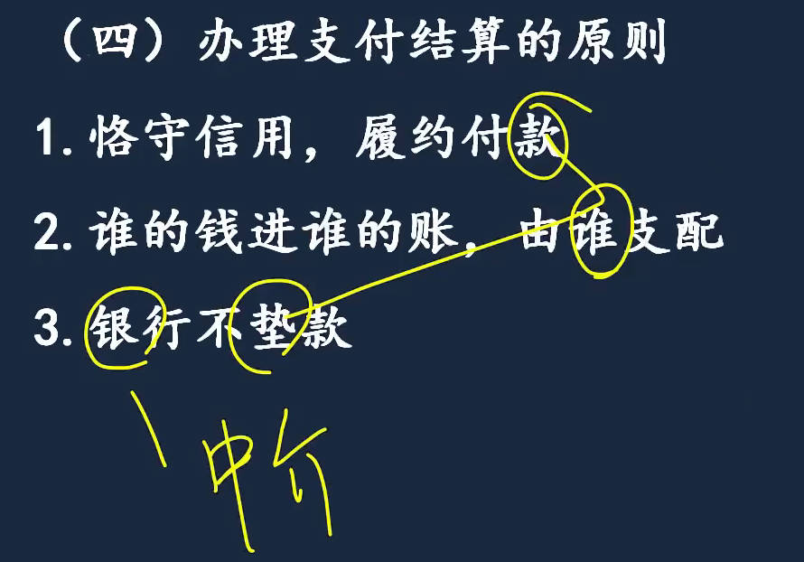 |
## 办理要求

1. 填写规范
   1. 收款人名称：全称 或 规范化简称
   1. 出票日期：必须大写， 前加0 ： 月：1、2、10， 日：1-9、10、20、30。    前加1：日为11-19。
   1. 金额：中文大写和阿拉伯数字同时记载
1. 签章
   1. 单位和银行：盖章能证明法人身份(公章或财务专用章)，法人不会动，所以还要证明代理人：要加法定代表人或代理人签名/章。 
   1. 个人只要证明个人身份就行：签名/章

1. 更改要求：金额、日期、收款人名称不得更改
1. 伪造：对章下手

|  |  |
| ------------------------------------------------------------ | ------------------------------------------------------------ |
|  |  |
|  |  |
|  |                                                         |

# 2、银行(结算)账户

## 开立

[银行预留签章卡片](https://aistudy.baidu.com/okam/pages/article/index?articleId=15713233&ucid=Pj6vnHc4nWR&categoryLv1=%E6%95%99%E8%82%B2%E5%9F%B9%E8%AE%AD&ch=54&srcid=10004)	

1. 重点：开变撤、七类银行账户
2. 账户分类
   1. 按存款人分类：单位、个人账户
   2. 按用途分：单位账户：==基本户、一般户(借款用)、专用户、临时户==；    ==个人银行结算账户==：分类分级管理 】
      1. 基本户只能有1个
      2. 专用户：专款专用
      3. 预算单位零余额账户：国库单一账户体系中的账户
3. 银行结算帐户`开立、变更、撤销`：开变撤
   1. 开户：预留签章卡片、==备案制账户==(企业)、非法人另一部分账户(==核准制账户==发开户许可证)
      1. 存款人自主原则：不得强令存款人到指定银行开立银行结算账户
      2. 开户申请签章和记载要求：单位开变撤申请只能是公章，而不是财务专用章，预留银行签章可为财务专用章
      3. 签订银行结算`账户管理协议`
         1. 异地开户：必须法定代表人或负责人 面签
         2. 开通非柜面转账业务：向非同名银行和支付账户转账，要签协议约定限额等 
      4. 预留银行签章卡片：证明法人身份：公章或财务专用章； 后2个证明自然人身份
      5. 企业和非企业在开户上区别：备案制、基本存款账户编号(只要有，开立其它都要提供)、开立之日可办理收付款业务
   2. 变更：主动、被动变更
   3. 撤销
4. `7类银行账户`
5. 银行结算账户管理

|  |  |
| ------------------------------------------------------------ | ------------------------------------------------------------ |
|  |  |
|  |  |
|  |  |
|  |  |
|  |                                                         |

## 变更	

银行结算账户的==变更==： 主动、被动变更
1. 主动变更
   1. 改名称：改公司名称，银行办理完变更手续，2工作日内向人民银行当地分支行备案
2. 被动变更
   1. 被动变更：原则上企业变更要主动提交申请或通知，如果没，银行发现了。
      1. 内容发生变更，没有及时办理变更手续，适当控制      
   2. 有效期到了，不更新，中止业务
3. 变更后原开户许可证处理
   1. 非企业：涉及到许可证上东西的变更，就换新证。      企业现在只有编号

|  |  |
| ------------------------------------------------------------ | ------------------------------------------------------------ |
|  |  |

## 撤销

[银行结算账户撤销流程](https://www.meipian.cn/1vqmv0x3)  

银行结算账户的==撤销==: 就是销户

1. 应撤销账户的法定情形
   1. 企业没了
   2. 迁址：要变更开户银行的, 办理撤销
2. 撤销程序：因转户撤销，银行打印  "已开立银行结算账户清单"
3. 撤销顺序：先撤销一般户、专用户、临时户，把资金转入基本户；最后撤基本户
4. 不得撤销结算账户的情形：存款人尚未清偿开户银行债务
5. 强制撤销：1年未发生收付业务且不欠开户行债务，通知单位30日内办销户

|  |  |
| ------------------------------------------------------------ | ------------------------------------------------------------ |
|  |  |
|  |                                                         |

## 7类银行结算账户

[国库集中收付制度 ](https://wiki.mbalib.com/wiki/国库集中收付制度)  [国库单一账户](https://baike.baidu.com/item/国库单一账户/2844543?fr=aladdin)  [国库单一账户体系](https://www.gov.cn/zxft/ft99/content_903348.htm)	

1. ==基本存款账户==
   1. 开户资格：非个人(企业单位)、够级别、非临时、应独立
   2. 证明文件：营业执照、批文、证明、登记证书
   3. 使用规定
   4. 非独立核算的单位： 开汇缴和支出账户，收的钱上交，花钱总公司基本户转给你
2. ==一般存款账户==：用于借款，能存，不能取。
   1. 概念：在开户行借款不需要开，直接转入基本户就行。在开户行以外的银行借款。
   2. 开户要求：基本存款账户编号、开立基本户所需的各种证明、借款合同或有关证明
   3. 使用范围：存现金，不能取现金，取现金要转基本户
3. ==专用存款账户==
   1. 概念：一共有12个，专款专用。注意现金存取规定
   2. 使用规定：证券3：不取； 房产3：支取须报人民银行当地分支行批准； 粮4：可取；  
   3. 收入汇缴：向2个账户划缴外，只收不付
   4. 业务支出：基本户拨入，只付不收  【汇缴和支出2个专用户主要是为了保证安全，执行收支2条线】
      1. 个人也可仿效设置收支2条线，开2个账户
         1. 工商：网银等用，购买用，最多1万，花没了其它账户转入
         2. 招商：不开通网银手机支付等，只收钱，收支2条线
   5. 开户要求
4. 预算单位零余额账户：国库单一账户体系中的账户      
   1. 审批：基层单位用于零星开支，向财政部门提出申请
   2. 账户管理：无基本户，作为基本户；有基本户，作为专用户管理。
   3. 使用规定：用于财政 "授权" 支付；
      1. 国库单一账户体系：
         1. 2个收钱的： `国库单一账户`：预算内资金收取； `预算外资金财政专户`：收取预算外资金。    
         2. 2个花钱的：`预算单位零余额账户`(只付不收，用于单位零星支出)；  `财政部门零余额账户`(用于财政直接支付，单位花大钱时支出，财政是爹，儿子买电脑等高价物品他爹支付) 
         3. 核算特殊性质资金的特设专户等
5. ==临时存款账户==
6. 个人银行结算账户：分类分级管理
7. 异地银行结算账户：上面所有账户开在异地

|  |  |
| ------------------------------------------------------------ | ------------------------------------------------------------ |
|  |  |
|  |  |
|  |  |
|  |  |
|  |  |
|  |  |
|  |                                                         |
### 临时存款账户

1. 适用范围
   1. `实缴制企业`仍需验资。 以前叫工商，现在叫市场监督管理局
2. 开户时"不需要提供"开户登记证(或编号)的情形：因为没有证或编号
3. 使用规定
   1. 有效期不得超过2年，验证的临时存款账户只收不付

|  | 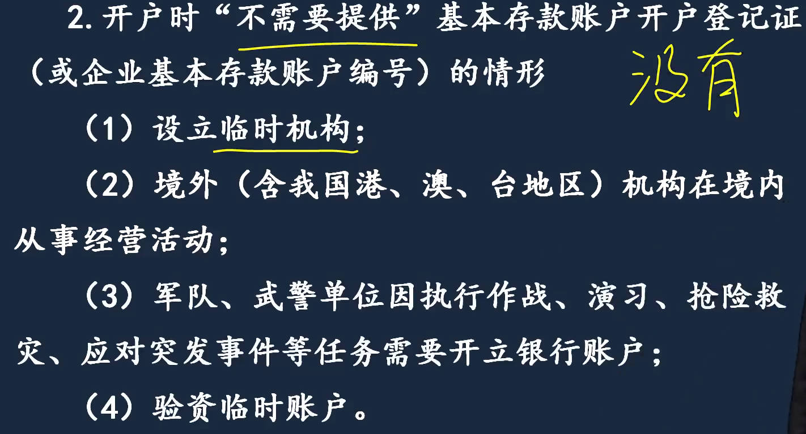 |
| ------------------------------------------------------------ | ------------------------------------------------------------ |
|  |  |

### 个人银行结算账户

==分类分级管理==：分3类账户

- 1类老婆的，干嘛都行，没限制；  转账、现金存取等
- 2类老公的，都能干但有限制，投资理财不限；  
- 孩子的，

1. 开1类账户必须见到工作人员
2. 开户证明文件：不满16，用户口薄为有效身份证明。
3. 个人电子渠道开立2、3类账户要求
   1. 2类开户要绑定其它户(1类或信用卡)，2、3类验证与绑定户为同一人开立，登记的手机号码与绑定户一致
4. ==代理开户==
   1. 出具证明：代理人、被代理人身份证明、及委托书，必要时要出证明代理关系的 公证书
   2. 单位代理个人开户：单位证明材料、被代理人身份证件的复印件，激活手续前，只收不付，例如单位给个人缴住房公积金。  [公积金联名卡](https://www.baidu.com/s?ie=UTF-8&wd=%E5%85%AC%E7%A7%AF%E9%87%91%E8%81%94%E5%90%8D%E5%8D%A1) 	
   3. 法定代理：无/限制民事行为能力的开户申请人，法定代理人或法院有关部门依法制定； 不能使用银行卡
5. 可以转入个人账户的款项
6. 使用规定
7. 个人账户的可疑交易类型

|  | 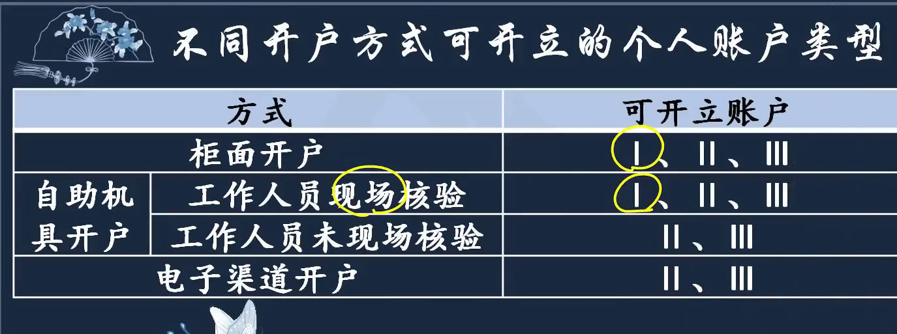 |
| ------------------------------------------------------------ | ------------------------------------------------------------ |
|  |  |
|  |  |
|  |  |
|  |  |
|  |  |
|  | 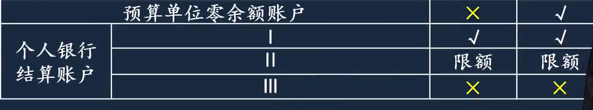 |

## 银行结算账户管理

1. 实名制管理
2. 资金管理
3. 预留银行签章管理
4. 可授权他人办理
5. 对账管理

|  |  |
| ------------------------------------------------------------ | ------------------------------------------------------------ |
|  |  |
|  |                                                              |

# 3、银行非现金支付业务

[三票一卡](https://www.baidu.com/s?ie=UTF-8&wd=%E4%B8%89%E7%A5%A8%E4%B8%80%E5%8D%A1)  

## 1、票据结算方式

[商业汇票信息披露的10个问题](https://www.163.com/dy/article/HHL5TAFP0518SFUK.html) [9月最新票据逾期名单分析](http://www.piaofengzixun.com/2022/10/11/shangpiaoinfo-202209/)  [问天票据网](https://www.cdhptxw.com/mryt/)  [票据信息披露平台](https://disclosure.shcpe.com.cn/#/dashboard)  [承兑信用信息查询](https://disclosure.shcpe.com.cn/#/infoQuery/ticketStateQuery) [上海票交所](http://www.shcpe.com.cn/content/shcpe/index.html) [票动力](https://www.piaodongli.com/) [微票宝](https://www.wpb.work/) [深度](https://company.shendushuke.com/) [洛米票仓](https://nuomipjw.com/) [票据交易平台](https://www.zhihu.com/question/496510171) [汇承](https://www.hchpj.com/#/capitalization) [商票圈](https://www.shangpiaoquan.com/#/)   

[票据权利期限和付款期限](https://www.acc5.com/ask/question_2994206.html)  

[什么是财务公司](https://mip.64365.com/zs/1209665.aspx) [财务公司 - 知乎](https://www.zhihu.com/question/347948231)  [企业集团财务公司有多少家](https://www.maigoo.com/news/544520.html)   [集团财务公司](https://www.66law.cn/laws/173810.aspx)

> 财务公司：财务公司是企业集团开的一家内部银行
>
> 商业承兑汇票信息披露操作细则：
>
> **累计承兑发生额**是指承兑人当年1月1日至上月末累计承兑的商业汇票总金额；
>
> **承兑余额**是指承兑人已承兑但未结清的商业汇票总金额。收款人未签收的商业汇票不计入承兑人的承兑发生额和承兑余额内。
>
> **累计逾期发生额**是指承兑人近5年内发生过逾期的全部商业汇票总金额。持票人已发起提示付款，但承兑人在票据到期后拒绝付款或未在规定期限内应答的行为构成逾期；
>
> **逾期余额**是指承兑人已逾期但未结清的商业汇票总金额。

> 导读：我国的财务公司主要分为两大类：一类是企业集团财务公司(主要是中资企业集团财务公司，是为企业集团成员单位提供金融服务的非银行金融机构;另一类是一般性财务公司。
>
> 1. 财务公司或称“财务有限公司”，又称“注册接受存款公司”，是指经营部分金融业务的准银行。主要承办定期大额存款、发放贷款、经销证券、买卖外汇、代理保险、财务咨询等金融服务。其服务对象主要是大企业、大公司集团，不开立私人帐户、不办理小额存贷款和储蓄，以此与银行相区别。
> 2. 目前我国的财务公司主要可以分为两大类：一类是企业集团财务公司(主要是中资企业集团财务公司)，是为企业集团成员单位提供金融服务的非银行金融机构;   另一类是一般性财务公司，主要包括外资财务公司、中外合资财务公司，是由中外金融机构或外国金融机构按中国法律规定，经批准在中国境内投资设立、面向社会提供较为广泛金融服务的非银行金融机构。至于中外合资财务公司、外资财务公司，其设立与审批、业务范围、监督管理、解散与清算、罚则等适用1994年2月25日由国务院发布的行政法规：〈中华人民共和国外资金融机构管理条例〉。通常所说的财务公司主要是指上述第一类财务公司。
> 3. 根据中国人民银行2000年6月30日第三号令发布的《企业集团财务公司管理办法》的规定：所谓财务公司是指，依据《中华人民共和国公司法》和本办法设立的、为企业集团成员单位(简称成员单位)技术改造、新产品开发及产品销售提供金融服务，以中长期金融业务为主的非银行金融机构。这里所称的成员单位是指集团母公司，母公司控股51%以上的子公司，母公司、子公司单独或共同持股20%以上的公司，或持股不足20%但处于最大股东地位的公司。外资企业集团的成员单位还包括该外资企业集团的外方投资者在中国境内直接持股或与该外资企业集团共同持股20%以上的公司。由此可见，我国的财务公司是由企业集团内部集资组建的，其宗旨和任务是为本企业集团内部各企业筹资和融通资金，促进其技术改造和技术进步。如华能集团财务公司、中国化工进出口财务公司、中国有色金属工业总公司财务公司等。
> 4. 财务公司的业务有：存款、贷款、结算、票据贴现、融资性租赁、投资、委托以及代理发行有价证券等。从今后规范要求的角度看，财务公司的特点就是为集团内部成员提供金融服务，其业务范围、主要资金来源与资金运用都应限定在集团内部，而不能像其他金融机构一样到社会上去寻找生存空间。
> 5. 财务公司在业务上受中国人民银行领导、管理、监督与稽核，在行政上则隶属于各企业集团，是实行自主经营、自负盈亏的独立企业法人。截至1997年底，我国财务公司总数为72家，它们在支持与促进企业集团，特别是大型企业集团的改革发展中发挥了特定的作用。

### 票据当事人

[被记名授让票据的人](https://www.baidu.com/s?ie=UTF-8&wd=%E8%A2%AB%E8%AE%B0%E5%90%8D%E6%8E%88%E8%AE%A9%E7%A5%A8%E6%8D%AE%E7%9A%84%E4%BA%BA)	

1. 总则
   1. `票据含义、特征、功能`
      1. 广义票据包括股票、发票、提货单等，狭义票据：<<票据法>>规定的票据。  票据的转让，通过背书的方式来完成。
         1. 自付票据： 银行出票，银行自付付款； 银行汇票、银行本票
         1. 委付：企业或个人出票，委托开户银行付款； 支票
         1. 即付票据：拿到票就能拿到钱； 银行汇票、银行本票、支票
         1. 远期票据
      1. 特征：完全有价证券(4个小特征：涉权、交付、提示、缴回证券)、文义证券、金钱债权证券(无因)
      1. 功能：支付(款项)、汇兑、结算(双方互负债务，交换票据，抵消债务)、信用(通过远期票据实现)、融资功能(贴现、转贴现、再贴现)
   2. 7个票据当事人
      1. 基本当事人：我国只有银行本票(大额人民币，银行自己签发，自己付款，出票人付款人合2为1，不需特别强调付款人。)，无商业本票。
      2. 非基本当事人：承兑人、背书人(转让票据的人)、被背书人
      3. `为了理解，要会画票据当事人图`
         1. b拿到票据后，由于票据3个月后才到期，b需要有人站出来承诺到期付款，这张票是银行承兑汇票，所以b找到承兑银行，承兑银行审核后，觉得a有到期支付的能力，银行为了收取相应手续费，同意承担到期付款责任，在承兑人栏签章，银行就从`付款人变为承兑人`
            1. 承兑人：不可能你拿张票，随便写个付款人，人家就会付款
         2. `背书转让票据`时： B要在票据背面背书人栏签章，B是背书人，是转让票据的人， C是被记名受让票据的人，称为`被背书人`。
            1. 保证人：给出票人提供的保证记正面，背书保证记背面。
         3. 横着看，成对出现； 竖着看，身份会转变
      4. 承兑人和付款人： 付款义务不一样
         1. 付款人是中介，只承担相对付款义务，例如支票，出票人账户没钱，银行不会垫付
         1. 付款人可以理解为女朋友，女朋友没有替你还债的义务； 承兑人，老婆
   3. 票据权利：2个，请求、追索权，谁手里拿着票，谁就能行使权利
   4. 票据责任
   5. 票据行为：重点
2. 分则
   1. 银行汇票
   2. 商业汇票
   3. 本票
   4. 支票

|  |  |
| ------------------------------------------------------------ | ------------------------------------------------------------ |
|  |  |
| 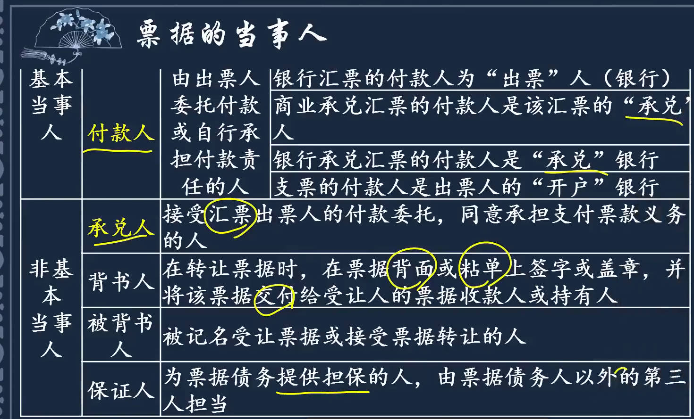 |  |

### 票据权利

[公示催告后,票据提示付款期限超过_百度搜索](https://www.baidu.com/s?ie=UTF-8&wd=%E5%85%AC%E7%A4%BA%E5%82%AC%E5%91%8A%E5%90%8E%EF%BC%8C%E7%A5%A8%E6%8D%AE%E6%8F%90%E7%A4%BA%E4%BB%98%E6%AC%BE%E6%9C%9F%E9%99%90%E8%B6%85%E8%BF%87)   [8个时效期限](https://zhuanlan.zhihu.com/p/478914046)  [提示付款期限](https://www.baidu.com/s?ie=UTF-8&wd=%E6%8F%90%E7%A4%BA%E4%BB%98%E6%AC%BE%E6%9C%9F%E9%99%90%E6%98%AF%E5%88%B0%E6%9C%9F%E5%90%8E%E8%A6%81%E9%92%B1%E7%9A%84%E6%9C%9F%E9%99%90)   

票据权利：2个，`请求、追索权`，谁手里拿着票，谁就能行使权利。

- **付款请求权**：持票人向票据主债务人，出示票据`要求付款的权利`。
  - 能行使请求权：收款人、最后的被背书人
  - 付款人：银行汇票，自付票据。 商业票据，企业签发，委付票据。  支票是企业个人签发，委托开户行付款，委付票据。 本票没有付款人，自己出票，自己付款。
  - 付款人只承担相对付款责任，例如`支票`付款人是出票人开户银行，你账户有钱我帮你付，没钱就不帮你付，还罚你。承兑人需承担“绝对”付款责任。
  - 保证人：为票据债务提供担保，必须要在票据上做记载，签一保证合同不行。体现的票据是文义证券
- **追索权**：请求权被拒或其它法定原因存在时，向其前手请求偿还票据金额，及其它法定费用的权利
  - 能行使追索权：收款人、最后的被背书人、代为清偿票据债务的保证人、背书人
  - 最后的被背书人，前面的所有人都是前手，可以不按债务顺序追索

1. `票据权利的取得`：必须给(ji)付对价。欺诈、偷盗、胁迫、重大过失(例没盖章) 
   1. B有权利，C就有权利； 或者c捡到给d，c没权利，d也没有
2. 票据权利的行使与保全
3. `票据权利丧失的补救`（失票救济）
   1. `挂失`止付：通知付款人暂停支付
      1. 可挂失止付的票据：支票：出票人的开户银行；  【有明确的付款人】
      2. 挂失止付通知书
      3. 信息登记：暂停支付 => 电子化处理
      4. 止付期：持票人自己申请，止付期12日
   2. 公示催告
      1. 概念：向票据支付地人民法院申请
      2. 公示催告程序
         1. 为了找到利害关系人
         2. ==公示催告申请书==
         3. ==公示催告期间==：保证有人要钱时，银行告诉票据被公示催告，是在提示付款期要钱，所以要超过提示付款期
            1. 公示催告本身不直接延长提示付款期限，具体期限仍由票据类型和原定规则决定
            2. 裁定终止：利害关系人出现，通知失票人、付款人； 然后失票人和利害关系人打官司
            3. 无人申报：法院作出除权判决，宣告丢失票据无效，通知付款人，且公告
               1. 公告之后，失票人凭法院除权判决要求付款人付款
               2. 特殊情况：利害关系人有正当理由未在判决前申报，有1年时间起诉
   3. 普通诉讼：公示催告也不是普通诉讼的必经程序，例知道谁捡到票，要不回来。
4. `票据权利时效`
   1. 商业汇票是远期票据，拿到票不能行使票据权利，到期了才能行使
   2. `再追索`：别人追索了你，你把钱还给别人，取的了票据，向前手追索。
      1. 追索和再追索时效的适用对象是前手背书人，前手保证人，如果追到了出票人或承兑人，不再适用追索和再追索权的时效，改为适用对出票人或承兑人的时效
      2. 解题先找追索对象，再找起算点。
   3. 2年是票据权利时效的期限，6个月是商业汇票的付款期限，   比如开纸质商业汇票票据出票日是1.1号，那么到期日最长是到7.1，付款期不能超过6个月  ，如果持票人对这张票的出票人行使票据权利的期限是从票据到期日起2年

|  | 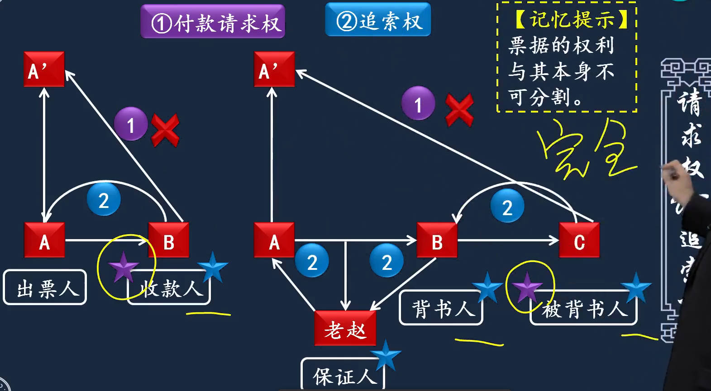 |
| ------------------------------------------------------------ | ------------------------------------------------------------ |
|  |  |
|  |  |
|  |  |
|  |  |
|  |  |
|  |  |
|  |  |
|  |  |

### 票据责任

1. 责任人：一方的权利必然对应另一方的责任，请求权对应付款责任
   1. 付款责任
   2. 清偿责任

2. 提示付款
3. 票据的抗辩：中级重点
   1. 抗辩： 对抗、理由
   2. 对物的抗辩：针对这张票，是票出了问题；谁拿这张有问题的票，银行都不会给钱
   3. 对人的抗辩：不是票出了问题，是拿票的人出问题。B不支付合理对价,你找B，不能抗辩C
      1. a不能因为b没有支付合理对价，就不给c付款

|  |  |
| ------------------------------------------------------------ | ------------------------------------------------------------ |
| 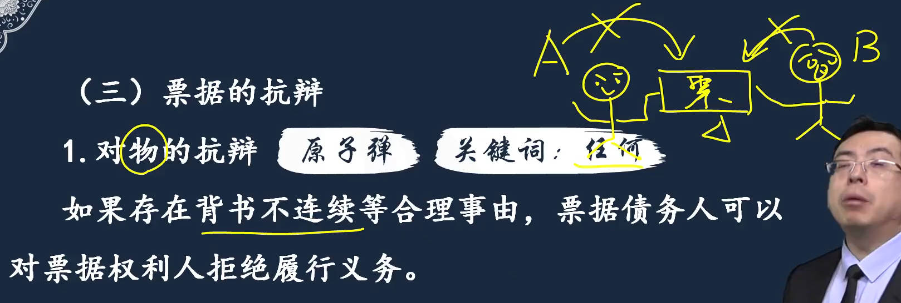 |  |
|  |          |

### 票据行为
票据行为：4种，出票、背书、承兑、保证

1. 概念：在票据上签章了，就要对签章享有权利承担义务
   1. 权利义务构成要件
2. 出票
   1. 票据的`记载事项`：非法定记载事项，记不记都没用
   2. 出票人责任
3. 背书
   1. 背书种类：背书人签章，并记被背书人名称； `委托收款`背书，权利人还是背书人。  `质押背书`：借钱用票担保，票上要写清质押。
   2. 背书记载事项
   3. 粘单的使用：第一个使用粘单的人
   4. 背书连续：非转让背书2个：委托收款、质押背书
   5. 背书特别规定
      1. 条件背书：条件无效
      2. 部分背书：背书无效
      3. 禁转背书：不得转让：D向A'行使付款请求权被拒，向A出票人行使追索权可以，向B追索权，B不负责
      4. 期后背书：你要不到钱，转让给别人，目的不纯。 法律规定不允许背书转让
   6. 背书效力
4. 承兑
   1. 提示承兑： 到期日不明确的，出票日起1个月内; 到期日明确的，到期日前
      1. 见票后定期付款：承兑人见票
5. 保证
   1. 保证人条件
   2. 记载事项
   3. 保证责任
      1. 保证人和被保证人承担同一法律责任
   4. 附条件的保证
6. 票据的追索
   1. 追索适用情形
   2. 被追索人确定
   3. 追索内容
   4. 行使追索权
      1. 通知期限：自取的证明之日起，3日内向全体前手发出追索通知
   5. 清偿效力

|  |  |
| ------------------------------------------------------------ | ------------------------------------------------------------ |
|  |                                                              |

#### 背书
|  |  |
| ------------------------------------------------------------ | ------------------------------------------------------------ |
|  |  |
|  |  |
|  | I |
|  | 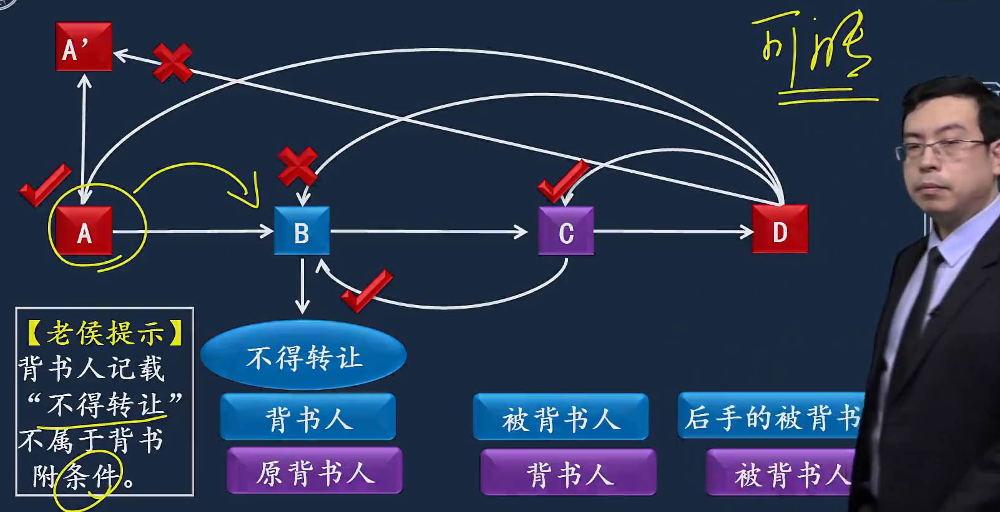 |
|  |                                                         |

#### 承兑
|  |  |
| ------------------------------------------------------------ | ------------------------------------------------------------ |
|  |  |
|  |  |

#### 保证

|  |  |
| ------------------------------------------------------------ | ------------------------------------------------------------ |
|  |  |
|  |                                                              |

#### 追索
|  |  |
| ------------------------------------------------------------ | ------------------------------------------------------------ |
|  |  |
|  |  |
|  |  |
|  |  |
|  |  |
|  |                                                              |

### 具体票据

[17种常见的银行票据](https://zhuanlan.zhihu.com/p/634256088)  

上面内容是总则，下面是票据法分则，3类4种具体票据

#### 银行汇票

[现金银行汇票代理付款人](https://www.baidu.com/s?ie=UTF-8&wd=%E7%8E%B0%E9%87%91%E9%93%B6%E8%A1%8C%E6%B1%87%E7%A5%A8%E4%BB%A3%E7%90%86%E4%BB%98%E6%AC%BE%E4%BA%BA)   [现金银行汇票为什么要写代理付款人](https://www.baidu.com/s?ie=utf-8&f=3&rsv_bp=1&tn=baidu&wd=%E7%8E%B0%E9%87%91%E9%93%B6%E8%A1%8C%E6%B1%87%E7%A5%A8%E4%B8%BA%E4%BB%80%E4%B9%88%E8%A6%81%E5%86%99%E4%BB%A3%E7%90%86%E4%BB%98%E6%AC%BE%E4%BA%BA&oq=%25E7%258E%25B0%25E9%2587%2591%25E9%2593%25B6%25E8%25A1%258C%25E6%25B1%2587%25E7%25A5%25A8%25E4%25BB%25A3%25E7%2590%2586%25E4%25BB%2598%25E6%25AC%25BE%25E4%25BA%25BA&rsv_pq=98c2f18a0001728b&rsv_t=dda04TVeY4hXAtLRF8oT0Pbi1pvKJR20gRnfbjVwFUvo9P7OMRexn3VpzEk&rqlang=cn&rsv_enter=1&rsv_dl=ts_1&rsv_sug3=10&rsv_sug1=8&rsv_sug7=100&rsv_sug2=0&rsv_btype=t&prefixsug=%25E7%258E%25B0%25E9%2587%2591%25E9%2593%25B6%25E8%25A1%258C%25E6%25B1%2587%25E7%25A5%25A8%25E4%25B8%25BA%25E4%25BB%2580%25E4%25B9%2588%25E4%25BB%25A3%25E7%2590%2586%25E4%25BB%2598%25E6%25AC%25BE%25E4%25BA%25BA&rsp=1&inputT=8962&rsv_sug4=10602)		

1. 概念：银行汇票，主要用于异地结算；  
   1. 出票金额[申请时交付的款项]，实际结算金额[实际支付的款项]，多余金额。   
   1. `银行汇票有4联`： `卡片联`银行留着做帐[借方凭证，`解讫通知联`，贷方凭证]，2、3联卖方给自己开户行提示付款，收款银行把解讫通知联给汇款银行，通知付款。

1. 适用范围：个人也可用
1. 申请：双方都为个人，才可申请现金银行汇票
1. 签发和交付：必记事项：委师傅金去牵羊【无条件支付的委托/承诺、收、日期、签章、字样】
1. 实际结算金额
1. 提示付款
1. 退款和丧失

|  |  |
| ------------------------------------------------------------ | ------------------------------------------------------------ |
|  |  |
|  |  |
|  |  |
|  | 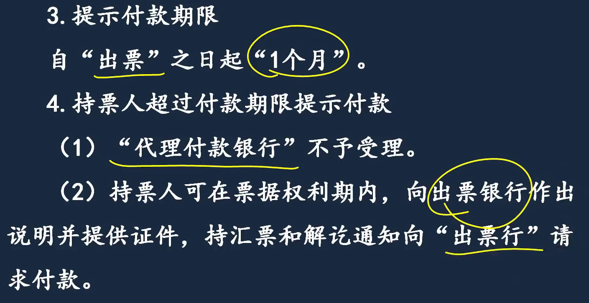 |
|  |  |
|  |                                                              |

#### 商业汇票

[中国裁判文书网使用攻略](https://zhuanlan.zhihu.com/p/66714107)  [中国裁判文书网非常卡](https://zhuanlan.zhihu.com/p/157848809) [2016农行39.15亿票据案](https://baijiahao.baidu.com/s?id=1661009130664020515&wfr=spider&for=pc)

[票据信息披露平台](https://disclosure.shcpe.com.cn/#/dashboard)     [票交所票据信息披露平台详解](https://zhuanlan.zhihu.com/p/498530005)   [承兑汇票贴现平台](https://www.zhihu.com/question/521076686/answer/2801954929)

1. 概念：商业承兑汇票也可由收款人签发(出票)，交给付款人承兑，再收回来。
1. 出票
1. 承兑
1. 纸质票据电子化
1. 商业汇票的`信息披露`：持续披露：变动信息，每月前10日内
1. 贴现：背书人签章
1. 商业汇票的付款期限和提示付款期限
   1. 付款期限：透支企业商业信用的最长时间。 提示付款：向银行出示票据，要钱的时间，决定现在能不能拿到钱 。   提示承兑：决定未来能不能拿到钱，只有人承诺到期付款了，才能决定未来能拿到钱。
   1. 即付：出票日到期日相同、没有记载付款期限

| 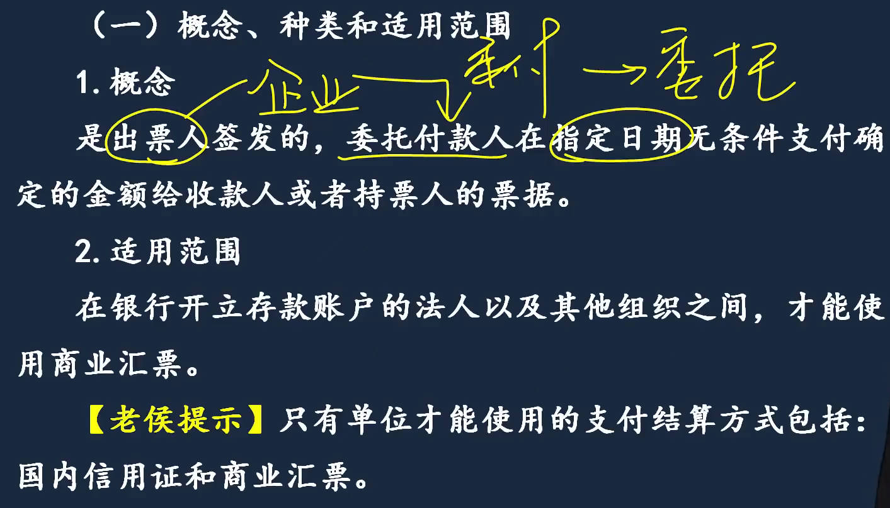 |         |
| ------------------------------------------------------------ | ------------------------------------------------------------ |
|  |  |
|  |  |
|  |  |
|  |  |
|  |  |
|  |  |
|  |  |
| 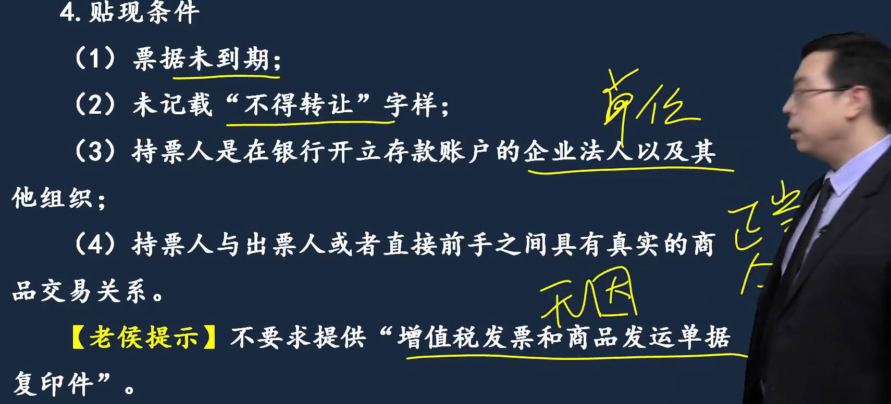 |  |
|  |  |
|  |  |
|  |                                                              |

#### 银行本票

[银行本票结算的业务流程和账务处理](http://www.olsysb.com/jswz/34.html)  [党组织](https://weibo.com/2328516855/M9UqPaj0p#comment) 19次党代会极简史   [同一票据交换区域](https://www.baidu.com/s?ie=UTF-8&wd=%E5%90%8C%E4%B8%80%E7%A5%A8%E6%8D%AE%E4%BA%A4%E6%8D%A2%E5%8C%BA%E5%9F%9F)  

1. 概念：虽然不方便，但信誉度最高，大额人民币。  范围不是全国
   1. 银行签发
   1. 定额的：只有千元、万元
1. 出票
1. 付款
1. 退款和丧失

|  |  |
| ------------------------------------------------------------ | ------------------------------------------------------------ |
|  |  |
|  |  |
|  |                                                              |

#### 支票

> 1. 概念、种类、适用范围
>    1. 现金支票：只能用于支取现金
>    1. 转账支票：只能转账
>    1. 普通支票：既可用于支取现金，也可用于转账
>       1. 划线支票：普通支票左上角划2条平行线，只能转账
> 1. 出票：本票无付款人，支票无收款人。 支票授权补记(为了支票使用便捷)
> 1. 签发要求：空头支票，中国人民银行罚，罚金谁大按谁罚[最低1000]
> 1. 支票的付款

| 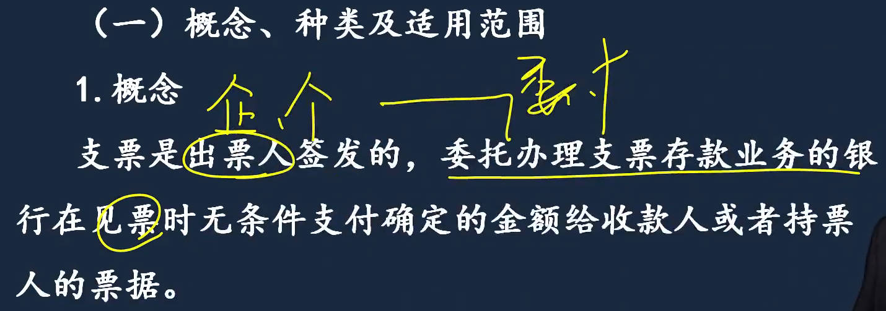 |  |
| ------------------------------------------------------------ | ------------------------------------------------------------ |
|  |  |
|  |  |
|  |  |
|  |  |

##### 支票的付款

1. 提示付款期限
2. 转账支票提示付款程序：转账/现金支票提示付款程序不一样。委托收款要背书，而所有现金票据背面无背书栏。
3. 现金支票提示付款程序

|  |  |
| ------------------------------------------------------------ | ------------------------------------------------------------ |
|  |  |
| 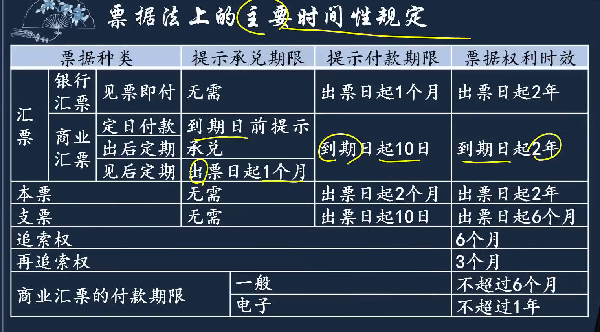 |  |

## 2、非票据结算方式

### 银行卡
1. 概念和分类
   1. 信用卡：分为贷记卡和准贷记卡， `准贷记卡`开卡要交备用金； 
   2. 借记卡：转账卡：日常使用的银行卡； 
      1. 储值卡：公交卡； 
      2. 专用卡：以前有交罚款的专用卡； 
   3. 联名卡：商业银行和其它机构合作发行的，有公积金联名卡
1. 申、销、挂、追：注销45天； 
   1. 追：人、物、钱保、司法。追回
1. 贷记卡
   1. 优惠政策：免息还款期：银行记账日，即刷卡消费日
   1. 透支利率：可协商
   1. 协议显著、充分知悉、确认接受：日利率万5，年利率x360都18%，很高，一般存年利率3%
   1. 预借现金：现金转账：信用卡额度转到自己借记卡； 现金充值：转到支付宝； 信用卡资金不能到非持卡人账户和其他信用卡。
   1. 风险控制：通过柜面取现额度：协议约定；
   1. 不得收取的款项
      1. 滞纳金：逾期收的有利息，相当于收滞纳金
      1. 超限费、1金3费不能收
1. 银行卡收单

|  |  |
| ------------------------------------------------------------ | ------------------------------------------------------------ |
|  |  |
|  |  |
|  |  |
|  |  |
|  |  |
|  |                                                              |

#### 银行卡收单

1. 概念：
   1. 收单向商户收手续费；
   2. 拿着ICBC的卡，划的建行pos机，交易信息发到`信息处理机构-银联`； 传递交易信息到icbc，icbc确认交易信息，通过银联返回到商户pos机，pos打出纸条，个人签字确认，商户把纸条交给建行
   3. 每日23点银行之间进行轧差清算(银行之间转差额)，建设银行次日转账给商户。商户用建行的pos机，交的服务费三方分（icbc、银联、建行）。
2. 收单机构及特约商户
3. 管理规定
   1. 特约商户管理：本地化管理：实体特约商户
   2. 业务与风险管理
      1. 风险应对措施：认定事件、发生事件
      2. 风险事件：移机：pos有gps芯片，在规定范围内使用
      3. 退货：从哪里来回哪里去
4. 结算收费：重点，3个分账，非营利：收单机构给免了，无钱可分，所以发卡、网络全免了。

|  |  |
| ------------------------------------------------------------ | ------------------------------------------------------------ |
|  |  |
|  |  |
|  |  |
|  |  |

### 汇兑、委托收款
> 1. 汇兑
>    1. 分类：==汇兑，就是汇款==，信汇、电汇
>    1. 记载事项：收账通知：汇入行给收款人的
>    1. 撤汇：尚未汇出；  退汇：在途或到汇入行，办汇款的退回。
> 1. 委托收款
>    1. 办理委托收款，要给银行委托收款证明：已承兑商业汇票、债券等付款人债务证明
>    1. 适用范围：现金票据不可以
>    1. 程序

|  |  |
| ------------------------------------------------------------ | ------------------------------------------------------------ |
|  |  |
|  |  |
|  |  |
|  |                                                              |

### 电子支付

电子支付：网上银行、条码支付、网络支付

1. 概念
2. 网上银行：分支型：线下有实体银行；批量支付：发工资
3. 条码支付
   1. 条码支付商户管理：实名制管理
   2. 条码支付的风险管理：风险事件
4. 网络支付

| 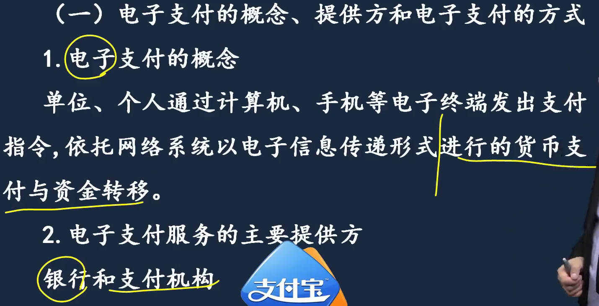 |  |
| ------------------------------------------------------------ | ------------------------------------------------------------ |
|  |  |
|  |  |
|  |  |
|  |  |
|  |  |
|  |                                                         |

#### 网络支付

1. 概念
2. 网络支付机构：无担保，付款立即到帐
3. 支付账户：结算户和支付户区别
4. 支付机构风险管理
   1. 代替银行：支付机构与个人交易，只是虚拟财产转移，正式的还要通过银行；2种情况可代替银行进行交易验证(小额200红包、固定且定期)

|  |  |
| ------------------------------------------------------------ | ------------------------------------------------------------ |
|  |  |
|  |  |
|  |  |

### 预付卡

[预付卡的赎回](https://www.chinaacc.com/chujizhicheng/jhwd/zy20240918173416.shtml)  

美容卡、公交卡、购物卡等

1. ==单、多用途==预付卡：美容卡、公交卡、购物卡：用于行贿，关注限制
2. 记名、不记名
3. 
4. 购买预付卡登记信息
5. 转账购买与充值：充值5000以上必须转账方式
6. 使用规定
7. 赎回：防止公款私存
   1. 预付卡赎回: 将预付卡余额兑换成现金或其他货币形式的行为
8. 发卡机构：挪用可怕：小黄车押金

| 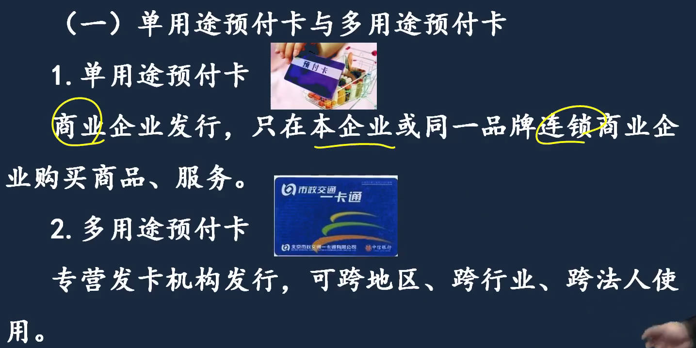 |  |
| ------------------------------------------------------------ | ------------------------------------------------------------ |
|  |  |
| 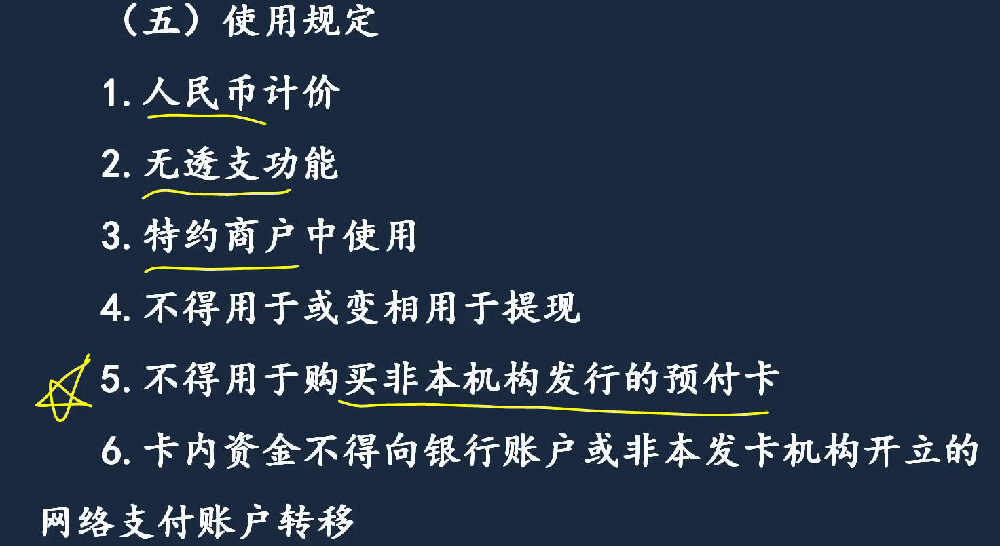 |  |
|  |  |

# 4、支付机构非现金支付业务

# 5、支付结算法律责任
