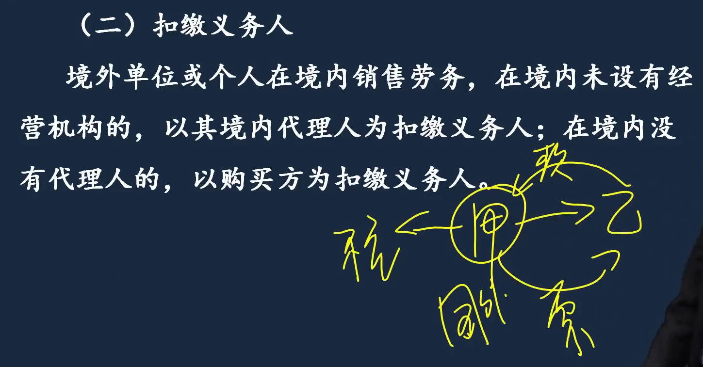
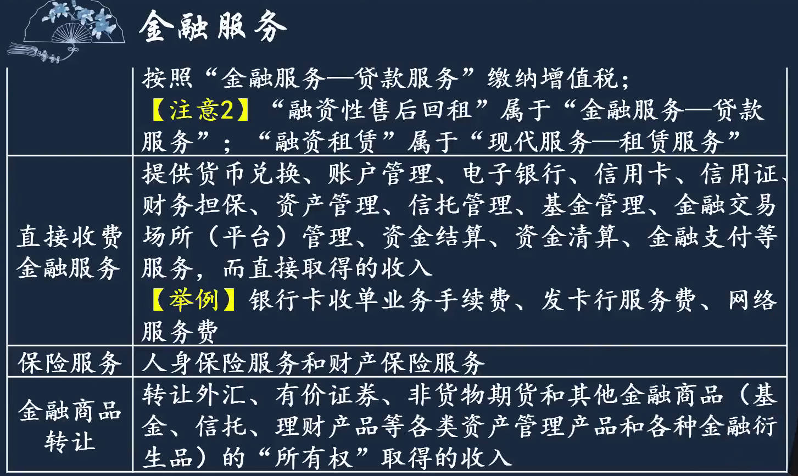
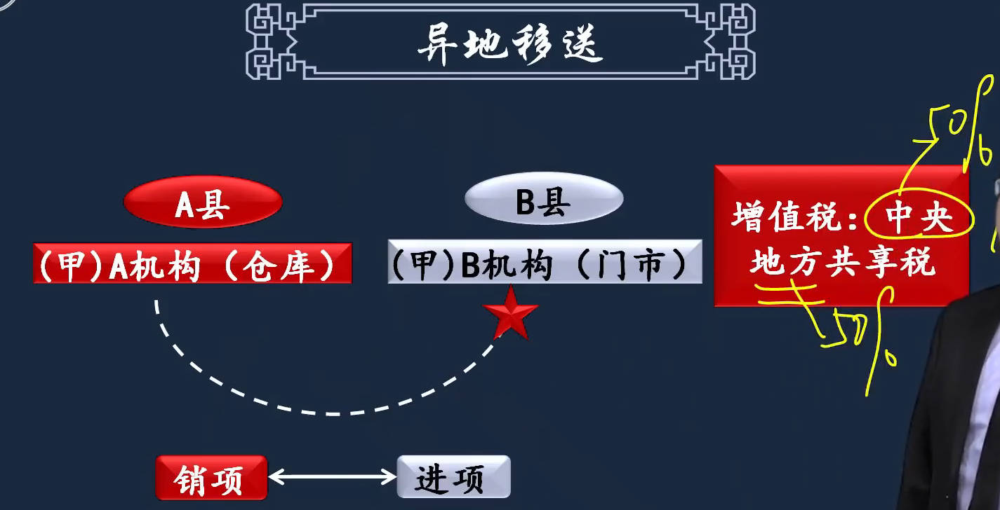
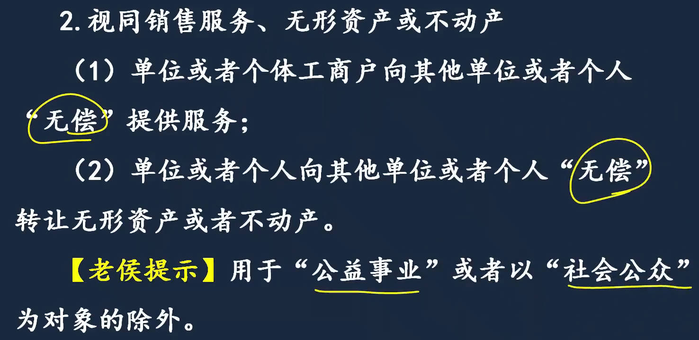
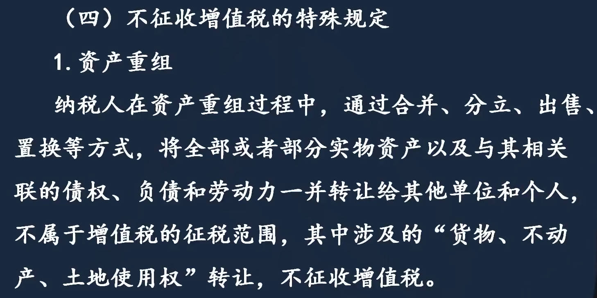
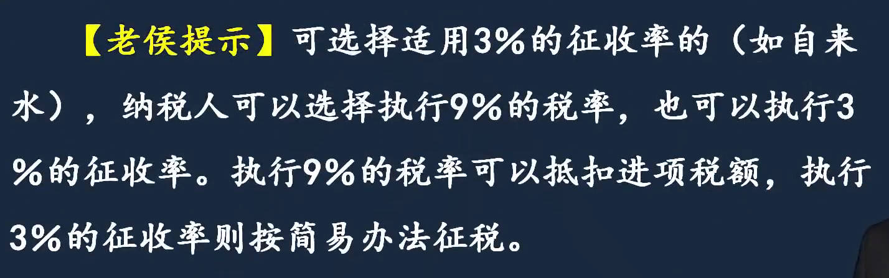
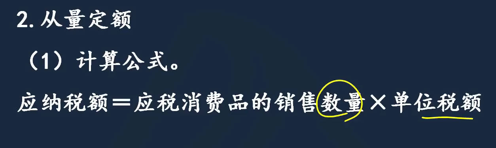

# 1、税收法律制度概述
税收$\color{blue}\Large实体法$：18税；          $\color{blue}\Large程序法$：税收征管法

1. `税收与税法关系`
   1. 税收：从经济角度谈税，把税看成分配关系，国家参与企业收益再分配的过程； 强制、无偿、固定性。
   2. 税法：从法律角度谈税，税收征纳过程中当事人的权利义务
   3. 税收的特征：三性；为实现智能(花钱) => 财政收入 => 凭政治权利；站在经济角度谈税
   4. 主体：纳税人；  `扣缴义务人`：赋有代扣、代收、代缴税款的义务人；例：单位代扣代缴个人税款；  `纳税担保人`：担保纳税人能按期缴纳税款。代理人：代办相关纳税手续，跑流程的人
2. `实体税法的构成要素`
3. `税收征管体制`

|  |  |
| ------------------------------------------------------------ | ------------------------------------------------------------ |
|  |  |

## 实体税法的构成要素

征税对象相当于一级科目，税目相当于二级科目，==税目是征税对象具体化==；例：消费税应税消费品相当于一级科目，烟酒等属于二级科目

1. ==纳税人==[直接税]：直接的纳税义务；负税人[间接税]：税赋的最终承担者(例如增值税负税人是消费者)；扣缴义务人(个人所得税企业代扣代缴)
   1. 纳税人：负有纳税义务的单位和个人
   2. 纳税人和`负税人`可能是一个人[企业所得税]，也可能不是一个人[增值税]
2. ==征税对象==：课税对象(区别不同税种的重要标志);  增值税(商品销售流转过程中的增值额)；消费税(应税消费品)；企业所得税(企业所得额)；个税(个人所得额)；  所有税种都以征税对象命名。
3. ==税率==：决定征税的深度；3种： **比例**、**定额**(按数量，例甲类啤酒每吨收250)、**累进**(分段)
   1. 决定了纳税人负担多少税，国家要收多少税
   2. 累进税率：递增税率，金额越高，税率越高，起调节作用；  **超额(个人所得税中的综合所得)、超率**累进税率(土地增值税)
      1. 超额：分别依所属等级，适用多个不同等级税率，然后分段计算，最终相加汇总
         1. 例：个人所得来源的形式不同，计税方法不一样，其中综合所得包括4项，执行超额累进税率
      2. 超率：以征税对象数额的相对率，划分若干级距，分别规定相应的差别税率
4. ==计税依据==：又称计税基础； `从价`(凡是适用比例税率的，计税依据就是价款)、`从量`(凡适用定额税率，计税依据就是数量)
   1. 从价计征计税依据就是`价`
5. ==纳税环节==：征税对象流转过程中，应当缴纳税款的环节；  
   1. 单一环节纳税
   2. 多环节纳税
6. ==税收优惠==
   1. **减**(少征)、**免**税(免征一分钱不要)； 
   1. **起征点**[达到全额征税,未达不征税]、**免征额**[只对超过免征额的部分征税，对全体纳税人的照顾]

|  |  |
| ------------------------------------------------------------ | ------------------------------------------------------------ |
|  |  |
|  |  |
|  |  |
|  |  |
|  |  |
|  |  |
|  |                                                              |

## 税收征管体制

现行税种与征收机制。   

1. ==税务机关征收==
2. ==海关征收==的税种：关税、船舶吨税、海关代征：进口环节增值税和消费税

|  |  |
| ------------------------------------------------------------ | ------------------------------------------------------------ |

# 2、增值税

小结：

增值税**应税行为**：5+1， 销售货物/劳务/服务/无形资产/不动产、进口货物。  ==无不货服劳==

**征税范围**

- 销售服务：7项服务， ==现代生活金融电信、建筑交邮==

**税率**

- 9%
  - 货物： 基本==温饱==、精神文明、==农业==生产、==生活能源==
  - 销售服务、无形资产、不动产： 若想天长地久，==房地产==(4项)是==交邮==的基础;  基础电信、转让土地使用权、建筑、销售不动产、不动产租赁

不再产生后续销项税额：==简、免、集、个==

[为什么说增值税是由消费者承担的？](https://www.zhihu.com/question/339793503/answer/3381325018)  

**理解： 增值税由消费者承担**,  理解了增值税的流转和进项抵扣这个疑惑就可以迎刃而解

在增值税链条上**，销售方只是纳税人，购买方才是负税人**！！！纳税人代缴税费，负税人出真金白银。

1. A卖B一物，作价100，按13%税率的话，A向B收取13的增值税，然后向税务局缴纳。该环节，购买方B是增值税的承担者，承担了13。
2. B若加工该物卖C，作价300，按13%税率的话，B向C收取39的增值税，但只需要向税务局缴纳26，因为允许B抵扣掉支付的进项13。该环节，购买方C是增值税的承担者，承担了39。
3. 如果C是最终的消费者，由于没有了销项，支付的进项39无法抵扣，C妥妥成为了增值税的最终承担者。

总结： 购买时交的13抵扣了， 卖出时的销项税是收的下一个买家的， 属于代收代缴

[增值税全部由消费者承担吗](https://ailegal.baidu.com/?fr=seo_qadetail&template=business&articleType=qadetail&articleId=49e6632e773ce4001112)  

> - 费者购买商品或接受服务时，支付的款项中包含了税款。企业作为纳税人，在销售过程中`代收代缴`增值税，但税负最终往往转嫁给消费者。
> - 消费者作为最终使用者，不进行销售，无法抵扣这部分税款，因此承担了增值税的最终税负

## 增值税基本原理

流转税、增值额、购进扣税(扣除购买时交的税，进项抵扣)、链条式纳税

增值税基本原理：1954年法国；所有行业比作蛋糕，1分为2，一半交增、一半交营业税，人为划分，但行业有交集，为避免重复征税，2012开始营改增，2016年5月全部营改增。

> 一笔业务，先确定属于增值税征税范围的哪一项(例：销售货物还是销售服务)，再过渡到税率(不同行业，不同范围，适用的税率不一样)，再应纳税额计算。

增值税：商品货物的流转税，产生于商品流转的各个环节

1. ==三大基本原理==：`购进扣税法`即税款抵扣制、链条式纳税、价外税  【要知道什么是`流转税、增值额、购进扣税`】
   1. 厂家10元买的原材料，加工后100元卖给批发商，增值了90元，==增值税90x13%； 增值税就是用增值额来缴税==，征税对象不是销售额
   2. 购进扣税：如果每个商品都计算增值额非常麻烦，==将增值额拆分成销项税额和进销税额==
      1. 销项税额 - 进项税额 = ==应纳税额== ； 100 x 13% - 10 x 13% = 90 x 13%
2. `购进扣税法`：理解流转税、增值额、购进扣(税款抵扣制)； 
   1. **把购买过程中，已经负担过的税款，扣除掉**(销项-进项=应纳税额)。
      1. 购买时交了1.3，卖出时从应交的里面扣除1.3；  13-1.3； 
      2. 进项税：买东西，不光给10元，还要给1.3的增值税，要花11.3 
         1. 1.3应交增值税-进项税额，交给国家，10计入成本
      3. 销项税: 卖东西， 批发商要给厂家13增值税，一共113
         1. 100计入收入，13应交增值税-销项税额
   2. 流转：商品加价一步一步流转，流转税产生于商品生产与流转环节
3. `链条式纳税`：多环节纳税，形成纳税链条，不能断，逐环节纳税；
   1. 流转的每个环节都会增值，都要交增值税
   1. [消费者负担增值税](https://lvlin.baidu.com/question/185900246837049004.html) ；增值税是流转税，在每个流通环节都要交税。消费者是最后一个环节的所以税负就是消费者来承担
4. `价外税`：计税依据中不能包括税款本身，即不含增值税的销售额；   卖东西收钱时收：价税合计金额；    消费税价内税，价款包含税；
   1. 价内税目的为了限制消费，消费税要在价格里面才能限制消费，起到限制作用，如果没有15%的消费税，买只要850

|  |  |
| ------------------------------------------------------------ | ------------------------------------------------------------ |
|  |  |

## 纳税人和扣缴义务人

1. ==纳税人==
   1. `增值税应税行为`：5+1， 销售货物/劳务/服务/无形资产/不动产、进口货物。  ==无不货服劳==
      1. 增值税纳税人为商品销售过程中，取得商品增值的那一部分人，即卖方为纳税人
   2. 特殊情况纳税人
      1. 看对外经营开发票的抬头，以谁的名字对外开的发票，纳税人就是谁；  承包人资质不够，以发包人名义对外经营； 
      2. 资管产品运营(基金)；管理人(基金经理)
   3. 一般纳税人：站在国家角度，一般只考虑规模，特殊情况才考虑会计核算健全程度
      1. 特殊情况: 个人卖房、非企业性单位(事业单位淘汰旧车)、不经常发生该项应税业务【例如饭店卖一个自己的店铺】
      2. 对小规模不公平，买家从一般纳税人处买能抵扣，成本只有100万，从小规模买不能抵扣，成本103万，所以可找税务机关代开专用发票。
      3. 2个标准，看 经营规模 和 会计核算健全程度
   4. 登记相对不可逆：税务总局另有规定的除外，以前生产型的50万，登记标准改革后。
2. ==扣缴义务人==：
   1. 境内代理人： 先把税扣了交给国家，再把钱打给境外； 类似企业把个税扣了交给国家，再把剩余工资发给你
   2. 购买方：购买方先把税扣了交给国家，再把钱打给境外

|  |  |
| ------------------------------------------------------------ | ------------------------------------------------------------ |
|  |  |
|  |  |

## ==征税范围==

[中华人民共和国增值税法__中国政府网](https://www.gov.cn/yaowen/liebiao/202412/content_6994557.htm)  

[中华人民共和国增值税暂行条例](https://xzfg.moj.gov.cn/front/law/detail?LawID=393)  [中华人民共和国增值税暂行条例实施细则](https://www.chinatax.gov.cn/chinatax/n810341/n810765/n812171/200812/c1190739/content.html)  [增值税暂行条例实施细则_百度百科](https://baike.baidu.com/item/%E5%A2%9E%E5%80%BC%E7%A8%8E%E6%9A%82%E8%A1%8C%E6%9D%A1%E4%BE%8B%E5%AE%9E%E6%96%BD%E7%BB%86%E5%88%99/6041684)  [中华人民共和国增值税暂行条例实施细则（财政部令第50号）](https://www.gov.cn/flfg/2008-12/18/content_1181744.htm)  

[增值税征税范围](https://zhuanlan.zhihu.com/p/1925952566455406831)   [增值税的征税范围和税率](https://zhuanlan.zhihu.com/p/822175667)    [增值税税率](https://zhuanlan.zhihu.com/p/115197259)   [税法增值税征收范围和税率](https://zhuanlan.zhihu.com/p/549345511)  

[中国税务杂志社电子刊](https://mag.ctax.org.cn/Home/Index)  

[增值税暂行条例实施细则](https://fgk.chinatax.gov.cn/zcfgk/c102416/c5207148/content.html)  

[关于《国家税务总局关于调整增值税纳税申报有关事项的公告》的解读](https://fgk.chinatax.gov.cn/zcfgk/c100015/c5238174/content.html)   

[《增值税及附加税费申报表(一般纳税人适用)》_百度搜索](https://www.baidu.com/s?ie=utf-8&f=8&rsv_bp=1&tn=baidu&wd=%E3%80%8A%E5%A2%9E%E5%80%BC%E7%A8%8E%E5%8F%8A%E9%99%84%E5%8A%A0%E7%A8%8E%E8%B4%B9%E7%94%B3%E6%8A%A5%E8%A1%A8(%E4%B8%80%E8%88%AC%E7%BA%B3%E7%A8%8E%E4%BA%BA%E9%80%82%E7%94%A8)%E3%80%8B&oq=%25E9%2599%2584%25E4%25BB%25B6%253A1.%25E3%2580%258A%25E5%25A2%259E%25E5%2580%25BC%25E7%25A8%258E%25E5%258F%258A%25E9%2599%2584%25E5%258A%25A0%25E7%25A8%258E%25E8%25B4%25B9%25E7%2594%25B3%25E6%258A%25A5%25E8%25A1%25A8(%25E4%25B8%2580%25E8%2588%25AC%25E7%25BA%25B3%25E7%25A8%258E%25E4%25BA%25BA%25E9%2580%2582%25E7%2594%25A8)%25E3%2580%258B&rsv_pq=f59e9cc2000419db&rsv_t=8f1bgDApMk5yEPMlOp2aCfoYKXKlesgO6pMXlHFqBBCerwJb5k4RebrdMNY&rqlang=cn&rsv_enter=1&rsv_dl=tb&rsv_sug3=2&rsv_sug1=2&rsv_sug7=100&bs=%E9%99%84%E4%BB%B6%3A1.%E3%80%8A%E5%A2%9E%E5%80%BC%E7%A8%8E%E5%8F%8A%E9%99%84%E5%8A%A0%E7%A8%8E%E8%B4%B9%E7%94%B3%E6%8A%A5%E8%A1%A8(%E4%B8%80%E8%88%AC%E7%BA%B3%E7%A8%8E%E4%BA%BA%E9%80%82%E7%94%A8)%E3%80%8B)  [《增值税及附加税费申报表（一般纳税人适用）》及其附列资料填写说明（2025年2月1日启用）](https://shanghai.chinatax.gov.cn/bsfw/xzzx/bgxz/sbzsl/202502/t475112.html)   [增值税一般纳税人申报表_百度搜索](https://www.baidu.com/s?ie=utf-8&f=8&rsv_bp=1&tn=baidu&wd=%E5%A2%9E%E5%80%BC%E7%A8%8E%E4%B8%80%E8%88%AC%E7%BA%B3%E7%A8%8E%E4%BA%BA%E7%94%B3%E6%8A%A5%E8%A1%A8&oq=%25E3%2580%258A%25E5%25A2%259E%25E5%2580%25BC%25E7%25A8%258E%25E5%258F%258A%25E9%2599%2584%25E5%258A%25A0%25E7%25A8%258E%25E8%25B4%25B9%25E7%2594%25B3%25E6%258A%25A5%25E8%25A1%25A8(%25E4%25B8%2580%25E8%2588%25AC%25E7%25BA%25B3%25E7%25A8%258E%25E4%25BA%25BA%25E9%2580%2582%25E7%2594%25A8)%25E3%2580%258B&rsv_pq=e0434229000d1d28&rsv_t=9feeBPpUJGbAR%2FlxiQctReTgP1H%2BrQmlzZQadwyII3QleBWrZjiI3bYbXME&rqlang=cn&rsv_enter=0&rsv_dl=tb&rsv_n=2&rsv_sug3=3&rsv_sug1=1&rsv_sug7=100&rsv_btype=t&inputT=58804&rsv_sug4=58804)   [2024全新版一般纳税人增值税申报表填写](https://zhuanlan.zhihu.com/p/703322330)   [一般纳税人增值税申报表](https://www.douyin.com/note/7381689332060540170)   

### 征税范围的一般规定

销售货物等5+1

1. `销售/进口货物`：
   1. 出口退税：征过增值税，出口时退掉，使不含增值税出口；税收公平原则：进口时再加上，和国内生产同类产品的价格一样，公平竞争,所以进口货物要征增值税。   进口货物进项税额也可抵扣，增值税抵扣凭证：增专用发票、进口增值税专用缴款书。  关税看原产地。  有形动产，有体物   
   2. 出口退税
      1. 一般卖方交税，相当于税交给卖方国了，进口国不干
      2. 进口产品，要么出口国没有增值税，比如美国； 要么把增值税退掉，让商品不含增值税出口； 而国内卖的产品含增值税，价高，所以把进口的产品也加上增值税
   3. 增值税进口不看原产地，关税看原产地
2. `销售劳务`：加工、修理修配劳务(有形动产)
3. `销售服务`：7项服务， ==现代生活金融电信、建筑交邮==
   1. 交通运输服务：湿(飞机飞行员空姐一起租)、期租、程租(连船带船员一起租);  
      1. 现代服务-租赁服务： 干(只租飞机)、光租(只租船)
   2. 邮政服务：汇兑不是金融服务，只是收手续费，不是利息；凡涉及代理，属于现代服务-商务辅助服务-经济代理服务，但邮政代理除外。
   3. 电信：基础、增值适用的税率不一样
   4. 建筑：疏浚：疏通下水道
   5. 金融：和利息相关
      1. 融资性售后回租：A生产线卖租赁公司1000，再租回来5年，每年给300租金，说好租赁期满，设备还是A的；本质是融资，相当于抵押贷款；    属于`金融商品-贷款服务`
      2. 融资租赁：B从C买设备租给A，设备属有形动产，C给B开票税率13%,如果B租给A，取得的是利息，按金融服务-贷款服务，适用6%税率，按13%抵扣，6%缴税，国家不干，为保证纳税链条统一，所以后面也是13%。 属于`现代服务-租赁服务`
   6. 现代服务：服务于生产；
   7. 生活服务
4. `销售无形资产`
5. 销售不动产

|  |  |
| ------------------------------------------------------------ | ------------------------------------------------------------ |
|  |  |
|  |  |
|  |  |
|  |  |
|  |  |
|  |  |
|  |  |
|  |  |
|  |  |
|  |                                                              |
### 视同销售

`视同销售` ：2种，视同销售货物、视同提供应税服务 

1. 视同销售货物
   1. 委托代销
      1. B销售后有销项，然后给A发出代销清单，A给B开发票，B就有了进项；  
      1. B进项销项抵消，B赚手续费，手续费交6%增值税
   2. `货物异地移送`：因为增值税是中央地方共享税， 影响地方财政收入； 
      1. 仓库在A县，门市在B县，将货物从A县移到B县要交增值税； 流转后可以抵扣，相当于没交
   3. 自产、委托加工、购进的货物用于"非生产性"支出
      1. ==自产、委托加工的货物用于非生产性支出==： `本着税收公平原则`， 视同销售，我不生产月饼中秋发月饼要缴增税，你生产月饼发月饼也要交增值税。
      2. ==购进货物==：==对外视同销售==，要进入下一个流转环节，要抵扣进项，要收增值税，`保证纳税链条完整`。
         1. `购进货物`在用于投资、分配股利、赠送时才视同销售，用于集体福利时，==对内==，不进入下一个流转环节，相当于负税人
      3. 判断视同销售： 先确定用途(是否`非生产性支出`)， 确定来源(是否外购) ， 再确定用途(是对外还是对内)
2. 视同销售服务、无形资产、不动产
   1. 对外、无偿； 用于公益除外

|  |  |
| ------------------------------------------------------------ | ------------------------------------------------------------ |
|  |  |
|  |  |
|  |  |

### 混合销售与兼营

要先判定是混合销售还是兼营，然后确认交什么税

1. 混合销售：一项销售行为，涉及增值税不同应税项目，且项目有从属性
   1. 例：卖货13%，送货上门运输服务9%税率，一并按销售货物交增值税；ktv卖烟。不拆分，按一项缴税。==看主业是什么==。
2. 兼营：不同项目的混业经营，不发生在同一项销售行为中，分别核算分别缴纳
   1. 相互没有关联关系，不是一项销售行为，多项销售行为的并行关系
3. 判断混合销售的关键是 ==同时== ； 判断兼营关键是 ==并==

|  |  |
| ------------------------------------------------------------ | ------------------------------------------------------------ |

### 不征增值税的特殊规定

1. 资产重组: 货物、不动产、土地使用权转让，不征增值税
2. 非营业活动：本质上不是经营行为
   1. 行政单位替国家收钱
   2. 员工为本单位提供取得工资的服务： 饭店员工拿工资，炒菜。
   3. 单位为员工提供服务： 单位提供上下班班车
3. 非在境内提供应税服务
   1. 没有发生在中国境内: 境外提供方、境外发生

4. 其他不征收
   1. 存款利息： 鼓励存款
   1. 保险赔付：赔偿为了弥补损失，不是经营行为
   1. 住宅专项维修基金：所有权属全体业主

|  |  |
| ------------------------------------------------------------ | ------------------------------------------------------------ |
|  |  |
|  |  |

## ==税率==与征收率

[最新最全的税率表](https://finance.sina.com.cn/stock/zqgd/2025-07-05/doc-infekhfz8953991.shtml)  [2025年6月起新的税率表](https://business.sohu.com/a/907842234_121123682)  

[税率和征收率的区别](https://mp.weixin.qq.com/s?__biz=MzI2OTA0OTE2Ng==&mid=2247524672&idx=1&sn=e532cf3d147b7638bb36cdcf406386ee&chksm=eae46d61dd93e4773e0f293f42f38813e28c7bf231c1deebaf7362b836eb27df7dcd7607a206&scene=27)  [征收率_百度搜索](https://www.baidu.com/s?ie=UTF-8&wd=%E5%BE%81%E6%94%B6%E7%8E%87)  

[好：2025年6月起税率表](https://business.sohu.com/a/907097705_121124337)     [增值税税率表_百度搜索](https://www.baidu.com/s?ie=UTF-8&wd=%E5%A2%9E%E5%80%BC%E7%A8%8E%E7%A8%8E%E7%8E%87%E8%A1%A8)  [现行增值税税率的不同适用情形一表梳理](https://shanghai.chinatax.gov.cn/jdtax/ztzl/yshj/sycz/202505/t476405.html)   [最新增值税税率表](http://beijing.chinatax.gov.cn/bjswj/c104489/202412/56cc094f04274037b75a8f17e3b11b20.shtml)   [请提供一份详细的增值税税率表](https://chat.baidu.com/search?word=%E5%A2%9E%E5%80%BC%E7%A8%8E%E7%A8%8E%E7%8E%87&dyTabStr=MCwxMiwzLDEsMiwxMyw3LDYsNSw5&pd=csaitab&setype=csaitab&extParamsJson=%7B%22enter_type%22%3A%22search_a_tab%22%2C%22sa%22%3A%22vs_tab%22%2C%22apagelid%22%3A%2215963721319800200343%22%2C%22ori_lid%22%3A%2215963721319800200343%22%7D)   

[增值税日常稽查办法](https://fgk.chinatax.gov.cn/zcfgk/c100011/c5195024/content.html)   [一般纳税人登记管理办法](https://fgk.chinatax.gov.cn/zcfgk/c100011/c5192946/content.html)   

预征率:  [增值税预征率_百度搜索](https://www.baidu.com/s?ie=UTF-8&wd=%E5%A2%9E%E5%80%BC%E7%A8%8E%E9%A2%84%E5%BE%81%E7%8E%87)   [建筑服务增值税的税务处理](https://sghexport.shobserver.com/html/baijiahao/2025/08/06/1621775.html)  

> 征收率: 指对特定的货物或特定的纳税人,发生应税销售行为, 在某一生产流通环节, 应纳税额与销售额的比率
>
> 征收率主要适用于，不满足增值税销项税额与进项税额配比条件的，销售活动
>
> 
>
> 税率: 适用于一般纳税人的一般计税方法
>
> 征收率: 针对小规模纳税人，和一般纳税人==适用简易计税方法==计税的项目
>
> 采用征收率计算的，不得抵扣进项税
>
> 
>
> ==税率不代表实际税负， 征收率等于实际税负==
>
> 例1：某增值税一般纳税人公司本月不含税销售收入113万元，当期采购成本50万元，适用13%税率。
>
>  
>
> 当期应纳税额=113万×13%-50万×13%=81900元
>
> 实际税负=81900/113万元=7.25%
>
> 根据例1可以看出：一般纳税人的实际税负是小于适用税率的

1. `税率`：  13、==9(鼓励消费，降低负税人负担)==、6、0%。  增值税税率是一般纳税人使用的
   1. 13%: 有形动产租赁、加工修理修配劳务、销售和进口除9%以外的货物
   2. 9%
      1. 货物： 基本==温饱==、精神文明、==农业==生产、==生活能源==
      2. 销售服务、无形资产、不动产：  若想天长地久，==房地产==(4项)是==交邮==的基础;   基础电信、转让土地使用权、建筑、销售不动产、不动产租赁
         1. 租赁特殊：考虑前后纳税链条, 动产租赁上个环节是销售货物，13%税率
         2. 不动产要么自己盖，要么买；  自己盖，上个环节是土地使用权和建筑服务，   买，上个环节是销售不动产，都是9%
   3. 6%：除13%和9%以外的
   4. 0%：出口退税； 这个环节的税不要了，而且你之前交的税全退你，比免税还彻底
      1. 出口货物，税率为0
      2. ==跨境销售==规定的服务、无形资产，税率为0
      3. ==国际运输服务、航天运输服务==
2. `征收率`：3%、5%、0.5%  、3%减按2%、 5%减按1.5%
   1. 小规模纳税人及一般纳税人选择简易办法计税的，征收率3%，另有规定除外   [什么情况下采取简易办法征收](https://www.kuaiji.com/zhuanyewenda/20089974.html)； 
      1. 用征收率的，都是含税的销售价格，因为不能抵扣，税加在成本中了
   2. 3%
      1. 小规模纳税人：==除==“销售货物、销售自己使用过的物品、销售和出租不动产、进口货物”==外==的一般应税行为
      2. ==一般纳税人适用3%==： 可选3%的货物，例：自来水，9%可抵扣，选3%不能抵扣。  可选3%征收率的服务：必考
   3. 销售旧货与自己使用过的物品：
      1. 旧货：用征收率的都是含税，要价税分离。  
      2. 自己：不得抵扣第一条：简面集个，外购固定资产，用于4种行为：简易方法、免征、集体福利、个人消费
   4. 5%
      1. 不动产业务：营业税时过渡政策；个人出售住房：2年为分界线，所得税5年为分界线
         1. 差额计税：卖出价减买入价的余额，乘以5%
      2. 选择差额纳税的劳务派遣服务
         1. 劳动者不会给劳务派遣公司开发票，没法抵扣
   5. 适用5%并减按1.5%征收
3. 免税

|  |  |
| ------------------------------------------------------------ | ------------------------------------------------------------ |
|  |  |
|  |  |
|  |  |
|  |  |
|  |  |
|  |  |
|  |  |
|  |  |
|  |  |
|  |  |
|  |                                                              |

## ==应纳税额计算==

### 一般纳税人销项税额

`一般纳税人应纳税额计算`：购进扣税法, $销项税额-进项税额$

1. `销项税额`： ==销项税额=不含税销售额 * 税率==
   1. 销售额
      1. ==销售额=全部价款 + 价外费用==
      2. 价外费用
         1. 价格以外，单独向购买方收取的，`与销售有连带关系的收费`, ==应该叫价外收入==
         2. 价外费用是价税合计金额，需进行价税分离
            1. 例如`收的`包装物`押金`，不可能再给你补税款
         3. 不属于价外费用
            1. `凡合理的代收款项`，非企业收入，`不计入价外费用`： 代国家收，代企业缴
            2. 代垫运费
               1. 超市销售商品并提供上门送货： 混合销售，作为价外费用处理
               2. 淘宝包邮： 卖家和买家的运费，还是混合销售，作为价外费用处理
               3. C给B开运费发票，A把运费发票转交给B，A是中介，不作为价外费用处理
   2. `含税销售额的换算`
      1. $\color{blue}\Large不含税销售额={含税销售额\over1+适用税率}$   
         1. 公式推导：含税销售额=不含税销售额 + 增值税
      2. 判断是否含税
         1. 价外费用
         2. 以旧换新（零售业务）
         3. 金融商品转让：例买卖股票，股价含增值税
         4. 旅客运输服务：车票、船票等
   3. `视同销售货物行为销售额的确定`：无销售额
      1. 售价低且无正当理由： 为了少交税，例2万的货，200卖给亲戚
      2. 售价高： 虚报价格，骗出口退税
      3. 视同销售但无销售额: 必须要按顺序
         1. 先按你自己价格
         2. 如果你不生产，按其他纳税人价格
         3. 新产品市场没卖的，自己也没卖过，没有市场价格，按==组成计税价格==确定
   4. 组成计税价格：组价；没有销售额，就要组出销售额。重点。 `增值税计税价格，就是不含税销售额`
      1. ==非应税消费品组价==：不是应该缴纳消费税的商品：里面就不涉及消费税； 实际上是让给商品定价
         1. 商品售价，记主营业务收入，==收入=成本+利润==
         1. 利润不知道，国家给个比例，成本利润率(母子率，分母放前面)替代利润， ==利润=成本 x 成本利润率==
         1. $\color{blue}\Large组成计税价格=成本\times(1+成本利润率)$
      2. ==应税消费品组价==：`含消费税`
         1. 商品售价（成本+利润+消费税）：  知道成本，不知利润消费税，利润用成本利润率替代，消费税用消费税税率替代。
            1. 消费税税率相当于消费税在整个价款中占的比例，消费税占价款15%， 成本+利润就占(1 - 15%)
            2. 成本加利润是85，占100的85%，85除以85%就能还原为100，小学数学
         2. $\color{blue}\Large组成计税价格={成本\times(1+成本利润率)\over(1-消费税税率)}$
   5. 特殊销售方式下销售额的确定 

|  |  |
| ------------------------------------------------------------ | ------------------------------------------------------------ |
|  |  |
|  |  |
|  |  |
|  |  |
|  |  |
|  |  |
|  |  |
|  |                                                              |

##### 特殊销售方式下销售额的确定

[余额计税是不是差额计税_百度搜索](https://www.baidu.com/s?ie=UTF-8&wd=%E4%BD%99%E9%A2%9D%E8%AE%A1%E7%A8%8E%E6%98%AF%E4%B8%8D%E6%98%AF%E5%B7%AE%E9%A2%9D%E8%AE%A1%E7%A8%8E)	

> - 余额计税: ==销售额减去成本==后的金额进行计税 
>   - 例如某些运输业务中，全程运费扣除支付给其他运输企业的费用后的余额作为营业额
> - 差额计税: 全部价款或价外费用==减去法定可扣除项目==（如分包款、土地价款等）后的余额作为计税销售额的计税方式
>   - 常见于建筑服务、房地产开发、劳务派遣等领域

1. 包装物押金：白酒取得时就作为价外费用，白酒不鼓励退瓶，退瓶就是假酒
2. 折扣销售、销售折让与销售退回：
   1. 折扣销售：==商业折扣==，先折扣再销售，按折扣后金额确定收入
      1. 分别开发票是2笔业务，各做个的处理
      2. 折扣额写在备注栏，相当于写错了，不能从销售额减折扣
      3. 销售额和折扣额写在金额栏，允许扣减折扣额
   2. 销售折让与销售退回：卖出的货有残次品，让30%; 不要了就是退回
      1. 开红字增值税专用发票，允许扣减
3. ==以旧换新==：核心
   1. 非金银首饰：新货物价格；	 旧的做购进材料处理，==新==的按同期销售价格确定销售额，不得扣减旧货回收价格  
   2. 金银首饰：实际收取的价款；   按==实际收取==的不含增值税的价款确定销售额; 例如收取的加工费
4. 以物易物：双方都做购销处理，相当于销售货物同时又购入货物
5. ==还本销售==：先卖给你，钱分期再返还给你,促销手段，带有融资性质。按正常销售处理
6. ==余额计税==：无抵扣凭证时`为了避免重复征税`，而采用的一种变通方式
   1. 金融商品转让：买卖股票
      1. 无偿转让时，不直接免征增值税，是为了将来再卖出时，有买入价
   2. 旅游服务: 适用于一般纳税人，但不能开具增值税专用发票的情形，为了避免重复征税，可以减
      1. 有的没有增值税专用发票，例如餐饮不能开增值税专用发票，确认销售额时可以减
      2. 有的有增值税专用发票，例如住宿，能抵扣，就不能减，不能减2遍
   3. 销售不动产：土地出让金是交给国家的，只有收据，没有专用发票，不能作为抵扣凭证
   4. 建筑服务
      1. 执行简易征收办法，我给你支付分包费，你不能给我开增值税专用发票，我就不能抵扣，就涉及到重复征税

|  |  |
| ------------------------------------------------------------ | ------------------------------------------------------------ |
|  |  |
|  |  |
|  |  |
|  |  |

#### 进项税额

进项税额：分准予抵扣的 和 不得抵扣的

1. `准予抵扣的进项税额`：
   1. 凭票抵扣：
      1. 增值税专用发票、海关进口增值税专用缴款书、境外完税凭证
      1. 境外单位代理人或购买方，代扣代缴增值税
   1. 计算抵扣：为了补全纳税链条
      1. 农产品抵扣: ==扣除率==
         1. 从低征收率3%的小规模纳税人处购入农产品，看后续用途(税率)，后续交的多，抵扣的就多
         1. 进项税额 = 买价 x 规定的扣除率
      1. 购入境内旅客运输服务的抵扣
         1. 增值税电子普通发票： 虽然不是专用发票，但可以凭票抵扣
         1. 飞机票
         1. 火车票
         1. 汽车票、船票
1. `不得抵扣的进项税额`
1. `扣减进项税额的规定`：==进项税额转出==；例如：管理不善损耗，但已经抵扣了，从进项税额中扣减出来。
1. `转增进项税额`：进项税额转入：原来不能抵，后来能抵，转增

|  |  |
| ------------------------------------------------------------ | ------------------------------------------------------------ |
|  |  |
|  |  |
|  |  |

##### 不得抵扣的进项税额

1. 不再产生后续销项税额：==简、免、集、个==;  因为纳税链条终止
   1. 固定资产、无形资产、不动产: 专用于简、免、集、个不得抵扣;  既...又，可以抵扣
   1. 货物： 外购货物==既用于应税项目，又用于免税或简易计税项目==，无法划分耗料情况,无法划分哪一部分用于哪个项目：找权重，按比例抵扣
      1. 计算`不得`抵扣的进项税： 分子就用==免税项目==的销售额，占总销售额的比重，计算权重
      1. 计算`准予`抵扣的进项税： 分子就用==应税项目==的销售额，占总销售额的比重，计算权重
1. 非正常损失
   1. 例：买的货10000+1300增值税，货被偷了，1300税不能抵扣
   1. 增值税抵扣前提是，链条式纳税，逐环节征税，逐环节抵扣，你这里没法流转了，纳税链条终点，不能抵扣，你就成了负税人

1. 营改增特殊项目
   1. 贷款服务：老子不让抵扣，儿子也不让抵，贷款不让抵，与贷款有关的都不让抵

1. 会计核算不健全

|  |  |
| ------------------------------------------------------------ | ------------------------------------------------------------ |
|  |  |
|  |  |
|  |  |
|  |                                                         |

##### 扣减进项税额的规定

==进项税额转出==；例如：管理不善损耗，但已经抵扣了，从进项税额中扣减出来。

1. 直接转出: 知道税额
2. 计算转出
   1. 存货
   2. 服务
   3. 农产品: 由于后续用途不同，当时的扣除率不一样，转出时，适用的扣除率也不一样
      1. 成本除以(1-10%),是为了还原买价
      2. 农产品收购价款，看成100%，其中买价x10%扣除率是税款，剩余的才是成本
      3. 毁损的是成本，而不是买价，所以涉及到买价还原，还原到100%,再乘以扣除率，才能算出真正不得抵扣的进项税
   4. 固定资产、无形资产、不动产： 用净值，扣除已经计提过的折旧
      1. 100万，能用5年，每年计提20万折旧，用了3年毁损了，因为前面的折旧已经用过了，损失的是剩余部分，用净值转出

|  |  |
| ------------------------------------------------------------ | ------------------------------------------------------------ |
|  |  |
|  |  |
|  |  |

##### 转增进项税额

进项税额转入：原来不能抵，后来能抵，转增

为什么这里要价税分离： 当初不得抵扣，增值税计入成本

|  |  |
| ------------------------------------------------------------ | ------------------------------------------------------------ |

### 小规模纳税人应纳税额

1. `小规模纳税人`应纳税额计算
   1. 一般业务
      1. 征收率：执行简易征收，征收率3%
      2. 计算公式：小规模纳税人取得的销售额都是含税，要价税分离；
   2. 转让、退回：红字增值税==普通==发票

|  |  |
| ------------------------------------------------------------ | ------------------------------------------------------------ |
|  |  |

### ==进口货物应纳税额==

不区分一般、小规模纳税人

1. 没有销售价格，一律采用组价计算
2. 合同价、==离岸==(对方货物到对方海关价格)、长途==运输==(运输费、保险费等)、==到岸价==、==关税完税价格==(到我国后，海关认定的货物购买价格)
   1. 一般货物
      1. 进口产品交完关税，关税就成为产品价值的一部分，完税价格可以理解为成本，关税理解为利润
   2. 从价计征应税消费品

|  |  |
| ------------------------------------------------------------ | ------------------------------------------------------------ |
|  |  |
|  |  |

### 税收优惠

企业是不是非经营性质, 不是为了赚钱，就优惠

1. 法定免税项目
2. 营改增==境内服务==免税项目
3. 增值税==即征即退==：征完就退
   1. 是为了给城建税、教育费附加留下计税依据

4. 增值税起征点: 仅适用个人
5. 小微企业免税规定：每年变

|  |  |
| ------------------------------------------------------------ | ------------------------------------------------------------ |
|  |  |
|  |  |
|  |  |
|  |  |
|  |  |

## 增值税征收管理

[纳税期限1日是什么_百度知道](https://zhidao.baidu.com/question/1060205211835033539.html)    [纳税期限1日如何申报_百度搜索](https://www.baidu.com/s?ie=utf-8&f=8&rsv_bp=1&tn=baidu&wd=%E7%BA%B3%E7%A8%8E%E6%9C%9F%E9%99%901%E6%97%A5%E5%A6%82%E4%BD%95%E7%94%B3%E6%8A%A5&oq=%25E4%25BB%2580%25E4%25B9%2588%25E8%25A1%258C%25E4%25B8%259A%25E7%25BA%25B3%25E7%25A8%258E%25E6%259C%259F%25E9%2599%25901%25E6%2597%25A5&rqlang=cn&rsv_dl=tb&rsv_enter=1&rsv_btype=t&inputT=6601&rsv_sug3=26&rsv_sug1=16&rsv_sug7=100&rsv_sug2=0&rsv_sug4=7368)  

1. 征收管理
   1. 纳税义务发生时间: 根据销售方式不同，分别对待
      1. 租赁服务预收货款：租赁都是先付租金
      2. 先开发票：开具发票的当天
   2. 纳税地点
      1. ==个人==提供建筑服务，销售或租赁不动产，转让自然资源
   3. 纳税期限：纳税期限是指税法规定的关于税款缴纳时间方面的限定,纳税人向国家缴纳税款的最后时间限制
      1. 以1个季度为纳税期限的有哪些: 小规模纳税人、银行业金融机构(包括4个)
      2. ==纳税申报==：增纳税申报期限就是次月的15天之内，大多数税种的一般纳税申报期限。
2. 增值税专用发票使用规定

|  |  |
| ------------------------------------------------------------ | ------------------------------------------------------------ |
|  |  |
|  |  |

### 增值税专用发票使用规定

1. 联次及用途：3联
   1. 发票联、抵扣联交给购买方

2. 一般纳税人==不得领购==增专用发票情形: 不让用
3. 一般纳税人==不得开具==增专用发票情形： 因为对方不能抵扣

|  |  |
| ------------------------------------------------------------ | ------------------------------------------------------------ |
|  |  |

# 3、消费税

[应税消费品_百度百科](https://baike.baidu.com/item/%E5%BA%94%E7%A8%8E%E6%B6%88%E8%B4%B9%E5%93%81/3250858)     [中华人民共和国消费税暂行条例 ](https://flk.npc.gov.cn/detail2.html?ZmY4MDgwODE2ZjNjYmIzYzAxNmY0MTFhZWZmOTE3NjQ)   [中华人民共和国消费税暂行条例_百度百科](https://baike.baidu.com/item/%E4%B8%AD%E5%8D%8E%E4%BA%BA%E6%B0%91%E5%85%B1%E5%92%8C%E5%9B%BD%E6%B6%88%E8%B4%B9%E7%A8%8E%E6%9A%82%E8%A1%8C%E6%9D%A1%E4%BE%8B/7930940)  

[中华人民共和国消费税暂行条例实施细则](https://www.chinatax.gov.cn/n810341/n810765/n812171/n812675/c1190726/content.html)    [中华人民共和国消费税暂行条例实施细则](https://12366.chinatax.gov.cn/bzds/130/130-4-1.html)  

[消费税税目税率表](https://flk.npc.gov.cn/detail2.html?ZmY4MDgwODE2ZjNjYmIzYzAxNmY0MTFhZWZmOTE3NjQ)   [2025年18税种税率表](https://mp.weixin.qq.com/s?__biz=MzAwNjA4ODA0Mw==&mid=2454777163&idx=2&sn=1d7e9a4b1d39af04c5bfe139a90a7d69&poc_token=HBM-oGijbN-sHTb6TmSQb-FJJy_wlLDAjtKO0mCL)   [18税种税率表](https://mp.weixin.qq.com/s?__biz=MzU2MDkyMzc0Nw==&mid=2247543974&idx=2&sn=df24223570a0e7584f91321708a6ae2a&poc_token=HONUoGijCJsm9d2-Czx80MUiPCnlOaAFeJjyKL5j)  [税率表](https://www.bilibili.com/opus/889258762327556096#reply272836735664)   [好：18税种税率表](https://mp.weixin.qq.com/s?__biz=MzU2MDkyMzc0Nw==&mid=2247543974&idx=2&sn=df24223570a0e7584f91321708a6ae2a&poc_token=HONUoGijCJsm9d2-Czx80MUiPCnlOaAFeJjyKL5j)  

==应税消费品==: 境内生产、委托加工和进口的, 应当缴纳消费税的消费品

## 消费税税目

消费税纳税人：在我国境内"==生产、委托加工、进口==" 规定消费品的单位和个人； 以及国务院确定的，"==销售=="规定的消费品的单位和个人；  

- 一般的在生产、委托加工、进口环节征收， 特殊的消费品在销售环节征收
  - 开始规定生产、委托加工、进口消费品，后来发现一些应税消费品在这些环节征税不方便，反而在销售环节征税方便，就增加了销售环节纳税

1. 消费税税目
   1. 消费税暂行条例列了15个税目

|  |  |
| ------------------------------------------------------------ | ------------------------------------------------------------ |
|  |  |
|  |  |
|  |                                                              |
## 消费税==征税范围==

[400元的烟里到底包含了多少税](https://baijiahao.baidu.com/s?id=1743500478903276642&wfr=spider&for=pc)  [2022年最新消费税税率表及涉税分录](https://baijiahao.baidu.com/s?id=1745022896070739802&wfr=spider&for=pc)  [烟](http://zu.78tp.com/de/%E7%83%9F%E8%8D%89%E8%BF%9B%E4%BB%B7%E6%98%8E%E7%BB%862022.html)   [一箱烟加征多少税_百度搜索](https://www.baidu.com/s?ie=UTF-8&wd=%E4%B8%80%E7%AE%B1%E7%83%9F%E5%8A%A0%E5%BE%81%E5%A4%9A%E5%B0%91%E7%A8%8E)  

> 征税环节：生产环节、委托加工环节、出口环节、零售环节
>
> 必须既在征税环节，又是应税消费品，才征收消费税

1. 征税范围概览: 也称为==纳税环节==
2. 消费税征税范围的具体规定:  特殊：超豪华小汽车、卷烟加征， 加2次消费税
   1. **生产**应税消费品
      1. 直接对外销售： `销售时`纳税
         1. `消费税是流转税`，产生于商品的流转环节，流转时缴税
      2. 移送使用(连续生产)： 不纳税，待生产`最终应税消费品`销售时纳税
         1. ==连续生产应税消费品==，`销售时`纳税
         2. ==连续生产非应税消费品==，`移送使用时`纳税
            1. 生产普通化妆品里面用了高档香水，必须要交一次消费税，既然最终不交消费税，那么移送使用时交
         3. 用于其它方面： 用于非生产性支出，只要用了应税消费品，就视同销售，`移送使用时`纳税，因为==赠送等==情形不是销售，不能纳税
            1. 单一环节纳税：只要没缴过税，而又用了，就必须交一次消费税 
   2. **委托加工**应税消费品
      1. 委托加工业务税务处理
         1. 及时性： 国家想早点收到税
         2. 准确性： 受托方是个人时，由于个人会计核算不健全，国家宁可晚一点，由委托方收回后，自行缴纳消费税
         3. 受托方是单位，`受托方代收代缴`
         4. 受托方是个人，由委托方`收回后自行缴纳`
      2. 委托加工纳税人： b是增值税纳税人，a委托加工应税消费品，是消费税纳税人
      3. ==委托方收回后消费税==的税务处理:  单一环节纳税，委托加工收回时`受托方已经代收代缴`
         1. 直接出售
            1. 直接出售: 前面交过
            2. 以高于受托方的计税价格出售: 按规定申报缴纳消费税，计税时`准予扣除代收代缴的消费税`
               1. 因为==加价出售==，计税基础增加了，消费税补缴，补差额部分
         2. 连续加工
            1. 非应税消费品：收回时已经负担过了，这里既不涉及交税，也不涉及扣除
            2. 应税消费品: 
               1. 特殊应税消费品: `性质没变`； 委托加工的白酒，连续生产白酒，用白酒勾兑白酒，委托加工环节已交的消费税`不允许扣除`
               2. 一般应税消费品： 涉及变性，高档香水变成高档化妆品，价值提升了，高档化妆品又是应税消费品，==销售时纳税==，==准予扣除==委托加工环节已交的消费税
   3. **进口**应税消费品
   4. **销售**应税消费品：针对==特殊应税消费品==
      1. ==零售环节征收==: 所以生产、委托加工、进口环节不征
         1. 单一环节纳税： 金银生产等环节不交税，  玉石生产环节交，零售环节销售时不交
         1. 金银首饰连同包装物一起销售，包装物并入金银首饰销售额，作为计税依据
         1. 带料加工，就是委托加工业务，按委托加工处理
      2. 零售环节加征： 超豪华小汽车
         1. 4s店是纳税人，生产进口环节征收，零售环节加征，税率10%
      3. 批发环节加征
         1. 卷烟复合计征： 比例税率11%， 定额，0.005元/支
            1. 批发环节加征： 批发给零售，而不是批发给批发企业(平调)

|  |  |
| ------------------------------------------------------------ | ------------------------------------------------------------ |
|  |  |
|  |  |
|  |  |
|  |  |
|  |  |
|  |  |
|  |  |
|  |  |
|  |  |
|  |  |
|  |  |

## 消费税税率
1. 基本规定
   1. 比例税率: 大多数应税消费品
   2. 定额：啤酒、黄酒、成品油
   3. 复合计征：卷烟、白酒
2. 会计核算水平要求
   1. 兼营不同税率应税消费品，分别核算； 未分别核算，从高适用税率

3. 套装与礼盒
   1. 视为一个整体，从高适用税率

|  |  |
| ------------------------------------------------------------ | ------------------------------------------------------------ |
|  |  |

## 应纳税额计算

1. 基本计算
   1. 从价： ==不含增值税的销售额== x 税率 = 应纳税额，和增值税计税依据一样
   2. 从量： 应税消费品的销售数量 x 单位税额 = 应纳税额
   3. 复合计征：销售额 x 比例税率 + 销售数量 x 定额税率 = 应纳税额
2. 特殊情况销售额确定
   1. 自设==非独立核算门市部==
      1. 堵漏洞：单一环节纳税，厂家卖给门市8000，门市对外卖9500，计税依据按出厂价8000，国家不干，按门市对外价格征收消费税
   2. 换、投、抵按最高销售价格
      1. 跟别人换东西，希望自己价格高； 投资入股，希望自己拿的商品价高；抵债时，希望多抵
         1. 这3个希望价格报的越高越好
      2. 这里增值税和消费税计税依据不一样，`消费税要求按最高销售价格，增值税要求平均价`
   3. 品牌使用费: 理解为价外费用
   4. 包装物押金
      1. 增值税：一般货物、啤酒黄酒逾期时作为价外费用
      2. 消费税：和增值税没区别
         1. 啤酒黄酒定额，不从价计征消费税，就算计入价外费用也没用
   5. 品牌使用费： 价外费用
   6. 以旧换新: 和增值税处理一样
      1. 非金银首饰： 新货物价格
      2. 金银首饰：实际收取价格
3. ==组成计税价格==：比增值税复杂
   1. 自产自用
   2. 委托加工
   3. 进口
4. 已纳消费税的扣除
5. 不得扣除

|  |  |
| ------------------------------------------------------------ | ------------------------------------------------------------ |
|  |  |
|  |  |
|  |  |

### 组价

比增值税复杂

1. 自产自用
   1. 首先按纳税人生产`同类消费品的平均销售价格`计算纳税，换抵投按最高销售价格
   2. 没有同类消费品销售价格，组价
      1. 从价计征的应税消费品： 和增值税组价相同
      2. 复合计征的应税消费品： 消费税2块组成， 定额部分和比例部分
2. 委托加工
   1. 首先按`受托方同类消费品`的销售价格计算纳税
   2. 没有同类消费品销售价格，组价
      1. 从价计征的应税消费品
         1. 组成计税价格： 材料成本(成本)加加工费(利润)
      2. 复合计征的应税消费品
3. 进口: 组价

|  |  |
| ------------------------------------------------------------ | ------------------------------------------------------------ |
|  |  |
|  |  |
|  |                                                              |

### 已纳消费税的扣除

1. 外购和委托加工收回的应税消费品，去连续生产应税消费品： 已经缴过消费税，去==连续生产新类型的应税消费品==，要交消费税，之前交过的允许扣除
   1. 因为外购和委托加工已经交过消费税
   1. 按当期生产领用数量扣除
1. 扣除范围：哪些能扣，不是所有已经交过消费税的，外购和委托加工收回的应税消费品，去连续生产应税消费品的时候都能扣
   1. 只有9项可以扣除，不是都可以扣除
   1. 记忆不得扣除的更方便
1. 扣除计算公式
   1. 按当期生产领用数量扣除

|  |  |
| ------------------------------------------------------------ | ------------------------------------------------------------ |
|  |  |

### 已税消费品不得扣除的情形

|  |  |
| ------------------------------------------------------------ | ------------------------------------------------------------ |

## 消费税征收管理

1. 纳税义务发生时间
   1. 委托加工不涉及增值税
2. 纳税地点
   1. 消费税是全额上缴中央

|  |  |
| ------------------------------------------------------------ | ------------------------------------------------------------ |
|  |                                                              |

