# 1、企业所得税

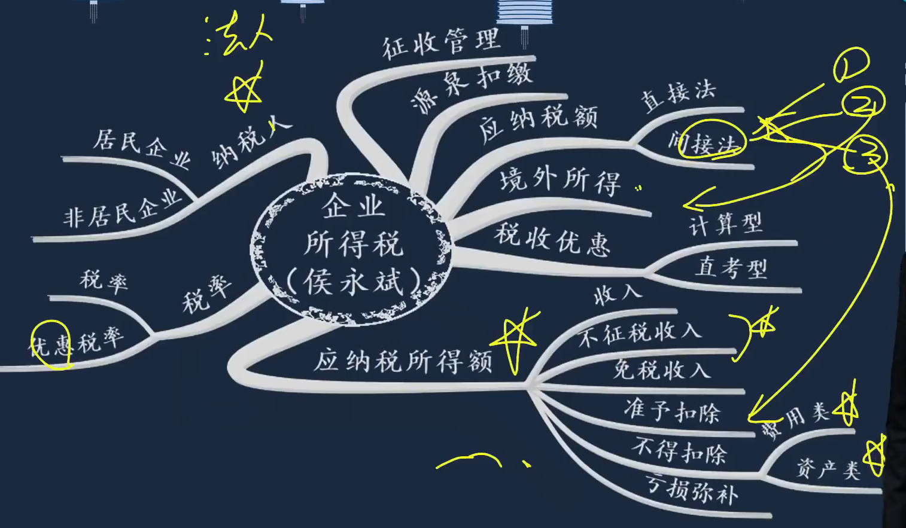

## 纳税人

[25%所得税高不高_百度搜索](https://www.baidu.com/s?ie=UTF-8&wd=25%25%E6%89%80%E5%BE%97%E7%A8%8E%E9%AB%98%E4%B8%8D%E9%AB%98)    

1. 纳税人：`我国境内的企业和其他取得收入的组织`
   1. 企业所得税==先税后分配==(税后利润分配给所有者)
   1. 个人所得税==先分后税==，利润先分给个人，再由个人交所得税
   1. 企业所得税，其实是`法人所得税`
      1. 个人独资企业等不是法人； 凡是法人，都交企业所得税
1. 分类
1. 纳税义务: 2者纳税义务不一样
   1. 居民企业：依据属人原则征收
   1. 非居民企业：依据属地原则征收
      1. 特殊：例，美国和澳洲企业，在加拿大签合同，把美企在中国的分支机构卖给澳企
1. `所得来源地`: 解决属地原则问题
   1. 权益性投资资产转让： a投资b，不想要了，把持有b的股份转让给c
   1. 股息、红利等权益性投资：a投资b，b要给a分红
   1. 利息、租金、特许权使用费： a借钱给b，b向a支付利息、租金、特许权使用费

|  |  |
| ------------------------------------------------------------ | ------------------------------------------------------------ |
|  |  |
|  |  |
|  | 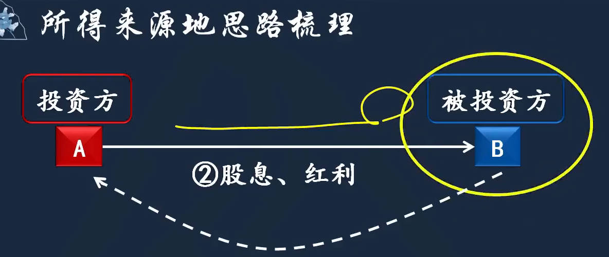 |
|  |                                                              |

## 税率

[企业所得税税率](https://mp.weixin.qq.com/s?__biz=MzU2MDkyMzc0Nw==&mid=2247543974&idx=2&sn=df24223570a0e7584f91321708a6ae2a&poc_token=HOO_omij64iUO-NHVAy3QyCFScMgWmHjs4O_rQm0)  

税率：25%、20%， 对应纳税义务

1. 25%
   1.  外国企业在中国卖土豆，一视同仁，都收25%
1. 20%
1. ==优惠税率==：10%、减按15%、20% 
   1. 10%：2类 
      1. 适用20%税率的非居民企业，实际执行时按10%执行
      1. 重点软件企业和集成电路设计企业
   1. `减按15%`征收: 共6类
   1. 20%: `小型微利企业`
      1. 160万，100万按12.5%，超过100万的部分按50%计入应纳税所得额
      1. $(100\times12.5\%+60\times50\%)\times20\%$

|  |  |
| ------------------------------------------------------------ | ------------------------------------------------------------ |
|  |                                                         |

## 应纳税所得额

[好：企业所得税计算](https://lx.acc5.com/calculator/2/)  

`应纳税所得额`：  ==企业所得税应纳税额 = 应纳税所得额 x 适用税率==

1. 直接法：应纳税所得额=收入总额-不征税收入-免税收入-各项扣除-准予弥补的以前年度亏损
   1. 假设没有会计准则，计算应纳税所得额的方法
   2. 收入
   3. 扣除： 扣除遵循的原则，`真实`(真实发生的费用)、`相关`(（合理性）费用的发生和取得的收入相关)、`限额`(超限的不能扣)
   4. 补亏： 5年以内的亏损可以扣除
2. 间接法：应纳税所得额=利润总额 + 纳税调整金额
   1. 把税法的规定和会计的规定，有差别的地方，进行调整

### 收入总额确定

1. 收入形式
   1. 货币形式：==固定或可确定的收入==
   1. 非货币形式: 非货币形式的收入不固定，要按公允价值确定收入额
2. **收入类别**
   1. 个人所得税要按收入的类别，分类确定计税的方法；
   1. 企业所得税不管什么类别的收入，都是一样的计税方法，谈收入类别，没什么意义。
3. 收入确认时间
4. 特殊销售方式下==收入金额确认==
   1. 销售货物
      1. `售后回购`：作为2笔业务处理； 卖一笔货，收到100万，接着商量，1年后，110万的价格再买回来，`其实是质押贷款`
      2. 以旧换新
      3. 商业折扣
      4. 现金折扣: 又称为销售折扣， 卖完了还给折扣，目的是为了收款，折扣作为财务费用
      5. 销售折让、退回
      6. 买一赠一
         1. 所得税处理：权重按各项商品的公允价值的比例进行分摊
         2. 增值税处理：视同销售
      7. 产品分成
   2. 提供劳务： 采用完工进度(完工百分比法)确认收入
   3. 租金
      1. 租赁期限跨年度，且租金提前一次性支付:  分期均匀计入相关年度收入
5. 视同销售

|  |  |
| ------------------------------------------------------------ | ------------------------------------------------------------ |
|  |  |
| 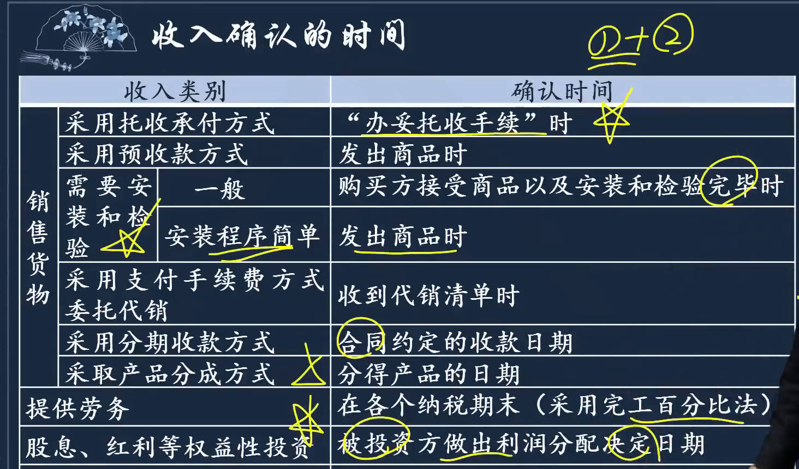 |  |
|  |  |
|  |  |
|  |  |
|  |  |
|  |                                                         |

### 不征税收入、免税收入

1. 不征税收入：企业==非经营行为==带来的收入
   1. 财政拨款
   2. 依法收取并纳入财政管理的行政事业性收费、政府性基金
   3. 不纳税收入用于支出形成的费用，不得扣除对应的折旧摊销
      1. 配比原则：有收入，可以扣成本； 没有收入，成本也不让扣

2. 免税收入: 企业的经营行为，但符合国家的鼓励方向
   1. 国债利息收入
   2. 股息红利等权益性投资收益：企业所得税是税后利润分配，已经征过税。符合条件是持有12月以上，鼓励投资不鼓励投机
      1. a投资b，b要给a分红，a取得的就是股息、红利等权益性投资收益； 企业所得税是税后利润分配，股息红利已经是税后收入
   3. 符合条件的非营利组织收入： 捐钱给红十字会

|  |  |
| ------------------------------------------------------------ | ------------------------------------------------------------ |
|  |                                                         |

### 税前==扣除项目==概述

[好： 企业所得税汇算清缴12项费用的扣除比例,视频更详细](https://zhuanlan.zhihu.com/p/596001319)   

[视频教程：2025年企业所得税汇算清缴申报（企业所得税年报、完整版35张表）](https://www.bilibili.com/video/BV19i4y1Z7tK/?vd_source=7346303e5e18677d7261c2c0c109ecfd)  

[企业所得税申报表_百度搜索](https://www.baidu.com/s?ie=utf-8&f=3&rsv_bp=1&tn=baidu&wd=%E4%BC%81%E4%B8%9A%E6%89%80%E5%BE%97%E7%A8%8E%E7%94%B3%E6%8A%A5%E8%A1%A8&oq=%25E4%25BC%2581%25E4%25B8%259A%25E6%2589%2580%25E5%25BE%2597%25E7%25A8%258E&rsv_pq=c9d63c610000b895&rsv_t=9121KYe3Yf%2BNqXVLIo0bZoIViIAkPyO%2B57%2FJkxjRz53M5hw8kdTCWgK%2BNqU&rqlang=cn&rsv_enter=1&rsv_dl=ts_3&rsv_sug3=9&rsv_sug1=5&rsv_sug7=100&rsv_sug2=1&rsv_btype=t&prefixsug=%25E4%25BC%2581%25E4%25B8%259A%25E6%2589%2580%25E5%25BE%2597%25E7%25A8%258E%25E7%2594%25B3%25E6%258A%25A5&rsp=3&inputT=8255&rsv_sug4=9900)  [企业所得税年度纳税申报主表填写及模板](https://mp.weixin.qq.com/s?__biz=MzkxNTQ3MTY2Mg==&mid=2247522910&idx=2&sn=417271be786b0ea4faf5ec642bdbc9e1&poc_token=HAL8omijaoywRzgmGmey7zWQSc7ZT8Z9ag_l-P3o)      [企业清算所得税申报表模板](https://mp.weixin.qq.com/s?__biz=MzkxNTQ3MTY2Mg==&mid=2247520761&idx=3&sn=e809ff5b25e98c6123f89b1e4ef8304a&poc_token=HP_7omijZ31XCdUR3u3EiXEdEUjXd_cRfFLzVAL2)    [35张2025年企业所得税汇算清缴年度纳税申报表模板（带公式）](https://zhuanlan.zhihu.com/p/25046246661)     [汇算清缴35张申报表填报说明及公式.xlsx](https://zhuanlan.zhihu.com/p/1888969012681106607)  [表](https://www.zhihu.com/people/hui-ji-helper)     [企业所得税预缴纳税申报表有这些新变化_国家税务总局](https://www.chinatax.gov.cn/chinatax/n810356/n3010387/c5241910/content.html)     

[《中华人民共和国企业所得税年度纳税申报表（A类，2017年版）》（2024年度适用）](https://guangdong.chinatax.gov.cn/gdsw/gzsw_qyndsbbtx/2025-02/25/content_a00e6f7235cc4e7c988815d615a6bfda.shtml)      [《中华人民共和国企业所得税年度纳税申报表（A 类，2017年版）》部分表单及填报说明（2024年修订）](https://shanghai.chinatax.gov.cn/bsfw/xzzx/bgxz/sbzsl/202501/t474994.html)  

[2025年企业所得税汇算清缴35张申报表_百度搜索](https://www.baidu.com/s?ie=UTF-8&wd=2025%E5%B9%B4%E4%BC%81%E4%B8%9A%E6%89%80%E5%BE%97%E7%A8%8E%E6%B1%87%E7%AE%97%E6%B8%85%E7%BC%B435%E5%BC%A0%E7%94%B3%E6%8A%A5%E8%A1%A8)     [25年企业所得税汇算清缴申报流程与注意事项](https://baijiahao.baidu.com/s?id=1825089309770894988&wfr=spider&for=pc)   

准予在税前扣除的有4项

1. **成本**:无考点，配比原则，有收入，必然有成本，合理的成本一律可以扣除
2. **费用**：考核重点，扣除3大原则，`真实性、相关性、限额（合理性）`
3. **税金**
   1. 不得扣除的税金
      1. 准予抵扣的增值税：价外税，根本不计入收入，当然不能从收入里减
      2. 预缴的企业所得税
   2. 准予扣除的税金
4. **损失**
   1. 准予扣除的损失
      1. 不管什么原因损失的资产，计算所得税都能扣除
   2. 不得扣除的损失
      1. 违法犯罪造成的损失
   3. `损失资产收回`的税务处理
   4. 损失的申报
      1. 税法认实际发生，不认预提、计提
   5. `以前年度`资产损失的追补
      1. 追补年限一般不超过5年

|  | 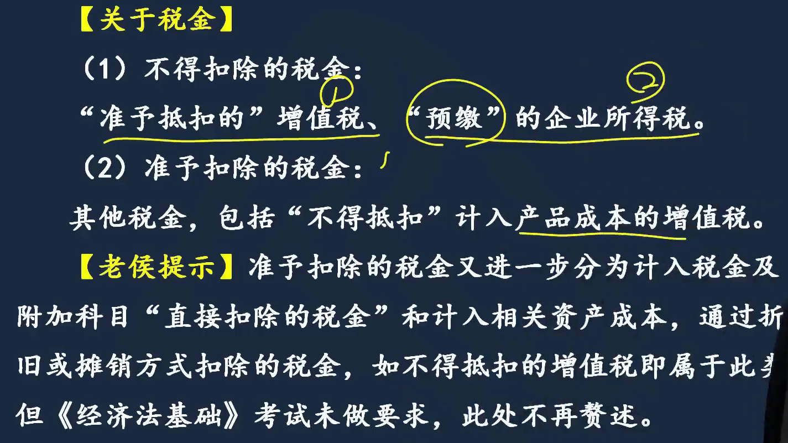 |
| ------------------------------------------------------------ | ------------------------------------------------------------ |
|  |  |
|  |  |
|  |                                                         |

#### 各类费用的具体扣除规定

1. 和工资薪金有关的三项经费
   1. 上年转下来加今年发生的一共25，今年准予扣除限额上限24，剩下1继续向明年结转

2. 保险费
3. 利息费用
   1. 利息有资本化、费用化，借款为了研发、构建不动产，属于资本化支出； 经营性借款是费用化处理
   2. 金融企业借款利息，即跟银行的借款，利息是国务院指导范围内制定的，合理相关的利率

4. 公益性捐赠
   1. 非货币资产捐赠中发生的相关支出，有公益捐赠票据，按捐赠支出扣除； 没证据的，按企业相关费用扣除

5. 业务招待费
   1. 扣除比例：实际发生额60%，和销售收入的千分之5，两者按小的扣

6. 广告、业务宣传费
   1. 关联企业广宣费的扣除： 关联企业都卖a产品，有广宣费分摊协议，乙的扣除限额，不加甲分摊过来广宣费
      1. 关联企业甲乙都卖a产品，甲给a打的广告，要乙分摊40%，甲发生的100万广宣费，乙承担40万
      2. 乙销售收入2000万，发生的广宣费280万，乙能扣300，归集过来的40万不计算在乙扣除限额内

7. 租赁费用     [融资租赁_百度百科](https://baike.baidu.com/item/%E8%9E%8D%E8%B5%84%E7%A7%9F%E8%B5%81/633886)  [融资租赁的三种形式_百度搜索](https://www.baidu.com/s?wd=%E8%9E%8D%E8%B5%84%E7%A7%9F%E8%B5%81%E7%9A%84%E4%B8%89%E7%A7%8D%E5%BD%A2%E5%BC%8F&usm=2&ie=utf-8&oq=%E7%BB%8F%E8%90%A5%E7%A7%9F%E8%B5%81%20%E8%9E%8D%E8%B5%84%E7%A7%9F%E8%B5%81&rsf=101634503&rsv_dl=0_prs_28608_2)  
   1. 融资租赁：作为承租方自有资产核算，计提折旧扣除

8. 手续费及佣金
9. 党组织工作经费
10. 其他准予扣除项目

|  |  |
| ------------------------------------------------------------ | ------------------------------------------------------------ |
|  |  |
|  |  |
|  |  |
|  |  |
|  |  |
|  |  |
|  | 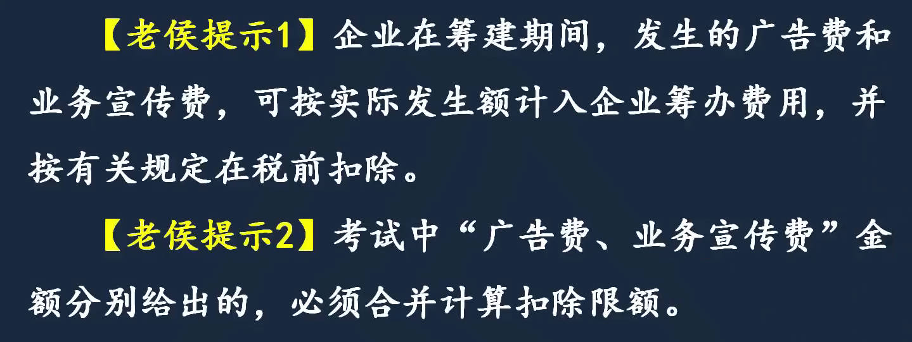 |
|  |  |
|  |  |
|  |  |
|  |  |

#### 不得扣除的支出(费用类不得扣除)

[不允许使用后进先出](https://www.baidu.com/s?ie=UTF-8&wd=不允许使用后进先出)  

6. 不得扣除的支出(费用类不得扣除项目)
   1. 股息、红利等权益性投资收益
   2. 企业所得税税款
   3. 税收滞纳金
   4. 罚金、罚款和被没收财物的损失
   5. 超过规定标准的公益性捐赠支出及所有非公益性捐赠支出
   6. 赞助支出
   7. 未经核定的准备金支出
      1. 税法认的是实际发生，未经核定，你计提了，一律不得扣除，没发生，`不真实`

   8. 不合理支出
      1. 企业之间是平等民事主体，不会有管理关系，所以是`不合理`支出
      2. 左手转右手，企业内部的资金转移，没有涉外，不是合理支出

7. 资产类不得扣除项目
8. 亏损的弥补

|  |  |
| ------------------------------------------------------------ | ------------------------------------------------------------ |
|  |                                                         |

#### 资产类不得扣除项目

[经营性租赁和融资租赁区别](https://www.dongao.com/wdzt/zckjs_jingyingxingzulin_1018974/)   [经营租赁和融资租赁](https://www.dongao.com/zckjs/cg/201905071018989.shtml)   [融资租赁的三种形式_百度搜索](https://www.baidu.com/s?wd=%E8%9E%8D%E8%B5%84%E7%A7%9F%E8%B5%81%E7%9A%84%E4%B8%89%E7%A7%8D%E5%BD%A2%E5%BC%8F&usm=2&ie=utf-8&rsv_pq=ff126b7100473e51&oq=%E7%BB%8F%E8%90%A5%E7%A7%9F%E8%B5%81%20%E8%9E%8D%E8%B5%84%E7%A7%9F%E8%B5%81&rsv_t=6aff4NS3vjBsoCSVE8ZRVTHdOxoOwCHUcE%2B%2BZ3XmZAIKcp%2F%2BRMNbIVB5hgI&rsf=101634503&rsv_dl=0_prs_28608_2)  

1. ==固定资产和生产性生物资产==：不得计提折旧的项目
   1. 不得在税前计算折旧扣除掉固定资产
      1. 未投入使用的房屋，可以计提折旧； 未投入使用的设备，不能计提折旧
      2. 经营租赁，出租方做自有资产核算提折旧，==租入==方租金做费用化处理,==不能提折旧==
         1. 融资租赁是租入方做自有资产核算提折旧，==出租方不能提折旧==
      3. 很久以前作为固定资产入账的土地，不可能按地球寿命提折旧： 现在土地，叫土地使用权，作为无形资产核算
   2. 固定资产的计税基础：即入账价值
   3. 固定资产折旧计提方式
      1. 税法只认直线法
   4. 生产性和消耗性生物资产：下蛋鸡和炸鸡; 果树、树枝烧炭、奶牛、耕牛
      1. 生产性生物资产的计税基础
   5. 固定资产和生产性生物资产的==最低折旧年限==
2. 无形资产： 以摊销方式扣除
   1. 不得计提摊销的
   2. 无形资产计税基础
   3. 摊销方法
   4. 摊销年限
3. 长期待摊费用
4. 投资资产
   1. 长期股权投资：会计上有成本法、权益法
   2. 税法只认成本法，不能扣除: 借：长投  贷：银存，都是资产, 只是资产形态的变化

5. 存货计价
   1. 后进先出： 超市买牛奶， 肯定买生产日期靠后的

|  |  |
| ------------------------------------------------------------ | ------------------------------------------------------------ |
|  |  |
|  |  |
|  |  |
|  | 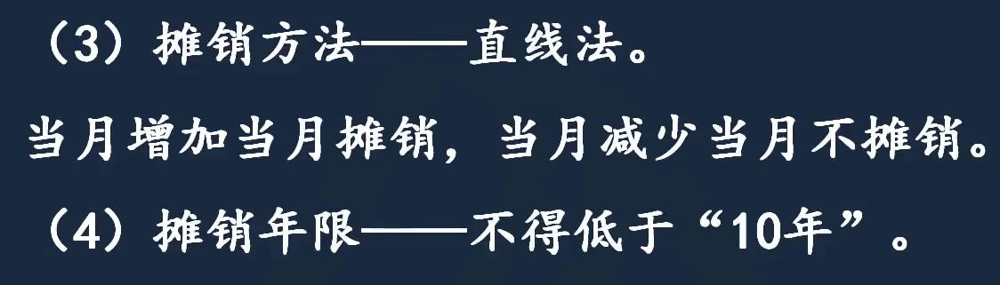 |
|  |  |
|  |  |

### 亏损弥补

一般企业弥补5年，特殊企业弥补10年

|  |  |
| ------------------------------------------------------------ | ------------------------------------------------------------ |

## 税收优惠

[加计扣除_百度搜索](https://www.baidu.com/s?ie=UTF-8&wd=%E5%8A%A0%E8%AE%A1%E6%89%A3%E9%99%A4)   [加计抵减、加计扣除、加计抵扣区别](https://mp.weixin.qq.com/s?__biz=MzAwNjA4ODA0Mw==&mid=2454775906&idx=3&sn=850fbf36f200cac3e2b1526bc9777e4c&poc_token=HPGJjGij7lLL-apHRZh0ZGX-imQwFteTzDM0Zldr)   

1. 税收优惠形式
   1. 免税收入
   2. 可以减免税的所得
      1. 免征
      2. 减半征收
      3. 二年免征三年减半征收
      4. 三免三减半
      5. 五免
      6. 五免五减半
      7. 十免

   3. 优惠税率等等
   4. 很多，可以在不定项中考核，或直接考核

2. 以计算形式，在==不定项中考核==
   1. `加计扣除`: 加算费用， 例残疾人工资，计算费用时多扣100%
   2. `抵扣应纳税所得额`：例投资额的70%，抵扣应纳税所得额
      1. $(应纳税所得额-投资额\times70\%)\times25\%$
   3. `应纳税额抵免`
      1. $应纳税所得额\times25\%-投资额\times10\%$
   
3. ==直接考核==的税收优惠
   1. 直接调整
      1. 加速折旧：缩短折旧年限的上限，不能低于税法规定年限的60%
         1. 只要不是房屋建筑物，单价500万以下，例单位买汽车，可以一次性扣除，不用计提折旧
   
      2. `减计收入`： 减按90%计入收入总额

   2. `单选题`： 给了利润总额，一个调整项目，让求应纳税所得额； 考的是间接法的调整，又结合了税收优惠
      1. 500万以内免征，超过减半征收： $技术转让所得 = 收入 - 成本$
   
      2. 第一种调整方法： 直接调(`应纳税额调增调减`)，==算出不需要交税的部分，再减去==
         1. 700利润里只有100需要交税，600不需要交税
   
         2. 税法：(800-100-500)x50%=100，要交的
         3. 会计：800-100=700，会计上计入的利润，税法说这700里只有100要交税
            1. 700-100=600，不需要交税的部分
         4. 应纳税所得额：2000-600=1400
         5. 500免征，加超过500的一半免征，600免征，2000-（500+100）=1400
      3. 第二种调整方法： ==先会计利润里剔除，再加回税法规定的部分==
         1. 调整的部分，假设不存在，从会计利润剔除
            1. 收入加了800，先减掉，减掉的100，先加上
            2. 2000-800+100=1300，得到会计和税法没有差异的部分
         2. 最后加上技术转让所得，按照税法规定，应当计入应纳税所得的部分，1300+100
            1. 税法：(800-100-500)x50%=100，要交的

|  |  |
| ------------------------------------------------------------ | ------------------------------------------------------------ |
|  |  |
|  |  |
|  |  |
|  |  |
|  |  |

### 境外所得抵免税额计算

境外所得在国外交的所得税额，可以在国内抵免应纳税额

外国依据属地原则收的税，在国内可以抵扣一部分

- 否则外国依据属地原则收税，国内依据属人原则收税，企业被2边征税
- 抵免限额： 在国内交25%，那在国外所得最多抵免25%

|  |  |
| ------------------------------------------------------------ | ------------------------------------------------------------ |
|  |  |
|  |                                                         |

## ==应纳税额计算==

1. `应纳税额`计算：	应纳税额=应纳税所得额 x 税率 - 减(抵)免税额 + 国外所得补缴税款
   1. 计算应纳税所得额
      1. 直接法
         1. 前面讲的是直接法，下面用间接法
      2. 间接法: 2种计算方法:  计算差异进行调整、问题拿出来单独处理
         1. 调增调减：==影响损益==的要调，会计准则和税法规定不一样的要调整。
         2. `前面税收优惠里的单选题`： 给了利润总额，一个调整项目，让求应纳税所得额； 考的是间接法的调整，又结合了税收优惠
            1. 500万以内免征，超过减半征收： $技术转让所得 = 收入 - 成本$
         
            2. 第一种调整方法： 直接调(`应纳税额调增调减`)，==算出不需要交税的部分，再减去==
               1. 应纳税所得额：2000-600=1400
               2. 500免征，加超过500的一半免征，600免征，2000-（500+100）=1400
            3. 第二种调整方法： ==先会计利润里剔除，再加回税法规定的部分==
               1. 调整的部分，假设不存在，从会计利润剔除
                  1. 收入加了800，先减掉，减掉的100，先加上
                  2. 2000-800+100=1300，得到会计和税法没有差异的部分
               2. 最后加上技术转让所得，按照税法规定，应当计入应纳税所得的部分，1300+100
                  1. 税法：(800-100-500)x50%=100，要交的
   2. 计算应纳税额
      1. 例1
         1. 不分国： 境外境内合并计算，计算==抵免额==
         2. 分国： 境内应纳税额加境外应补税额，计算==补交额==
      2. 例2
         1. 计算差异进行调整:  `应纳税额调增调减`
         2. 把问题拿出来单独处理

|  |  |
| ------------------------------------------------------------ | ------------------------------------------------------------ |
|  |  |
|  |                                                         |

## 源泉扣缴

`源泉扣缴`：就是增值税里的代扣代缴，国内买方先把税扣了，将税后利润支付给国外卖方

1. 适用范围: 非居民企业
2. 非居民企业应纳税所得额
   1. 余额计税：财产不是白来的，例境外企业转让境内的不动产，不动产是当年花钱买的，有成本，允许扣减取得时的成本

|  |  |
| ------------------------------------------------------------ | ------------------------------------------------------------ |
|  |  |

## 征收管理

企业所得税只能按年征，因为所有行业都有旺季和淡季，这个月赚钱，下个月亏钱

- 分月分季预缴，因为公务员要月月发工资

|  |  |
| ------------------------------------------------------------ | ------------------------------------------------------------ |
|  |  |
|  |                                                              |

# 2、个人所得税

|  |  |
| ------------------------------------------------------------ | ------------------------------------------------------------ |

## 纳税人、征税对象

[个税计算器2023](http://www.geshuiba.com/)  [2023杭州最低社保基数要交多少钱](http://g.bm.manmankan.com/hangzhou/202304/11364.shtml) [医疗保险缴费计算](https://www.66law.cn/laws/646787.aspx)   [2024杭州个税应纳税额计算_百度搜索](https://www.baidu.com/s?ie=UTF-8&wd=2024%E6%9D%AD%E5%B7%9E%E4%B8%AA%E7%A8%8E%E5%BA%94%E7%BA%B3%E7%A8%8E%E9%A2%9D%E8%AE%A1%E7%AE%97)  

纳税人和征税对象

1. 纳税人：分类所得税制 => 综合所得税制；1980、1986、2018
1. 纳税人分类和纳税义务
   1. 居民
      1. 有住所：在中国境内习惯性居住，不是指有房子

   1. 非居民
      1. 依据属地原则征收: 外国人国外的收入，跟中国没任何关联，不可能交个税
   
1. 所得"来源"地界定： 怎么界定来源于中国境内的所得，就得给我国交个税

|  |  |
| ------------------------------------------------------------ | ------------------------------------------------------------ |
|  |  |

## 税目类别

[个税是分类列出_百度搜索](https://www.baidu.com/s?ie=utf-8&f=8&rsv_bp=1&tn=baidu&wd=%E4%B8%AA%E7%A8%8E%E6%98%AF%E5%88%86%E7%B1%BB%E5%88%97%E5%87%BA&oq=%25E4%25B8%25AA%25E7%25A8%258E%25E6%2598%25AF%25E5%2588%2597%25E4%25B8%25BE&rqlang=cn&rsv_dl=tb&rsv_enter=1&rsv_sug3=12&rsv_sug1=4&rsv_sug7=100&rsv_sug2=0&rsv_btype=t&inputT=9425&rsv_sug4=11531&bs=%E4%B8%AA%E7%A8%8E%E6%98%AF%E5%88%97%E4%B8%BE&rsv_jmp=fail)   [个税9项4大类](https://baijiahao.baidu.com/s?id=1773931685529801610&wfr=spider&for=pc) [9类](https://mbd.baidu.com/newspage/data/dtlandingsuper?nid=dt_4609601173630314393&sourceFrom=search_a)    

按所得来源不同， 分为==9个项目4大类==别:  有的分3项(劳务所得、经营所得、其他所得)

1. 综合所得
2. 经营所得
3. 财产所得
4. 偶然所得

==9项==: `工资、劳务、稿酬、特许权`、生产经营、财产转让、财产租赁、利息股息和偶然所得

### 综合所得

不是把个人所有收入综合，只是小综合，出卖劳动力所得: 工资薪金、劳务报酬、稿酬、特许权使用费

1. `综合所得概述`
   1. 居民按纳税年度合并计算，综合所得4项只适用于居民，==居民才综合==； 非居民不综合，按月或次分项计算
1. `综合所得税目`
   1. 工资薪金所得： ==非独立==个人劳动所得
      1. 非独立：集体劳动，分工合作
      1. 特殊规定
   1. 劳务报酬所得：  个人==独立==从事 " 非雇佣的 " 劳务所得
      1. 律助给律师个人工作
   1. 稿酬：   个人作品 "出版、发表" 取得的所得
   1. 特许权使用费 ：这4种(专利、商标、著作、非专利技术)， 所有权转让和使用权转让都是，特许权使用费所得
      1. 无形资产(除土地使用权)的使用权和所有权转让，都要归类为特许权使用费所得
      1. 特别规定
1. 居民个人“综合所得” ==计税方法==的一般规定
   1. 按年计征，分月或分次预缴，年终汇算清缴

#### 综合所得项目

|  |  |
| ------------------------------------------------------------ | ------------------------------------------------------------ |
|  |  |
|  |  |
|  |  |
|  |  |
|  |                                                              |

#### 年终==汇算清缴==应纳税额计算

[杭州个人所得税专项附加扣除细则](https://m.hz.bendibao.com/live/74535.shtm)   [杭州2025个税专项附加扣除_百度搜索](https://www.baidu.com/s?ie=UTF-8&wd=%E6%9D%AD%E5%B7%9E2025%E4%B8%AA%E7%A8%8E%E4%B8%93%E9%A1%B9%E9%99%84%E5%8A%A0%E6%89%A3%E9%99%A4)     [怎么才能少交个税](https://baijiahao.baidu.com/s?id=1842863721890897113&wfr=spider&for=pc)   

居民个人==综合所得年终汇算清缴==应纳税额计算: 先讲汇算清缴是为了解决公式的应用； 之后再讲综合所得每个项目预扣预缴的计算

1. 适用税率：综合所得执行 ==3%～45% 七级超额累进==税率
2. 应纳税所得额： `定额扣除(生计费) + 附加扣除(其他3个)` 
   1. $\color{blue}\Large应纳税所得额=每年收入额-生计费-专项扣除-专项附加扣除-其他扣除$
   2. `收入的确定`
      1. 劳务报酬、特许权使用费：减20%费用，因为工资薪金，每个月预缴时，可以扣生计费，而这2个预缴时，没有生计费扣除，但它们也要活着，所以规定扣20%日常生活开支
      2. 稿酬：减20%费用计入收入额，并减按70%计算，鼓励创作
   3. `生计费`：每年扣除限额60000
   4. `专项扣除`： 个人负担的三险一金
   5. `专项附加扣除`： 子女教育、赡养老人、继续教育、大病医疗、住房贷款利息、住房租金
   6. `其他扣除`：企业年金、商业健康保险等补充保险
      1. 商业健康险扣除： 2400元每年
3. 应纳税额
   1. $\color{blue}\Large应纳税额=应纳税所得额\times适用税率-速算扣除数$
   2. 根据额累定义计算： 依所属税率等级分段计算，最后相加汇总
      1. 一档一档计算很麻烦，所以用速算扣除数
   3. 速算扣除数原理: C-D
      1. A+B: 36000x3%是长方形A的面积，21600x10%是长方形B的面积
      2. 速算扣除数是D的面积

|  |  |
| ------------------------------------------------------------ | ------------------------------------------------------------ |
|  |  |
|  |  |
|  |  |
|  |  |
| 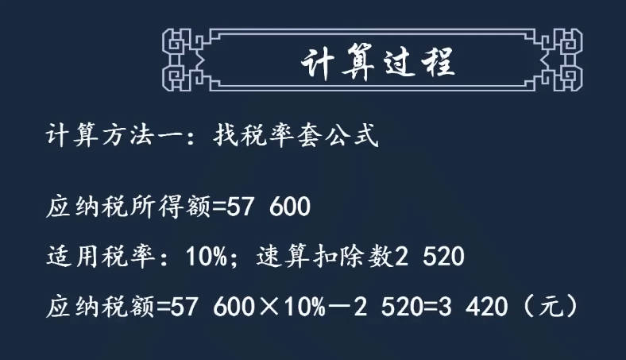 |  |
|  |                                                              |

#### 分月或分次==预扣预缴==计税规定

[居民个人工资、薪金所得的预扣预缴](https://www.dongao.com/cjks/jjfjc/202408014463538.html)  

预缴： 根据综合所得不同项目，它的方法是不一样的

1. 工资薪金所得是按月预扣预缴，累计预扣预缴制

> 5. 居民个人“综合所得”分月或分次预扣预缴个人所得税计税规定
>    1. 工资薪金所得
>       1. **按月**取得工资、薪金所得
>          1. ==累计预扣预缴==应纳税所得额
>             1. 1个月就累计1个月的收入，累计一个月的费用，第2个月就把上个月的，也都加上
>                1. 第2个月加上第1个月的收入、费用，收入全加，扣的费用也全加，当累计到第12个月时，会发现全年的收入累计到一起，费用也累计到一起
>                1. 第12个月算出一个`应纳税额`，前11个月的预缴税款，减掉之后，去补交第12个月的当月税款
>                1. 最终全年的应纳税额，就和汇算清缴算出的应纳税额完全一样
>             1. $\color{blue}累计预扣预缴应纳税所得额=累计收入-累计免税收入-累计减除费用-累计专项扣除-累计专项附加扣除-累计依法确定的其他扣除$
>          2. ==本期==应预扣预缴==税额==
>             1. $\color{blue}本期应预扣预缴税额=(累计预扣预缴应纳税所得额\times预扣率-速算扣除数)-累计减免税额-累计已预扣预缴税额$
>          3. 累计减除费用
>             1. 首次参加工作入职当月：不是换工作，而是第一次参加工作
>                1. 7月1号入职，累计生计费扣除： 7x5000
>             2. 低收入劳动者：收入弹性大，同时又不是特别高的
>       2. 单位低价向职工售房
>       3. 企业年金、职业年金
>    2. 劳务报酬所得、稿酬所得、特许权使用费所得
>       1. 适用税率：**按次**
>       2. 应纳税所得额：==定额和定率相结合==的扣除方式

综合所得分月或分次预扣预缴计税规定

##### 工资薪金所得

|  |  |
| ------------------------------------------------------------ | ------------------------------------------------------------ |
|  |  |
|  |  |
|  |  |
|  |  |

##### 劳务报酬、稿酬、特许权使用费所得

[稿酬应纳税额计算器](https://www.gerensuodeshui.cn/index_gcsd.html)  

1. 适用税率：**按月或按次预缴**
   1. 劳务报酬所得
      1. 3级超额累进预扣率
      2. 大学生实习：可按劳务报酬所得计算，因为没签合同，也可按累计预扣制计算，因为和其他员工上班一样
         1. 是劳务报酬，但计税规则可按工资薪金
   2. 稿酬所得、特许权使用费所得
      1. 20%单一比例税率
2. 应纳税所得额：劳务报酬、稿酬、特许权使用费，应纳税所得额采用==定额和定率相结合==的扣除方式
   1. 汇算清缴时，这3个不分是多少，一律扣20%
      1. 预扣预缴时，不足4000，扣800，采用定额定率结合的扣除方法
   2. 每次收入额$\color{blue}\large\le$4000，减800
   3. 每次收入额$\color{blue}\large>$4000，扣20%， $\color{blue}\large应纳税所得额=每次收入额\times(1-20\%)$

|  |  |
| ------------------------------------------------------------ | ------------------------------------------------------------ |
|  |  |
|  |  |
| 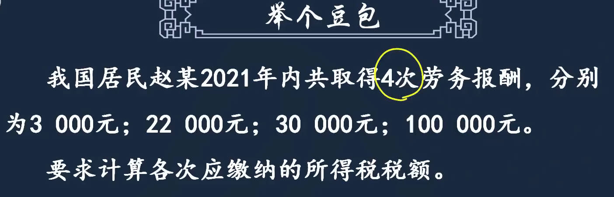 | 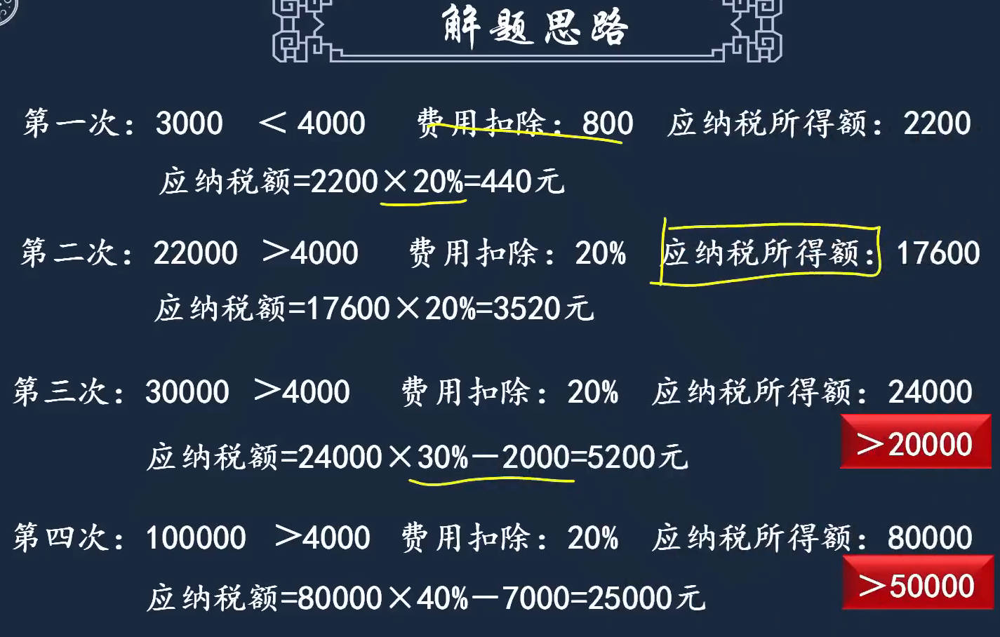 |
|  |  |
|  |  |
|  |  |
|  |  |

### 经营所得

1. 税目
   1. 基本规定
   1. 征税范围特殊规定
      1. 企业为个人购买资产
         1. 给投资者、投资者媳妇买房，`相当于给投资者分配利润`，先分后税，到你手里就是你的个人所得
         2. 向法人投资者或他的家人买房，相当于给公司股东买房，`相当于给股东分配利润`，股东按利息、股息红利所得，去缴纳个人所得
         3. 不是投资者，也不是股东，例如员工年底抽奖，抽个汽车，相`当于给员工发工资`
2. 应纳税额计算
   1. 计税方法、税率：`按年计征，五级超额累进税率`
   2. 应纳税所得额： 收入总额 - 成本 - 费用及损失后的余额 
      1. 计税依据和企业所得税应纳税所得额的计算类似
      2. ==费用扣除上和企业所得税有区别==
         1. 业主本人工资不能扣
         2. 业主本人上着班，还做着小买卖：生计费等在工资薪金里扣了，经营所得里不能再扣

|  |  |
| ------------------------------------------------------------ | ------------------------------------------------------------ |
|  |  |
|  |  |
|  |  |
|  |  |

### 财产所得

#### 财产租赁所得

1. 税目
   1. 特别规定：原价8000/平，卖给个人6000/平，个人5年内要无偿提供给开发商对外出租，租金收入相当于冲抵房价的优惠，这种情况下，个人少支出的购房款，相当于个人的财产租赁所得

2. 应纳税额计算
   1. 计税方法：每套住房1个月内取得的收入为一次
   2. 税率：个人出租住房10%，个人出租非住房20%，
   3. 应纳税所得额
      1. 定额加定率扣除
         1. 增值税是价外税，不能扣除
      2. 房屋租赁期间修缮费用，每月最多扣800，多出部分以后扣除
   4. 应纳税额
      1. 判断是否达到4000计数：不是每月的收入额，而是$\color{blue}收入额 - 租赁中缴纳的税费 - 修缮费$

|  |  |
| ------------------------------------------------------------ | ------------------------------------------------------------ |
|  |  |
|  |  |
|  |                                                              |

#### 财产转让所得

1. 税目
   1. 基本规定
      1. 股权转让所得
         1. 限售股：限制公开转让，可通过私下的协议方式转让
         2. 回收转让股权：原来卖给你，但现在要拿回来
   2. 企业改制职工取得量化资产税务处理
   3. 视同转让
2. 应纳税额计算
   1. 税率: 20%
   2. 应纳税所得额
      1. $应纳税所得 = 转让财产收入 - 原值 - 合理费用$
      2. 原值即买价，相当于成本
   3. 应纳税额 = 应纳税所得额 x 20%
      1. 转让时是卖方，取得房屋时是买方，增值税不能抵扣，计入成本

|  |  |
| ------------------------------------------------------------ | ------------------------------------------------------------ |
| 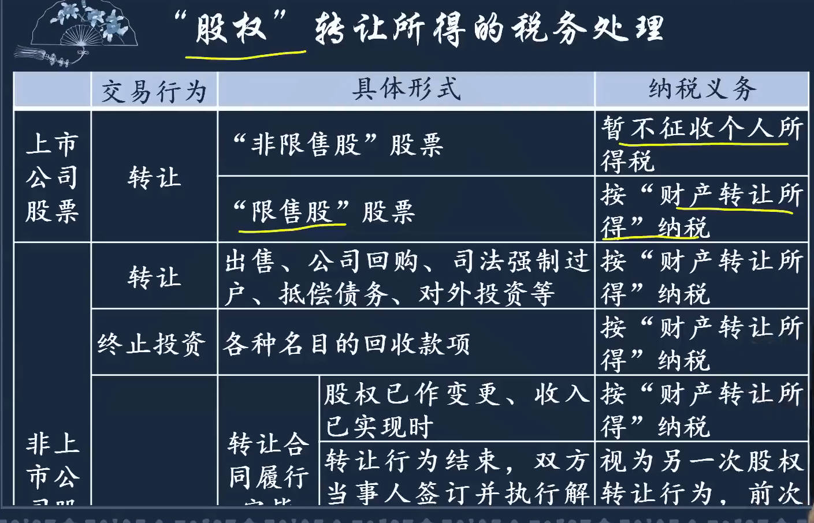 |  |
|  |  |
|  |  |
|  |  |
|  |                                                         |

### 利息、股息、红利所得

应纳税额计算：按次计征，20%

1. 利息、股息、红利所得税目
   1. 基本规定： 个人拥有`债权、股权`等取得的利息、股息、红利性质的所得
   2. 特殊规定
      1. 开发商拿房子抵押，不能办产权证，就和买房人商量，暂时办不了证，你可以使用但不能卖，约定一个时期后如果还没证，你可以无条件退房，相当于开发商占用你资金，给你补偿款(利息)
      2. 购买价款低于净资产价格，低价买来的，相当于挣钱了
2. 偶然所得税目

|  |  |
| ------------------------------------------------------------ | ------------------------------------------------------------ |
|  |  |

### 偶然所得

1. 税目
   1. 基本规定
   2. 特别规定
      1. 企业促销所得
      2. 担保所得： 承担担保责任有偶然性，对方可能还不了钱
      3. 受赠所得
      4. 发票和彩票中奖所得的起征点
         1. 发票800，彩票1万
2. 应纳税额计算
   1. 按次计征，20%

|  |  |
| ------------------------------------------------------------ | ------------------------------------------------------------ |
|  |  |
| 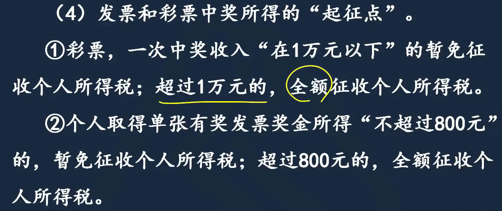 |  |

### 捐赠的扣除

捐赠不是个人所得项目，但可以和所有个人所得项目结合，所有所得都能捐

1. 公益性捐赠
   1. 限额扣除：和应纳税所得额比较，最多扣应纳税所得额30%， 从应纳税所得额扣
   2. 全额扣除
2. 非公益性捐赠

| 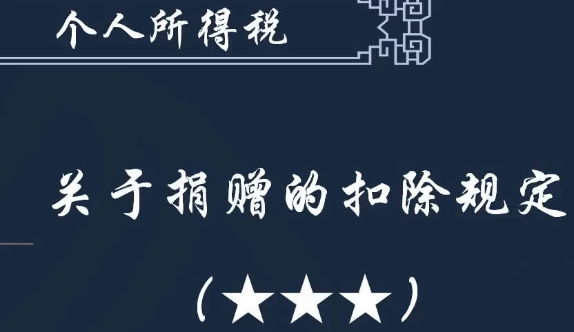 |  |
| ------------------------------------------------------------ | ------------------------------------------------------------ |
|  |  |
|  |  |

### 个税应纳税额总结

|  |  |
| ------------------------------------------------------------ | ------------------------------------------------------------ |
|  |                                                         |
## 税收优惠

1. 可结合不定项选择题考核的减免税
2. 直接考核的减免税

|  |  |
| ------------------------------------------------------------ | ------------------------------------------------------------ |
|  |  |
|  |  |
|  |  |
|  |  |

## 征收管理

[个税税务机关给付2%手续费_百度搜索](https://www.baidu.com/s?ie=UTF-8&wd=%E4%B8%AA%E7%A8%8E%E7%A8%8E%E5%8A%A1%E6%9C%BA%E5%85%B3%E7%BB%99%E4%BB%982%25%E6%89%8B%E7%BB%AD%E8%B4%B9)  

1. 纳税申报
   1. 代扣代缴为主
      1. 税务机关对扣缴义务人按照其所扣缴的税款金额,支付一定比例(即2%)的费用作为补偿和奖励
   2. 自行申报为辅：要么多交，要么少交
2. 纳税期限

|  |  |
| ------------------------------------------------------------ | ------------------------------------------------------------ |
|  |  |
|  |  |
|  |  |
|  |  |
|  |  |

 c
