18税：

[2022经济法基础](https://www.youtube.com/watch?v=cuUG5jlPcEY&list=PL7OHlWPKg-a3kcVp7ddkhM2JZrvf65Jzz&index=87)  [18税_百度搜索](https://www.baidu.com/s?ie=UTF-8&wd=18%E7%A8%8E)  [十八种税率](http://www.360doc.com/content/25/0611/14/642066_1155291923.shtml)  [十八税](https://zhuanlan.zhihu.com/p/685197675)  [18税](https://baijiahao.baidu.com/s?id=1774279144412949912&wfr=spider&for=pc)  [18大税种](https://baijiahao.baidu.com/s?id=1785885407169845749&wfr=spider&for=pc)  [2025年18税税率表,计算公式+账务处理](https://baijiahao.baidu.com/s?id=1827186648829270993&wfr=spider&for=pc)  [十八税解析](https://baijiahao.baidu.com/s?id=1817132519027893690&wfr=spider&for=pc)  [18税](https://mp.weixin.qq.com/mp/wappoc_appmsgcaptcha?poc_token=HGWVnWijI6OK_wvd1Jh7lyiDA5njbQSYIhMLHbGF&target_url=https%3A%2F%2Fmp.weixin.qq.com%2Fs%3F__biz%3DMzAwNjA4ODA0Mw%3D%3D%26mid%3D2454777163%26idx%3D2%26sn%3D1d7e9a4b1d39af04c5bfe139a90a7d69)  

税率表：

[18税种税率表](https://mp.weixin.qq.com/s?__biz=MzU2MDkyMzc0Nw==&mid=2247543974&idx=2&sn=df24223570a0e7584f91321708a6ae2a&poc_token=HKPWq2ij83tk8IzLKC8EsONK7-XWUIgRTR-LCN49)  

18税计算：

[法行宝-法律计算器](https://ailegal.baidu.com/?fr=ai_alad_jisuanqi&tab=calculator)  [18税种的自动计算器](https://zhuanlan.zhihu.com/p/644721620)  [18个税种应纳税额自动计算](https://www.hqjy.com/zj-2/6544.html)   

[个税计算器2025](https://www.gerensuodeshui.cn/city/%CE%E4%BA%BA.html)  [个税计算-人事星球](https://www.rsxq.com/geshuijisuan/)   [2024年个人所得税计算表](https://www.kkexcel.com/biaoge/caiwu/2024-07-29/63.html)   [18个税种应纳税额计算模板](https://mp.weixin.qq.com/s?__biz=MzIxNzUxOTMzOA==&mid=2247710665&idx=2&sn=1f2ef31b2efd1122afc68bd8b25e1b73&poc_token=HNcBoGijXDEB7_t1Tbw5l22LZH5txfKZxnE7N7As)   

企业所得税计算：

[计算企业所得税所有公式](https://ailegal.baidu.com/?fr=seo_qadetail&template=business&articleType=qadetail&articleId=7bee781cd068bb241126)   [好： 企业所得税计算器](https://zhuanlan.zhihu.com/p/596001319)   [好：企业所得税计算](https://lx.acc5.com/calculator/2/)  

[企业所得税计算案例分析](https://mp.weixin.qq.com/s?__biz=MzkxNTQ3MTY2Mg==&mid=2247526015&idx=4&sn=75eee27a488e0a531f2819970eca0881&poc_token=HGPfomijyL_Adeq8zVrMN3Cw5hBoz9-8mCHXWckH)   

企业总负税：

[税负率](https://www.dongao.com/scjy/wenda_glhj/202503274543027.html)  [公司税负率](https://www.64365.com/zs/887583.aspx)  [企业总负税占利润的百分比_百度搜索](https://www.baidu.com/s?ie=utf-8&f=8&rsv_bp=1&tn=baidu&wd=%E4%BC%81%E4%B8%9A%E6%80%BB%E8%B4%9F%E7%A8%8E%E5%8D%A0%E5%88%A9%E6%B6%A6%E7%9A%84%E7%99%BE%E5%88%86%E6%AF%94&oq=%25E4%25BC%2581%25E4%25B8%259A%25E4%25BA%25A4%25E7%259A%2584%25E5%2590%2584%25E7%25A7%258D%25E7%25A8%258E%25E5%258D%25A0%25E5%2588%25A9%25E6%25B6%25A6%25E7%259A%2584%25E7%2599%25BE%25E5%2588%2586%25E6%25AF%2594&rsv_pq=f335abe900000897&rsv_t=1877d6IBWRjk%2BEqmZ70oyVRoRzkM2dDwUkd204OGcl1BrGPjxX2CQ05F56M&rqlang=cn&rsv_enter=1&rsv_dl=tb&rsv_sug3=2&rsv_sug1=1&rsv_sug7=100&rsv_n=2&bs=%E4%BC%81%E4%B8%9A%E4%BA%A4%E7%9A%84%E5%90%84%E7%A7%8D%E7%A8%8E%E5%8D%A0%E5%88%A9%E6%B6%A6%E7%9A%84%E7%99%BE%E5%88%86%E6%AF%94)  [2025年最新预警税负率](https://mp.weixin.qq.com/s?__biz=MjM5NzU5NzU5NQ==&mid=2654993389&idx=1&sn=0fc7457fff6d2ebc3b763fc6d2ae9809&poc_token=HLhroGijQFHIPH6tDaKdBjwSAOA9gc0oD2w2_Q2m)  

[企业交的各种税占利润的百分比_百度搜索](https://www.baidu.com/s?ie=UTF-8&wd=%E4%BC%81%E4%B8%9A%E4%BA%A4%E7%9A%84%E5%90%84%E7%A7%8D%E7%A8%8E%E5%8D%A0%E5%88%A9%E6%B6%A6%E7%9A%84%E7%99%BE%E5%88%86%E6%AF%94)  [企业纳税规模占利润总额的比重高达67%](https://xueqiu.com/8991823264/220570601)    [总负税](https://easylearn.baidu.com/edu-page/tiangong/questiondetail?id=1711390953340532462&fr=search)  

合同种类： 

[合同的主要种类_会计百科](https://baike.esnai.com/history.aspx?id=18764)  

税务：

[国家税务总局天津市税务局涉税信息查询](https://tianjin.chinatax.gov.cn/wzcx/ssxxggCx.action?gglx=11)  

财产和行为税

# 1、房地产相关税种

## 房产税

### 房产税特征、纳税人和征税范围

[产权出典_百度搜索](https://www.baidu.com/s?ie=UTF-8&wd=%E4%BA%A7%E6%9D%83%E5%87%BA%E5%85%B8)  

1. 房产税特征
   1. 经营性房产(余值)，或出租(租金)

2. 纳税人
   1. 受益人纳税
   2. 产权出典: 房产所有者将房屋的所有权暂时转移给他人(即“承典人”),以换取一定的资金或其他利益,并在约定期限内可赎回房产的法律行为

3. 征税范围

|  |  |
| ------------------------------------------------------------ | ------------------------------------------------------------ |
|  |  |

### 房产税应纳税额

4. 房产税应纳税额计算
   1. 计税依据
      1. 从价计征: 余值
      2. 从租计征
   2. 房产原值
      1. 不能扣折旧
   3. 租金： 不含增值税
   4. 投资联营: 区分真投资还是假投资
      1. 真投资: 共担风险，共享收益
      2. 假投资: 不承担风险，只收固定收益
   5. 融资租赁
   6. 年度中间出租： 从价和从租结合
      1. 自用看是单位经营性房产(从价)，还是个人自用居住性房产(不征)
         1. 从价计征算的是年应税销售额，需要除以12，乘以N，N使用的月数
6. 征收管理

|  |  |
| ------------------------------------------------------------ | ------------------------------------------------------------ |
|  | 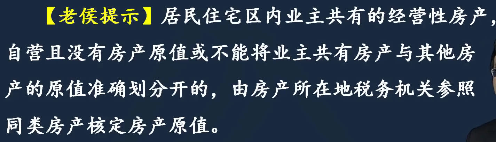 |
|  |  |
|  |  |
|  |                                                         |

### 税收优惠

|  |  |
| ------------------------------------------------------------ | ------------------------------------------------------------ |
|  |  |

### 征收管理

和固定资产折旧有关，当月增加的房产，次月交，当月减少的房产，当月交

- 第一条，房产原来就有，所以用于生产经营之月起，就要交房产税

|  |  |
| ------------------------------------------------------------ | ------------------------------------------------------------ |
|  |  |

## 城镇土地使用税

1. 概念：准财产税；定额征收
2. 纳税人：受益人纳税
3. 征税范围
4. 税率： 幅度差别定额税率
   1. 例：北京二环和五环的税率不一样

5. 计税依据
   1. 实际占用的土地面积

6. 应纳税额
   1. 从量计征
   2. 年应纳税额===实际占用应税土地面积==(平米) x 适用税额
7. 税收优惠
8. 征收管理

|  |  |
| ------------------------------------------------------------ | ------------------------------------------------------------ |
| 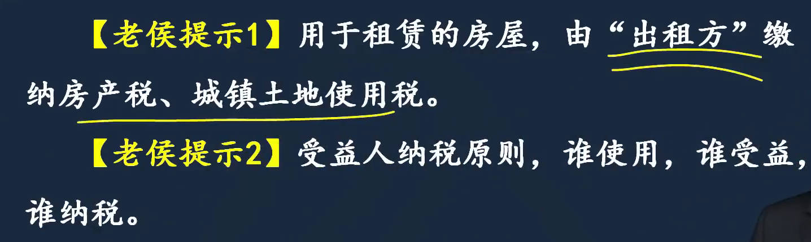 |  |
|  | 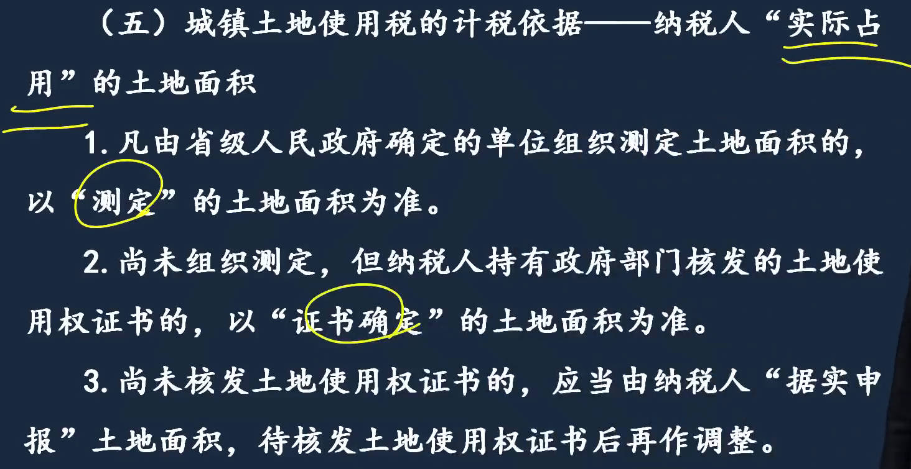 |
|  |  |

### 税收优惠
|  |  |
| ------------------------------------------------------------ | ------------------------------------------------------------ |
|  |  |
|  |  |

### 征收管理
|  |  |
| ------------------------------------------------------------ | ------------------------------------------------------------ |
|  |  |

## 耕地占用税

1. 立法目的：特定行为目的税：保护耕地
2. 纳税人
   1. 基本农田和非基本农田征收比例不一样

3. 应纳税额计算
   1. 税率： 耕地占用税施行==地区差别定额税率==

4. 加征规定
5. 税收优惠
6. 纳税义务发生时间及纳税期限

|  |  |
| ------------------------------------------------------------ | ------------------------------------------------------------ |
|  |  |
|  |  |
|  | 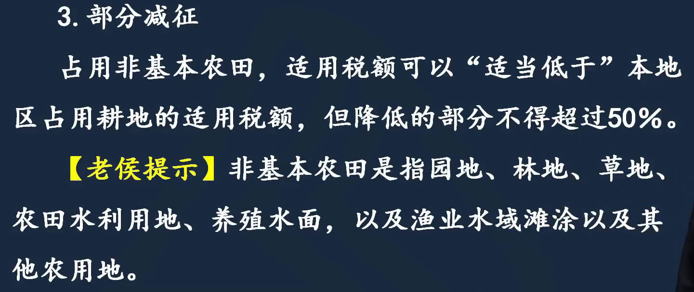 |
|  |  |
|  |  |
|  |  |
## 契税

1. 特征
   1. 财产转移税，房屋和土地的买卖过程中征收
   2. 用来==证明财产归属==，买方缴税，契约交过税
2. 征税范围
   1. 土地使用权出让是政府行为，企业之间是转让行为

3. 应纳税额
   1. 税率： 3%～5%的幅度比例税率
   2. 计税依据
      1. 成交价格确定：与房屋不属于同一不动产单元，例如车位，看合同里规定的房子什么价、车位什么价，车位单算
      2. 价格差额：差额计税，适用于土地使用权互换、房屋互换
      3. 补交：原来国家划拨方式给它一块地，没花钱，用可以，卖不行，如果想卖
         1. 改为可以出让的土地
         2. 经国家批准，可以卖掉，划拨的土地性质还不用改

4. 税收优惠
5. 征收管理
   1. 纳税义务发生时间
6. 纳税退还

|  |  |
| ------------------------------------------------------------ | ------------------------------------------------------------ |
|  |  |
|  |  |
|  |  |
|  |  |
|  |  |
|  |                                                              |

### 税收优惠
|  |  |
| ------------------------------------------------------------ | ------------------------------------------------------------ |
|  |  |
|  |  |
|  |                                                         |

### 征收管理

|  |  |
| ------------------------------------------------------------ | ------------------------------------------------------------ |
|  |  |
## ==土地增值税==

1. 特征：有转移，有收益才征
   1. 契税是买方税，土地增值税是卖方税
2. 征税范围
   1. 个人卖房、互换免征土地增值税
   1. 没有权属转移，不征收; 发生权属转移且有增值才征收

|  |  |
| ------------------------------------------------------------ | ------------------------------------------------------------ |
|  | 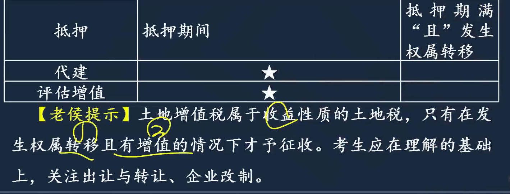 |

### 应纳税额计算

1. 适用税率
   1. 按增值额与扣除项目金额的比率，来设置税率依据
2. 计税公式
   1. 只需要算出扣除项目金额
3. ==扣除项目==
   1. 新建项目
   2. 存量房(二手房)
4. 计算步骤
5. 销售旧房扣除规定
6. 计税依据的特殊规定

|  | 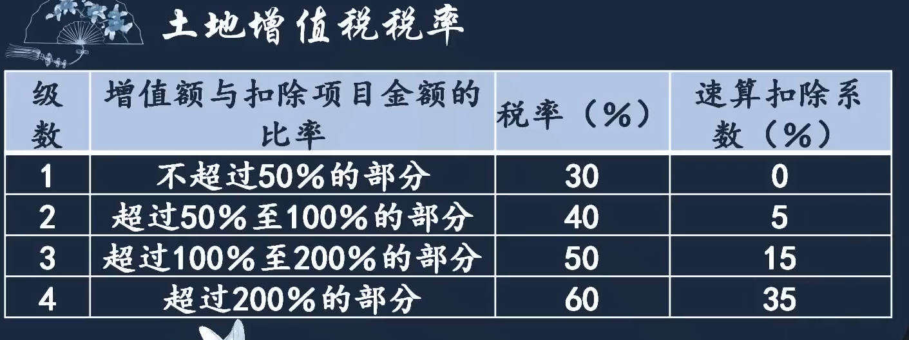 |
| ------------------------------------------------------------ | ------------------------------------------------------------ |
| 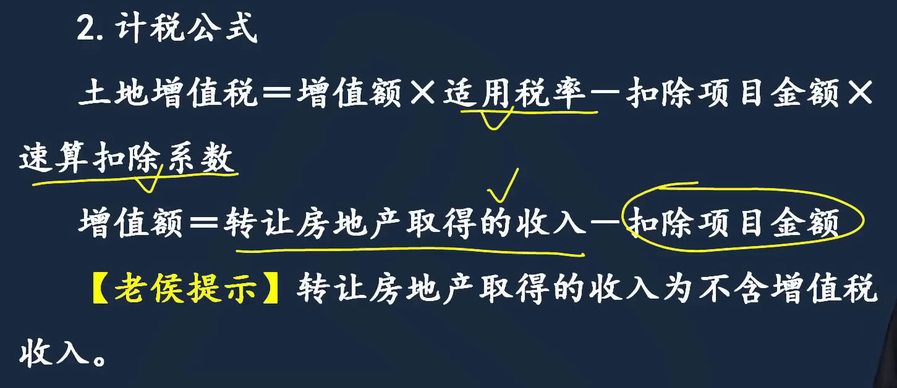 |  |

#### ==扣除项目==

1. 拿地成本：包括土地出让金、应该缴纳的契税
2. 建房
   1. 房地产开发费用
      1. 利息明确：利息单独扣，剩余费用按照1、2项之和的规定比例扣除
      2. 利息不明确：利息不能单独扣，费用按照1、2项之和的规定比例扣除
         1. 利息明确：是否能提供金融机构证明
3. 销售
   1. 没有印花税：由于卖的期房，开发过程中产生的印花税，开发费用中已经扣除
   2. 非房地产开发企业：开以扣印花税，因为它拿不到商品房预售许可证，只能卖现房
4. 优惠
   1. 加计扣除： ==拿地和开发成本之和==的20%

|  |  |
| ------------------------------------------------------------ | ------------------------------------------------------------ |
|  |  |
|  |                                                         |

#### ==计算步骤==

|  |  |
| ------------------------------------------------------------ | ------------------------------------------------------------ |
| 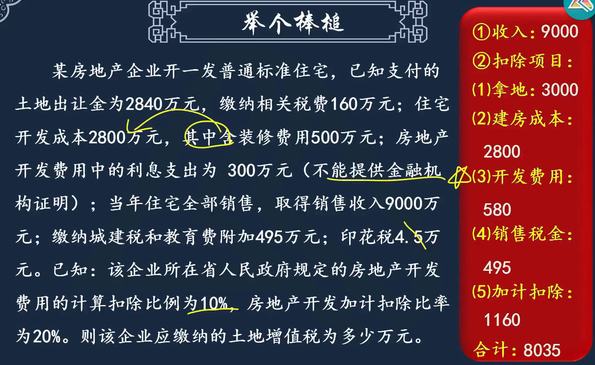 |  |

#### 销售旧房扣除规定

1. 销售旧房扣除标准
   1. 房屋评估价格：重新建房屋的成本，乘以它现在几成新

2. 计税依据特殊规定
   1. 隐瞒、虚报、不实：不认你报的金额，给你去评估价格
   2. 非直接销售
      1. 例无偿赠送，去给你找一个价格

|  |  |
| ------------------------------------------------------------ | ------------------------------------------------------------ |
|  |  |
| 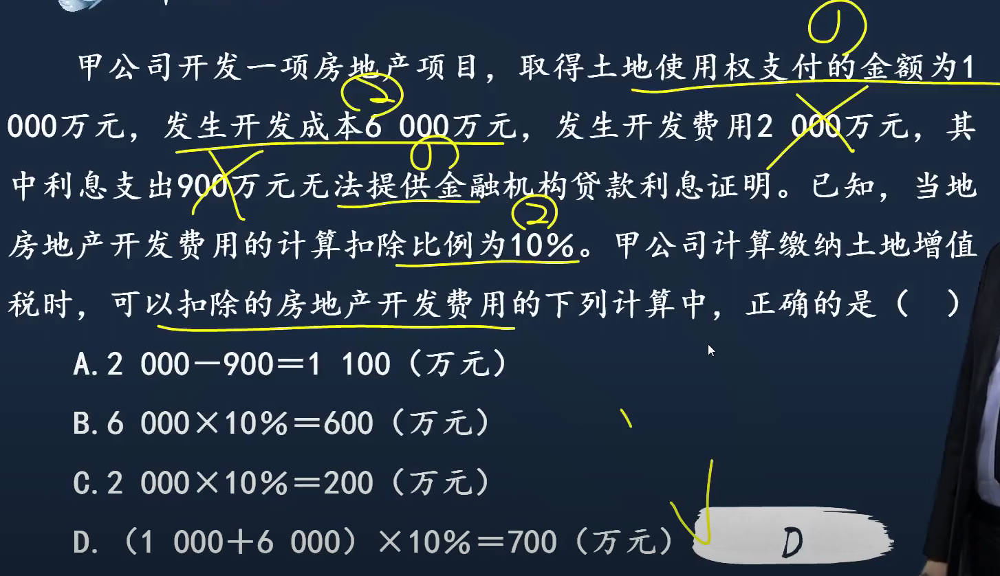 |  |

### 税收优惠

|  |  |
| ------------------------------------------------------------ | ------------------------------------------------------------ |

### 纳税清算

[清算_百度搜索](https://www.baidu.com/s?ie=UTF-8&wd=%E6%B8%85%E7%AE%97)  [土地增值税清算_百度搜索](https://www.baidu.com/s?ie=utf-8&f=8&rsv_bp=1&tn=baidu&wd=%E5%9C%9F%E5%9C%B0%E5%A2%9E%E5%80%BC%E7%A8%8E%E6%B8%85%E7%AE%97&oq=%25E6%25B8%2585%25E7%25AE%2597&rsv_pq=9e3a5a9e022c33a4&rsv_t=6077lOLUzzvZOP7jRygLIxFhQhsP%2BBBXjG16NqiGKdIQZ%2Fkq%2B%2FikyMuFaEA&rqlang=cn&rsv_dl=tb&rsv_enter=1&rsv_sug3=16&rsv_sug1=2&rsv_sug7=100&rsv_sug2=0&rsv_btype=t&inputT=3146&rsv_sug4=45191)  

清算：终结已解散公司的一切法律关系，处理公司剩余财产的程序

土地增值税清算： ==计算==房地产开发项目应缴纳的土地增值税税额，==结清==该房地产项目应缴纳土地增值税税款的行为

应当清算的，已经百分百完成转让

|  |  |
| ------------------------------------------------------------ | ------------------------------------------------------------ |
## ==印花税==

[印花税2022年7月1日实施_百度搜索](https://www.baidu.com/s?ie=UTF-8&wd=%E5%8D%B0%E8%8A%B1%E7%A8%8E2022%E5%B9%B47%E6%9C%881%E6%97%A5)  

1. 特征：特定行为目的税
   1. ==书立、使用应税==经济==凭证==: 例签合同
      1. 境内书立应税凭证
      2. 境外书立但在`境内使用`应税凭证
   2. ==证劵交易==
   
2. **纳税人**：书立人、使用人、证券交易人
   1. 境内签合同、境外签合同
   2. ==书立人==：又分3种：`立合同人、立帐薄人`(实收资本、资本公积帐薄)、`立据人`
      1. 立合同人: 合同当事人，甲方乙方
      1. 立帐薄人: 营业账簿，指记载资金的帐薄，记载实收资本、资本公积的帐薄
      1. 立据人: 产权转移书据的签订双方
      1. 印花税双向征收
   3. 使用人
   4. 证劵交易的交易人
   5. 扣缴义务人：在哪个证券公司开的户，就是证券登记结算机构
3. **征税范围**：使用列举制，列举出来的都征
   1. 11类合同

4. 应纳税额计算
   1. 计税依据：不同行为计税依据不一样
   2. 应纳税额计算
5. 免税规定
6. 征收管理

| 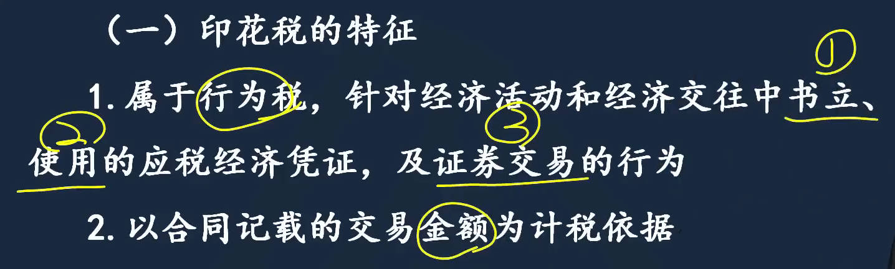 |  |
| ------------------------------------------------------------ | ------------------------------------------------------------ |
|  |  |

### 征税范围

列举制，列举出来的征税

|  |  |
| ------------------------------------------------------------ | ------------------------------------------------------------ |
|  |  |

### 计税依据

证劵交易印花税计税依据

- 非集中：场外交易，私下里协议授让，有可能没有转让价格，例赠送

| 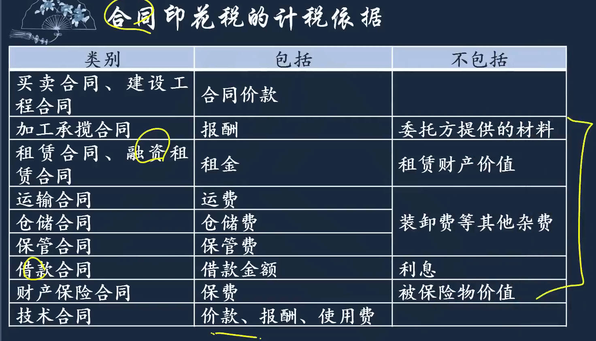 |  |
| ------------------------------------------------------------ | ------------------------------------------------------------ |
|  |  |
|  |  |

### 应纳税额计算

|  |  |
| ------------------------------------------------------------ | ------------------------------------------------------------ |
|  |  |

### 免税
|  |  |
| ------------------------------------------------------------ | ------------------------------------------------------------ |
|  |  |

### 征收管理
| 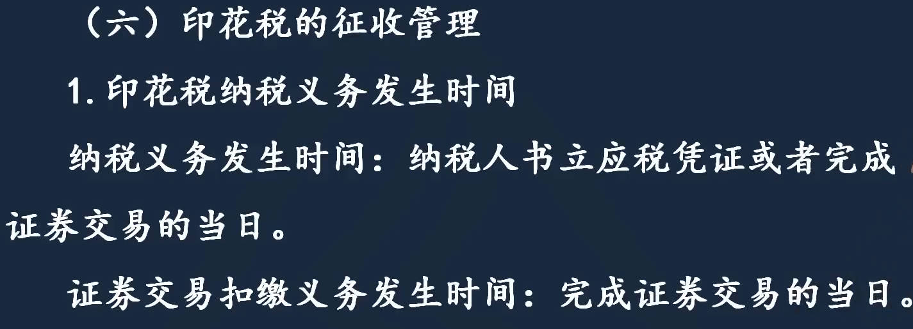 |  |
| ------------------------------------------------------------ | ------------------------------------------------------------ |
|  |  |
# 2、车辆、船舶与环境相关税种

## 车船税

1. 特征：列举制
   1. ==财产税==，有车、船，每年都要交
   2. 拥有并使用的才是纳税人，4s店不交车船税

2. 征税范围
3. **应纳税额**
4. 税收优惠
5. 征收管理

|  | 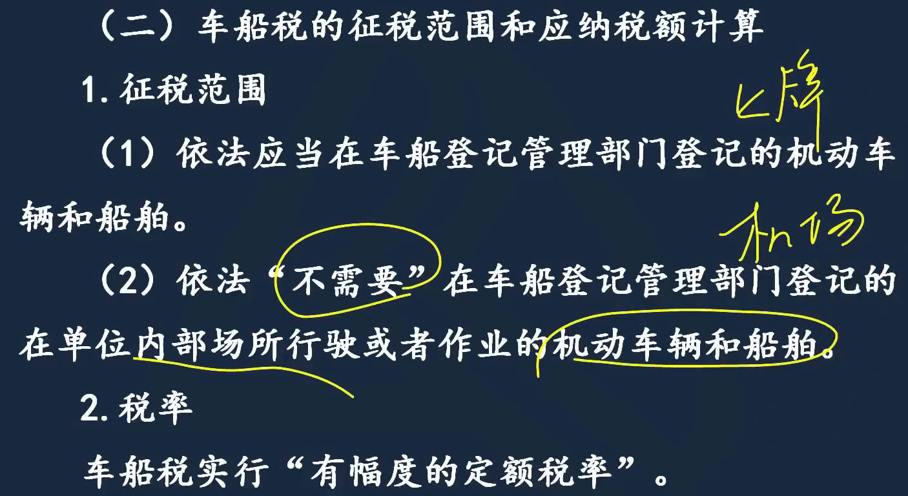 |
| ------------------------------------------------------------ | ------------------------------------------------------------ |
|  |  |

### 税收优惠

|  |  |
| ------------------------------------------------------------ | ------------------------------------------------------------ |
|  |                                                         |

### 征收管理

|  |  |
| ------------------------------------------------------------ | ------------------------------------------------------------ |
|  |  |
|  |  |

## 车辆购置税

1. 概念
   1. 典型的行为税： ==购置规定车辆==的单位和个人

2. 纳税人
3. 应纳税额计算
4. 免税政策
5. 征收管理

|  |  |
| ------------------------------------------------------------ | ------------------------------------------------------------ |
|  |  |
|  |  |

### 征收管理

车辆购置税一次性征收，只对一手车征收，二手车不征

车基本每年贬值10%； 第一年20%，因为含了10%的车辆购置税

|  |  |
| ------------------------------------------------------------ | ------------------------------------------------------------ |
| 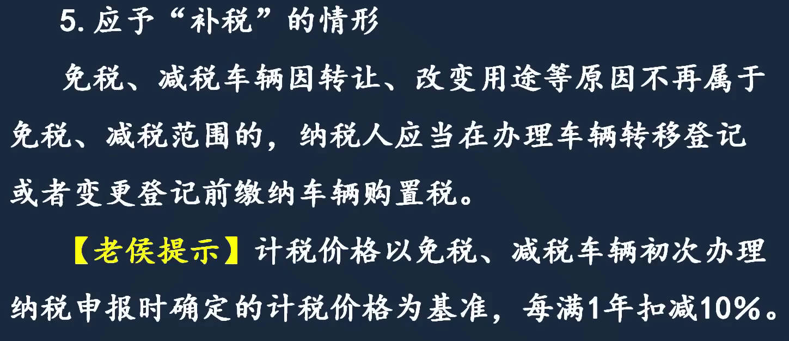 |  |
|  |  |

## 船舶吨税

1. 特征
   1. 行为税，只要是从境外港口进入境内港口，不管是中国船还是外国船，都要交税

2. 税率
   1. 复式税率表：横轴，吨位数； 纵轴，停靠时间

3. 计税依据
4. 税收优惠
5. 纳税期限

|  |  |
| ------------------------------------------------------------ | ------------------------------------------------------------ |
|  |  |
|  |  |
| 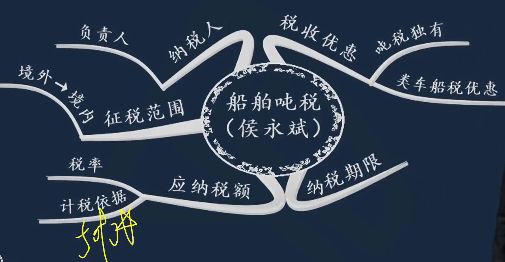 |  |

## 环境保护税

[国家规定的分贝数_百度搜索](https://www.baidu.com/s?ie=UTF-8&wd=%E5%9B%BD%E5%AE%B6%E8%A7%84%E5%AE%9A%E7%9A%84%E5%88%86%E8%B4%9D%E6%95%B0)  

1. 纳税人
   1. 同时满足：直排、生产经营者

2. 征税范围： 不含光污染
3. 税率
4. 计税依据
5. 应纳税额计算
6. 税收优惠
7. 征收管理

|  |  |
| ------------------------------------------------------------ | ------------------------------------------------------------ |
|  |  |
|  |  |
|  |  |
|  |  |
|  |  |
|  |  |
# 3、与增值税联系密切税种

## ==关税==

关税的法定税率包括==最惠国税率、协定税率、特惠税率和普通税率==。不同种类物品适用的关税税率不同，可在中国海关官网等网站进行查询

1. 特征
   1. 特定环节流转税，针对进出口环节
2. 纳税人
3. 关税课税对象
   1. 中国生产，出口，再进口回来，也交关税
4. ==进口==货物应纳税额计算：==完税价格== x 税率
   1. 不同商品从不同地区进口，关税都不一样
   2. `进口关税完税价格`
      1. 一般贸易项下进口货物关税完税价格的确定： 到岸价经过海关审定
         1. FOB(离岸价)：`成交价格`基础上，加上出口关税；
         2. 运输途中：运费保险费等；
         3. CIF(到岸价，运输有损毁)
            1. 以成交价格为基础的到岸价，经过海关审定作为完税价格
         4. 关税完税价格
            1. 买方佣金相当于工资，是给自己人的
            2. 报关费做费用处理
            3. 正常回扣，就是商业折扣，商品价格按折扣后的金额算
            4. 卖方延期交货的合同违约金
      2. 特殊贸易项下进口货物关税完税价格的确定
         1. 运往境外委托加工，原材料的钱不能算
   3. 关税税率
5. ==出口==货物应纳税额计算

|  |  |
| ------------------------------------------------------------ | ------------------------------------------------------------ |
|  | 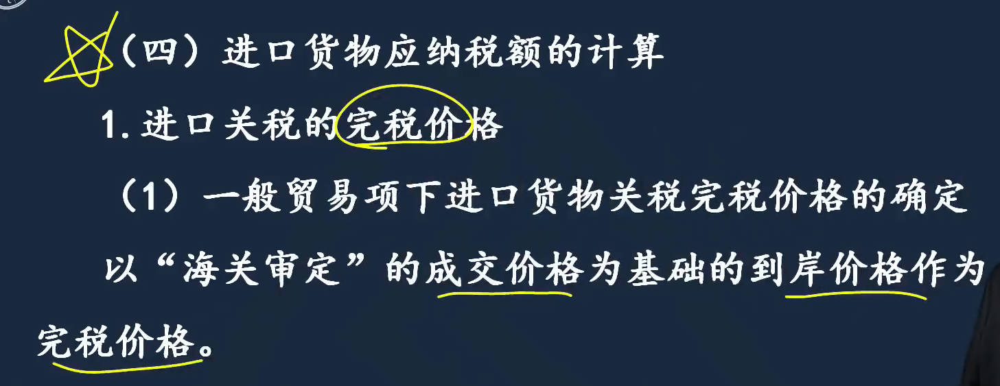 |
|  |  |
|  | 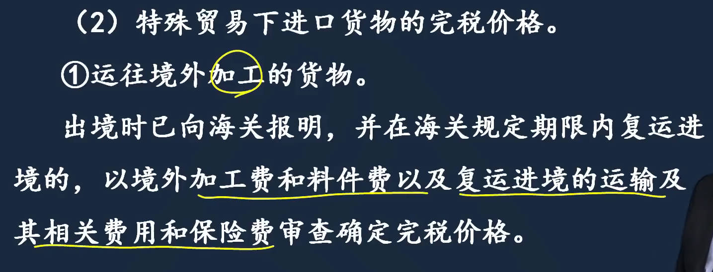 |
|  |                                                         |

### 关税税率
1. 税率适用的标准：以==进口货物的原产地==为标准
2. 关税税率种类
   1. 最惠国税率
   2. 协定税率： 关税优惠条款，签有优惠协定
   3. 特惠税率： 特殊关税优惠条款
   4. 普通税率：和我国未签订任何税收优惠政策

|  |  |
| ------------------------------------------------------------ | ------------------------------------------------------------ |

### 应纳税额计算

关税计税依据及应纳税额计算

1. 进口关税
   1. 滑准税：==税率和商品价格反向滑动==； 为了调节进口商品价格，使国内的价格保持相对稳定
2. 出口关税
   1. 价税分离： 货物都已经离开中国口岸了，出口关税肯定交过了， 而关税是价外税，完税价格里不能含关税
      1. 出口货物完税价格： 和增值税一样，价税分离公式

| 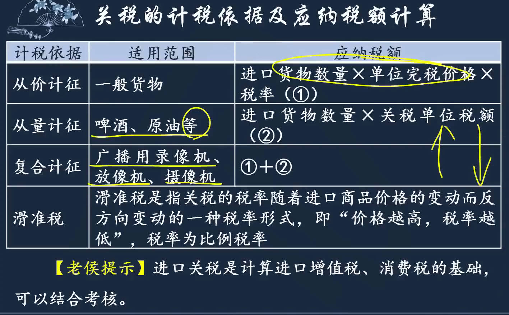 |  |
| ------------------------------------------------------------ | ------------------------------------------------------------ |
|  |                                                         |

### 税收优惠

|  |  |
| ------------------------------------------------------------ | ------------------------------------------------------------ |
|  |                                                         |

### 征收管理

1. 纳税期限
2. 暂不放行情形
3. 补征与追缴

|  |  |
| ------------------------------------------------------------ | ------------------------------------------------------------ |
|  |  |
## 城市维护建设税

附加税是对增值税、消费税附征的一种税费，包括城建税、教育费附加和地方教育费附加（后两者属于费）

1. 纳税人
2. 税率
   1. 受托方代征，城建税税率用受托方所在地的: 例委托加工

| 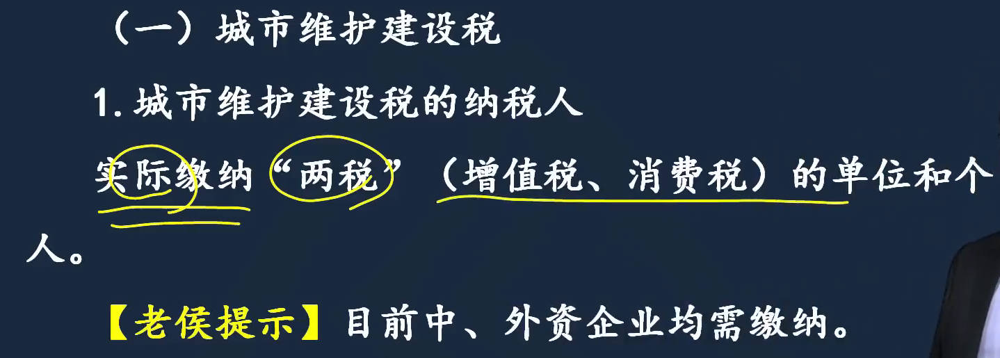 |  |
| ------------------------------------------------------------ | ------------------------------------------------------------ |
|  |  |
|  | 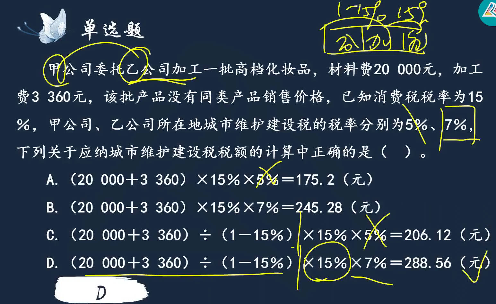 |

## 教育费附加

除了税率和城建税不一样，其他都一样

|  |  |
| ------------------------------------------------------------ | ------------------------------------------------------------ |
|  |  |

## ==资源税==

1. 纳税人
   1. 开采不可再生资源

2. 征税范围
3. 税率
4. 应纳税额
   1. 资源税是价内税

5. 税收优惠
6. 征收管理

|  |  |
| ------------------------------------------------------------ | ------------------------------------------------------------ |
|  |  |

### 应纳税额

1. 特殊情况应纳税额计算
   1. 应税产品为矿产品
   2. 外购与自采应税产品混合销售或混合加工
      1. 外购的交过税了，允许扣除
      2. $\color{blue}外购的资源税 = 外购原矿金额\times本地区选矿税率 = 外购原矿金额\times本地区原矿税率$
   3. 销售额偏低且无正当理由
   4. 同一应税产品，其中既有享受减免税的，又有不享受减免的
      1. 按产量占比找权重

|  |  |
| ------------------------------------------------------------ | ------------------------------------------------------------ |
|  |  |
|  |  |
|  |  |
| 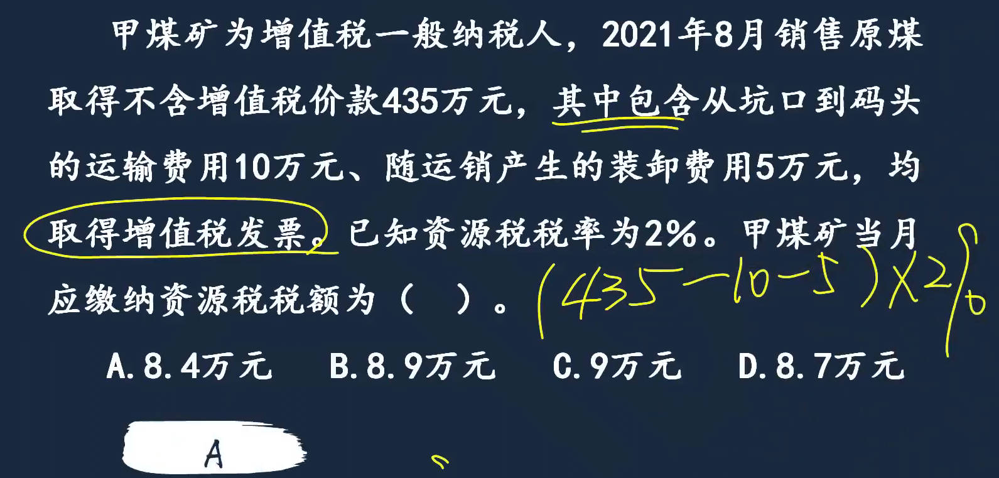 |  |

### 优惠和征收

|  |  |
| ------------------------------------------------------------ | ------------------------------------------------------------ |
|  |  |

## 烟叶税

|  |  |
| ------------------------------------------------------------ | ------------------------------------------------------------ |
|  | 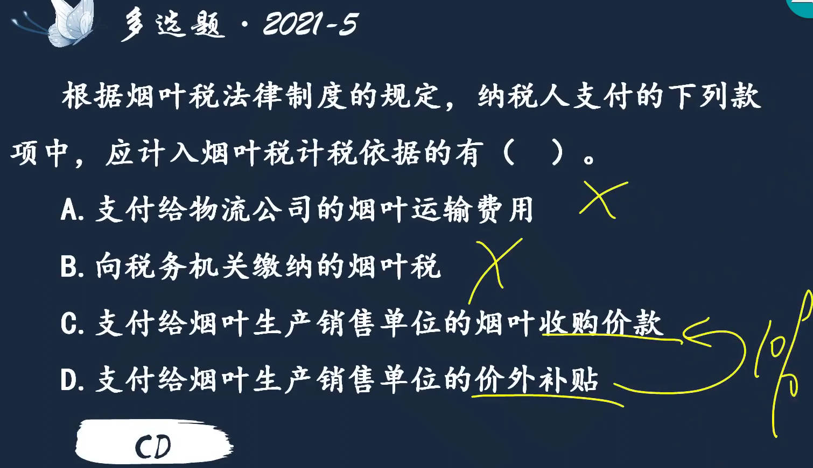 |
|  |  |