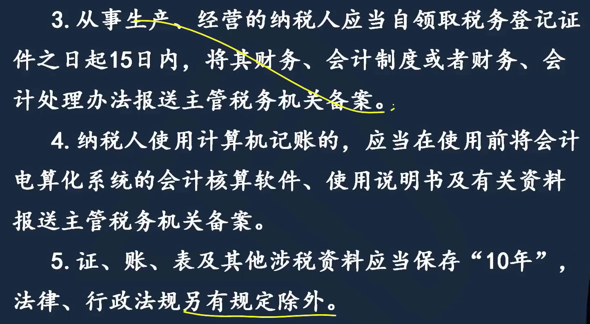
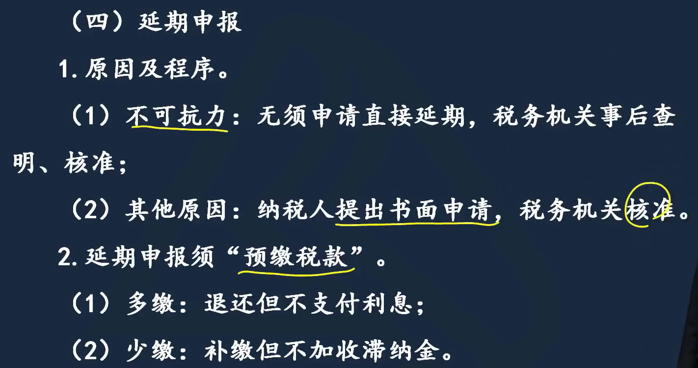
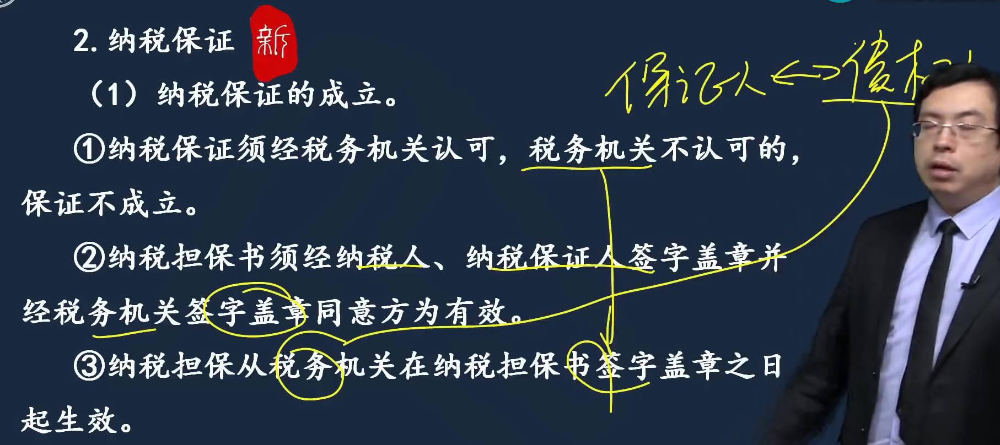
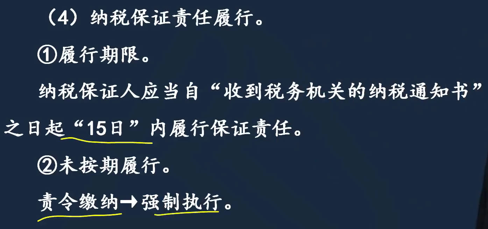
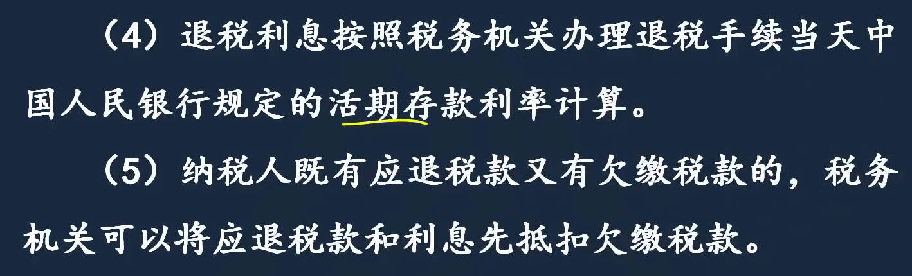
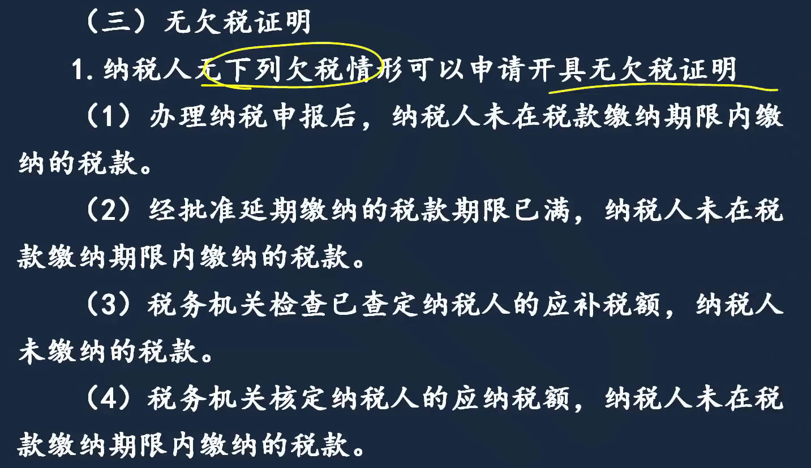
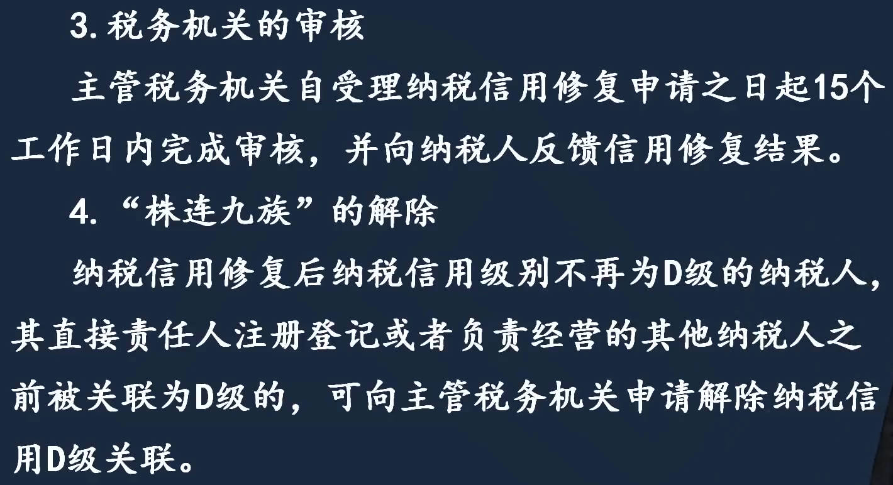
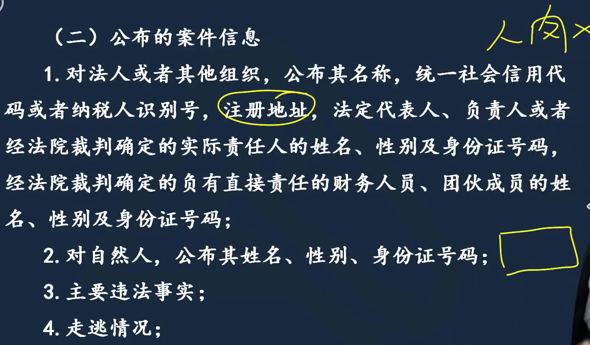
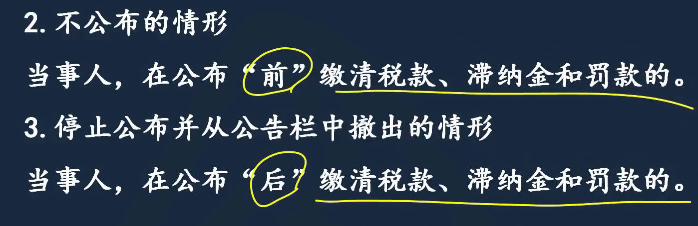
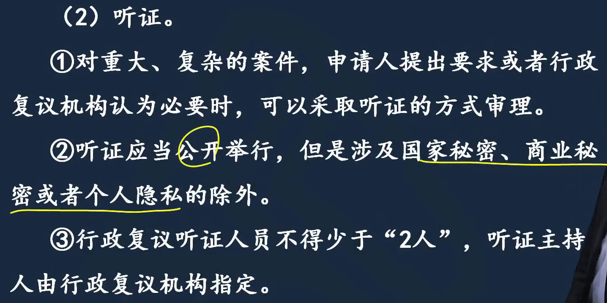

征收和行政复议是重点

# 1、税收征管法概述

1. 税收征管法概念、性质、适用范围
1. 税收征管法适用对象
   1. 适用对象
   1. 征税主体的权利义务
      1. 征税主体权利的基本范围
      1. 发票检查权
      1. 税务检查权
   1. 纳税主体的权利义务
1. 3证、5证、多证合一到一照一码走天下，营业执照、社会信用代码
1. 适用范围：由税务机关负责征收的税种，适用税收征管法。海关负责征收的税种，适用海关法、进出口关税条例

|  |  |
| ------------------------------------------------------------ | ------------------------------------------------------------ |
|  |  |
|  |  |
|  |  |
|  |  |
|  |  |
|  |  |
|  |  |
|  |  |
# 2、税务管理

## 税务登记

税务登记管理：登记-申报-纳税

|  |  |
| ------------------------------------------------------------ | ------------------------------------------------------------ |
|  |  |
|  |  |
|  |  |
|  |  |
|  |  |
|  |  |
|  |  |
|  |  |
|  |  |
|  |                                                              |

## 证、账、票管理

|  |  |
| ------------------------------------------------------------ | ------------------------------------------------------------ |
|  |  |
|  |  |
|  |  |
|  |  |
|  |  |
|  |  |
|  |                                                         |

## 纳税申报

|  |  |
| ------------------------------------------------------------ | ------------------------------------------------------------ |
|  |  |
|  |  |

# 3、==税款征收==

1. ==征收方式==
   1. 查定征收：查产量，例小厂矿和作坊
   2. 查验征收：验商品， 例小型零售批发企业
   3. 代扣代缴：例工资薪金所得
   4. 代收代缴：例委托加工的消费税
2. 核定、调整应纳税额：可核定的情形，要么没账，要么相当于没账；账册健全，查账就行了
   1. 核定应纳税额
   2. 调整应纳税额：调整方法
      1. 企业报的东西，不准，所以才调整
3. 缴纳应纳税额
4. 税款征收措施
   1. 纳税担保：抵押，不转移占有。质押,转移质物的占有
5. 纳税退还、补缴、追征、申请无欠税证明

|  |  |
| ------------------------------------------------------------ | ------------------------------------------------------------ |

## 核定调整应纳税额

- 核定应纳税额	
  - 可以核定情形： 要么没账要么相当于没账
  - 核定方法
    - 按照收入， 或者成本加费用加利润核定
- 调整应纳税额: 申报的不准

|  |  |
| ------------------------------------------------------------ | ------------------------------------------------------------ |
|  |  |
|  |  |
|  |  |
|  |  |

## 缴纳应纳税额

|  |  |
| ------------------------------------------------------------ | ------------------------------------------------------------ |
|  |  |
|  |  |

## 税款征收措施

1. 税款征收措施
   1. 责令缴纳
   2. 纳税担保
   3. 税收保全与税收强制执行
   4. 欠税清缴
   5. 阻止出境
2. 纳税退还、补缴、追征与申请无欠税证明

|  |  |
| ------------------------------------------------------------ | ------------------------------------------------------------ |
|  |  |
|  |  |
|  |  |
|  |  |
|  |  |
|  |  |
|  |  |
|  |  |
|  |  |
|  |  |
|  |  |

## 退还、补缴、追征与申请无欠税证明

|  |  |
| ------------------------------------------------------------ | ------------------------------------------------------------ |
|  |  |
|  |  |
# 4、税务检查

1. 纳税信用管理
   1. 纳税信用修复
2. 税收违法行为检举
3. 重大税收违法失信案件信息公布

|  |  |
| ------------------------------------------------------------ | ------------------------------------------------------------ |
|  |  |
|  |  |
|  |  |
|  |  |
|  |  |
|  |  |
|  |  |

## 违法行为检举

|  |  |
| ------------------------------------------------------------ | ------------------------------------------------------------ |
|  |  |
|  |  |
|  |  |
|  |  |

## 重大税收违法失信案件信息公布

|  |  |
| ------------------------------------------------------------ | ------------------------------------------------------------ |
|  |  |
|  |  |
|  |  |
|  |                                                              |
# 5、税务行政复议

1. 税务行政复议的适用范围：民告官
1. 复议管辖
1. 必经、选择复议
1. 申请和受理
1. 审查及决定

|  |  |
| ------------------------------------------------------------ | ------------------------------------------------------------ |
|  |  |
|  |  |
|  |  |
|  |  |
|  |  |
|  |  |
|  |  |
|  |  |
|  |  |
|  |                                                              |

# 6、法律责任

|  |  |
| ------------------------------------------------------------ | ------------------------------------------------------------ |

