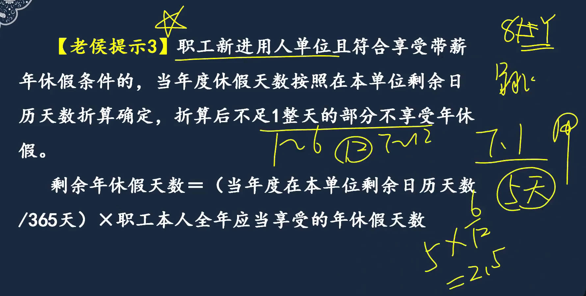
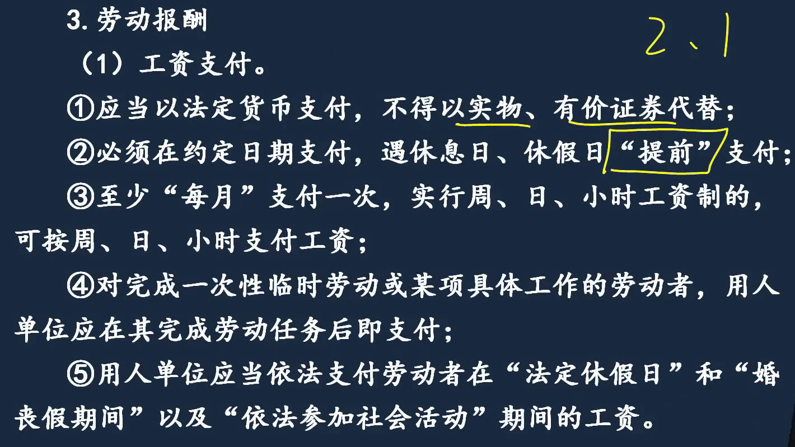
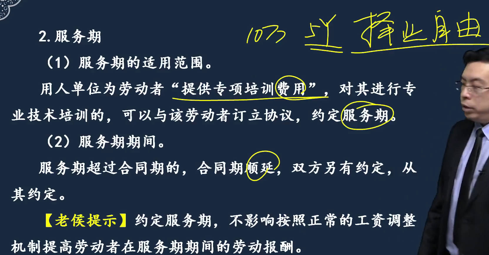
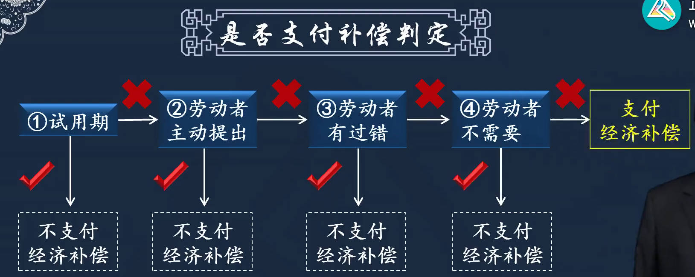
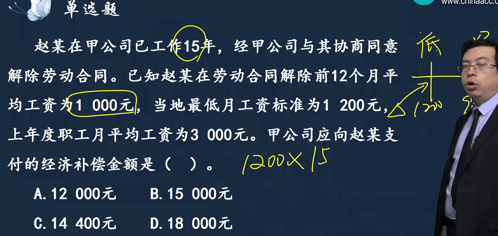
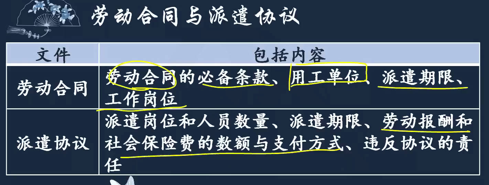
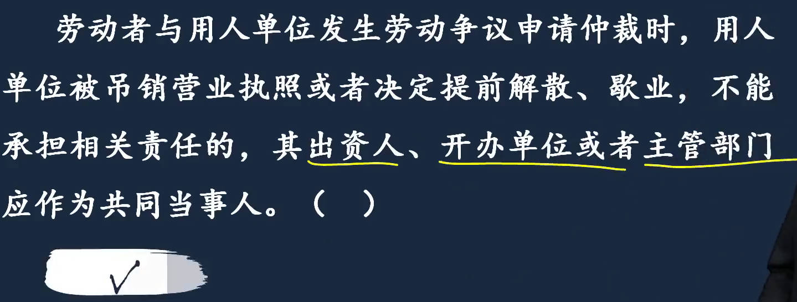
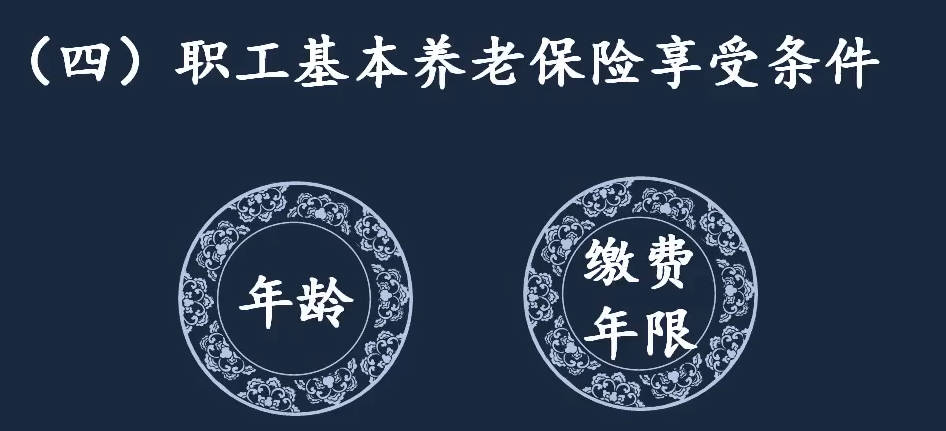
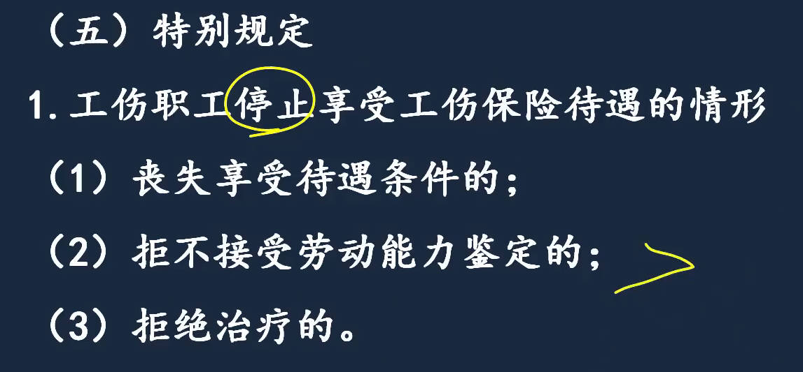
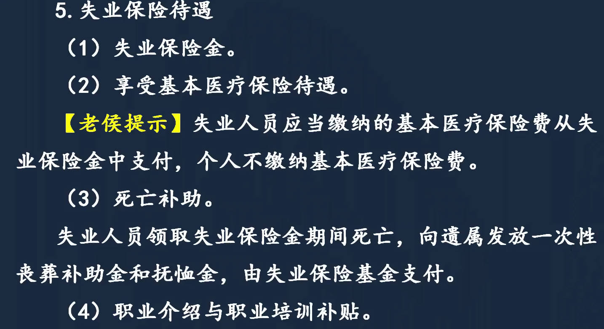

# 1、劳动合同法律制度

1. 一般情况下的劳动合同
2. 特殊劳动合同
   1. 集体合同
   2. 劳务派遣合同

## 劳动合同订立

1. `订立原则`：信用：学历造假
1. 订立主体
   1. 资格要求
      1. 劳动者：歧视、妇女平等就业权利、残疾人/军人等有特别规定的；16周岁(文艺、体、特种工艺)
      1. 单位：没执照有委托书：`分公司`，可以签劳动合同，雇佣劳动者
   1. 双方义务：单位要求提供担保和收钱：返、罚每人500-2000、造成损害赔
1. 建立劳动关系：用工之日起（看什么时候上班）
   1. 先建立劳动关系，后签合同
   1. 先签合同，后建立劳动关系

1. 签订劳动合同：对劳动关系做进一步的保障，双方`权利义务以书面形式明确`；是要式合同(有必备条款)
   1. 订立时间：用工之日起1个月内
      1. **1个月内**，劳动者不签：终止关系、支付报酬、无补偿
      2. **超过1个月**不签的法律责任：支付双倍工资，从**满1个月次日**到签合同日，，一直不签到**满1年前日**，`最多11月双倍工资`；几个月后单位想签合同，劳动者不签，`有离职补偿`；   
      3. **1年临界点**：用工之日起满1年，视为订立无固定期限合同(长期合同)，不再双倍工资，视为只是欠一个书面手续,只能要求补订书面合同；
      4. 试用期最长不能超过6个月
1. `合同效力`：合同是否生效
   1. 胁迫：违背平等自愿、协商一致
   1. 劳动合同效力先裁后审，直接找法院，不受理
   1. 劳动合同无效，订立日起就没法律约束力；给对方造成损失，有错方赔

|  |  |
| ------------------------------------------------------------ | ------------------------------------------------------------ |
|  |  |
|  |  |
|  |  |
|  |  |
|  |  |
|  |  |

## 劳动合同内容

> 1. 必备条款
>    1. ==合同期限==
>       1. 以完成一定工作任务为期限的劳动合同：承包医院科室；   季节性-滑雪场
>       2. `无固定期限劳动合同`：长期合同；法定情形，用人单位无选择权
>          1. 单位连续工作`满10年`
>          2. 需要满足双10：连续工作满10年，且距退休不足10年（针对`初次实行劳动合同制`单位、`国企改制`；劳动合同法2008正式实施）
>             1. 不给国家负担。双10
>             2. 注意区分：不得解除和中止劳动合同15/5，连续满15，且距退休不足5年
>          3. 连续订立2次固定期限合同，要继续续订合同，且没有法定的情形，订立无固定期限劳动合同
>          4. 违法规定不签无固定期限劳动合同： 自应当订立之日起，每月支付2倍工资，不受最多11个月限制
>    2. 工作时间、休息、休假：带薪年休假
>       1. 不定时工作制：针对特殊岗位，饭店厨师；
>       2. 加班：一般：每天不超1小时，特殊：D≤3，M≤36；
>          1. 加班费：平时加班不低于150%，周末加班不低于200%，法定休假日不低于300%；
>       3. `带薪年休假`：连续工作1年以上的，参加工作时间(累计工作年限)，不是本单位工作年限。
>          1. `1年起`步，`十年分`界，5、10、15；满1不满10，5天
>             1. 不享受：病假2月以上，当年不享受； 带薪事假(婚/产假等)累计20天以上，当年也不享受；寒暑假超过年假天数，当年也不享受；
>             2. 可分散请假
>          2. 跳槽后享受年休假：7月1进，6/12 × 5，不足1天舍弃，休2天，上个公司休完年休假再跳槽。
>    3. 工资报酬：加班工资、最低工资
> 2. 可备条款
>    1. `试用期`：期限、待遇
>    1. 培训
>    2. `服务期`：培训和服务期关联
>    2. 补充保险
>    2. 福利待遇
>    3. 保密和竞业限制

|  |  |
| ------------------------------------------------------------ | ------------------------------------------------------------ |
|  |  |
|  |  |
|  |  |
|  |  |
|  |  |
|  |  |
|  |                                                              |

### 必备条款

[当月工资次月发合法吗](https://zhuanlan.zhihu.com/p/1898265168301004706)   

> 1. 工资报酬
>    1. 工资
>    2. 加班工资: 周末指六和日
>       1. 加班费：平时加班不低于150%，周末加班不低于200%，法定休假日不低于300%
>       2. 元旦3天，补休3天，其中2天休息日，==可补休==，1天休假日，3倍工资，法定休假日不能补休
>    3. 最低工资：不同地区、年份不一样，北京:2021-2022,H25.3；
>    4. 扣工资：每月扣不超过当月工资20%，且剩余工资不低于最低工资
>    5. 未及时足额支付工资处罚
>       1. 未及时足额支付、低于最低工资、不支付加班费
>       2. 限期支付，逾期按应付金额`50%以上100%以下`加付赔偿金

|  |  |
| ------------------------------------------------------------ | ------------------------------------------------------------ |
|  |  |
|  |                                                              |

### 可备条款

[提前解除竞业协议](https://www.zhihu.com/question/551971935/answer/2661729872)

1. 试用期：掌握试用期`期间、待遇`
   1. 以上包括当年； `1年2个月，2年2个月，3年6个月`； 延长的试用期只要没超过规定，算一次试用期。
      1. 违法责任：例：法定2M，超过2个月,乘2，按试用期满工资`10000 x 2`赔偿。
      1. 试用期超过1个月，`赔偿金`是期满工资乘以1
   1. 试用期工资：不能低于相同岗位最低档工资80%，或劳动合同约定工资的80%，并不得低于最低工资标准
2. 服务期： 用人单位提供专项培训费用
   1. 如果约定服务期，必须干到服务期满，服务器内离职，要付`违约金`
      1. 例：飞行员。服务期超过合同期，合同期要顺延至服务器满。
         1. 和`劳动合同期限`不同，要走单位不同意，提前一个月书面通知，到期照样走
   2. 违约责任
      1. 约定的违约金不超过培训费； 劳动者支付的违约金不超过`尚未履行部分`分摊的培训费
      2. 违约金上限：剩下的2年占5年服务期：2/5 × 10(培训费),  和约定的违约金比较，如果约定的违约金没超过上限，就按约定的违约金。
3. 保密和竞业限制

|  |  |
| ------------------------------------------------------------ | ------------------------------------------------------------ |
|  |  |
|  |  |
|  |  |

#### 保密和竞业限制

1. 违约责任
2. 保守商业秘密(合同期内)和竞业限制(合同期满)
   1. 竞业限制期限不超过2年
   2. 竞业限制司法解释：
      1. 单位解除：除支付已履行的，还需额外支付3个月补偿
      2. 订立时未约定补偿金：但实际履行了，离职前12月平均工资的30%，或最低工资标准中较高者补偿。
      3. 劳动者违约：违约金、赔偿金、还要继续履行竞业限制

|  |  |
| ------------------------------------------------------------ | ------------------------------------------------------------ |
|  |  |

## 劳动合同履行、变更

1. 履行
   1. 拖欠工资：向当地人民法院申请支付令
   2. 单位的规章制度：未公示或告知劳动者的制度无效
2. 变更
   1. 变更劳动合同应采用书面形式
   2. 未书面，但已经实际履行超过1个月：防止换领导后对原来的承诺不认账，例涨工资，已经领了2个月，新领导想按合同低工资发，法院不予支持。

|  |  |
| ------------------------------------------------------------ | ------------------------------------------------------------ |
|  |  |

## ==解除==

[书面辞职怎么留证据](https://www.baidu.com/s?ie=UTF-8&wd=%E4%B9%A6%E9%9D%A2%E8%BE%9E%E8%81%8C%E6%80%8E%E4%B9%88%E7%95%99%E8%AF%81%E6%8D%AE)   [书面辞职证据应当怎么保留](https://www.66law.cn/laws/4044414.aspx)  [书面通知辞职怎么保留证据](https://ailegal.baidu.com/?fr=seo_qadetail&template=business&articleType=qadetail&articleId=069c0b798c524d001022)    

1. `协商解除`： 主动辞单位不补偿
2. `法定解除`： 不需要对方同意
   1. 劳动者单方解除
      1. 提前通知：协商不成，提前通知；==正式工30天+书面==，无补偿；  试用期提前3天通知
      2. 随时通知：对方过错在先，但未危及生命，你不仁我不义； 例：单位不发工资，不上保险；有补偿金。
      3. 无需通知：严重侵犯劳动者权益，危及人身安全， 有经济补偿。 例：单位胁迫
   2. 用人单位单方解除
      1. 提前通知：提前30天或`多付1月工资`(代通知金)；N+1，N工作年限，每满1年，要支付1个月补偿，1就是代通知金。不得以代通知金替代补偿金
      2. 随时通知：试用期内可随时解除劳动合同；劳动者过错在先
      3. 经济性裁员：20人以上或占职工总数10%以上； 有经济补偿金

|  |  |
| ------------------------------------------------------------ | ------------------------------------------------------------ |
|  |  |
|  |  |
|  |  |
|  |  |
|  |  |

## 劳动合同终止

2. 终止： 不能约定，只有法定事项；  法定事实出现，合同终止
   1. 只有法定终止，不能约定
   2. 具体情形：履行完毕、劳动者有长期饭票、一方死。     
      1. ==被动终止有补偿==
      2. 是否补偿：试用期、主动提、有过错、不需要(死亡、享受基本养老待遇)
3. `不得解除和终止`的情形
   1. 患病或非因工负伤，用人单位要仁至义尽，让劳动者享受==医疗期==
   1. 女职工孕期、产期、哺乳期
   1. 在本单位连续工作满15年，且距法定退休不足5年

4. 解除和终止的经济补偿：
   1. 经济补偿金：工作年限×月工资； N+1；  `本单位工作的年限`
   2. `高薪职工`最高年限不超过12年
   3. 上限：当地职工月平均工资3倍
   4. 下限：当地最低工资标准

5. 解除和终止的法律后果
   1. 单位出==离职证明==；  例：有竞业限制，让告了，新单位要承担连带责任，劳动者赔不起，新单位赔钱。
   2. 15日内办档案和保险转移手续， 劳动合同文本至少保存2年。
6. 违法解除和终止劳动合同的法律责任
   1. 单位责任
      1. 违法解除：按补偿`2倍`支付`赔偿金`
      2. 合法解除：但公司不支付补偿金，责令限期支付，逾期加付50%-100%赔偿金
   2. 劳动者责任：赔偿；单位招用尚未解除的，连带赔偿责任

|  |  |
| ------------------------------------------------------------ | ------------------------------------------------------------ |
|  |  |
|  |  |
|  |  |
|  |  |
|  |  |
|  |  |
|  |  |
|  |  |

## 特殊劳动合同

1. 非全日制用工：小时工
2. 集体合同
   1. 第一次开会： `合同草案`：企业和代表开会；人数对等，双方均不得少于3人，各设1首席代表拍板。
   2. 第二次开会： 职工会，全体职工讨论。
      1. 2个不低于：2/3以上职工代表或职工出席，  全体职工代表半数以上或全体职工半数以上同意，方获通过
      1. 集体合同订完，如后续再和每个员工签合同，不得低于集体合同的工资和劳动条件。
3. 劳务派遣：人事外包、人才租赁
   1. `三方关系2个合同`：劳务派遣单位又称用人单位，劳务输出单位；`用工单位叫劳务输入单位`；
   2. 劳务费是扣除工资后支付给劳务派遣单位的报酬，和劳动者工资没有关系
   3. 对劳务派遣单位要求
      1. 用人单位不得设立劳务派遣单位向本单位派遣：规避正式用工
   4. 对用工单位要求
      1. 使用被派遣劳动者数量不超过用工总量10%； 例，正式员工100人，最多可用11个派遣工, $11\over100+11$
      2. 用工单位不得将派遣工再派到其它单位

|  |  |
| ------------------------------------------------------------ | ------------------------------------------------------------ |
|  |  |
|  |  |
|  |  |
|  |  |
|  |  |
|  |  |
|  |  |

## 劳动争议解决

1. 争议范围：劳动者和用人单位之间发生的几乎一切纠纷
2. 劳动争议解决方式：可直接提起劳动仲裁，`先裁后审`，不能直接诉讼
   1. 终局裁决：限制用人单位的，如果用人单位不服，要先申请撤销裁决，然后才能起诉。

|  |  |
| ------------------------------------------------------------ | ------------------------------------------------------------ |
|  |  |

### 劳动仲裁

1. 参加人
   1. 吊销营业执照的：找儿子找不到，找它爹
   2. 代理人：写个授权委托书（委托合同）
   3. 第三人：与劳动争议双方有利害关系，例：竞业限制的乙公司，甲与劳动者签竞业限制，去乙公司上班，被甲告了
2. 劳动仲裁管辖：劳动争议有管辖权。受理在先，不是申请在先
3. ==仲裁程序==
   1. 申请受理
      1. 仲裁时效
         1. 一般情况，知道权利被侵害起1年；
         2. 拖欠报酬，劳动关系终止之日起1年。起算点不一样
   2. 开庭
      1. 裁决前，必须先调解
   3. 作出裁决：
      1. 终局裁决
         1. 涉及钱，不超过12个月最低工资标准；
         2. 涉及劳动合同必备条款的。
         3. 只限制用人单位：收到裁决书之日起30日内，向仲裁委员会所在地中级法院申请撤销裁决后，才能起诉。
         4. 提示：数项中只要单项不超过12个月当地最低工资标准，就算终局裁决
      2. 非终局裁决
   4. 执行
      1. 劳动者申请先予执行，法院执行

|  |  |
| ------------------------------------------------------------ | ------------------------------------------------------------ |
|  |  |
|  |  |
|  |  |
|  |  |
|  |  |
|  |  |

# 2、社会保险法律制度

[七险二金](https://baike.baidu.com/starmap/view?fromModule=starMap_recommend&lemmaId=637613&lemmaTitle=%E5%8C%BB%E7%96%97%E4%BF%9D%E9%99%A9&nodeId=1599cf4ffc1b0144c9130212&starMapFrom=lemma_starMap)  

[国家医保局 人力资源社会保障部关于印发《国家基本医疗保险、工伤保险和生育保险药品目录(2021年)》的通知](http://www.gov.cn/zhengce/zhengceku/2021-12/03/content_5655651.htm)    [医保报销看懂起付线](https://www.qztv.cn/index/News/detail/id/wq95wqbDnMKyd8KiwqzChnt0w5nChcKofcOdwoN2wq7Cl8KCw5xxcA.html)

[基本养老保险统筹基金组成](https://www.baidu.com/s?ie=UTF-8&wd=%E5%9F%BA%E6%9C%AC%E5%85%BB%E8%80%81%E4%BF%9D%E9%99%A9%E7%BB%9F%E7%AD%B9%E5%9F%BA%E9%87%91%E7%BB%84%E6%88%90)   [实施弹性退休制度暂行办法](https://www.gov.cn/lianbo/bumen/202501/content_6995741.htm)  

[2025年社保新规！一次性补缴到15年，灵活就业也能领养老金！](https://baijiahao.baidu.com/s?id=1832915545639071236&wfr=spider&for=pc)  [基本养老金补交](https://www.baidu.com/s?ie=utf-8&f=8&rsv_bp=1&tn=baidu&wd=%E5%9F%BA%E6%9C%AC%E5%85%BB%E8%80%81%E9%87%91%E4%B8%80%E6%AC%A1%E6%80%A7%E8%83%BD%E8%A1%A5%E9%BD%90%E5%A4%9A%E5%B0%91%E5%B9%B4&oq=%25E5%259F%25BA%25E6%259C%25AC%25E5%2585%25BB%25E8%2580%2581%25E9%2587%2591%25E4%25B8%2580%25E6%25AC%25A1%25E6%2580%25A7%25E8%25A1%25A5%25E9%25BD%2590%25E5%25A4%259A%25E5%25B0%2591%25E9%2592%25B1&rsv_pq=b23609ec0002ebdc&rsv_t=0c6bKJn8Gpn7%2BZef8fBf3JI4CktB5QbLKu%2FJYoaxVGC26vYScAxXLRv%2FsFo&rqlang=cn&rsv_enter=1&rsv_dl=tb&rsv_btype=t&inputT=19901&rsv_sug3=29&rsv_sug1=25&rsv_sug7=100&bs=%E5%9F%BA%E6%9C%AC%E5%85%BB%E8%80%81%E9%87%91%E4%B8%80%E6%AC%A1%E6%80%A7%E8%A1%A5%E9%BD%90%E5%A4%9A%E5%B0%91%E9%92%B1)   

[基本养老金抚恤金是多少](https://www.baidu.com/s?ie=utf-8&f=3&rsv_bp=1&tn=baidu&wd=%E5%9F%BA%E6%9C%AC%E5%85%BB%E8%80%81%E9%87%91%E6%8A%9A%E6%81%A4%E9%87%91%E6%98%AF%E5%A4%9A%E5%B0%91&oq=%25E6%258A%259A%25E6%2581%25A4%25E9%2587%2591&rsv_pq=ebdc877c0001fcb3&rsv_t=e952FqdTwzegP1ANuaHzJp1q12n%2FKrmf6%2BKgljz60cxH3jhucpLzeSRLOyE&rqlang=cn&rsv_enter=1&rsv_dl=ts_0&rsv_sug3=16&rsv_sug1=10&rsv_sug7=100&rsv_sug2=0&rsv_btype=t&prefixsug=%25E5%259F%25BA%25E6%259C%25AC%25E5%2585%25BB%25E8%2580%2581%25E9%2587%2591%25E6%258A%259A%25E6%2581%25A4%25E9%2587%2591&rsp=0&inputT=6173&rsv_sug4=8261) [退休人员去世后这5笔钱可领取](https://baijiahao.baidu.com/s?id=1832384556236546563&wfr=spider&for=pc)     

[个税计算器2023](http://www.geshuiba.com/)  [2023杭州最低社保基数要交多少钱](http://g.bm.manmankan.com/hangzhou/202304/11364.shtml) [医疗保险缴费计算](https://www.66law.cn/laws/646787.aspx)

[2024年11月起，企业按最低基数缴纳社保，行不通了！](https://baijiahao.baidu.com/s?id=1816786999968553452&wfr=spider&for=pc)   [现在企业交社保还能按最低交吗_百度搜索](https://www.baidu.com/s?ie=UTF-8&wd=%E7%8E%B0%E5%9C%A8%E4%BC%81%E4%B8%9A%E4%BA%A4%E7%A4%BE%E4%BF%9D%E8%BF%98%E8%83%BD%E6%8C%89%E6%9C%80%E4%BD%8E%E4%BA%A4%E5%90%97)  

[杭州2025年社保个人缴费是多少钱](https://www.jiusongjiankang.com/health/news/4502841.html)   [杭州2025基本养老个人最低交多少钱_百度搜索](https://www.baidu.com/s?ie=utf-8&f=8&rsv_bp=1&tn=baidu&wd=%E6%9D%AD%E5%B7%9E2025%E5%9F%BA%E6%9C%AC%E5%85%BB%E8%80%81%E4%B8%AA%E4%BA%BA%E6%9C%80%E4%BD%8E%E4%BA%A4%E5%A4%9A%E5%B0%91%E9%92%B1&oq=%25E6%259D%25AD%25E5%25B7%259E2024%25E8%2581%258C%25E5%25B7%25A5%25E6%259C%2588%25E5%25B9%25B3%25E5%259D%2587%25E5%25B7%25A5%25E8%25B5%2584&rsv_pq=98af037a00001354&rsv_t=192aDqIkO6jVohy7ITMQiej55QzxWzGy6NANtLPpBm4u09hg37Nqe%2F%2BVKZ0&rqlang=cn&rsv_enter=1&rsv_dl=tb&rsv_sug3=21&rsv_sug1=17&rsv_sug7=100&sug=%25E6%259D%25AD%25E5%25B7%259E2025%25E5%259F%25BA%25E6%259C%25AC%25E5%2585%25BB%25E8%2580%2581%25E4%25B8%25AA%25E4%25BA%25BA%25E6%259C%2580%25E4%25BD%258E%25E4%25BA%25A4%25E5%25A4%259A%25E5%25B0%2591%25E9%2592%25B1&rsv_n=1&bs=%E6%9D%AD%E5%B7%9E2024%E8%81%8C%E5%B7%A5%E6%9C%88%E5%B9%B3%E5%9D%87%E5%B7%A5%E8%B5%84)  [2025年杭州社保缴费明细](https://baijiahao.baidu.com/s?id=1837880213919883675&wfr=spider&for=pc)   

视同缴费年限

[养老保险中的视同缴费年限](https://baijiahao.baidu.com/s?id=1840038586465036849&wfr=spider&for=pc)   [视同缴费年限_百度搜索](https://www.baidu.com/s?ie=UTF-8&wd=%E5%85%BB%E8%80%81%E4%BF%9D%E9%99%A9%E5%88%B6%E5%BA%A6%E6%94%B9%E9%9D%A9%E5%89%8D(%E5%90%AB%E6%94%B9%E9%9D%A9%E5%89%8D%E5%9B%BA%E5%AE%9A%E5%B7%A5)%E7%9A%84%E8%BF%9E%E7%BB%AD%E5%B7%A5%E9%BE%84%E8%A7%86%E5%90%8C%E7%BC%B4%E8%B4%B9%E5%B9%B4%E9%99%90)  

## 基本养老保险

[杭州社平工资2024基数_百度搜索](https://www.baidu.com/s?wd=%E6%9D%AD%E5%B7%9E%E7%A4%BE%E5%B9%B3%E5%B7%A5%E8%B5%842024%E5%9F%BA%E6%95%B0&usm=1&ie=utf-8&rsv_pq=bf61be7f0028eed8&oq=%E6%9D%AD%E5%B7%9E2024%E6%9C%88%E5%B9%B3%E5%9D%87%E5%B7%A5%E8%B5%84&rsv_t=9421sKec77La699fwXdaX%2FqHhGYkr7DVol6Yy%2F72z%2FlVv2U00IngbWfOMnQ&rsf=101634000&rsv_dl=0_prs_28608_1)  

1. 覆盖范围：分2种，职工、城乡居民。
   1. 养老保险双规制：公务员， 教师养老按公务员法规定
   2. 灵活就业人员可参加2种保险: 基本养老保险、基本医疗保险
2. 基本养老保险基金组成
   1. 分3部分，`单位`缴的，放锅里，==统筹基金==，`个人`缴的放碗里，==个人账户==，==政府补贴==
   2. 退休领钱时从锅里取点，从碗里取点；   
   3. 跨区域就业的，缴费年限累计计算，领取时分段计算，统一计算出一个金额来支付，因为每个地区缴费标准和领取标准不一样。

3. 缴费计算：单位==16%==进统筹，个人8%进个人账户
   1. 个人账户月存储额： $本人月缴费工资\times缴费比例$
      1. 工资基数：上年度月平均工资， 特殊：
         1. 过低，低于当地职工月平均工资`60%`
         2. 过高，高于当地职工月平均工资`300%`
   2. 灵活就业人员缴费： 缴20%，其中8%记入个人账户
4. `享受条件`：达到法定退休年龄、累计缴费达到规定年限
   1. 退休年龄：2025年1月1日起，我国将用15年时间，逐步将男职工的法定退休年龄从原60周岁延迟到63周岁，将女职工的法定退休年龄从原50周岁、55周岁，分别延迟到55周岁、58周岁
   2. 提前退休：从事井下高空等，提前5年, 男55，女45
   3. 因病或非因工致残： 男50，女45
   4. 缴费年限： 15
5. 职工基本养老保险待遇
   1. 丧葬补助金、抚恤金:  因病或非因工死亡,个人账户余额可依法继承
   2. 病残津贴：未达到退休年龄, 因病或非因工致残，完全丧失劳动能力
   3. 退休金计算： 由**基础养老金**和**个人账户养老金**组成   [退休金计算](https://baijiahao.baidu.com/s?id=1833453601686329564&wfr=spider&for=pc)   [养老金计算](https://baijiahao.baidu.com/s?id=1832511395948232063&wfr=spider&for=pc)  

|  |  |
| ------------------------------------------------------------ | ------------------------------------------------------------ |
|  |  |
|  |  |
|  |  |
|  |  |
|  |  |
|  |  |
|  |                                                              |

## 基本医疗保险

[医保三大目录](https://xc.bendibao.com/news/2023816/8563.shtm)   

[药品目录(2021年)](https://www.gov.cn/zhengce/zhengceku/2021-12/03/content_5655651.htm)  [药品目录（2024年）](https://www.gov.cn/zhengce/zhengceku/202411/content_6989859.htm)   

[诊疗项目目录](http://www.linyixian.gov.cn/n30334494/n38447929/n38448179/n38447893/n51277726/index.html)  [河南医保服务设施和诊疗项目查询](https://ggfw.ylbz.henan.gov.cn/hsa-pass-hallEnter/index.html#/ServiceCatalog?type=3)  [基本医疗保险诊疗项目目录和服务设施项目目录](http://www.china-zibo.gov.cn/gongkai/site_gxqybfj/channel_60ab12913c7cb5c8b8f8d6f9/doc_61a08bb4e122a9130cc0065c.html)   [医保服务设施和诊疗项目_百度搜索](https://www.baidu.com/s?ie=UTF-8&wd=%E5%8C%BB%E4%BF%9D%E6%9C%8D%E5%8A%A1%E8%AE%BE%E6%96%BD%E5%92%8C%E8%AF%8A%E7%96%97%E9%A1%B9%E7%9B%AE)  [什么是《医保诊疗项目目录》？](https://www.kaiyang.gov.cn/zmhd/cjwtzsk/ylws_5899649/202306/t20230601_79996020.html)  

[南阳报销比例](https://t.nanyang.gov.cn/mailview/api/view/preview/5A0218B826FA8386D6842DB825A985FCE51B05CE27AF113A7DE6332E856A8CD0)   [杭州2024年平均工资_百度搜索](https://www.baidu.com/s?ie=UTF-8&wd=%E6%9D%AD%E5%B7%9E2024%E5%B9%B4%E5%B9%B3%E5%9D%87%E5%B7%A5%E8%B5%84)    [400元医保一年能报销多少次](https://baijiahao.baidu.com/s?id=1828094440753339365&wfr=spider&for=pc)  

[医疗机构诊疗科目名录](https://www.baidu.com/s?ie=UTF-8&wd=%E8%AF%8A%E7%96%97%E9%A1%B9%E7%9B%AE%E7%9B%AE%E5%BD%95)  

[城乡居民医保是新农合吗_百度搜索](https://www.baidu.com/s?ie=utf-8&f=3&rsv_bp=1&tn=baidu&wd=%E5%9F%8E%E4%B9%A1%E5%B1%85%E6%B0%91%E5%8C%BB%E4%BF%9D%E6%98%AF%E6%96%B0%E5%86%9C%E5%90%88%E5%90%97&oq=%25E5%259F%258E%25E4%25B9%25A1%25E5%25B1%2585%25E6%25B0%2591%25E5%258C%25BB%25E4%25BF%259D&rsv_pq=a824bba4000d1698&rsv_t=4c04RxDMstgklaiAW%2Bu99z1FL6OqjmwH7XgAizNglHUiGvLau6cEtHG8Bkc&rqlang=cn&rsv_enter=1&rsv_dl=ts_0&rsv_sug3=5&rsv_sug1=4&rsv_sug7=100&rsv_sug2=0&rsv_btype=t&prefixsug=%25E5%259F%258E%25E4%25B9%25A1%25E5%25B1%2585%25E6%25B0%2591%25E5%258C%25BB%25E4%25BF%259D%25E6%2598%25AF&rsp=0&inputT=2740&rsv_sug4=4983)   [南阳城乡居民基本医保报销比例](https://ny.bendibao.com/live/20221010/12431.shtm)   [河南城乡居民基本医保](https://ylbzj.nanyang.gov.cn/2023/09-14/27981.html)   

断缴很多年： [医保很多年没交了还能用吗](https://ailegal.baidu.com/?fr=seo_qadetail&template=business&articleType=qadetail&articleId=803f7a0159e7e2250309)   [基本医疗保险断缴](https://www.baidu.com/s?ie=utf-8&f=8&rsv_bp=1&tn=baidu&wd=%E5%9F%BA%E6%9C%AC%E5%8C%BB%E7%96%97%E4%BF%9D%E9%99%A9%E6%96%AD%E7%BC%B4%E5%BE%88%E5%A4%9A%E5%B9%B4%E8%BF%98%E8%83%BD%E7%94%A8%E5%90%97&oq=%25E5%259F%25BA%25E6%259C%25AC%25E5%258C%25BB%25E7%2596%2597%25E4%25BF%259D%25E9%2599%25A9%25E6%25AF%258F%25E6%259C%2588%25E4%25BA%25A4%25E5%2590%2597&rsv_pq=a3c1a033000090b1&rsv_t=2d6eUQKbDXaxYyMSUNpjc%2BuA1qk9zN1Q9Nu%2Bq8Ndd%2BpycUWwhfdmgJMyBpg&rqlang=cn&rsv_enter=1&rsv_dl=tb&rsv_btype=t&inputT=7689&rsv_sug3=46&rsv_sug1=38&rsv_sug7=100&sug=%25E5%259F%25BA%25E6%259C%25AC%25E5%258C%25BB%25E7%2596%2597%25E4%25BF%259D%25E9%2599%25A9%25E6%2596%25AD%25E7%25BC%25B4%25E5%25BE%2588%25E5%25A4%259A%25E5%25B9%25B4%25E8%25BF%2598%25E8%2583%25BD%25E7%2594%25A8%25E5%2590%2597&rsv_n=1&bs=%E5%9F%BA%E6%9C%AC%E5%8C%BB%E7%96%97%E4%BF%9D%E9%99%A9%E6%AF%8F%E6%9C%88%E4%BA%A4%E5%90%97)   [缴费频率](https://ailegal.baidu.com/?fr=seo_qadetail&template=business&articleType=qadetail&articleId=f8ffc98d68624a000727)   [基本医疗保险断缴很多年要重新参保吗](https://www.baidu.com/s?ie=utf-8&f=3&rsv_bp=1&tn=baidu&wd=%E5%9F%BA%E6%9C%AC%E5%8C%BB%E7%96%97%E4%BF%9D%E9%99%A9%E6%96%AD%E7%BC%B4%E5%BE%88%E5%A4%9A%E5%B9%B4%E8%A6%81%E9%87%8D%E6%96%B0%E5%8F%82%E4%BF%9D%E5%90%97&oq=%25E5%259F%25BA%25E6%259C%25AC%25E5%258C%25BB%25E7%2596%2597%25E4%25BF%259D%25E9%2599%25A9%25E6%2596%25AD%25E7%25BC%25B4%25E5%25BE%2588%25E5%25A4%259A%25E5%25B9%25B4%25E8%25BF%2598%25E8%2583%25BD%25E7%2594%25A8%25E5%2590%2597&rsv_pq=eadc9d7b00035588&rsv_t=f0423oFol8Y5FB023J87LZLijymmW1uw%2FTkFAFd7Y1Yzynv5u1P7BCNOmFQ&rqlang=cn&rsv_enter=1&rsv_dl=tb&rsv_btype=t&inputT=18302&rsv_sug3=68&rsv_sug1=54&rsv_sug7=100&bs=%E5%9F%BA%E6%9C%AC%E5%8C%BB%E7%96%97%E4%BF%9D%E9%99%A9%E6%96%AD%E7%BC%B4%E5%BE%88%E5%A4%9A%E5%B9%B4%E8%BF%98%E8%83%BD%E7%94%A8%E5%90%97)   [医保断缴后续交](https://baijiahao.baidu.com/s?id=1832609963955321832&wfr=spider&for=pc)  [医保断交了好几年是重新参保好还是续交好](https://ailegal.baidu.com/?fr=seo_qadetail&template=business&articleType=qadetail&articleId=3518f78e12fa2b000827)   [重新参保](https://www.baidu.com/s?ie=utf-8&f=3&rsv_bp=1&tn=baidu&wd=%E5%9F%BA%E6%9C%AC%E5%8C%BB%E7%96%97%E4%BF%9D%E9%99%A9%E6%96%AD%E7%BC%B4%E5%BE%88%E5%A4%9A%E5%B9%B4%E8%A6%81%E9%87%8D%E6%96%B0%E5%8F%82%E4%BF%9D%E5%90%97&oq=%25E5%259F%25BA%25E6%259C%25AC%25E5%258C%25BB%25E7%2596%2597%25E4%25BF%259D%25E9%2599%25A9%25E6%2596%25AD%25E7%25BC%25B4%25E5%25BE%2588%25E5%25A4%259A%25E5%25B9%25B4%25E8%25BF%2598%25E8%2583%25BD%25E7%2594%25A8%25E5%2590%2597&rsv_pq=eadc9d7b00035588&rsv_t=f0423oFol8Y5FB023J87LZLijymmW1uw%2FTkFAFd7Y1Yzynv5u1P7BCNOmFQ&rqlang=cn&rsv_enter=1&rsv_dl=tb&rsv_btype=t&inputT=18302&rsv_sug3=68&rsv_sug1=54&rsv_sug7=100&bs=%E5%9F%BA%E6%9C%AC%E5%8C%BB%E7%96%97%E4%BF%9D%E9%99%A9%E6%96%AD%E7%BC%B4%E5%BE%88%E5%A4%9A%E5%B9%B4%E8%BF%98%E8%83%BD%E7%94%A8%E5%90%97)   

[生育险和医疗险合并_百度搜索](https://www.baidu.com/s?ie=UTF-8&wd=%E7%94%9F%E8%82%B2%E9%99%A9%E5%92%8C%E5%8C%BB%E7%96%97%E9%99%A9%E5%90%88%E5%B9%B6)  

> - 职工基本医保：按月缴费，没有等待期，一旦参保即可享受医保报销待遇
>   - 断缴很多年：只有重新参保医疗保险并连续交费6个月以后，医保的报销待遇才会被恢复
> - 居民基本医保：医疗保险通常是一年一交

1. 覆盖范围： 职工、城乡居民； 无`双规制`
2. 保险费==缴纳==
   1. `个人缴2%`全部记入个人账户，`单位缴费(6%)的30%`记入个人账户
   2. 退休人员基本医疗保险费的缴纳：达到退休年龄，累计缴费年限没达到，继续缴费至国家规定年限
   3. 缴费年限没有全国统一规定，各统筹地区自己确定，大多数都是20年
3. 职工基本==医疗费用的结算==
   1. 享受条件：`定点、定围`(范围和标准)； 急诊、抢救除外
      1. `医保三大目录`：医保药品目录、诊疗项目目录和医疗服务设施范围目录，这是基本医疗保险的保障范围
   2. `支付标准`：享受医保，`起付线~封顶线`，当地年平均工资10% ~ 年平均工资6倍； 中间的报90%，达到封顶线就不报了。
      1. `自付费`由4块组成： (起付以下、封顶以上部分、区间内自付比例、非定点定围部分)。 例杭州年平均工资15w，好像不是这么算
   3. 看网上的视频，报销要扣除起付线的钱
4. 医保基金不支付的医疗费用：
   1. 因工负伤： 工伤保险支付
   2. 别人付了 
   3. 公共卫生负担：疫苗
   4. 境外就医

|  |  |
| ------------------------------------------------------------ | ------------------------------------------------------------ |
|  |  |
|  |  |
|  |  |
|  |                                                         |

### 医疗期

==医疗期==：重点   [医疗期工资](https://www.baidu.com/s?ie=UTF-8&wd=%E5%8C%BB%E7%96%97%E6%9C%9F%E5%B7%A5%E8%B5%84%E6%98%AF%E5%8C%BB%E4%BF%9D%E5%87%BA%E5%90%97)  

1. 概念：职工因患病或非因工负伤，治疗休息，但不得解除劳动合同的期间，就是治病休息的期间。仁至义尽：医疗期
   1. 因公负伤，享受的是`停工留薪期`，负责到底
2. 医疗期期间
   1. 由`累计工作年限`，和`本单位工作年限`，同时决定
      1. 累计工作不满10年，本单位工作年限5年以下，3个月医疗期，5年以上，6个月医疗期
         1. 累计计算期：看病不是连续的，出院后又复发，又回医院； `在累计的6个月内，可以去享受3个月的医疗期休假`。
      2. ==累计工作10年以上==，本单位工作年限5年...
         1. 医疗期： 起点6个月，加3，剔除15个月、21个月。   
         2. 累计计算期：==累计工作不满10年==，医疗期乘2；   累计工作10年以上，累计计算期是医疗期加6
3. 医疗期待遇
   1. 工资：当地最低工资80%
      1. 医疗期工资用人单位承担, 若用人单位已缴纳医疗保险, 职工在医疗期内的医保报销费用由医保基金支付
   2. 医疗期内不得解除劳动合同，除非满足单位`随时通知`解除条件
   3. 医疗期满，被解除劳动合同，有经济补偿

|  |  |
| ------------------------------------------------------------ | ------------------------------------------------------------ |
|  |  |
|  |  |
|  |                                                              |

## 工伤保险

[2024全国城镇居民人均可支配收入](https://www.baidu.com/s?ie=UTF-8&wd=2024%E5%85%A8%E5%9B%BD%E5%9F%8E%E9%95%87%E5%B1%85%E6%B0%91%E4%BA%BA%E5%9D%87%E5%8F%AF%E6%94%AF%E9%85%8D%E6%94%B6%E5%85%A5)  

[工亡配偶不满55周岁怎么赔付](https://baijiahao.baidu.com/s?id=1832791120594773899&wfr=spider&for=pc)    [为什么1-4级工亡的不能领工亡补助金_百度搜索](https://www.baidu.com/s?ie=utf-8&f=8&rsv_bp=1&tn=baidu&wd=%E4%B8%BA%E4%BB%80%E4%B9%881-4%E7%BA%A7%E5%B7%A5%E4%BA%A1%E7%9A%84%E4%B8%8D%E8%83%BD%E9%A2%86%E5%B7%A5%E4%BA%A1%E8%A1%A5%E5%8A%A9%E9%87%91&oq=1-4%25E7%25BA%25A7%25E5%25B7%25A5%25E4%25BA%25A1%25E7%259A%2584%25E4%25B8%258D%25E8%2583%25BD%25E9%25A2%2586%25E5%25B7%25A5%25E4%25BA%25A1%25E8%25A1%25A5%25E5%258A%25A9%25E9%2587%2591&rsv_pq=c43d412c001496df&rsv_t=6aacdstJlyvNrXRFhqRdeLDhrFyYy3OApsk1WgNTGERMxshVdRIpAwFmNZ0&rqlang=cn&rsv_dl=tb&rsv_enter=1&rsv_sug3=10&rsv_sug1=1&rsv_sug7=100&rsv_sug2=0&rsv_btype=t&inputT=4156&rsv_sug4=6273&rsv_sug=1)  

1. 缴纳：单位缴；
   1. 受伤单位也要出一部分

2. ==工伤认定==与劳动能力鉴定
   1. 工伤认定：应当认定、视同工伤、不认定
   2. 劳动能力鉴定
      1. `劳动功能障碍`分十个`伤残等级`、最重1级
      2. `生活自理障碍`三个等级
      3. 鉴定1年后，伤残有变化，可申请复查鉴定
3. ==工伤保险待遇==：轻、残、亡;  跟看病有关的保险付，跟工作有关的单位付
   1. `轻`：享`工伤医疗待遇`（`生活费、医疗费`）；
      1. 停工留薪期工资福利待遇
         1. 生活费: 报工伤，单位要按月开工资
         1. 护理费单位出
         1. 时间一般不超过12月，特殊情况延长不超过12个月
      1. 其它工伤医疗待遇
         1. 医疗费、住院伙食补助、交通食宿费、康复性治疗费
      1. 评定伤残等级后，停止享受停工留薪期待遇，转为享受伤残待遇
   1. `残`：残评定前享`工伤医疗待遇`（生活费、医疗费）
      1. 评级后享`伤残待遇`
         1. 一次性伤残补助
         2. 评伤残等级后的`护理费`工伤保险出(评级前的护理费单位出)
         3. 伤残津贴(生活费): 1-4级工伤保险出、5-6级单位出、7-10级没有伤残津贴
         4. 一次性辞退补助:  一次性伤残就业补助金单位付、一次性工伤医疗补助金保险付; 解除终止劳动合同时给
   1. `亡`: 因工死亡和==停工留薪期内==因工伤原因死亡，工亡待遇
      1. 丧葬补助: 6个月工资(当地上年度职工月平均工资)
      1. 抚恤金
      1. 一次性工亡补助： 上年度`全国城镇居民人均可支配收入(1年的)`的20倍
         1. 停工留薪期满后死亡的工伤职工已享受伤残津贴等长期待遇，因此不再重复享受一次性补助
   1. 单位出的钱有4种： 治疗工伤期间的工资、5-6级按月领的伤残津贴、伤残就业补助金、评级前的护理费
4. 劳动合同的解除：跟看病有关保险付，就业相关单位付；  单位付4种
5. 特别规定
   1. 停止享受
   2. 工伤职工退休
   3. 单位未缴纳：享受工伤保险待遇，单位出钱。
   4. 第三人原因：第三人付

|  |  |
| ------------------------------------------------------------ | ------------------------------------------------------------ |
|  |  |
|  |  |
|  |  |
|  |  |
|  |  |
|  |  |
|  |  |
|  |  |

## 失业保险

[失业人员职业技能培训](https://www.baidu.com/s?wd=%E5%A4%B1%E4%B8%9A%E4%BA%BA%E5%91%98%E8%81%8C%E4%B8%9A%E6%8A%80%E8%83%BD%E5%9F%B9%E8%AE%AD&rsf=101633403&rsp=0&f=1&rs_src=0&rsv_pq=e7efc9d4000b95ac&rsv_t=af6fCbct1tZ0IaskQA8FALKaOBGogV%2Bblm5HGqsQFe3PlVOt1XH6i8Kvr9k&rsv_dl=brs_28338_1)   [失业登记后政府职业培训与创业支持](https://ailegal.baidu.com/?fr=seo_qadetail&template=business&articleType=qadetail&articleId=2e62d138fdab9c241124)  

[政府补贴培训](https://www.bilibili.com/video/BV1sy3MzyEV6?spm_id_from=333.788.videopod.sections)    [政府补贴培训_百度搜索](https://www.baidu.com/s?ie=UTF-8&wd=%E6%94%BF%E5%BA%9C%E8%A1%A5%E8%B4%B4%E5%9F%B9%E8%AE%AD)  [政府补贴培训](https://mbd.baidu.com/newspage/data/dtlandingsuper?nid=dt_4492660917690390101&sourceFrom=search_a)  [关于2025年政府补贴培训政策的解读](https://mp.weixin.qq.com/s?__biz=MzIxMzM2MTAwNA==&mid=2247484502&idx=1&sn=7ff8cb0502d0f8c39fb4e21ba49f0c19&chksm=962d0a4af8ca0b431819365133493db6d1b45940ad3615066365bbad480baef0edc54e310e0a&scene=27)  [江苏公布652项政府补贴性技能培训项目](https://www.gov.cn/lianbo/difang/202503/content_7015811.htm)     

1. 缴纳
2. 待遇
   1. 享受条件：缴纳满1年、非本人意愿中断就业、已`失业登记`并有求职要求
   2. 单位备案个人申请
   3. 领取期限
      1. 缴费期限： 1年起，5年分，12、18、24
   4. 发放标准
      1. 不低于当地最低生活保障，不高于最低工资
      2. `医疗期、失业保险`待遇越过`最低工资标准`
   5. 失业保险待遇
      1. 失业保险金
      2. `基本医保失业保险缴纳`(单位个人应缴的，失业保险全缴)
      3. 死亡补助: 丧葬补助金和抚恤金
      4. 职业介绍与培训
3. 停止领取情形

|  |  |
| ------------------------------------------------------------ | ------------------------------------------------------------ |
|  |  |
|  |  |
|  |  |

## 社保其他考点

1. 社保登记
2. 社保缴费
3. 社保基金管理运营

|  |  |
| ------------------------------------------------------------ | ------------------------------------------------------------ |
|  |  |

### 产假

[百度AI搜索 ](https://chat.baidu.com/search?word=%E6%80%80%E5%AD%95%E5%91%98%E5%B7%A5%E5%85%AC%E5%8F%B8%E6%AD%A3%E5%B8%B8%E8%A6%81%E5%87%BA%E5%A4%9A%E5%B0%91%E9%92%B1&dyTabStr=MTIsMCwzLDEsMiwxMyw3LDYsNSw5&pd=csaitab&setype=csaitab&extParamsJson=%7B%22enter_type%22%3A%22search_a_tab%22%2C%22sa%22%3A%22vs_tab%22%2C%22apagelid%22%3A%229551986710590697026%22%2C%22ori_lid%22%3A%229551986710590697026%22%7D) [产假能否提前休](https://mp.weixin.qq.com/s?__biz=MzAxMjM5MDQ4MA==&mid=2247521704&idx=2&sn=036d59b120272956417b598eb0920ef5)    [怀孕期间被解雇赔偿](https://baijiahao.baidu.com/s?id=1823092196146722992&wfr=spider&for=pc)  [产假包括产前假吗_百度搜索](https://www.baidu.com/s?ie=utf-8&f=3&rsv_bp=1&tn=baidu&wd=%E4%BA%A7%E5%81%87%E5%8C%85%E6%8B%AC%E4%BA%A7%E5%89%8D%E5%81%87%E5%90%97&oq=%25E6%259D%25AD%25E5%25B7%259E%25E4%25BA%25A7%25E5%2581%2587%25E5%2587%25A0%25E4%25B8%25AA%25E6%259C%2588&rsv_pq=c8fa605b000c9101&rsv_t=eed16fiTfovvq1as%2B0O0TXMGsufM28S8Dm%2F9cIe52u4%2FSdJZBGvNo4Khy1Q&rqlang=cn&rsv_enter=0&rsv_dl=ts_0&rsv_btype=t&inputT=10344&rsv_sug3=34&rsv_sug1=14&rsv_sug7=100&rsv_sug2=0&prefixsug=%25E4%25BA%25A7%25E5%2581%2587%25E5%258C%2585%25E6%258B%25AC%25E4%25BA%25A7%25E5%2589%258D&rsp=0&rsv_sug4=15033)   [2N和三期工资](https://baijiahao.baidu.com/s?id=1826631662030740777&wfr=spider&for=pc)  
