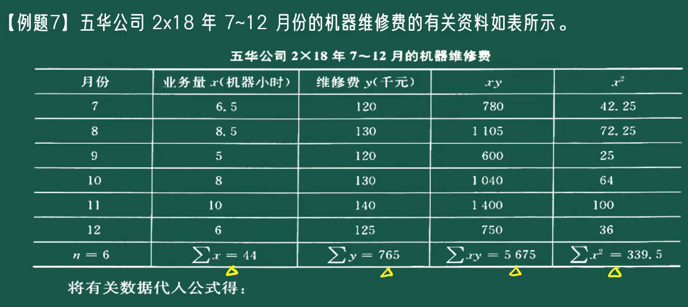
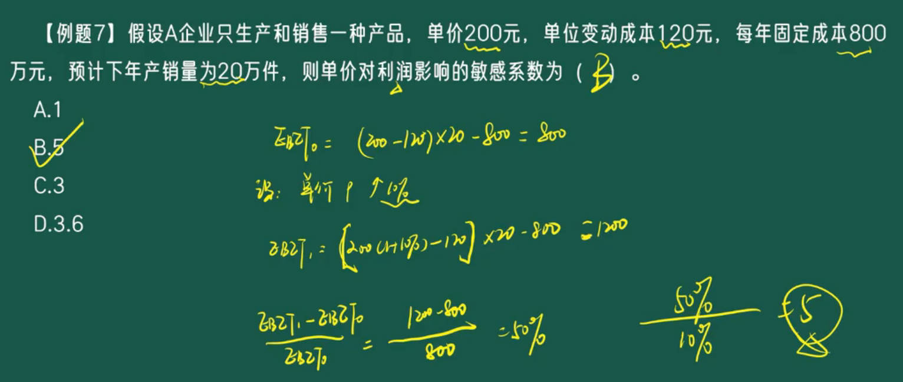
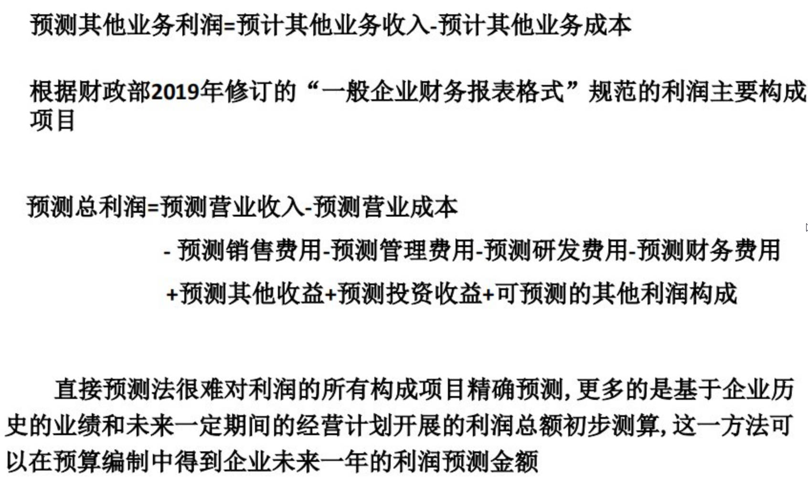
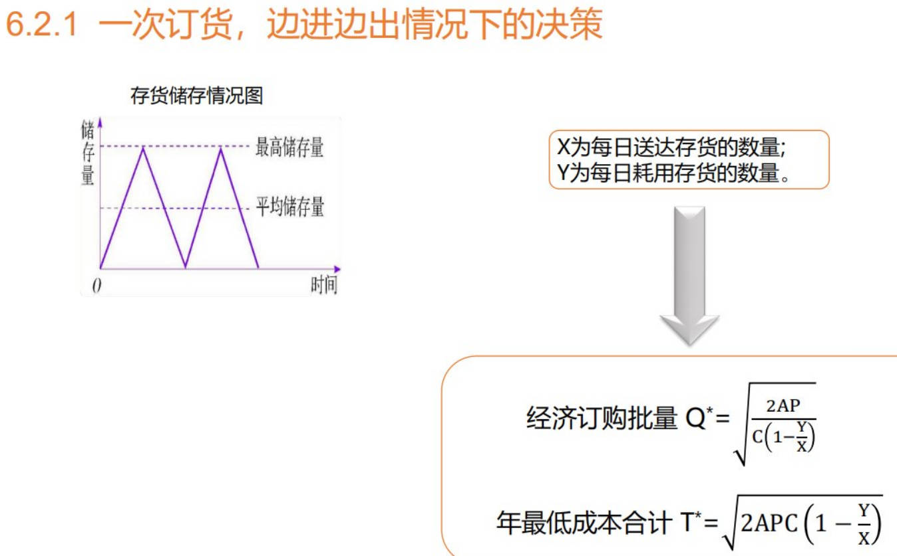
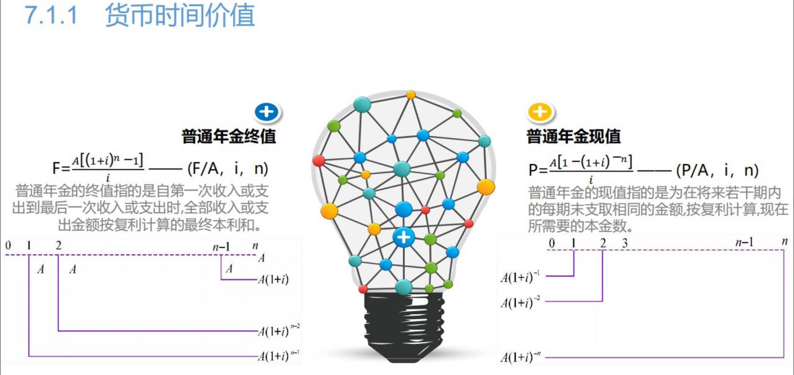
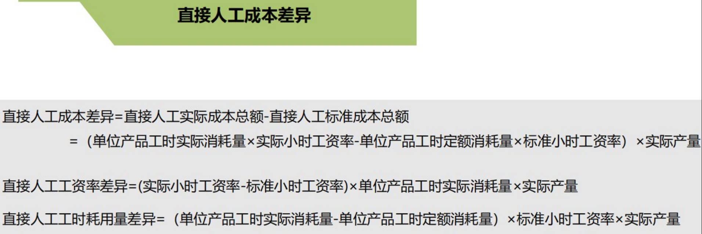
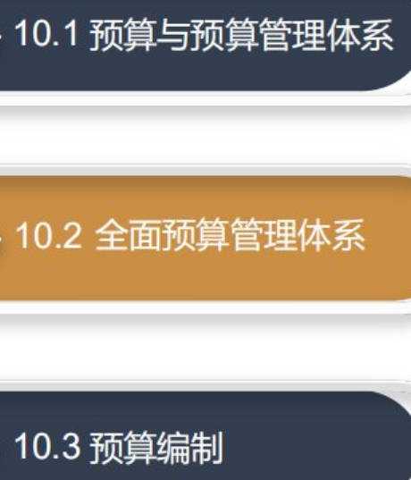
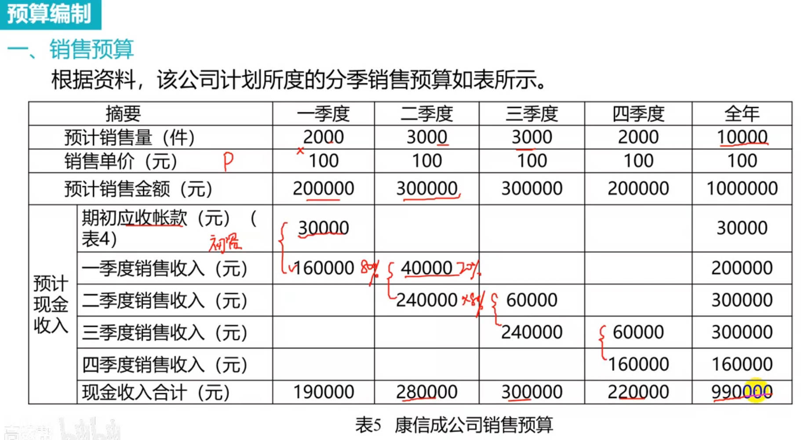
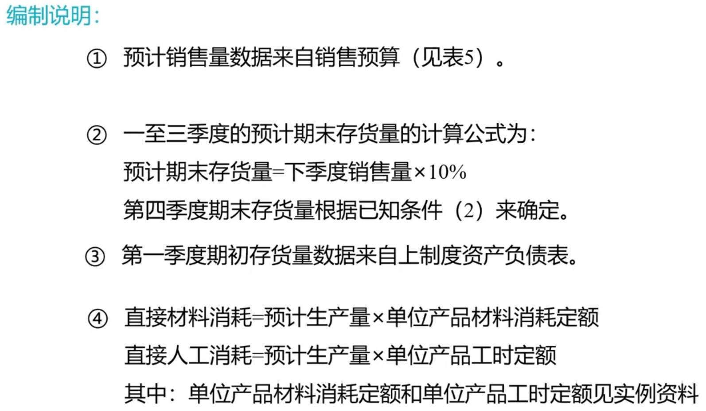
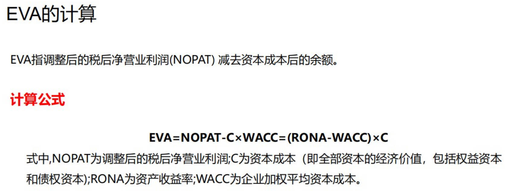

# 学习难点

# 目录

视频： [好：管理会计学](https://www.bilibili.com/video/BV19Ez5YeEUR?vd_source=7346303e5e18677d7261c2c0c109ecfd&spm_id_from=333.788.videopod.episodes&p=9)     [管理会计学](https://www.bilibili.com/video/BV1hqz3YRESy/?vd_source=7346303e5e18677d7261c2c0c109ecfd)    [另一个](https://www.bilibili.com/video/BV1ffMczgEnv?vd_source=7346303e5e18677d7261c2c0c109ecfd&spm_id_from=333.788.videopod.sections&p=2)  [另一个](https://www.bilibili.com/video/BV1xL4y1A72H/?p=5&vd_source=7346303e5e18677d7261c2c0c109ecfd)  [金融学](https://www.bilibili.com/video/BV1Sh411a7pJ/?p=23&vd_source=7346303e5e18677d7261c2c0c109ecfd)   [全面预算](https://search.bilibili.com/all?vt=35498795&keyword=%E5%85%A8%E9%9D%A2%E9%A2%84%E7%AE%97&search_source=5)  

[管理会计学](https://www.bilibili.com/video/BV19Ez5YeEUR/?vd_source=7346303e5e18677d7261c2c0c109ecfd)   [东北财经大学-管理会计](https://www.bilibili.com/video/BV1v7411B7wb/?vd_source=7346303e5e18677d7261c2c0c109ecfd)  [管理会计东北财经大学](https://www.bilibili.com/video/BV1Mk4y1o75d/?p=19&vd_source=7346303e5e18677d7261c2c0c109ecfd)    [中央财经大学](https://www.bilibili.com/video/BV1yd4y1G7kq?spm_id_from=333.788.videopod.episodes&vd_source=7346303e5e18677d7261c2c0c109ecfd&p=7)  

管理会计应用指引: [管理会计应用指引](http://search.mof.gov.cn/was5/web/search?channelid=289898)  [管理会计应用指引_百度百科](https://baike.baidu.com/item/%E7%AE%A1%E7%90%86%E4%BC%9A%E8%AE%A1%E5%BA%94%E7%94%A8%E6%8C%87%E5%BC%95/61083579)   

[产品成本分析](https://blog.csdn.net/oOBubbleX/article/details/148618622)   

**管理会计新增方法**：abc、jit、质量成本管理、产品生命周期成本管理、目标成本法、平衡计分卡

# 2、成本性态
1. 成本按==性态==分类
   1. 固定成本
   2. 变动成本
   3. 混合成本

2. 混合成本分解
   1. 分解为固定、变动
   2. `5种分解方法`：  只有高低点、回归直线法需要计算，要用到历史成本
      1. 高低点法: 只找业务量最高点、最低点坐标
      2. 回归直线法

|     |  |
| ------------------------------------------------------------ | --------------------------------------------------------- |
|     |  |
|     |  |
|  |  |
|     |  |
|     |  |
|     |  |

## 变动成本法

[变动成本法](https://www.bilibili.com/video/BV1ffMczgEnv?vd_source=7346303e5e18677d7261c2c0c109ecfd&spm_id_from=333.788.videopod.sections&p=3)  

> 概念：是指企业在进行常规成本计算时，以==成本性态分析==为前提, 只将==变动成本==作为产品成本的构成内容,而将==固定生产成本及非生产成本==作为期间成本,并按==贡献式损益==程序确定企业损益的一种成本计算方法

1. 变动成本法计算方法
2. 和完全成本法差异
   1. 成本构成
      1. 变动：产品成本包括变动生产成本，固定成本、非生产成本为期间成本
      2. 完全：产品成本包括全部生产成本，非生产成本为期间成本
   2. 销货成本及存货成本
   3. 营业净利润确定程序
3. 传统式损益和贡献式损益表

|  |  |
| ------------------------------------------------------------ | ------------------------------------------------------------ |
|     |     |

# 3、本量利分析

> - ‌**P**‌：单价（Price）
> - ‌**Q**‌：产销量（Quantity）
> - ‌**Vc**‌：单位变动成本（Variable Cost per Unit）
> - ‌**F**‌：固定经营成本（Fixed Operating Cost）
> - EBIT = 销售收入（PQ） - 变动成本（VQ） - 固定成本（F）
>   - $EBIT=PQ−VQ−F$
>
> 书本上的
>
> 1. V：业务量，volume
> 2. SP：销售价格(单价)，selling price
> 3. P：利润，profit
> 4. CM：贡献毛益，contribution margin，$收入 - 变动成本$
> 5. UCM：单位贡献毛益，$单价 - 单位变动成本$

[贡献毛益有两种表现形式](https://baike.baidu.com/item/%E8%B4%A1%E7%8C%AE%E6%AF%9B%E7%9B%8A%E7%8E%87/867123?fr=aladdin)   [边际贡献率_百度百科](https://baike.baidu.com/item/%E8%BE%B9%E9%99%85%E8%B4%A1%E7%8C%AE%E7%8E%87/2805054)   

[变动成本率](https://www.dongao.com/zckjs/cg/201904251006915.shtml)  

1. 成本、业务量、利润
   1. EBIT（息税前利润）: $收入 - 全部成本费用$
   2. 2个概念，2个率
      1. 边际贡献，就是书上的贡献毛益，常称==毛利==
      2. 边际贡献率: 每一元销售收入时边际贡献所占的比重
         1. `边际贡献`占收入的比重
         2. $\color{blue}边际贡献率=边际贡献\div销售收入=单位边际贡献\div单价$
         3. $\color{blue}变动成本率=变动成本\div销售收入=单位变动成本\div单价$
         4. $\color{blue}边际贡献率 + 变动成本率 = 1$
      3. 变动成本率: 也称补偿率，是与边际贡献率相对应的概念，即`变动成本`在销售收入中所占的百分率
         1. 和边际贡献率互补。产品变动成本率高，边际贡献率低，盈利能力小
2. 单一产品本量利分析
   1. 盈亏平衡分析：==保本分析==，盈亏平衡点， $EBIT = 0$
      1. 保本量、保本额
      2. 安全边际分析
   2. 目标利润分析： ==保利分析==，$EBIT = (p-v)q-F$，解方程，知4求1
   3. 本量利==敏感性分析==
      1. 利润敏感性分析： 一个因素变动，会导致利润有多少变动； 换种说法，利润变动是因素变动的多少倍
   
3. ==多种产品==保本分析
|     |  |
| ------------------------------------------------------------ | ------------------------------------------------------------ |
|  |     |
|     |  |
|     |     |
|     |                                                         |

## 保利分析
|     |     |
| --------------------------------------------------------- | --------------------------------------------------------- |
|     |     |

## 利润敏感性分析
|     |     |
| --------------------------------------------------------- | --------------------------------------------------------- |

## 多种产品保本分析
1. 综合边际贡献法: 加权平均法
2. 联合单位法 ： 俗称打包法
   1. 先求数量比
   2. 联合单价、联合单位变动成本

|  |  |
| --------------------------------------------------------- | --------------------------------------------------------- |
|  |  |
|  |  |
|  |  |

## 因素变动影响

1. 多种产品保本分析
   1. 先算保本额，再算保本量
2. 目标利润多因素分析
3. 经营安全分析

|  |  |
| --------------------------------------------------------- | --------------------------------------------------------- |
|  |  |
|  |  |

# 4、预测分析

[德尔菲法](https://baijiahao.baidu.com/s?id=1697726570501817231&wfr=spider&for=pc)  [指数平滑法](https://www.cnblogs.com/coshaho/p/9064785.html)   [预测算法—指数平滑法](https://www.cnblogs.com/zywnnblog/p/14270687.html)   

[经营预测](https://app8tmuj6dd3979.xet-pc.citv.cn/p/t_pc/course_pc_detail/video/v_6184c8e5e4b0bab3cb79b599?content_app_id=&product_id=p_6184a6e0e4b02561a6c9cb5c&type=6)  

1. **销售量预测**
   1. 定性销售预测：依据未来性质
      1. 市场调查
      2. 专家意见法: 德尔菲法
   2. 定量销售预测：通过数据预测
      1. 趋势分析法：根据历史数据是否同等对待分为以下几种
         1. 简单的算术平均法
         2. 移动加权平均法
         3. 指数平滑法: 加权平均法的改变
      2. 因素预测法：回归分析法
      3. 季节预测法
2. **成本预测**: 成本管理、预算编制的前提
   1. 和销售预测一脉相承，`也有趋势预测、因果预测`
      1. 对历史数据同等对待，就用算术平均法
      2. 对历史数据有权重，用加权平均法
      3. 更好的成本预测方法是因果预测法，用回归直线或更复杂的成本模型，抓住成本有关的因素，打造成本曲线。

   2. `目标成本法下的成本预测`：施加管理目标

3. **利润预测**
   1. 直接预测法：以财务报表为依托
      1. 直观、精度差

   2. 因素分析法
      1. 用数理统计方法，抓住影响利润的因素，打造利润模型，更精确的预测因素改变，对利润的影响
         1. 用因素对利润影响的`敏感系数`

4. **资金需要量预测**
   1. 资金需要总量
      1. 从销售收入、资产负债表，分析一定销售规模或资产负债规模，需要多少资金占用
      2. 预计资产负债表法： 销售百分比法
   2. 固定资金需要量
   3. 流动资金需要量
      1. 前3种方法实践中结合使用

## 销售量预测

|     |     |
| ------------------------------------------------------------ | ------------------------------------------------------------ |
|     |     |
|  |  |
|  |     |
|     |     |
|                               |                                                         |

## 成本预测

## 利润预测

## 资金需要量预测

# 5、短期经营决策

1. 定价决策
2. 产品功能成本决策
3. 品种决策: 生产什么
   1. 利用本量利分析中的贡献毛益，以及决策相关成本概念中的专属成本，提高了剩余贡献毛益，这2类指标为决策提供支持
   2. ==贡献毛益分析法==
4. 产品组合优化决策: 生产多少
5. 生产组织决策： 如何生产
6. 存货决策
   1. 存货的经济订货批量： 要储存或订多少存货

## 定价决策

## 产品功能成本决策

## 品种决策

## 产品组合优化决策

## 生产组织决策

生产决策：本量利分析的具体运用

1. 亏损产品是否停产决策
2. 新产品开发决策
3. 零部件自制或外购决策

|  |  |
| --------------------------------------------------------- | --------------------------------------------------------- |
|  |  |
|  |  |
|  |  |
|  |  |
|  |                                                      |

又一个教程

[短期经营决策](https://www.bilibili.com/video/BV1ffMczgEnv/?p=5&vd_source=7346303e5e18677d7261c2c0c109ecfd)   

|  |  |
| --------------------------------------------------------- | --------------------------------------------------------- |
|  |  |
|  |  |
|  |                                                      |

## 存货规划与周转期控制

1. 经济订货批量模型
2. 存货需要在数量、周转期上管理

|  |  |
| --------------------------------------------------------- | --------------------------------------------------------- |
|  |  |
|  |  |
|  |  |
|  |  |
|  |  |
|  |  |
|  |                                                           |

# 7、长期投资决策

1. 现金流量确定
   1. 投资期现金流量确定
   2. 营业期现金流量确定
   3. 终结期现金流量确定
2. 长投决策指标
   1. 净现值
   2. 现值指数
   3. 年金净流量
   4. 内含报酬率
   5. 回收期

|  |  |
| --------------------------------------------------------- | --------------------------------------------------------- |
|  |  |
|  |  |
|  |  |
|  |  |
|  |  |
|  |  |
|  |  |
|  |  |
|  |  |
|  |  |
|  |                                                           |

又一个教程

[长期经营决策](https://www.bilibili.com/video/BV1ffMczgEnv?vd_source=7346303e5e18677d7261c2c0c109ecfd&spm_id_from=333.788.videopod.sections&p=6)  

1. 货币时间价值
   1. 复利：复利终值、现值
   2. 年金
      1. 普通年金： 普通年金终值、现值
      2. 预付年金： 预付年金终值、现值

|  |  |
| --------------------------------------------------------- | --------------------------------------------------------- |
|  |  |
|  |  |

# 8、成本管理

1. 目标成本管理
2. 责任成本管理
3. 标准成本管理

|  |  |
| --------------------------------------------------------- | --------------------------------------------------------- |
|  |  |
|  |  |
|  |  |
|  |  |
|  |  |

## 标准成本管理
|  |  |
| --------------------------------------------------------- | --------------------------------------------------------- |
|  |  |
|  |  |
|  |  |
|  |  |
|  |  |

# 9、作业成本管理

|  |  |
| --------------------------------------------------------- | --------------------------------------------------------- |
|  |  |
|  |  |
|  |  |
|  |  |
|  |  |
|  |                                                      |

# 10、预算管理

1. 预算管理体系
   1. 分事前、事中、事后3个阶段
   2. 预算管理的最优实践：全面预算管理

2. 经营预算
   1. 销售预算
   2. 生产预算
   3. 直接材料预算
   4. 制造费用预算
3. 现金预算

|  |  |
| --------------------------------------------------------- | --------------------------------------------------------- |
|  |  |
|  |  |
|  |  |
|  |  |
|  |  |
|  |  |
|  |  |
|  |  |
|  |                                                      |

## 全面预算

[全面预算](https://www.bilibili.com/video/BV1ffMczgEnv?vd_source=7346303e5e18677d7261c2c0c109ecfd&spm_id_from=333.788.videopod.sections&p=7)  

预算编制方法
1. 增量预算：以历史水平为出发点，例前年水平，预计今年增加10%，所有项目按前年水平都乘10%，得到今年数据
2. 零基预算：全部项目都不参考以前历史数据
3. 滚动预算：1月份做1月到12月的预算，2月份做2月份到下一年1月份的，每次增加一个，剔除一个

|     |     |
| ------------------------------------------------------------ | ------------------------------------------------------------ |
|     |     |
|     |     |

### 实例

[预算](https://www.bilibili.com/video/BV1ffMczgEnv?vd_source=7346303e5e18677d7261c2c0c109ecfd&spm_id_from=333.788.videopod.sections&p=7)  

1. 先做销售预算
2. 生产预算
3. 直接材料采购预算
4. 直接工资预算
5. 制造费用预算
6. 产品成本预算
7. 管理费用预算
8. 财务费用预算
9. 销售费用预算
10. 预计利润表
11. 现金收支预算

|     |     |
| ------------------------------------------------------------ | ------------------------------------------------------------ |
|     |     |
|     |     |
|     |  |
|  |     |
|     |     |
|     |     |
|     |     |
|     |     |
|     |     |
|     |     |
|     |     |
|     |     |

# 11、业绩考核

|  |  |
| --------------------------------------------------------- | --------------------------------------------------------- |
|  |  |
|  |  |
|  |  |
|  |  |
|  |  |
|  |  |
|  |  |
|  |  |
|  |  |
|  |  |
|  |  |
|  |  |
|  |  |
|  |  |

# 12、责任会计

|  |  |
| --------------------------------------------------------- | ----- |
|                                                      |  |
|                                                      |  |
|                                                      |  |
|                                                      |  |
|                                                      |  |
|                                                      |  |
