视频： [好：财务管理](https://www.bilibili.com/video/BV1fppbeFErH?vd_source=7346303e5e18677d7261c2c0c109ecfd&spm_id_from=333.788.videopod.episodes)    [年金的计算](https://www.bilibili.com/video/BV1GN4y1R7vu?vd_source=7346303e5e18677d7261c2c0c109ecfd&spm_id_from=333.788.videopod.sections&p=7) [cpa财务管理](https://www.bilibili.com/video/BV1Pb411R7Gg/?p=17&vd_source=7346303e5e18677d7261c2c0c109ecfd)    [公司理财](https://www.bilibili.com/video/BV1fctLevEj6/?vd_source=7346303e5e18677d7261c2c0c109ecfd)  [财务管理学](https://www.bilibili.com/video/BV1Tp4y1p7Fb/?p=20&vd_source=7346303e5e18677d7261c2c0c109ecfd)  [财务管理](https://www.bilibili.com/video/BV1D94y1c7Ay/?p=20&vd_source=7346303e5e18677d7261c2c0c109ecfd)  [东北财经大学](https://www.bilibili.com/video/BV1sw411i7U6/?p=9&vd_source=7346303e5e18677d7261c2c0c109ecfd)    [刘阳中级会计实务](https://www.bilibili.com/video/BV1omxezBEAC?vd_source=7346303e5e18677d7261c2c0c109ecfd&p=6&spm_id_from=333.788.videopod.episodes)  

[好：财管](https://space.bilibili.com/29130793)   [好：财管](https://space.bilibili.com/23951239/upload/video)  [教材视频](https://space.bilibili.com/385837831/upload/video)  

[证券的估值](https://www.bilibili.com/video/BV1a2TxzaErq?vd_source=7346303e5e18677d7261c2c0c109ecfd&p=17&spm_id_from=333.788.videopod.episodes)  [财务报表分析](https://www.bilibili.com/video/BV1154y1M7ii?spm_id_from=333.788.videopod.episodes&vd_source=7346303e5e18677d7261c2c0c109ecfd&p=3)  

股权穿透：[vie架构_百度搜索](https://www.baidu.com/s?ie=UTF-8&wd=vie%E6%9E%B6%E6%9E%84)   [协议控股结构_百度百科](https://baike.baidu.com/item/%E5%8D%8F%E8%AE%AE%E6%8E%A7%E8%82%A1%E7%BB%93%E6%9E%84/7312087?fr=aladdin)  

计算器： [DCF计算器](https://leetab.com/tools/DCF/?code=sz300773)  [好：价值计算器](https://www.jrjsq.com/) [好：TVM Calculator](https://online-calculator.org/time-value-of-money-calculator.aspx)       [复利计算器](https://kingscalculator.com/zh-CN/%E9%87%91%E8%9E%8D%E8%AE%A1%E7%AE%97%E5%99%A8/%E5%A4%8D%E5%88%A9%E8%AE%A1%E7%AE%97%E5%99%A8)   [tvm计算器_CFA/FRM](https://aicoding.csdn.net/6840faa4606a8318e85b612c.html?spm=1001.2101.3001.6661.1&depth_1-utm_source=distribute.pc_relevant_t0.none-task-blog-2%7Edefault%7EBlogCommendFromBaidu%7Eactivity-1-111114932-blog-111114927.235%5Ev43%5Epc_blog_bottom_relevance_base1)   

[0-1规划_百度搜索](https://www.baidu.com/s?ie=UTF-8&wd=0-1%E8%A7%84%E5%88%92)  [0-1整数规划与隐枚举法](https://cloud.tencent.com/developer/article/1028712)  

# 1、总论

[企业财务通则](https://tfs.mof.gov.cn/caizhengbuling/200806/t20080602_44453.htm)   [企业财务通则详解：从财务管理到收益分配的全面指导](https://baijiahao.baidu.com/s?id=1842177732503690442&wfr=spider&for=pc)  [企业财务通则](https://www.shui5.cn/article/62/5268$3.html)    

[税务](https://www.shui5.cn/article/62/5268$3.html)  

[国家的经济政策有哪些](https://ailegal.baidu.com/?fr=seo_qadetail&template=business&articleType=qadetail&articleId=c07527dd3f4812250103)  [宏观微观经济政策](https://chat.baidu.com/search?word=%E7%BB%8F%E6%B5%8E%E6%94%BF%E7%AD%96%E7%A7%8D%E7%B1%BB&pd=csaitab&setype=csaitab&extParamsJson=%7B%22enter_type%22%3A%22a_279%22%2C%22sa%22%3A%22re_dl_content_279%22%2C%22apagelid%22%3A%22955567390178c4a7%22%2C%22ori_lid%22%3A%2210760620379207156903%22%2C%22his_key%22%3A%22ag_10760620379207156903%22%2C%22aPageWord%22%3A%22%E7%BB%8F%E6%B5%8E%E6%94%BF%E7%AD%96%E7%A7%8D%E7%B1%BB%22%2C%22srcid%22%3A%22279%22%2C%22dqaKey%22%3A%22aichat_cache_ddce7643-2cb9-44f7-91a3-6e90b0bdb57f_1598884012818775675%22%7D)  

[独立董事](https://zhuanlan.zhihu.com/p/1076110522)  [执行董事](https://zhuanlan.zhihu.com/p/532625539)   [独立董事_百度百科](https://baike.baidu.com/item/%E7%8B%AC%E7%AB%8B%E8%91%A3%E4%BA%8B/1753544)  [非独立董事_百度百科](https://baike.baidu.com/item/%E9%9D%9E%E7%8B%AC%E7%AB%8B%E8%91%A3%E4%BA%8B/2504540)  

[经济模型_百度百科](https://baike.baidu.com/item/%E7%BB%8F%E6%B5%8E%E6%A8%A1%E5%9E%8B/1910400)  

[风险溢价_百度搜索](https://www.baidu.com/s?ie=UTF-8&wd=%E9%A3%8E%E9%99%A9%E6%BA%A2%E4%BB%B7)   [好：风险溢价 风险报酬](https://chat.baidu.com/search?word=%E9%A3%8E%E9%99%A9%E6%BA%A2%E4%BB%B7+%E9%A3%8E%E9%99%A9%E6%8A%A5%E9%85%AC&dyTabStr=MTIsMCwzLDEsMiwxMyw3LDYsNSw5&pd=csaitab&setype=csaitab&extParamsJson=%7B%22enter_type%22%3A%22search_a_tab%22%2C%22sa%22%3A%22vs_tab%22%2C%22apagelid%22%3A%2215110923892090226317%22%2C%22ori_lid%22%3A%2215110923892090226317%22%7D)  [好：通俗理解风险溢价](https://www.zhihu.com/question/26891682/answer/3255999876)  

实例： [万 科Ａ(SZ000002)财务分析](https://emweb.securities.eastmoney.com/pc_hsf10/pages/index.html?type=web&code=SZ000002&color=b#/cwfx/zyzb)     [小米集团-W(01810)财务分析](https://emweb.securities.eastmoney.com/PC_HKF10/pages/home/index.html?code=01810&type=web&color=w#/newfinancialanalysis)   

> 财管包括： ==**筹资、投资、营运资金、分配管理**==

1. ==财务活动==
   1. 分配活动：利润、股利分配
2. ==财务关系==
   1. 财务管理目标
   2. 财务管理原则
3. 企业组织形式
4. 财务管理环境
   1. 经济环境
      1. 经济周期
      2. 经济发展水平
      3. 通货膨胀
      4. `经济政策`
         1. 经济发展计划、产业政策、财税政策、金融政策
         2. 外汇政策、外贸政策、货币政策、行政法规
   2. 法律环境
      1. 企业组织法规
      2. 财务会计法规
         1. `企业财务通则`
      3. 税法
   3. 金融市场环境
      1. 金融市场构成
      2. 金融工具
         1. 货币市场证券
         2. 资本市场证券
      3. 利息率
         1. ==利率构成==：纯利率、通货膨胀补偿、风险报酬
            1. 风险报酬又分：违约风险报酬、流动性风险报酬、期限风险报酬
         2. 风险溢价： 某项投资`预期收益率与无风险收益率`（如国债利率）的差额，是投资者为承担不确定性所要求的补偿‌
            1. 例如，若股票预期收益率为10%，国债收益率为3%，则风险溢价为7%‌
            2. $风险溢价=必要报酬率−无风险报酬率$
         3. 风险报酬： 广义上等同于风险溢价，但更强调风险与收益的均衡关系。其表现形式包括绝对数（如金额）和相对数（如风险报酬率）。
            1. 例如，高风险资产（如股票）需提供更高潜在收益以吸引投资者‌

| 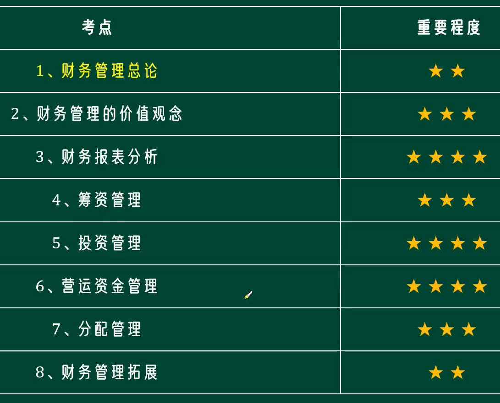 | 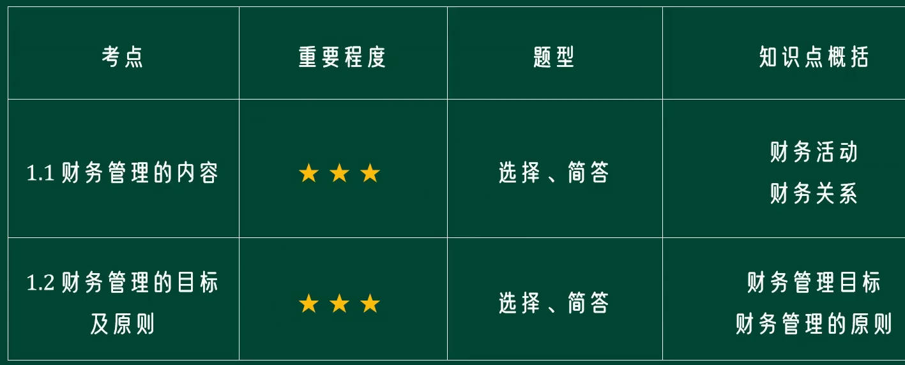 |
| --------------------------------------------------------- | --------------------------------------------------------- |
|  | 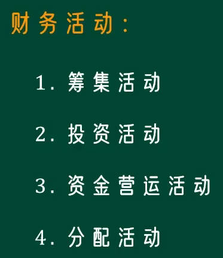 |
| 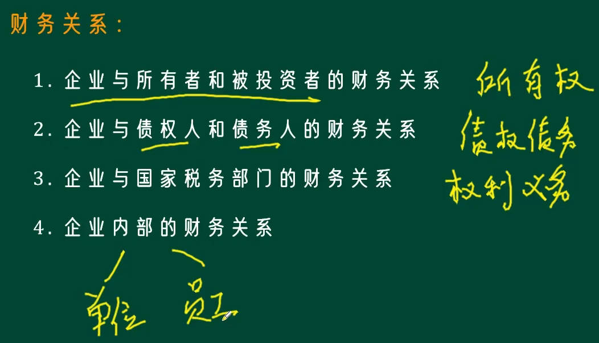 | 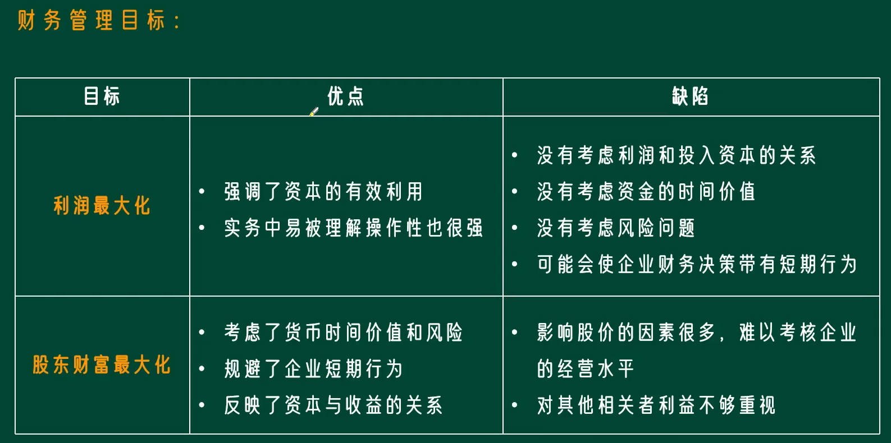 |
| 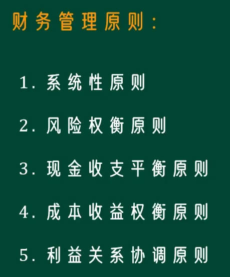 | 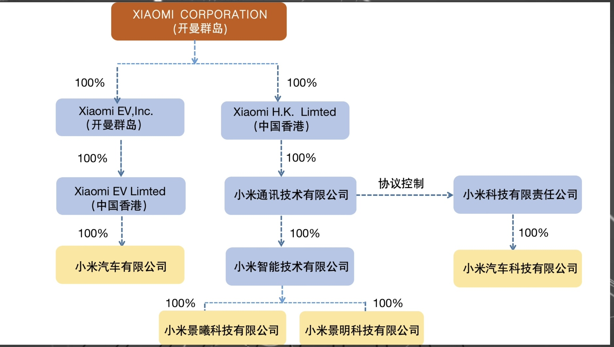                   |

## 财管研究内容

视频： [总论](https://www.bilibili.com/video/BV1KT4y1F7qG/?vd_source=7346303e5e18677d7261c2c0c109ecfd)  

[龙虎榜_百度搜索](https://www.baidu.com/s?ie=UTF-8&wd=%E9%BE%99%E8%99%8E%E6%A6%9C)   [资本运作_百度搜索](https://www.baidu.com/s?ie=UTF-8&wd=%E8%B5%84%E6%9C%AC%E8%BF%90%E4%BD%9C)  [资本运作](https://chat.baidu.com/search?word=%E8%B5%84%E6%9C%AC%E8%BF%90%E4%BD%9C&dyTabStr=MTIsMCwzLDEsMiwxMyw3LDYsNSw5&pd=csaitab&setype=csaitab&extParamsJson=%7B%22enter_type%22%3A%22search_a_tab%22%2C%22sa%22%3A%22vs_tab%22%2C%22apagelid%22%3A%2212644456665148563225%22%2C%22ori_lid%22%3A%2212644456665148563225%22%7D)  

[短债长投_百度搜索](https://www.baidu.com/s?ie=UTF-8&wd=%E7%9F%AD%E5%80%BA%E9%95%BF%E6%8A%95)  [政策如何缓解企业“短债长投”困境](https://baijiahao.baidu.com/s?id=1844597368617411866&wfr=spider&for=pc)  

[经理人期权_百度搜索](https://www.baidu.com/s?ie=UTF-8&wd=%E7%BB%8F%E7%90%86%E4%BA%BA%E6%9C%9F%E6%9D%83)   [经理人期权](./经理人期权)   [企业价值最大化的优缺点](https://www.dongao.com/zjzcgl/cwgl/202304214204614.shtml)   

[企业价值最大化](https://chat.baidu.com/search?word=%E4%BC%81%E4%B8%9A%E4%BB%B7%E5%80%BC%E6%9C%80%E5%A4%A7%E5%8C%96&dyTabStr=MTIsMCwzLDEsMiwxMyw3LDYsNSw5&pd=csaitab&setype=csaitab&extParamsJson=%7B%22enter_type%22%3A%22search_a_tab%22%2C%22sa%22%3A%22vs_tab%22%2C%22apagelid%22%3A%2211420985465096925972%22%2C%22ori_lid%22%3A%2211420985465096925972%22%7D)     [企业价值最大化计算案例](https://chat.baidu.com/search?word=%E4%BC%81%E4%B8%9A%E4%BB%B7%E5%80%BC%E6%9C%80%E5%A4%A7%E5%8C%96&dyTabStr=MTIsMCwzLDEsMiwxMyw3LDYsNSw5&pd=csaitab&setype=csaitab&extParamsJson=%7B%22enter_type%22%3A%22search_a_tab%22%2C%22sa%22%3A%22vs_tab%22%2C%22apagelid%22%3A%2211420985465096925972%22%2C%22ori_lid%22%3A%2211420985465096925972%22%7D)   [戈登增长模型_百度搜索](https://www.baidu.com/s?ie=UTF-8&wd=%E6%88%88%E7%99%BB%E5%A2%9E%E9%95%BF%E6%A8%A1%E5%9E%8B)   [好：企业价值最大化计算案例](./企业价值最大化计算案例)

1. ==净营运资本==： 正常经营的企业流动资产比流动负债多，多出来的部分叫净营运资本  [净营运资本_百度搜索](https://www.baidu.com/s?ie=UTF-8&wd=%E5%87%80%E8%90%A5%E8%BF%90%E8%B5%84%E6%9C%AC)  
2. 交易性金融资产： 短期股票操作；  ==可供出售金融资产==：收购、兼并等长期持有的股票
   1. 龙虎榜: 上海、深圳证券交易所每日公布的`股票交易异常波动榜单`，用于揭示当日涨幅、换手率等指标异常的个股信息
   2. 资本运作： 以资本保值增值为导向，通过兼并、收购、重组等手段实现资源优化配置‌
3. 企业价值最大化：企业寿命周期内,所有的现金流估算出来，按股东要求的回报率，折为期初的值
   1. 例公司活50年，每年赚的钱用C表示，股东要求的回报率$R_s$，所有的钱都按$R_s$折现到期初
4. 财管4个基础理论
   1. 投资组合： 解决资产配置，`鸡蛋不要放在一个篮子里`
   2. 资本资产定价模型：解决`风险的定价`,多少风险给多少收益合适
   3. MM资本结构理论：解决资产的配置，`股权和债权各占多少`
   4. Black-Scholes期权定价模型

| 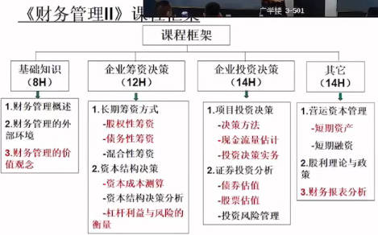 | 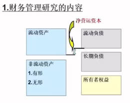 |
| --------------------------------------------------------- | --------------------------------------------------------- |
| 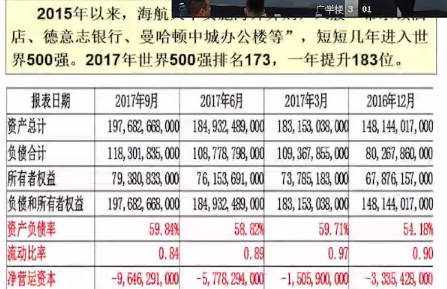 | 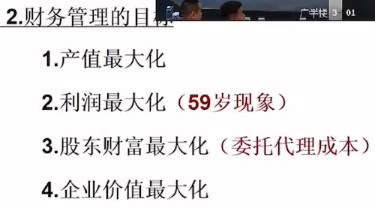 |
| 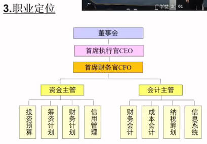 | 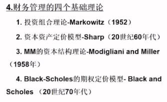 |
| 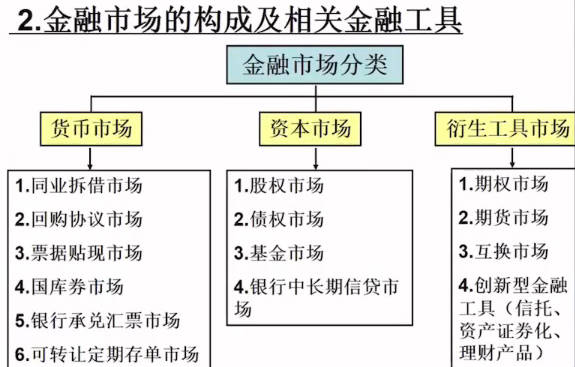 | 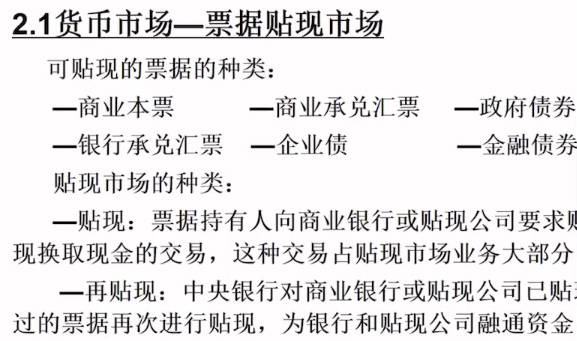 |
| 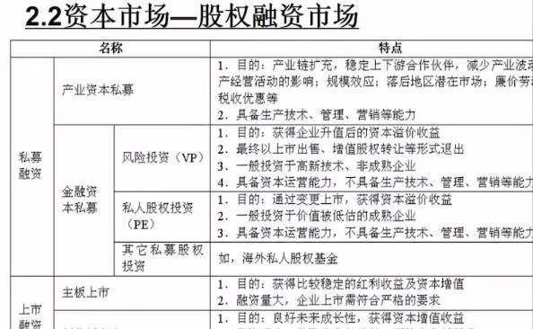 | 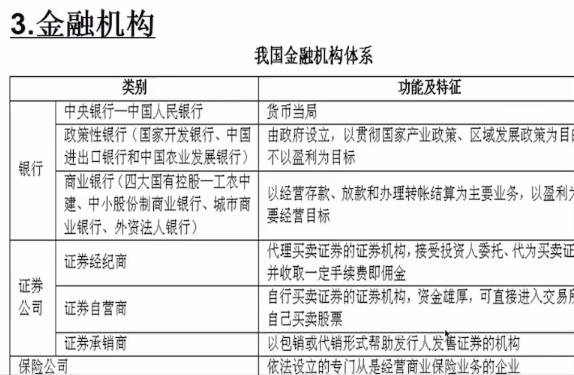 |

# 2、财务管理价值观念

[财务管理的价值观念](https://www.bilibili.com/video/BV1fppbeFErH?vd_source=7346303e5e18677d7261c2c0c109ecfd&p=2&spm_id_from=333.788.player.switch)  

[常用的六个复利基本公式](https://easylearn.baidu.com/edu-page/tiangong/questiondetail?id=1831305321966239338&fr=search)   [复利计算公式_百度百科](https://baike.baidu.com/item/%E5%A4%8D%E5%88%A9%E8%AE%A1%E7%AE%97%E5%85%AC%E5%BC%8F/5158638)  [神奇的复利效应](https://baijiahao.baidu.com/s?id=1763782949317841720&wfr=spider&for=pc)  [复利（经济学计算方法）](https://baike.baidu.com/item/%E5%A4%8D%E5%88%A9/7480331?fr=aladdin)  [复利、年金与贷款问题](https://baijiahao.baidu.com/s?id=1693450631593490546&wfr=spider&for=pc)  

[标准复利公式](https://easylearn.baidu.com/edu-page/tiangong/questiondetail?id=1828504462397282114&fr=search)   [标准复利公式](https://chat.baidu.com/search?word=%E6%A0%87%E5%87%86%E5%A4%8D%E5%88%A9%E5%85%AC%E5%BC%8F&dyTabStr=MTIsMCwzLDEsMiwxMyw3LDYsNSw5&pd=csaitab&setype=csaitab&extParamsJson=%7B%22enter_type%22%3A%22search_a_tab%22%2C%22sa%22%3A%22vs_tab%22%2C%22apagelid%22%3A%229753785310947483388%22%2C%22ori_lid%22%3A%229753785310947483388%22%7D)  [compound interest formula](https://chat.baidu.com/search?word=s%3Dp%281%2Bj%2Fm%29%5Emt&dyTabStr=MTIsMCwzLDEsMiwxMyw3LDYsNSw5&pd=csaitab&setype=csaitab&extParamsJson=%7B%22enter_type%22%3A%22search_a_tab%22%2C%22sa%22%3A%22vs_tab%22%2C%22apagelid%22%3A%2211688847968206144591%22%2C%22ori_lid%22%3A%2211688847968206144591%22%7D)  

[tvm计算器](https://blog.csdn.net/weixin_39524984/article/details/111114927)   [tvm计算器](https://blog.csdn.net/weixin_39939661/article/details/111114932)  

[年金](https://chat.baidu.com/search?word=pva%3Dfva&dyTabStr=MTIsMCwzLDEsMiwxMyw3LDYsNSw5&pd=csaitab&setype=csaitab&extParamsJson=%7B%22enter_type%22%3A%22search_a_tab%22%2C%22sa%22%3A%22vs_tab%22%2C%22apagelid%22%3A%2214492632700945508309%22%2C%22ori_lid%22%3A%2214492632700945508309%22%7D)  [TVM计算器计算投资储备](https://zhuanlan.zhihu.com/p/380446513)    

[负指数幂_百度百科](https://baike.baidu.com/item/%E8%B4%9F%E6%8C%87%E6%95%B0%E5%B9%82/10702069)  [负指数幂](https://chat.baidu.com/search?word=%E8%B4%9F%E6%8C%87%E6%95%B0%E5%B9%82&extParams=%7B%22enter_type%22%3A%22a_choosecontent%22%2C%22sa%22%3A%22re_dl_choosecontent%22%7D)  

1. 货币时间价值
   1. 复利: `compound interest`
      1. 现值： `Present Value`
   2. 年金: `Annuity pension` 
      1. ==普通年金==：每期`期末`发生的年金
         1. 求到第10年末，所有收益的终值是多少： 即求每一期年金`终值之和`
            1. 第一期没有复利，年金是从第1年年末开始
            2. $\color{green}FV_1 = 1\times (1 + 5\%)^9$ : 第一期期末年金1万，累积到第10年年末，复利了9期
            3. 第2期期末年金1万，累积到第10年年末，复利了8期
            4. 最后一期没有复利，就1万
            5. 每期年金终值相加，就得到公式
         2. FVA (Future Value of Annuity) , PMT(periodic payment)
      2. ==即付年金==：每期`期初`发生的年金
         1. 第一期是：$\color{green}FV_1 = 1\times (1 + 5\%)^{10}$，多乘了个 $(1+i)$
      3. ==递延年金==：从m年年初开始发生的年金
         1. 一共给 $\color{green}n - m$ 年的年金
         2. 现值算的是0时间的现值，而不是m时间处的现值，所以分母指数用n，而不是用$\color{green}n - m$
      4. ==永续年金==：没有终点的普通年金

2. 风险报酬： 风险、收益的计算
3. 证券估价

## 货币时间价值

| 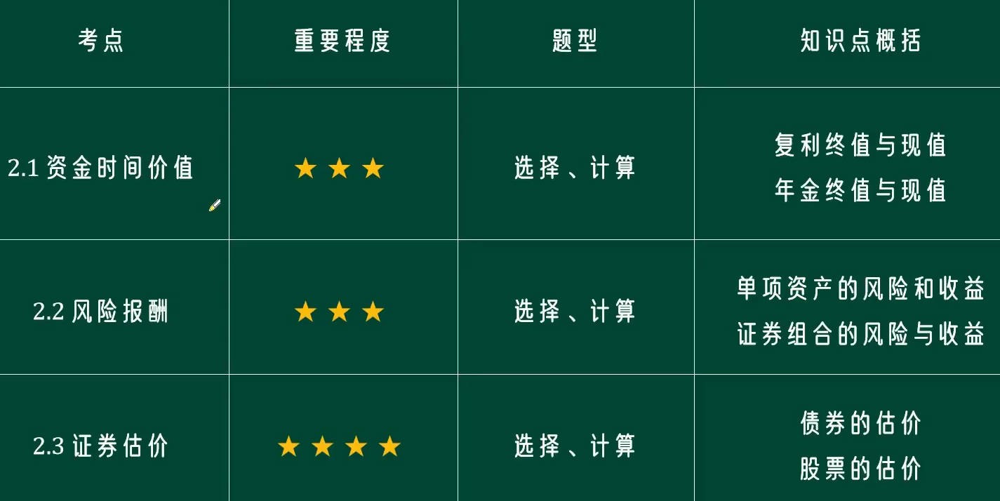 | 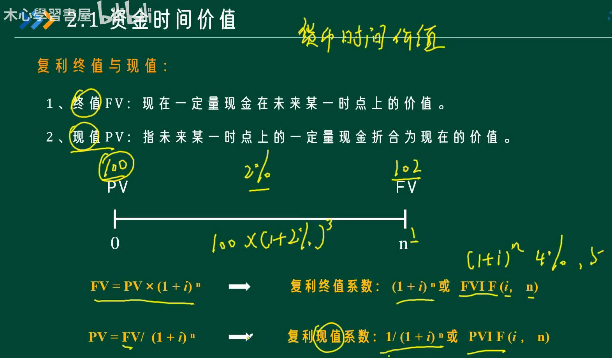    |
| --------------------------------------------------------- | ------------------------------------------------------------ |
| 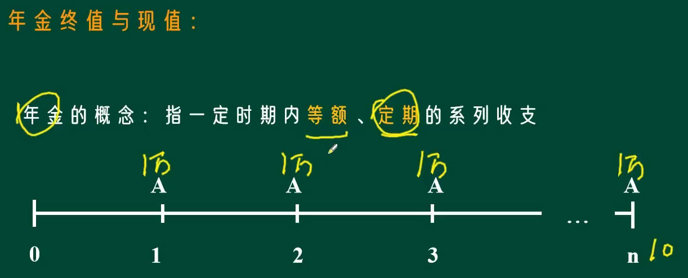 | 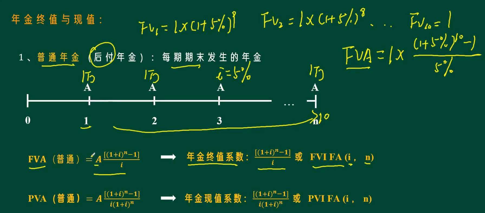 |
| 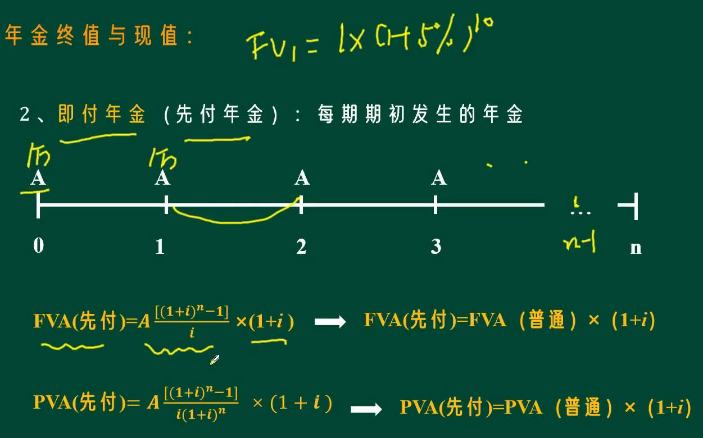 | 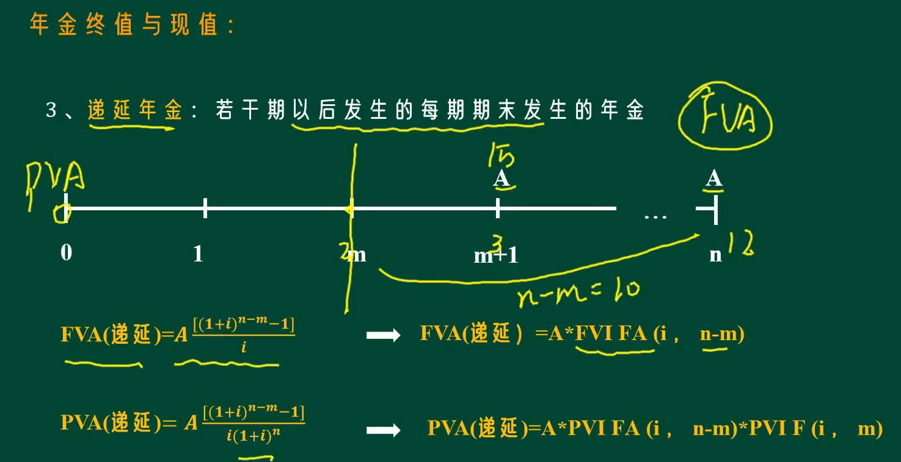    |
| 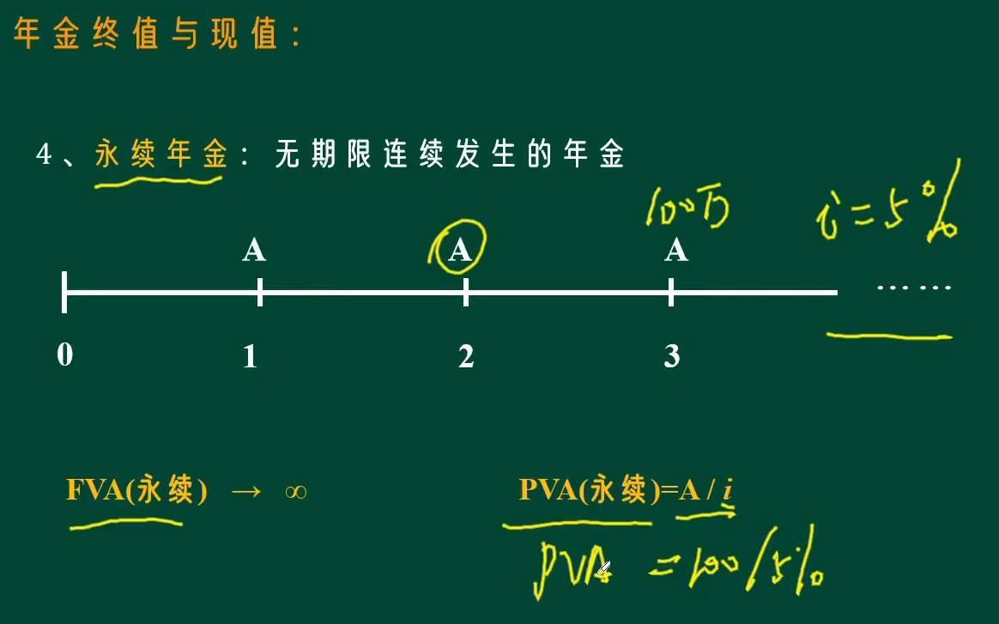 | 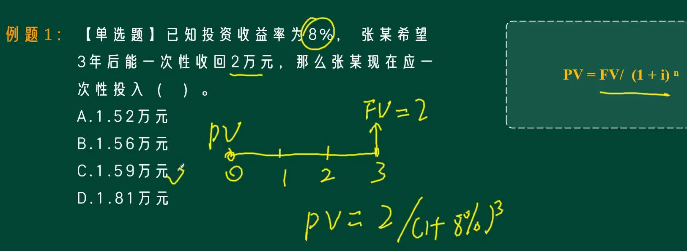    |
| 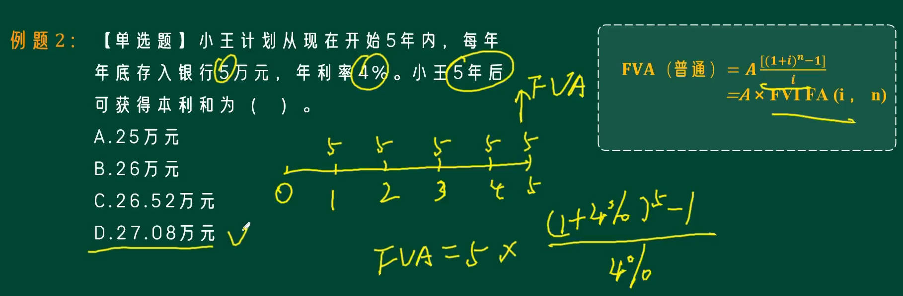 | 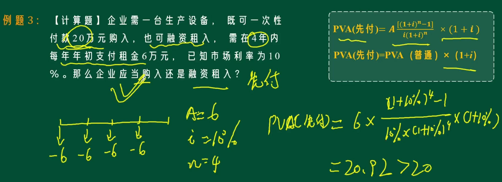    |
| 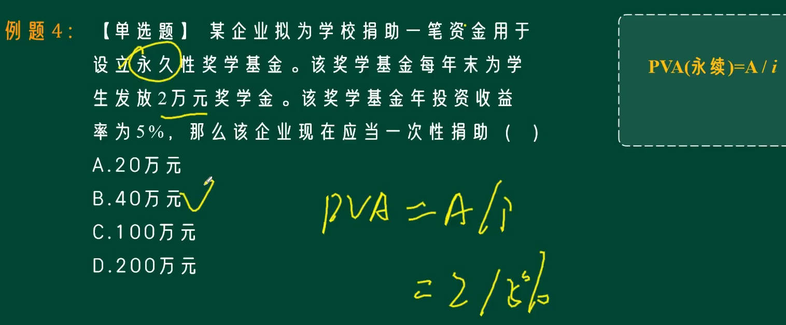 |                                                         |

### 贷款等额摊还

[北方工业大学\_黄凌灵\_等额摊还](https://www.bilibili.com/video/BV15f4y1q7pV/?vd_source=7346303e5e18677d7261c2c0c109ecfd)  

[等额摊还_百度搜索](https://www.baidu.com/s?ie=UTF-8&wd=%E7%AD%89%E9%A2%9D%E6%91%8A%E8%BF%98)  

1. 第一种还款方式：利滚利，比第2种多，到期还风险大
2. 第3种==等额本金==：5000，借5年，每年`等额还本金`1000，利息还500，所以第一年一共还1500
   1. 第二年还有4000本金，利息还400，一共还1400
3. 第4种==等额摊还==本金： 每次还的本金加利息之和相等，还的是一个相等的A，0处不还，期末还，后付年金
   1. 第0年借贷5000，折算为现值等于5000
   2. $A\times(P/A,10\%,5)=5000$ , a=1318.9
   3. 银行先扣利息，再还本金
      1. 第1年：500利息，$本金=1318.9-500=818.9，剩余本金=5000-818.9=4181.1$
      2. 第2年：$利息=4181.1\times10\%=418.11，本金=1318.9-418.11=900.79，剩余本金=4181.1-900.79=3280.32$

| 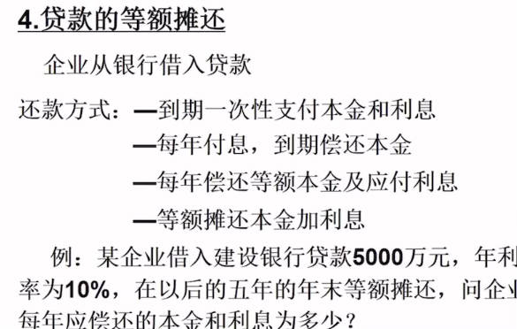 | 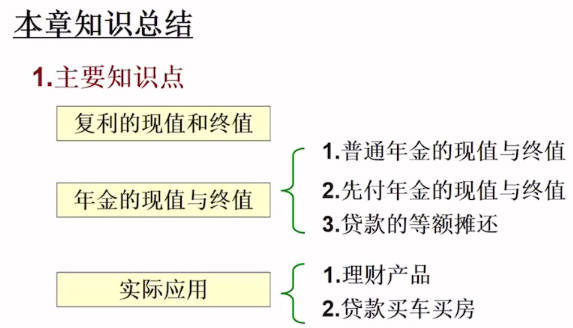 |
| --------------------------------------------------------- | --------------------------------------------------------- |

## 风险报酬

核心：期望收益率、标准、离散系数； 

[期望收益率](https://chat.baidu.com/search?word=%E6%9C%9F%E6%9C%9B%E6%94%B6%E7%9B%8A%E7%8E%87&dyTabStr=MTIsMCwzLDEsMiwxMyw3LDYsNSw5&pd=csaitab&setype=csaitab&extParamsJson=%7B%22enter_type%22%3A%22search_a_tab%22%2C%22sa%22%3A%22vs_tab%22%2C%22apagelid%22%3A%2212134182960949097787%22%2C%22ori_lid%22%3A%2212134182960949097787%22%7D)  [字母头上加横杠怎么读_百度搜索](https://www.baidu.com/s?ie=UTF-8&wd=%E5%AD%97%E6%AF%8D%E5%A4%B4%E4%B8%8A%E5%8A%A0%E6%A8%AA%E6%9D%A0%E6%80%8E%E4%B9%88%E8%AF%BB)  

[风险价值系数](https://chat.baidu.com/search?word=%E9%A3%8E%E9%99%A9%E4%BB%B7%E5%80%BC%E7%B3%BB%E6%95%B0%E5%85%AC%E5%BC%8F%E7%9A%84latex%E8%A1%A8%E7%A4%BA&dyTabStr=MTIsMCwzLDEsMiwxMyw3LDYsNSw5&pd=csaitab&setype=csaitab&extParamsJson=%7B%22enter_type%22%3A%22search_a_tab%22%2C%22sa%22%3A%22vs_tab%22%2C%22apagelid%22%3A%2212663111692389989968%22%2C%22ori_lid%22%3A%2212663111692389989968%22%7D)   [深入解析风险价值系数对投资决策的影响](https://www.jiangshitai.com/k/13856.html)  [风险价值系数_百度百科](https://baike.baidu.com/item/%E9%A3%8E%E9%99%A9%E4%BB%B7%E5%80%BC%E7%B3%BB%E6%95%B0/4549904)  

[股票收益率和期望收益率的区别_百度搜索](https://www.baidu.com/s?ie=utf-8&f=3&rsv_bp=1&tn=baidu&wd=%E8%82%A1%E7%A5%A8%E6%94%B6%E7%9B%8A%E7%8E%87%E5%92%8C%E6%9C%9F%E6%9C%9B%E6%94%B6%E7%9B%8A%E7%8E%87%E7%9A%84%E5%8C%BA%E5%88%AB&oq=%25E8%2582%25A1%25E7%25A5%25A8%25E6%2594%25B6%25E7%259B%258A%25E7%258E%2587&rsv_pq=bee24e1e0035ebbe&rsv_t=3f04CtJ%2BIMa4ox4WCRVGHpbbZL7F5V09mr6h7iijrgZMd5SOTjlv7lt531Y&rqlang=cn&rsv_enter=1&rsv_dl=ts_1&rsv_sug3=16&rsv_sug1=4&rsv_sug7=100&rsv_sug2=0&rsv_btype=t&prefixsug=%25E8%2582%25A1%25E7%25A5%25A8%25E6%2594%25B6%25E7%259B%258A%25E7%258E%2587%25E5%2592%258C%25E6%259C%259F%25E6%259C%259B%25E6%2594%25B6%25E7%259B%258A%25E7%258E%2587&rsp=1&inputT=10451&rsv_sug4=14927)  

[加权平均值_百度百科](https://baike.baidu.com/item/%E5%8A%A0%E6%9D%83%E5%B9%B3%E5%9D%87%E5%80%BC/7688373)  

[好：必要报酬率](https://aistudy.baidu.com/site/wjzsorv8/8cd47d9a-7797-42f3-9306-b902ded71161?botSourceType=124&eduFrom=196&examQuestionId=UQkrplDZqdcY1DXnxIRjUg)   [好:必要报酬率公式](https://chat.baidu.com/search?word=%E5%BF%85%E8%A6%81%E6%8A%A5%E9%85%AC%E7%8E%87%E5%85%AC%E5%BC%8F&dyTabStr=MTIsMCwzLDEsMiwxMyw3LDYsNSw5&pd=csaitab&setype=csaitab&extParamsJson=%7B%22enter_type%22%3A%22search_a_tab%22%2C%22sa%22%3A%22vs_tab%22%2C%22apagelid%22%3A%2214198351265635459079%22%2C%22ori_lid%22%3A%2214198351265635459079%22%7D)   [必要报酬率](./必要报酬率公式.md)  

**加权平均数**： 数据乘以一个对应的权重值，然后计算加权总和，再除以所有权重的总和

**投资回报率**： [投资报酬率ROI](https://chat.baidu.com/search?word=%E6%8A%95%E8%B5%84%E6%8A%A5%E9%85%AC%E7%8E%87+%E6%8A%95%E8%B5%84%E5%9B%9E%E6%8A%A5%E7%8E%87&dyTabStr=MTIsMCwzLDEsMiwxMyw3LDYsNSw5&pd=csaitab&setype=csaitab&extParamsJson=%7B%22enter_type%22%3A%22search_a_tab%22%2C%22sa%22%3A%22vs_tab%22%2C%22apagelid%22%3A%2217407792279376126519%22%2C%22ori_lid%22%3A%2217407792279376126519%22%7D)   ROI = 净利润 / 总投资成本   [投资报酬率  总资产报酬率](https://www.baidu.com/s?ie=UTF-8&wd=%E6%8A%95%E8%B5%84%E6%8A%A5%E9%85%AC%E7%8E%87%E6%98%AF%E6%80%BB%E8%B5%84%E4%BA%A7%E6%8A%A5%E9%85%AC%E7%8E%87)  [投资回报率](https://www.baidu.com/s?wd=%E6%8A%95%E8%B5%84%E6%8A%A5%E9%85%AC%E7%8E%87%20%20%E6%8A%95%E8%B5%84%E5%9B%9E%E6%8A%A5%E7%8E%87&rsv_dl=feed_landingpage_ib)   

[投资回报指标详解：理解ROI、NPV与IRR的区别与应用](https://baijiahao.baidu.com/s?id=1845050025128248768&wfr=spider&for=pc)  

> 衡量投资的资产，收益是多少，风险有多高

1. ==单项资产==的收益和风险
   1. 收益：`期望收益率`(平均收益率), ==单项资产的收益==
      1. 期望收益率: 收益率乘概率求和，$\color{green}\overline{R}=\sum_{i}^{n} R_iP_i$ ，R拔
         1. 将各种可能结果与其概率相乘，并将乘积相加，得到各种结果的加权平均数，即期望收益率
         2. 权重系数为各种结果发生的`概率`，所有权重的总和为1
      2. probability 概率，rate 率
      3. $\color{green}\sum_{i=1}^{n}$ 表示从1加到n的所有整数的和，大写的`sigma`
   2. 风险
      1. `标准差`：衡量每种情况收益率，偏离平均收益率的程度,  ==单项资产的风险==
      2. 方差开平方，得到标准差
      3. $\color{Green}\sigma = \sqrt{\sum_{i=1}^{N} (R_i - \overline{R})^2P_i}$
      4. 如果一项投资期望收益率高，而另一项投资标准差低，怎么做比较：把==标准差单位化==，变成它的`离散系数`(变异系数)，即每一单位收益承担多少风险
   
   3. 风险报酬   [风险报酬_百度搜索](https://www.baidu.com/s?ie=UTF-8&wd=%E9%A3%8E%E9%99%A9%E6%8A%A5%E9%85%AC)   [必要报酬率三个公式](https://aistudy.baidu.com/site/wjzsorv8/8cd47d9a-7797-42f3-9306-b902ded71161?qaId=874405&categoryLv1=%E6%95%99%E8%82%B2%E5%9F%B9%E8%AE%AD&efs=1&ch=54&srcid=10014&source=natural&category=%E5%85%B6%E4%BB%96&eduFrom=136&botSourceType=46)  [必要报酬率](https://www.zlketang.com/kjsc/kjsw_detail_61181.html)  
      1. 投资者因承担投资风险而`获得的`超过无风险利率的`额外收益`，  [必要报酬率](https://chat.baidu.com/search?word=%E5%BF%85%E8%A6%81%E6%8A%A5%E9%85%AC%E7%8E%87&dyTabStr=MTIsMCwzLDEsMiwxMyw3LDYsNSw5&pd=csaitab&setype=csaitab&extParamsJson=%7B%22enter_type%22%3A%22search_a_tab%22%2C%22sa%22%3A%22vs_tab%22%2C%22apagelid%22%3A%2215830864288979379539%22%2C%22ori_lid%22%3A%2215830864288979379539%22%7D)  
      1. `必要报酬率`(CAPM公式)：投资者投资，心里要求的最低收益率，包括2部分：时间价值和风险价值
         1. $\color{Green}必要报酬率=R_f+β(R_m−R_f)$
            1. $R_f$为无风险利率，$β$为资产系统风险系数(`风险价值系数`)，$R_m$为市场组合预期收益率‌（`市场平均收益率`）
         2. 风险价值系数: 风险报酬率除以标准离差率V，
            1. $\color{Green}b = (\overline{R} - R_f)/{V}$， 资产平均收益率，$R_f$无风险收益率，==V变异系数==
   
2. ==证券组合==投资的风险报酬： 投多个证券，风险怎么衡量
   1. 风险
      1. 非系统风险：个体风险，例如企业财务卷款跑路、经营不善破产等，是企业单个的风险，不影响其它企业
      2. 系统风险：就像坐同一电梯，出事没有企业能逃过，例利率、汇率变动
         1. `贝塔系数`衡量系统风险，表示系统风险对这个股票的影响程度，或股票对市场变动的反应程度
         1. 证券组合的$\beta$系数：$\color{Green}\beta _p = \sum_{i}^{n}\beta _iW_i $ ， W第i只股票的权重
      
   2. 报酬
      1. 资本资产定价模型：用来确定某只证券的期望收益率
         1. 单一证券的期望收益率
            1. 市场均衡： 没有非系统风险，只有系统风险
            2. $R_M$整个市场的收益，$R_M - R_f$整个市场的风险报酬，乘以$\beta$，这只证券的风险报酬，再加上无风险收益，就是证券的期望收益率
            3. $\color{Green}R_i = R_f + \beta_i(R_M - R_f)$
         2. 证券组合的收益率
            1. 乘以权重: $\color{Green}R_P = \sum_{i}^{n}W_iR_i $

| 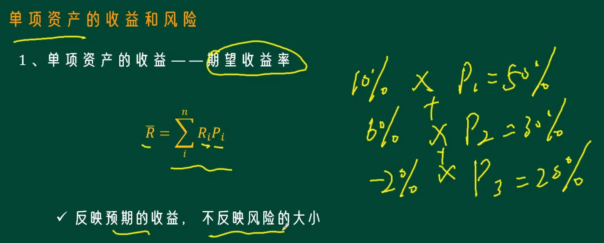 | 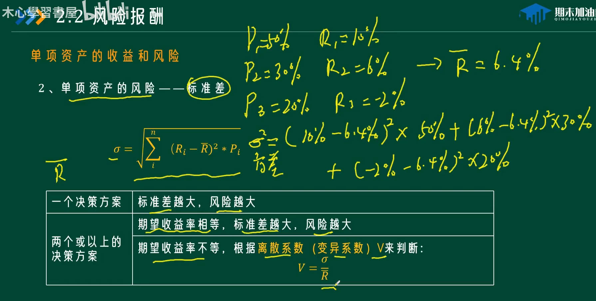    |
| --------------------------------------------------------- | ------------------------------------------------------------ |
| 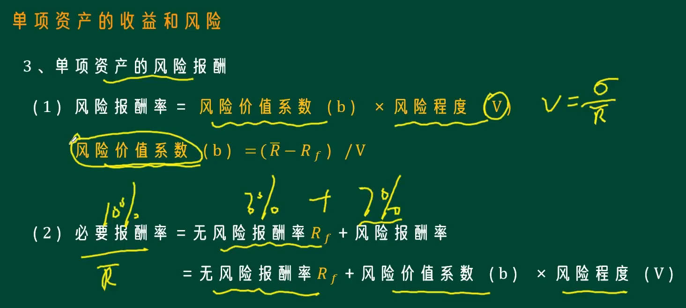 | 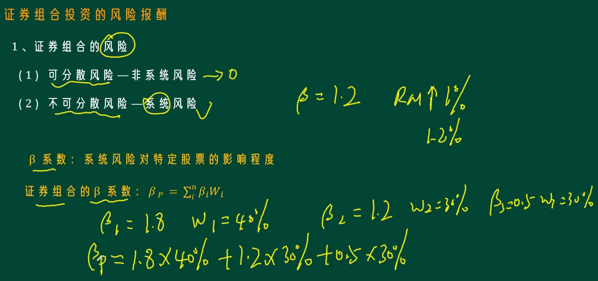 |
| 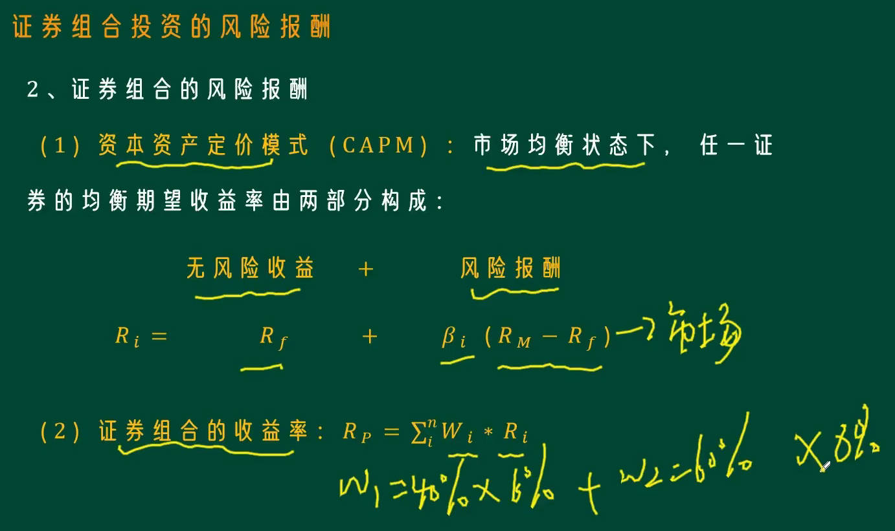 | 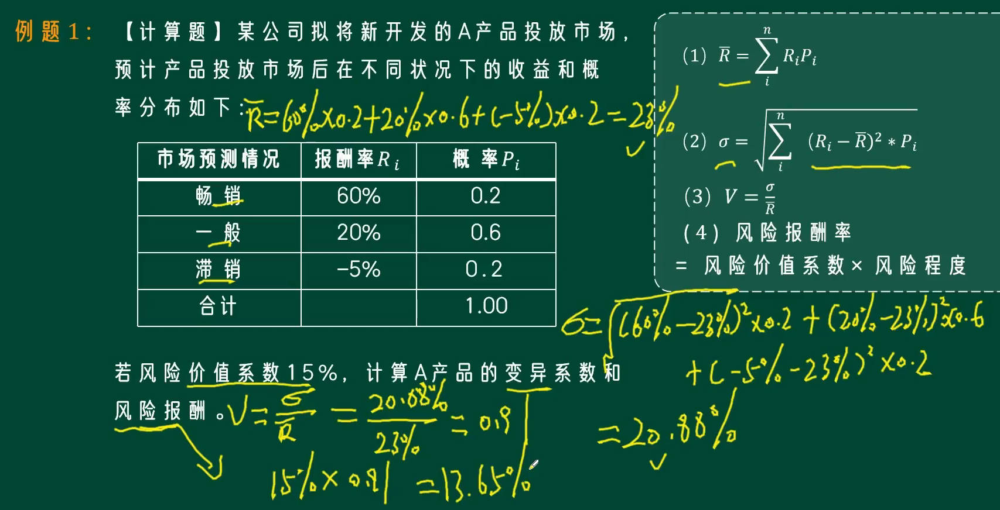    |
| 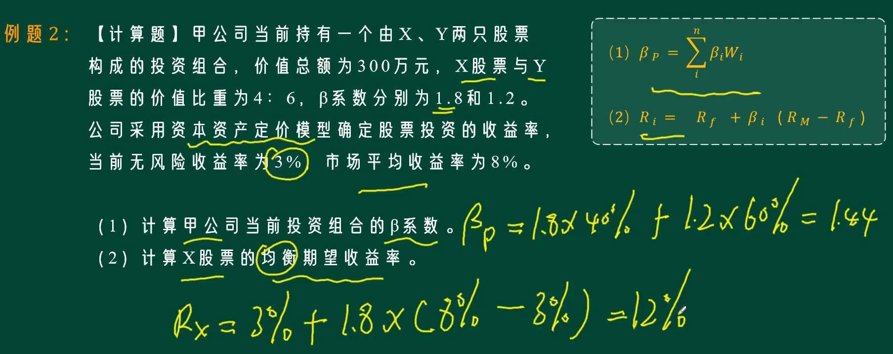 |                                                         |

## 证券估价

[到期收益率_百度搜索](https://www.baidu.com/s?ie=utf-8&f=8&rsv_bp=1&tn=baidu&wd=%E5%88%B0%E6%9C%9F%E6%94%B6%E7%9B%8A%E7%8E%87%20%E5%B8%82%E5%9C%BA%E5%88%A9%E7%8E%87&oq=%25E5%2588%25B0%25E6%259C%259F%25E6%2594%25B6%25E7%259B%258A%25E7%258E%2587&rsv_pq=f391b386024e2db4&rsv_t=b37fN4fPnhQ%2FNmfDuiNVn2ly9jB1PGEEt8j6qElukfjh%2BkQc4kgHdPYOv50&rqlang=cn&rsv_enter=1&rsv_dl=tb&rsv_sug3=14&rsv_sug1=2&rsv_sug7=100&rsv_sug2=0&rsv_btype=t&inputT=5730&rsv_sug4=7219)  

[债券要素](https://chat.baidu.com/search?word=%E5%80%BA%E5%88%B8%E8%A6%81%E7%B4%A0%E5%8C%85%E6%8B%AC%E5%93%AA%E4%BA%9B&dyTabStr=MTIsMCwzLDEsMiwxMyw3LDYsNSw5&pd=csaitab&setype=csaitab&extParamsJson=%7B%22enter_type%22%3A%22search_a_tab%22%2C%22sa%22%3A%22vs_tab%22%2C%22apagelid%22%3A%229754908590883957598%22%2C%22ori_lid%22%3A%229754908590883957598%22%7D)  

[估值PE_百度搜索](https://www.baidu.com/s?ie=utf-8&f=8&rsv_bp=1&tn=baidu&wd=%E4%BC%B0%E5%80%BCPE&oq=%25E4%25BC%25B0%25E5%2580%25BCP%2526gt%253B&rsv_pq=935d6cf40001b1a3&rsv_t=824clVGl5urOjuhxmaH0ZMDQJCfoojcXPz2PDj5M0%2F%2F30FmIE2VbheMfvdk&rqlang=cn&rsv_enter=1&rsv_dl=tb&rsv_sug3=2&rsv_sug1=2&rsv_sug7=100&rsv_sug2=0&rsv_btype=t&inputT=623&rsv_sug4=1776)  [好：通俗理解风险溢价](https://www.zhihu.com/question/26891682/answer/3255999876)  [风险溢价_百度搜索](https://www.baidu.com/s?ie=UTF-8&wd=%E9%A3%8E%E9%99%A9%E6%BA%A2%E4%BB%B7)   [好：风险溢价 风险报酬](https://chat.baidu.com/search?word=%E9%A3%8E%E9%99%A9%E6%BA%A2%E4%BB%B7+%E9%A3%8E%E9%99%A9%E6%8A%A5%E9%85%AC&dyTabStr=MTIsMCwzLDEsMiwxMyw3LDYsNSw5&pd=csaitab&setype=csaitab&extParamsJson=%7B%22enter_type%22%3A%22search_a_tab%22%2C%22sa%22%3A%22vs_tab%22%2C%22apagelid%22%3A%2215110923892090226317%22%2C%22ori_lid%22%3A%2215110923892090226317%22%7D)   [不要只会PE](https://baijiahao.baidu.com/s?id=1748344024006981082&wfr=spider&for=pc)   [wind股票软件_百度搜索](https://www.baidu.com/s?wd=wind%E8%82%A1%E7%A5%A8%E8%BD%AF%E4%BB%B6&rsf=101634504&rsp=0&f=1&rs_src=0&rsv_pq=a2c5b2c9000926cc&rsv_t=1a4bsM2uoeh%2FvSf9OFfCQ3bANVUn5kCEzKkca9BAcviarwTV67oZD6kxhzc&rsv_dl=brs_28338_1)  

1. 债券估价
   1. 附息债券：例，100债券，息票率6%，一年付息一次，一年付6利息，到期收益率(也称市场利率)也是6%
      1. 息票率是支付利息的利率，到期收益率用来算债券的年平均收益率
      1. 附息债券估价：就是期末年金求现值， ==利息现值 + 面值现值==(利息年金、面值复利现值)
   
   2. 一次性还本付息
      1. 利息不复利，每年给固定数
   
      2. 到期拿到`面值加利息（每年利息不复利）`，求这个合计数的现值（复利系数）
   
   3. 贴现债券：中间不付息，到期付100面值，但会打折出售，只用求面值的现值
   
2. 股票估价

| 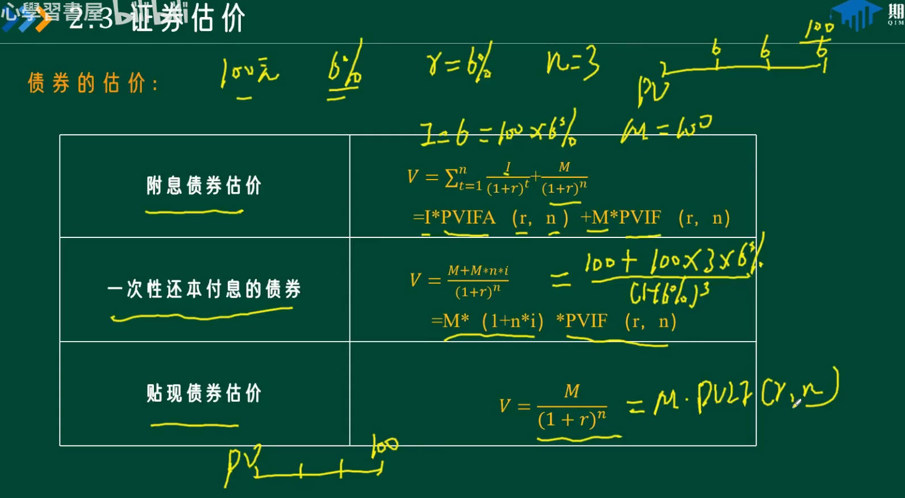 | 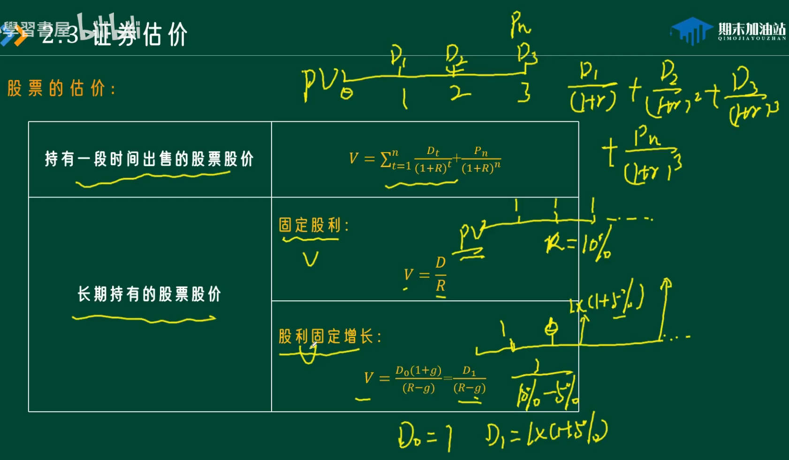 |
| --------------------------------------------------------- | --------------------------------------------------------- |
| 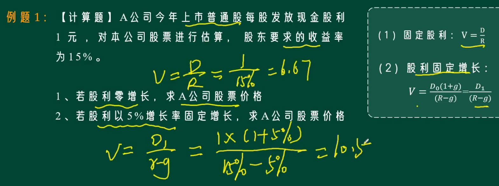 | 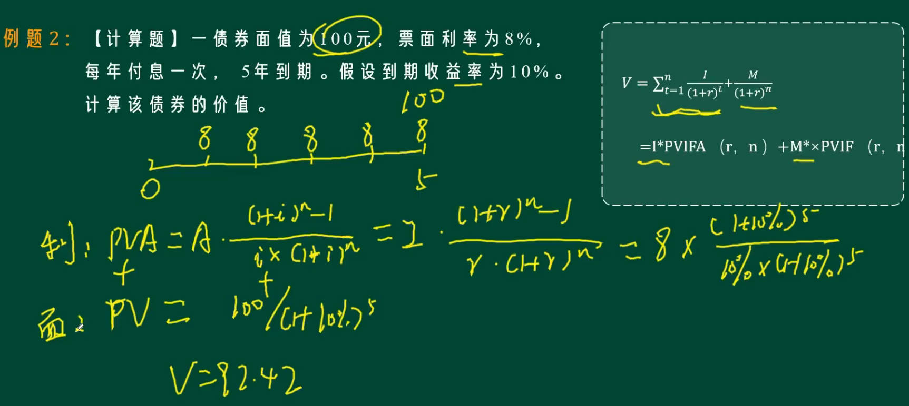 |
| 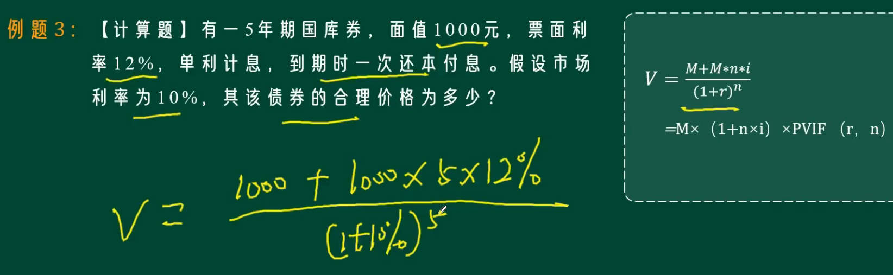 | 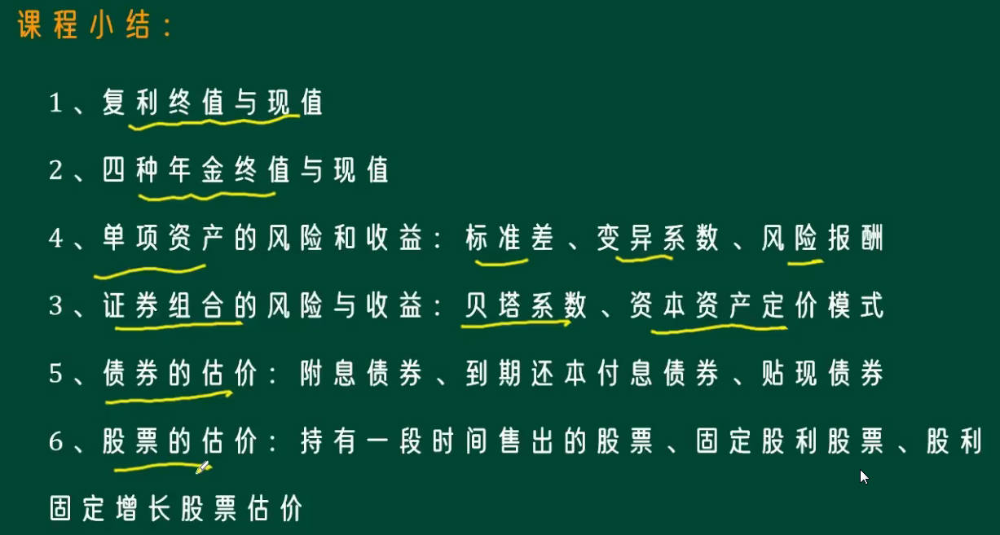 |
| 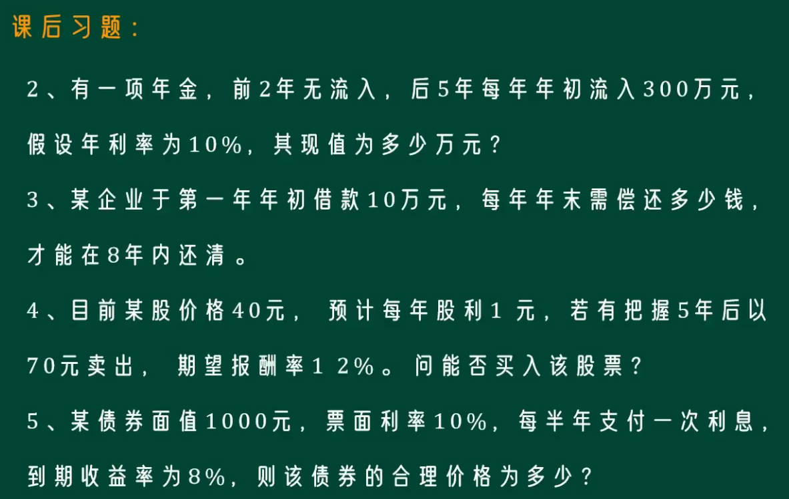 |                                                      |

# 3、财务报表分析

[短期偿债能力分析](https://www.bilibili.com/video/BV1f34y1H795/?vd_source=7346303e5e18677d7261c2c0c109ecfd&p=17&spm_id_from=333.788.videopod.episodes)   [财务管理学](https://www.bilibili.com/video/BV1RLPveWEJz?spm_id_from=333.788.videopod.sections&vd_source=7346303e5e18677d7261c2c0c109ecfd&p=6)    

思维导图： [财务分析](https://www.processon.com/view/62ccc39863768906c50a5208)   [财务分析](https://www.processon.com/view/6062973f7d9c0805fd33b47f)  

[11张财务分析思维导图](https://zhuanlan.zhihu.com/p/508113029)   [财务思维导图](https://baijiahao.baidu.com/s?id=1700600249206164152&wfr=spider&for=pc)   [财务分析思维导图_百度搜索](https://www.baidu.com/s?ie=UTF-8&wd=%E8%B4%A2%E5%8A%A1%E5%88%86%E6%9E%90%E6%80%9D%E7%BB%B4%E5%AF%BC%E5%9B%BE)  

**折现率**： 将未来预期收益折算成现值的比率， [折现率](https://baike.kuaiji.com/v3547759.html)   [折现率和利率区别](https://mp.weixin.qq.com/s?__biz=MzkxNTQ3MTY2Mg==&mid=2247516243&idx=2&sn=b23ada34d2301396be38296ecfdc2eb5&poc_token=HPhX1mijLpfW0mbArMHjMpM0fWVpeNCh12mNvqF4) 

**财务杠杆：** 企业利用债务融资放大股东收益的效应， 计算方法：  [财务杠杆](https://easylearn.baidu.com/edu-page/tiangong/questiondetail?id=1827681566650354667&fr=search)  [财务杠杆_百度搜索](https://www.baidu.com/s?ie=UTF-8&wd=%E8%B4%A2%E5%8A%A1%E6%9D%A0%E6%9D%86)  

- 静态指标： 财务杠杆比率=总资产/股东权益，`权益乘数`
  - 值>1时说明存在负债经营，该比率越大代表财务杠杆越高。例如总资产200万、股东权益100万时，杠杆比率为2倍。
- 财务杠杆系数DFL=EBIT/(EBIT-利息I)

****

**财务分析方法：**

1. 比率分析法: 企业同一时期==财报的相关项目==对比，包括3大类
   1. 构成比率：反映`组成部分与总体`之间关系
   2. 效率比率：反映`投入与产出`之间关系
   3. 相关比率：反映2个以上相关项目比值的财务比率，考察各项经济活动之间的`相互关系`
2. 比较分析法: ==不同时期财务状况，或不同企业财务状况比较==
   1. 纵向比较：本企业不同时期财务状况比较
   2. 横向比较：本企业与其它企业同期财务状况比较

----

[总资产周转天数](https://chat.baidu.com/search?extParamsJson=%7B%22aPageWord%22%3A%22%E6%80%BB%E8%B5%84%E4%BA%A7%E5%91%A8%E8%BD%AC%E5%A4%A9%E6%95%B0%22%2C%22enter_type%22%3A%22a_61344%22%2C%22his_key%22%3A%22ag_12307481884848448087%22%2C%22ori_lid%22%3A%2212307481884848448087%22%2C%22sa%22%3A%22re_dl_content_61344%22%2C%22srcid%22%3A%2261344%22%7D&pd=csaitab&setype=csaitab&word=%E6%80%BB%E8%B5%84%E4%BA%A7%E5%91%A8%E8%BD%AC%E5%A4%A9%E6%95%B0)   [财务趋势分析_百度百科](https://baike.baidu.com/item/%E8%B4%A2%E5%8A%A1%E8%B6%8B%E5%8A%BF%E5%88%86%E6%9E%90/12742818?fr=aladdin)  [财务趋势分析_百度搜索](https://www.baidu.com/s?ie=UTF-8&wd=%E8%B4%A2%E5%8A%A1%E8%B6%8B%E5%8A%BF%E5%88%86%E6%9E%90)  [趋势分析_财务状况等变化趋势和变化规律方法](https://baike.baidu.com/item/%E8%B6%8B%E5%8A%BF%E5%88%86%E6%9E%90/7954871?fr=aladdin)   

东方财富网公司财务分析：[百分比报表](https://emweb.securities.eastmoney.com/pc_hsf10/pages/index.html?type=web&code=SZ000002&color=b#/cwfx/bfbbb)   [杜邦分析](https://emweb.securities.eastmoney.com/pc_hsf10/pages/index.html?type=web&code=SZ000002&color=b#/cwfx/dbfx)  

**财务分析公式**: [财务分析公式大全_百度搜索](https://www.baidu.com/s?ie=UTF-8&wd=%E8%B4%A2%E5%8A%A1%E5%88%86%E6%9E%90%E5%85%AC%E5%BC%8F%E5%A4%A7%E5%85%A8)  [30个财务分析公式](https://zhuanlan.zhihu.com/p/471924745)  [20个公式](https://baijiahao.baidu.com/s?id=1840341235723295362&wfr=spider&for=pc)   [财务报表分析公式](https://baijiahao.baidu.com/s?id=1696259133007650367&wfr=spider&for=pc)  [公式](https://baijiahao.baidu.com/s?id=1796011236003430377&wfr=spider&for=pc)  [30个财务分析公式](https://mbd.baidu.com/newspage/data/dtlandingsuper?nid=dt_5213815351597892550&sourceFrom=search_a)   

> - ==能力分析==： 偿债、营运、盈利、发展能力
> - ==趋势分析==： 横向、纵向
> - ==综合分析==： 沃尔、杜邦分析

==相关财务比率计算== ： 4能力1趋势1综合

1. 偿债能力
   1. 短期偿债能力： 4个
      1. 流动、速动、现金、现金流量`比率`
         1. 速动比率：流动资产扣除存货，但还包括应收账款、应收票据等
         2. 现金比率：只考虑现金类资产
         3. 现金流量比率： 边赚钱边还负债，动态角度反映偿债能力
   2. 长期偿债能力：
      1. 资产负债率、权益乘数、产权比率
      2. 偿债保障比率、利息保障倍数
   
2. 营运能力
   1. 应收账款周转率、存货周转率
   2. 流动资产、固定资产、总资产周转率
      1. 总资产周转天数： 反映企业从投入资产到实现销售收入的完整周期，天数越短资产使用效率越高

3. 盈利能力
   1. 资产报酬率(3个)、固定权益报酬率(净资产收益率)、销售毛利率、成本费用净利率
   2. 每股利润与每股现金流量、每股股利、股利支付率和留存比率、每股净资产
   3. 市盈率、市净率

4. 发展能力
   1. 销售增长率、资产增长率、股权资本增长率、利润增长率

5. 趋势分析
   1. 比较财务报表、比较百分比财务报表、比较财务比率、图解法

6. 财务综合分析

| 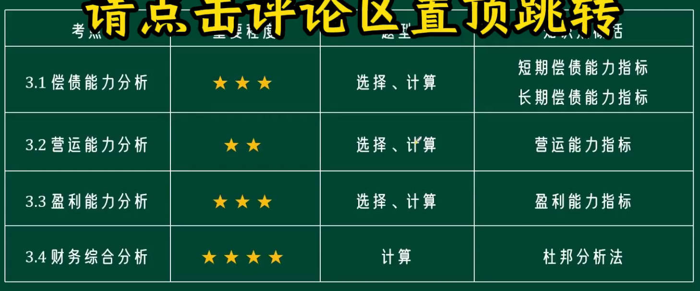 | 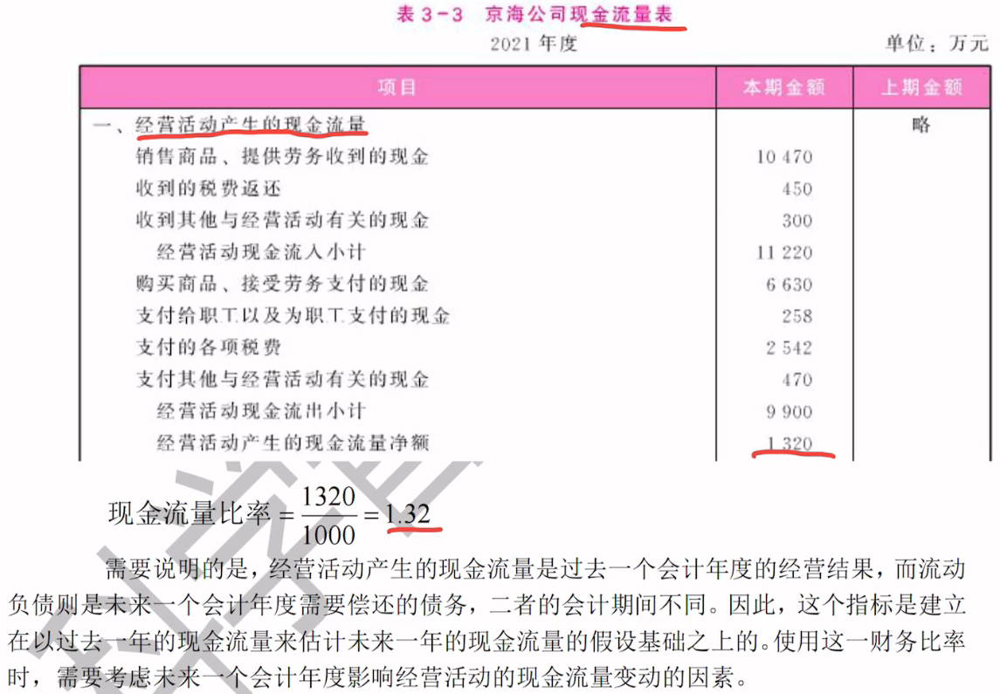 |
| --------------------------------------------------------- | ------------------------------------------------------------ |
| 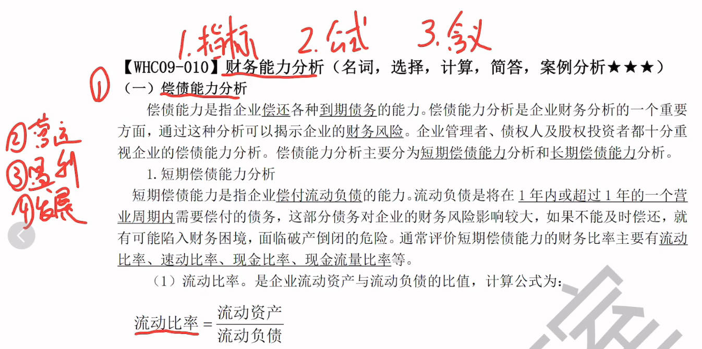 |                                                         |

# 4、筹资管理

[筹资管理](https://www.bilibili.com/video/BV1VN4y167k4/?vd_source=7346303e5e18677d7261c2c0c109ecfd)  

[保理_百度搜索](https://www.baidu.com/s?ie=UTF-8&wd=%E4%BF%9D%E7%90%86)  

保理：应收账款打包卖给保理公司去收

金融工具： [金融工具](https://www.dongao.com/zckjs/kj/201910181177472.shtml)  [金融工具_百度百科](https://baike.baidu.com/item/%E9%87%91%E8%9E%8D%E5%B7%A5%E5%85%B7/8890912)    [金融工具 ](https://zhuanlan.zhihu.com/p/715714294)  [金融工具分为3类](https://www.chinaacc.com/wenda/detail/xt/6047350)     [衍生工具_百度搜索](https://www.baidu.com/s?ie=UTF-8&wd=%E8%A1%8D%E7%94%9F%E5%B7%A5%E5%85%B7) [金融工具](https://zhuanlan.zhihu.com/p/715714294)   [金融工具分为哪三大类](https://www.acc5.com/news-xinwen/detail_199169.html)   

1. 资本成本
   1. 个别资本成本
   2. 加权资本成本
2. 杠杠原理
   1. 经营杠杠
   2. 财务杠杠
   3. 联合杠杠
3. 资本结构决策

| 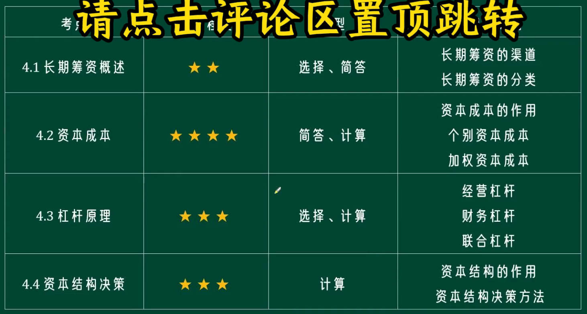 | 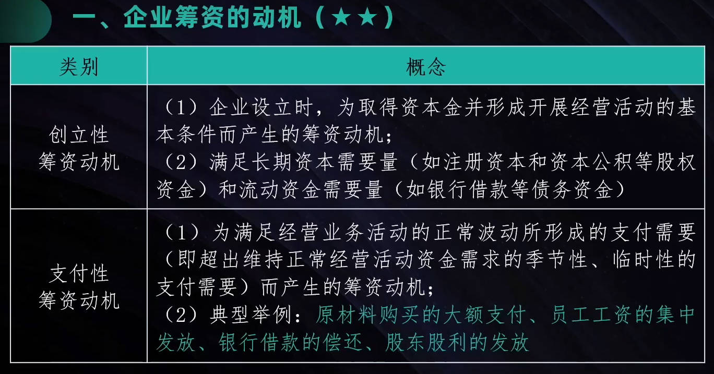 |
| --------------------------------------------------------- | --------------------------------------------------------- |
| 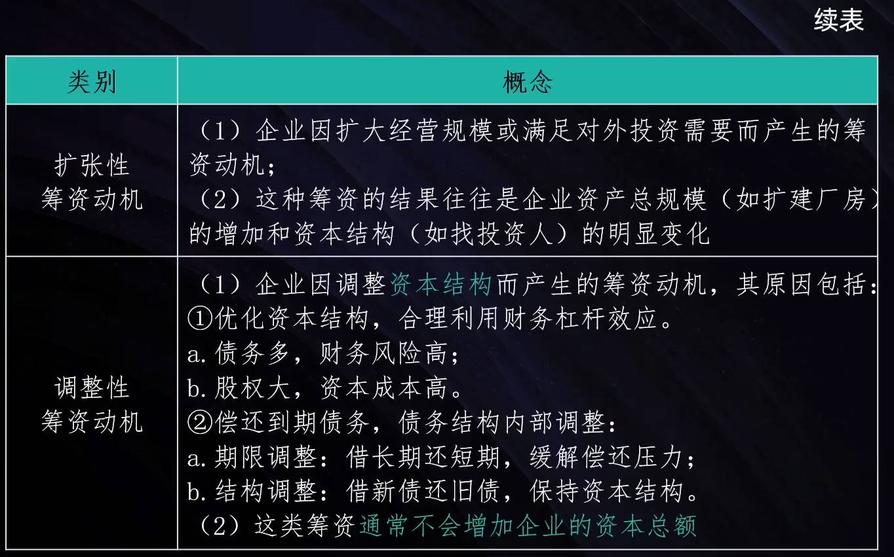 |  |
|  |  |
|  |  |
|  |  |
|  |  |
|  |                                                      |

## 债务筹资

[债务筹资](https://www.bilibili.com/video/BV18N4y167gD/?vd_source=7346303e5e18677d7261c2c0c109ecfd)  

1. 银行借款
2. 发行债券
   1. 债券发行价格
3. 融资租赁: 现在一般叫租赁
   1. 租金计算

|  |  |
| --------------------------------------------------------- | --------------------------------------------------------- |
|  |  |
|  |  |
|  |  |
|  |  |
|  |  |
|  |  |
|  |  |
|  |  |
|  |  |
|  |  |
|  |  |
|  |  |
|  |  |
|  |                                                           |

## 股权筹资

1. 吸收直接投资
2. 发行股票
   1. IPO程序： 核准制没有了

3. 留存收益

|     |     |
| ------------------------------------------------------------ | ------------------------------------------------------------ |
|     |  |
|     |     |
|     |     |
|     |     |
|     |     |
|     |     |
|     |     |
|  |     |
|     |     |
|     |     |
|     |     |
|     |     |
|     |     |
|     |     |
|     |     |

## 另一个教程

[筹资决策](https://www.bilibili.com/video/BV1Gy4y1z7KU/?vd_source=7346303e5e18677d7261c2c0c109ecfd)  

[股权杠杆效应 金字塔股权结构_百度搜索](https://www.baidu.com/s?ie=utf-8&f=8&rsv_bp=1&tn=baidu&wd=%E8%82%A1%E6%9D%83%E6%9D%A0%E6%9D%86%E6%95%88%E5%BA%94%20%E9%87%91%E5%AD%97%E5%A1%94%E8%82%A1%E6%9D%83%E7%BB%93%E6%9E%84&oq=%25E8%2582%25A1%25E6%259D%2583%25E6%259D%25A0%25E6%259D%2586%25E6%2595%2588%25E5%25BA%2594&rsv_pq=a5093e12000401dc&rsv_t=bbc2uBrWZATidI%2B7PhHLqR%2BkTfNwG5jFTfzmvv0nUxPZ4l0yhTPlB5a0dTM&rqlang=cn&rsv_enter=1&rsv_dl=tb&rsv_sug3=18&rsv_sug1=17&rsv_sug7=100&rsv_sug2=0&rsv_btype=t&inputT=8881&rsv_sug4=9495)  

分股不分权:  [公司控制权利益争夺之金字塔结构（附案例）](https://m.jiemian.com/article/909303.html)   [公司控制权工具](https://zhuanlan.zhihu.com/p/711792696)   [公司股权架构设计的多种主体架构及实务案例解析](https://baijiahao.baidu.com/s?id=1822850588454365244&wfr=spider&for=pc)  [金字塔股权杠杆：用少量的自有资金控制大量的外部资金](https://baijiahao.baidu.com/s?id=1663142980217670025&wfr=spider&for=pc)   [分股不分权的七种方法（三）：金字塔结构](https://baijiahao.baidu.com/s?id=1837611151210282582&wfr=spider&for=pc)  [六种主体股权架构模型（三）：控股公司架构](https://baijiahao.baidu.com/s?id=1840062001099803715&wfr=spider&for=pc)  

1. 注册资本制度： 开公司不能先借钱，要股东先投入钱
2. 企业组织形式
   1. 非法人企业不交企业所得税，只交个人所得税
3. 股权性筹资
   1. 投入资本筹资：人力资本可以占干股   [干股_百度搜索](https://www.baidu.com/s?ie=UTF-8&wd=%E5%B9%B2%E8%82%A1)  
   2. 发行股票筹资
      1. 绝对控制D公司： $10\times51\%\times51\%\times51\%=1.32$    [股权杠杆效应_百度搜索](https://www.baidu.com/s?ie=UTF-8&wd=%E8%82%A1%E6%9D%83%E6%9D%A0%E6%9D%86%E6%95%88%E5%BA%94)  

|     |  |
| ------------------------------------------------------------ | --------------------------------------------------------- |
|     |  |
|  |  |
|     |  |
|     |  |
|     |  |
|     |  |
|  |  |
|     |  |

# 5、投资管理

[竞争者五力模型_百度搜索](https://www.baidu.com/s?ie=UTF-8&wd=%E7%AB%9E%E4%BA%89%E8%80%85%E4%BA%94%E5%88%A9%E6%A8%A1%E5%9E%8B)   [五种力量模型分析_百度百科](https://baike.baidu.com/item/%E4%BA%94%E7%A7%8D%E5%8A%9B%E9%87%8F%E6%A8%A1%E5%9E%8B%E5%88%86%E6%9E%90/10383133)  

> （1）行业新进入者的威胁 （2）替代品的威胁、 （3）购买商的议价能力、 （4）供应商的议价能力、 （5）同业*竞争者*的竞争强度
>
> 竞争者五力模型： 业内竞争者、潜在的进入者、替代品、供应商和购买者的议价能力

1. 项目投资决策
   1. ==项目投资决策流程==： 机会选择、市场调查、可行性分析、项目实施与监控、事后审计与绩效评价

2. 证券投资

|  |  |
| --------------------------------------------------------- | --------------------------------------------------------- |
|  |  |
|  |  |
|  |  |
|  |                                                      |

## 投资现金流量计量

[互斥项目_百度搜索](https://www.baidu.com/s?ie=UTF-8&wd=%E4%BA%92%E6%96%A5%E9%A1%B9%E7%9B%AE)   [投资现金流](https://www.bilibili.com/video/BV11z4y1y75N/?vd_source=7346303e5e18677d7261c2c0c109ecfd)  

现金流分阶段估计

1. 现金流出量
2. 现金流入量
3. 现金净流量

|  |  |
| --------------------------------------------------------- | --------------------------------------------------------- |
|  |  |
|  |  |

### 另一个教程

[投资项目现金流量](https://www.bilibili.com/video/BV1i24y1c7fk?vd_source=7346303e5e18677d7261c2c0c109ecfd&spm_id_from=333.788.videopod.sections)   

1. 建设期
   1. 营运资本垫支
2. 营业期
   1. 不考虑税
      1. $\color{blue}\Large营业现金毛流量=收入-付现成本$
      2. 非付现成本：不该扣
   2. 考虑税
      1. $税前利润=收入-付现成本-非付现成本$
      2. $\color{blue}\Large营业现金毛流量=收入-付现成本-所得税$
3. 终结期
   1. 收回建设期营运资本垫支，营业期如有垫支也要收回
   2. 处置
      1. 卖赚了交所得税
      2. 卖亏少交所得税

|     |     |
| ------------------------------------------------------------ | ------------------------------------------------------------ |
|     |  |
|  |  |
|     |     |
|  |     |
|     |  |
|     |     |
|     |     |
|     |                                                         |

## 投资决策指标

[净现值and现值指数](https://www.bilibili.com/video/BV1o24y1b7M5?vd_source=7346303e5e18677d7261c2c0c109ecfd&spm_id_from=333.788.videopod.sections)  

[项目投资决策](https://www.bilibili.com/video/BV1HW411d7Qg?vd_source=7346303e5e18677d7261c2c0c109ecfd&spm_id_from=333.788.videopod.episodes&p=5)  

1. 净现值和现值指数： 项目是否盈利？ 投资额不等时，哪个项目更优？
   1. 货币时间价值：不同时间点上的数不能比较，只有折现后放在同一个时间点才能比较
   2. 现值指数： 2项目投资额不相等，直接比较净现值，因为起点不同(标准不同)，就不能用净现值(减法)，要用除法

2. 内含报酬率

### 净现值和现值指数
|  |  |
| --------------------------------------------------------- | --------------------------------------------------------- |
|  |  |
|  |                                                      |

### 内含报酬率

即内含收益率

1. 概念
   1. 贴现就是折现
   2. 内含收益率本质：某投资最多能达到的收益率
2. 

|     |  |
| ------------------------------------------------------------ | --------------------------------------------------------- |
|  |  |
|  |  |

### 静态和动态回收器

回本时间， 分类的标准：是否考虑货币时间价值

|  |     |
| --------------------------------------------------------- | ------------------------------------------------------------ |
|  |  |
|  |                                                         |

### 独立方案和互斥方案

1. 独立方案
   1. 看2个方案是否能盈利
2. 互斥方案
   1. 比较获利数额大小
   2. 年金净流量法： 净现值算完，2个都算到了零点上，再平均算各自==每一年的净赚==

|  |     |
| --------------------------------------------------------- | ------------------------------------------------------------ |
|  |     |
|  |     |
|  |  |

### 投资决策评价指标

[净现值](https://www.bilibili.com/video/BV1EA411x7LU/?vd_source=7346303e5e18677d7261c2c0c109ecfd)   [如何对比不同项目或业务领域的增量现金流？](https://www.mbalib.com/ask/question-4fcb90861edc30545bda35e291b8d6a0.html)   [增量现金流](https://chat.baidu.com/search?word=%E5%A2%9E%E9%87%8F%E7%8E%B0%E9%87%91%E6%B5%81%E5%88%86%E6%9E%90&dyTabStr=MTIsMCwzLDEsMiwxMyw3LDYsNSw5&pd=csaitab&setype=csaitab&extParamsJson=%7B%22enter_type%22%3A%22search_a_tab%22%2C%22sa%22%3A%22vs_tab%22%2C%22apagelid%22%3A%2218055157482833926793%22%2C%22ori_lid%22%3A%2218055157482833926793%22%7D)  

1. 折现现金流量法: 贴现指标
   1. `净现值`: 项目在整个寿命周期内，所有的==现金流入和流出==，按照资本成本，或者投资者认可的回报率，==折现到期初的值==
   2. `内含报酬率`: 所有项目里得到的钱，折现到期初，让它等于投入的钱折现到期初的折现率
      1. 项目里赚到的钱折现到期初，投到项目里的钱，也折现到期初，投入和得到相等时候的折现率
   3. 获利指数: 项目寿命周期内，获得的现金流按资本成本折现到期初，除以投入的钱折现到期初
2. 非折现现金流量法: 非贴现指标
   1. 投资回收期： 回本的时间
   2. 平均报酬率: 项目寿命周期内，每年的平均报酬率

|  |  |
| --------------------------------------------------------- | --------------------------------------------------------- |
|  |  |
|  |  |
|  |  |
|  |  |
|  |  |
|  |  |
|  |  |
|  |  |

# 6、营运资金管理

1. 流动负债管理
   1. 银行短期借款
   2. 商业信用
2. 流动资产管理
   1. 现金管理
   2. 应收账款管理
   3. 存货管理

|  |  |
| --------------------------------------------------------- | ----- |
|                                                      |  |
|                                                      |  |
|                                                      |  |
|                                                      |  |
|                                                      |  |
|                                                      |  |
|                                                      |  |
|                                                      |  |
|                                                      |  |
|                                                      |  |

# 7、分配管理

1. 利润分配
   1. 分配顺序
2. 股利分配
   1. 股利分配理论
   2. 股利分配政策
   3. 股利支付方式
3. 股票回购
   1. 股票回购计划

|  |  |
| --------------------------------------------------------- | ----- |
|                                                      |  |
|                                                      |  |
|                                                      |  |
|                                                      |  |
|                                                      |  |
|                                                      |  |
|                                                      |  |
|                                                      |  |
|                                                      |  |
|                                                      |  |

# 8、财务管理扩展

1. 企业并购管理
   1. 并购的形式和类型
   2. 并购的动因
2. 国际财务管理
   1. 国际财务管理策略

|  |  |
| --------------------------------------------------------- | ----- |
|                                                      |  |
|                                                      |  |
|                                                      |  |
|                                                      |  |
|                                                      |  |
|                                                      |  |
|                                                      |  |
|                                                      |  |
|                                                      |  |
|                                                      |  |

# 第9版教材

[教材视频](https://www.bilibili.com/video/BV1ZT4y1f7qF?vd_source=7346303e5e18677d7261c2c0c109ecfd&p=4&spm_id_from=333.788.videopod.episodes)  

## 4、财务战略与预算

[战略导向型财务管理_百度百科](https://baike.baidu.com/item/%E6%88%98%E7%95%A5%E5%9E%8B%E8%B4%A2%E5%8A%A1%E7%AE%A1%E7%90%86/2450274)   [战略管控型财务管理_百度搜索](https://www.baidu.com/s?ie=utf-8&f=8&rsv_bp=1&tn=baidu&wd=%E6%88%98%E7%95%A5%E7%AE%A1%E6%8E%A7%E5%9E%8B%E8%B4%A2%E5%8A%A1%E7%AE%A1%E7%90%86&oq=%25E6%2588%2598%25E7%2595%25A5%25E7%25AE%25A1%25E6%258E%25A7%25E5%259E%258B%25E8%25B4%25A2%25E5%258A%25A1%25E7%25AE%25A1%25E7%2590%2586&rsv_pq=be4751ce007b8538&rsv_t=fa63DhAD89rVtGQjr1C3Rs%2F2iBZooJK6%2Fa3m07bfvuC%2FNtE3x0MoJ8s%2Boqc&rqlang=cn&rsv_enter=0&rsv_dl=tb&rsv_btype=t)  [集团公司管控模式深度解析](https://baijiahao.baidu.com/s?id=1842159125629414141&wfr=spider&for=pc)   [集团公司战略型管控](https://www.sohu.com/a/681374465_100179892)   

[宝钢的战略导向预算](https://app8tmuj6dd3979.pc.xiaoe-tech.com/p/t_pc/course_pc_detail/column/p_609c8e23e4b0adb2d863abea)   [战略导向预算管理体系](https://www.huoban.com/yx-jiaocheng/qYQREDDvAoOoE72e.html)   [基于战略导向的全面预算管理](https://www.ekuaibao.com/blog/288774.html)   

[好：销售百分比法](https://www.bilibili.com/video/BV1Pb411R7Gg?vd_source=7346303e5e18677d7261c2c0c109ecfd&spm_id_from=333.788.videopod.episodes&p=17)   

1. 财务战略
   1. 财务战略分类
   2. SWOT分析法
2. 财务预测：预测资金需要量
   1. 销售百分比法

3. 财务预算：有了预测结果，结合战略编制预算

|  |     |
| --------------------------------------------------------- | ------------------------------------------------------------ |
|  |     |
|  |  |
|  |                                                         |

## 5、长期筹资方式

[长期筹资方式](https://www.bilibili.com/video/BV1ZT4y1f7qF?vd_source=7346303e5e18677d7261c2c0c109ecfd&spm_id_from=333.788.videopod.episodes&p=5)   

[定向增发与再融资](https://baijiahao.baidu.com/s?id=1839171071562585285&wfr=spider&for=pc)  

[知识拓展：可转换债券的潜在危机](https://app8tmuj6dd3979.xet-pc.citv.cn/p/t_pc/course_pc_detail/video/v_60b04af9e4b07e4d7fd98b39?content_app_id=&product_id=p_609c8e23e4b0adb2d863abea&type=6)   

1. 股权性筹资：投入的是资本
   1. 普通股筹资
2. 债务性筹资
   1. 长期借款筹资
   2. 普通债券筹资 
3. 混合性筹资

|  |  |
| --------------------------------------------------------- | --------------------------------------------------------- |
|  |  |
|  |                                                      |

## 6、==资本结构决策==

[好：资本结构决策](.\资本结构决策)   [资本结构决策_百度百科](https://baike.baidu.com/item/%E8%B5%84%E6%9C%AC%E7%BB%93%E6%9E%84%E5%86%B3%E7%AD%96/4243708)   [资本结构决策](https://chat.baidu.com/search?word=%E8%B5%84%E6%9C%AC%E7%BB%93%E6%9E%84%E5%86%B3%E7%AD%96&dyTabStr=MTIsMCwzLDEsMiwxMyw3LDYsNSw5&pd=csaitab&setype=csaitab&extParamsJson=%7B%22enter_type%22%3A%22search_a_tab%22%2C%22sa%22%3A%22vs_tab%22%2C%22apagelid%22%3A%229632171800091775755%22%2C%22ori_lid%22%3A%229632171800091775755%22%7D)   [资本结构决策](https://chat.baidu.com/search?word=%E8%B5%84%E6%9C%AC%E7%BB%93%E6%9E%84%E5%86%B3%E7%AD%96&dyTabStr=MTIsMCwzLDEsMiwxMyw3LDYsNSw5&pd=csaitab&setype=csaitab&extParamsJson=%7B%22enter_type%22%3A%22search_a_tab%22%2C%22sa%22%3A%22vs_tab%22%2C%22apagelid%22%3A%229632171800091775755%22%2C%22ori_lid%22%3A%229632171800091775755%22%7D) 

[好：MM理论](https://app8tmuj6dd3979.xet-pc.citv.cn/p/t_pc/course_pc_detail/video/v_60b04b0de4b0f120ffc1b682?content_app_id=&product_id=p_609c8e23e4b0adb2d863abea&type=6)  

`资本成本、资本结构、杠杆利益与风险`都和企业价值密切相关。

**资本结构决策**： 在若干可行的资本结构方案中选取[最佳资本结构](https://baike.baidu.com/item/最佳资本结构/9445254?fromModule=lemma_inlink)，是资本结构决策的因素分析.

- 是财务管理中的核心环节，涉及债务与股权融资的配比优化，旨在实现企业价值最大化并平衡财务风险‌

> - 借钱债务性资产、股权性资产时付出的代价，就是==资本成本==，例利息、分红等
>
> - 股权、债务借多少，它们的配比关系要怎样，就是==资本结构==

****

1. **资本成本测算**
   1. 债务资本成本
   2. 股权资本成本
   3. 资本结构理论：债务资本和股权资本的比例改变，如何影响公司价值
      1. MM资本结构理论
         1. 公司的价值和公司的实际资产有关，跟资金来源没有关系，即看你花在哪里，而不管钱从哪里来  
2. **杠杆利益与风险的衡量**
   1. 经营杠杆
   2. 财务杠杆
   3. 联合杠杆
3. **资本结构决策分析**

|  |  |
| --------------------------------------------------------- | --------------------------------------------------------- |
|  |  |
|  |  |
|  |  |

### 资本成本测算

[债务资本成本：银行借款和发行债券](https://www.bilibili.com/video/BV1AD4y1X7a4/?vd_source=7346303e5e18677d7261c2c0c109ecfd)     [资本成本的计算](https://www.bilibili.com/video/BV1rq4y1M7aQ/?vd_source=7346303e5e18677d7261c2c0c109ecfd)   

1. 资本成本包括筹措费用、使用费用
   1. ==资本成本率==：用资费用占融资总额的比重
   2. ==筹措费用率==：筹措费用占融资总额的比重

2. 债务资本成本率
   1. 银行借款资本成本
      1. 不考虑筹措费用
      2. 考虑筹措费用
   2. 发行债券
      1. 不考虑货币时间价值：和银行借款计算一样
      2. `考虑货币时间价值`: 每期的利息折现，加上最后的本金折现
         1. 如有筹措费用f： $B_0 -f$
3. 股权资本成本率
4. 综合资本成本率
5. 边际资本成本率

#### 债务资本成本
|     |     |
| ------------------------------------------------------------ | ------------------------------------------------------------ |
|  |  |
|     |     |
|  |     |

#### 股权资本成本

[好：资本成本测算](https://www.bilibili.com/video/BV1jz4y1y7xe/?vd_source=7346303e5e18677d7261c2c0c109ecfd) 

1. 优先股资本成本
   1. 优先股资本成本率是优先股股东要求的必要报酬率
   2. 每期分红约定好了，永续年金的折现问题  

2. 普通股资本成本
   1. 普通股资本成本率是普通股股东要求的必要报酬率
      1. 未来付出的代价不能确定，所以借用统计方法，用多种方法估计，最后求平均值

   2. 资本资产定价模型
   3. 折现现金流量法
      1. 股利固定：计算方法类似优先股：永续年金折现
      2. 稳定增长股利

   4. 债务成本加风险报酬

3. 综合资本成本率： 加权资本成本
   1. 

|  |     |
| --------------------------------------------------------- | ------------------------------------------------------------ |
|  |  |
|  |     |
|  |     |

### 杠杆利益与风险 

[好：杠杆利益](https://www.bilibili.com/video/BV1S5411V7gA/?vd_source=7346303e5e18677d7261c2c0c109ecfd)   

[拆解财务指标：经营杠杆](https://baijiahao.baidu.com/s?id=1776337319715261547&wfr=spider&for=pc)   [财务杠杆、经营杠杆、总杠杆的计算与关系](https://mbd.baidu.com/newspage/data/dtlandingsuper?nid=dt_4788863522232730786&sourceFrom=search_a)  [财务杠杆、经营杠杆、总杠杆](https://baijiahao.baidu.com/s?id=1781244818316508078&wfr=spider&for=pc)  

讲的不是很容易理解，不如另一个教程

1. 营业杠杆利益与风险：企业由于固定经营成本的存在，导致企业利润变动率大于营业额的变动率
   1. 变动成本与收入具有强关联，固定成本与之相反，超出固定成本的部分才会产生利润。以固定成本为支点，形成了经营杠杆
   2. `一定规模下，总成本不变，总的固定成本不变，随着生产规模增加，每单位分担的固定成本变少`，每单位变动成本不变，导致每单位的总成本变少
      1. 总固定成本、单位固定成本、总变动成本、单位变动成本、单位产品成本
      2. 销售收入随着规模增长，成本确下降，利润增加的更多(==息税前利润变化，比收入变化要大==)
   3. ==营业杠杆利益==：`息税前利润涨幅`比`营业收入涨幅大`
   4. ==营业杠杆风险==：由于固定成本的存在， 息税前利润降幅比营业收入降幅大
   5. ==营业杠杆系数==：营业杠杆有利益有风险，营业杠杆到底有多大？
2. 财务杠杆利益与风险：固定的财务负担(债务利息)，导致每股利润变动率大于企业营业利润变动率
   1. 财务杠杆：用别人的钱赚钱
   2. ==财务杠杆利益==： 由于债务利息的存在，导致`税后利润的变化，比息税前利润的变化大`
      1. 债务的利息税前扣，因为债务利息的存在，导致应纳税所得额减少，税后利润会增加
   3. ==财务杠杆系数==：
3. 联合杠杆利益与风险
   1. 企业经营过程中，不仅有固定成本，还会有财务和债务的利息，所以有经营杠杆和财务杠杆
|     |  |
| ------------------------------------------------------------ | --------------------------------------------------------- |
|  |  |
|     |  |
|     |  |
|     |  |
|     |  |

#### 容易理解

1. 营业杠杆：业务量引起ebit变化
2. 财务杠杆：ebit引起eps变化

##### 经营杠杆

[经营杠杆](https://www.bilibili.com/video/BV1gx4y1F7xT/?vd_source=7346303e5e18677d7261c2c0c109ecfd)  

|  |     |
| --------------------------------------------------------- | ------------------------------------------------------------ |
|  |  |
|  |     |
|  |  |
|  |     |
|  |                                                         |

##### 财务杠杆

1. ==财务杠杆：用别人的钱赚钱==，自己出500就达到了同样的收益
   1. 出1000，赚100
   2. 自己出500，借500，赚100，付出的成本是利息25
2. 普通股收益：$TE=(EBIT-I)\times(1-T)-D$，减去利息、税、优先股股利

|     |  |
| ------------------------------------------------------------ | --------------------------------------------------------- |
|  |  |
|     |  |
|     |  |
|     |  |
|     |  |
|  |                                                      |

##### 总杠杆

[总杠杆](https://www.bilibili.com/video/BV1ao4y1h7SG?vd_source=7346303e5e18677d7261c2c0c109ecfd&spm_id_from=333.788.player.switch&trackid=web_related_0.router-related-2206419-r6wc2.1760597980271.72)  

|  |  |
| --------------------------------------------------------- | --------------------------------------------------------- |
|  |  |
|  |                                                      |

### 资本结构决策

[资本成本比较法](https://www.bilibili.com/video/BV1uY4y1L7m6/?vd_source=7346303e5e18677d7261c2c0c109ecfd)  

资本结构是负债和所有者权益的比重关系，又叫产权比率

1. 每股收益分析法
   1. 第一步算出每股收益无差别点，即相交点
   2. 第二步算出筹资后，真正的EBIT达到多少
   3. 第三步比较真正的EBIT和相交点：大债小股

2. 公司价值分析法
3. 资本成本比较法

#### 每股收益分析法
|  |  |
| --------------------------------------------------------- | --------------------------------------------------------- |
|  |  |
|  |  |
|  |  |
|  |  |
|  |  |

#### 公司价值分析法

[公司价值分析法](https://www.bilibili.com/video/BV1dk4y187nu/?vd_source=7346303e5e18677d7261c2c0c109ecfd&spm_id_from=333.788.player.switch)   

1. 债务市场价值等于面值
2. 权益资本价值

|     |     |
| ------------------------------------------------------------ | ------------------------------------------------------------ |
|     |     |
|     |  |
|  |   |
|   |     |

[资本结构决策](https://www.bilibili.com/video/BV1ZT4y1f7qF/?p=6&vd_source=7346303e5e18677d7261c2c0c109ecfd)  

1. 最佳资本结构：`适度财务风险`条件下，预期的综合`资本成本`率最低，企业`价值最大`
2. 资本结构决策要有定量的分析方法：`每股收益分析法、资本成本比较法、公司价值比较法`
   1. 每股收益分析法: 公式含义，不同的筹资决策，它们的每股收益是无差别的
      1. 公式算出的哪种每股收益最高，就用哪种

   2. 公司价值比较法: 公司价值测算比较复杂，考试一般不会考

|  |  |
| --------------------------------------------------------- | --------------------------------------------------------- |
|  |                                                      |

## 7、投资决策原理

[第7章思维导图](https://app8tmuj6dd3979.pc.xiaoe-tech.com/p/t_pc/course_pc_detail/video/v_60b0423ce4b00176519f9695?product_id=p_609c8e23e4b0adb2d863abea&content_app_id=&type=6)   

借的钱用在哪里

1. 自己开厂
2. 投资股票

行为经济学，借鉴心理学和社会学的理论

|  |  |
| --------------------------------------------------------- | ------------------------------------------------------------ |
|  |     |
|  |                                                         |

## 8、投资决策实务

[项目投资决策](https://www.bilibili.com/video/BV11z4y1y75N/?vd_source=7346303e5e18677d7261c2c0c109ecfd)    [投资决策实务](https://www.bilibili.com/video/BV1rp4y1r7wH/?vd_source=7346303e5e18677d7261c2c0c109ecfd)   

考虑税收和折旧的现金流量，分成2类投资

1. 一般意义上的项目投资
   1. 更新改造固定资产
   2. 资本限额投资： 企业资本有限，能上的项目很多
   3. 投资时机选择： 例林业，什么时机砍伐
   4. 投资期选择：例房产开发，是立即建房卖出去，还是慢慢建设，投资期延长
2. 风险投资决策
   1. 按风险调整折现率
   2. 按风险调整现金流量
   3. 决策树
   4. 敏感性分析

|  |  |
| --------------------------------------------------------- | --------------------------------------------------------- |
|  |                                                      |

### 现金流量计算

### 项目投资决策

#### 固定资产更新决策

[固定资产更新决策](https://www.bilibili.com/video/BV1So4y147Tf?vd_source=7346303e5e18677d7261c2c0c109ecfd&spm_id_from=333.788.videopod.sections)  

|     |     |
| ------------------------------------------------------------ | ------------------------------------------------------------ |
|     |     |
|     |  |
|  |     |
|     |                                                         |

#### 资本限额投资决策

[第8章视频](https://www.bilibili.com/video/BV1sh411f7R7/?vd_source=7346303e5e18677d7261c2c0c109ecfd)  

#### 投资时机选择

#### 投资期选择决策

[投资决策实务2](https://www.bilibili.com/video/BV1PN411R711/?vd_source=7346303e5e18677d7261c2c0c109ecfd)  

1. 投资期： 开始`投入资金`到项目建成`投入生产`所需时间

### 风险投资决策

[投资决策实务2](https://www.bilibili.com/video/BV1PN411R711/?vd_source=7346303e5e18677d7261c2c0c109ecfd)  

项目有风险，现金流就有风险

风险投资分析有两类方法：

1. 风险调整法
   1. 折现率：无风险的调整为有风险的
   2. 调整现金流量: 有风险现金流量调整为无风险的
2. 分析项目的不确定性： 研究投资基础状态变动对投资分析结果的影响
   1. 决策树法
   2. 敏感性分析
   3. 盈亏平衡分析

## 9、短期资产管理

[视频：短期资产管理](https://www.bilibili.com/video/BV1yr4y1K7xh/?vd_source=7346303e5e18677d7261c2c0c109ecfd)   

[跟存货有关的模型有哪些_百度搜索](https://www.baidu.com/s?ie=UTF-8&wd=%E8%B7%9F%E5%AD%98%E8%B4%A7%E6%9C%89%E5%85%B3%E7%9A%84%E6%A8%A1%E5%9E%8B%E6%9C%89%E5%93%AA%E4%BA%9B)  

[库存控制的五种模型](https://easylearn.baidu.com/edu-page/tiangong/bgkdetail?id=590f8bd849649b6648d74797&fr=search)  [归口_百度搜索](https://www.baidu.com/s?ie=UTF-8&wd=%E5%BD%92%E5%8F%A3)  

|  |  |
| --------------------------------------------------------- | --------------------------------------------------------- |
|                                                      |                                                      |
|                                                      |                                                      |
|                                                      |                                                      |
|                                                      |                                                      |

## 10、短期筹资管理

[短期筹资管理](https://www.bilibili.com/video/BV1SK4y1D7UR/?vd_source=7346303e5e18677d7261c2c0c109ecfd)    [快速估算车贷年化利率](https://mbd.baidu.com/newspage/data/dtlandingsuper?nid=dt_4868869142188415985&sourceFrom=search_a)   

|  |  |
| --------------------------------------------------------- | --------------------------------------------------------- |
|                                                      |                                                      |
|                                                      |                                                      |
|                                                      |                                                      |
|                                                      |                                                      |

## 11、股利理论与政策

[股利理论与政策1](https://www.bilibili.com/video/BV1j5411E7CS/?vd_source=7346303e5e18677d7261c2c0c109ecfd)  [股利理论与政策2](https://www.bilibili.com/video/BV1zv4y1Z7mA/?vd_source=7346303e5e18677d7261c2c0c109ecfd)    [股利理论及政策](https://www.bilibili.com/video/BV1ZT4y1f7qF?vd_source=7346303e5e18677d7261c2c0c109ecfd&spm_id_from=333.788.videopod.episodes&p=11)   

[私募股权投资机构100强_百度搜索](https://www.baidu.com/s?ie=utf-8&f=8&rsv_bp=1&tn=baidu&wd=%E7%A7%81%E5%8B%9F%E8%82%A1%E6%9D%83%E6%8A%95%E8%B5%84%E6%9C%BA%E6%9E%84100%E5%BC%BA&oq=%25E6%2596%25B9%25E6%25BA%2590%25E8%25B5%2584%25E6%259C%25AC&rsv_pq=dd553d170000c576&rsv_t=1267iHijBJntV2s09BdrbzehdSqOfZKRPRVvEWJZYeFFZqRDiWUFv%2B4SYx4&rqlang=cn&rsv_enter=1&rsv_dl=tb&rsv_n=2&rsv_sug3=1&bs=%E6%96%B9%E6%BA%90%E8%B5%84%E6%9C%AC)  

|  |  |
| --------------------------------------------------------- | --------------------------------------------------------- |
|                                                      |                                                      |
|                                                      |                                                      |
|                                                      |                                                      |
|                                                      |                                                      |

## 12、并购与重组

[公司并购管理](https://www.bilibili.com/video/BV1Rh411C7ZT/?vd_source=7346303e5e18677d7261c2c0c109ecfd)    [公司重组破产和清算](https://www.bilibili.com/video/BV1zz4y1U78F/?vd_source=7346303e5e18677d7261c2c0c109ecfd)   

|  |  |
| --------------------------------------------------------- | --------------------------------------------------------- |
|  |                                                      |
|                                                      |                                                      |
|                                                      |                                                      |
|                                                      |                                                      |
